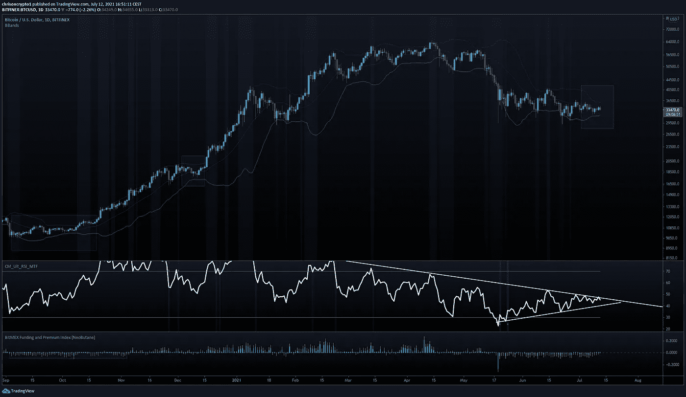
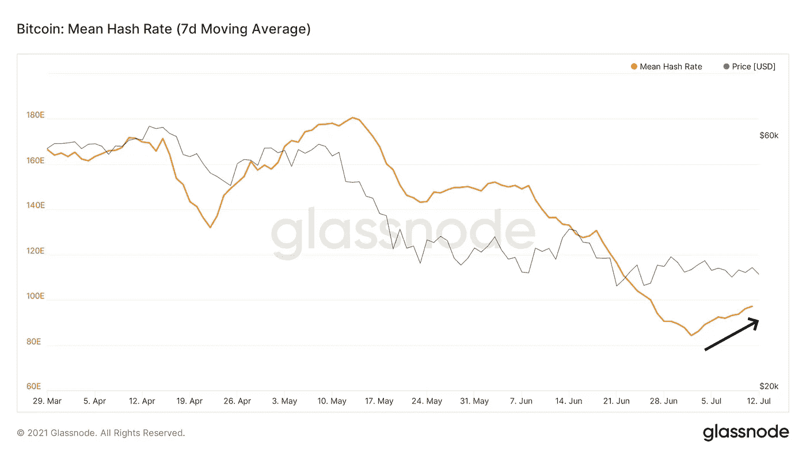
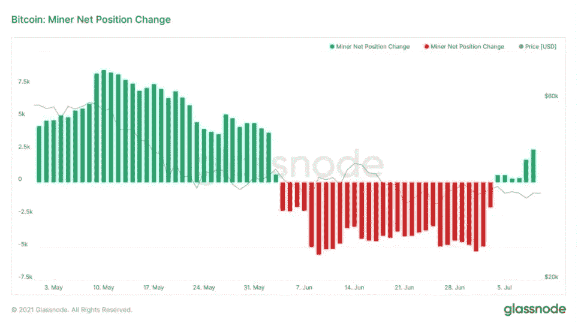

# 随着矿工打开钻机，比特币大幅反弹

> 原文：<https://medium.com/coinmonks/bitcoin-hashrate-rebounds-as-miners-turn-on-their-rigs-3ec0ae9a232c?source=collection_archive---------9----------------------->

抖音对其平台上的金融服务影响者采取了全面的高压手段，其中包括加密货币。与此同时，随着中国硬件迁往北美和欧洲，比特币价格开始回升。矿商也开始积累比特币，因为历史先例表明，BTC 兑美元汇率的大幅波动即使不是在几小时之内，也是在几天之内。

咱们挖吧。

## 抖音禁止有影响力的人推广加密货币

流行的社交媒体应用抖音更新了其品牌内容政策，禁止包括加密货币在内的金融服务广告。

据每日邮报报道，[这家中国拥有的社交媒体巨头采取了一项激烈的措施，不仅禁止其平台上的加密影响者，还禁止所有推广金融服务的创作者。这些包括但不限于加密货币、立即购买包括稍后支付公司、贷款、信用卡和外汇公司。](https://www.dailymail.co.uk/money/diyinvesting/article-9769617/TikTok-crackdown-crypto-trading-finance-influencer-promotions.html)

**查看** [全文点击这里](https://chrisoncrypto.com/blog/f/tiktok-bans-influencers-from-promoting-cryptocurrencies) **！**

# 技术上来说

## BTC 未来波动？

在上周一路跌至 32，000 美元之后，比特币(BTC)在回到 33，100 美元区域之前反弹至 34，680 美元。随着比特币继续在越来越紧的区间内挤压，价格在较低的时间框架内波动，迫切需要定向突破(如下图 24 小时布林带下)。

如果从历史数据来看，一次重大的变动即使不是几个小时，也是几天之后。

# 随着矿工打开钻机，比特币大幅反弹

在 6 月 28 日触及低于 75 万亿分之一的低点后，比特币价格已经回升了 33%以上。上月，在中国政府对当地秘密矿商发起全面战争之际，这一数字出现了下降。因此，大量矿工不得不暂时转移他们的采矿设备。

大多数矿商正在将业务转移到西方国家，尤其是欧盟和北美。一段时间以来，比特币的价格一直很低，尤其是因为搬运数吨计算硬件需要大量的物流。然而，好消息是比特币价格再次开始回升。

# 比特币矿工正在积累比特币

随着比特币的哈希拉特和网络安全的恢复，矿工们也开始再次积累这种加密货币。因此，加密矿工钱包余额已开始显示净积极的立场机会。根据 Glassnode 的数据，本月比特币矿工头寸变化为绿色。

整个 6 月份的深红色低谷表明，矿商正在清空总体库存——考虑到这大约是中国打击该行业的同一时间，这是有道理的。

这些环比指标的改善表明，乐观的投资者正在重返游戏。链上数据的积极发展表明，比特币可以很快恢复其北上之旅。

现在每个人心中的问题是，BTC 是否能够令人信服地越过 35，000 美元到 36，000 美元的价格标签。

时间会证明一切。

下次再见。

**加入** [电报](https://t.me/chrisoncryptochannel) **频道，实时更新&设置！
关注我** [推特](https://twitter.com/ChrisOnCrypto1) **&** [多嘴多舌](https://gab.com/chrisoncrypto) **下面还有我的社交门户。**

[https://www.paypal.com/donate?hosted_button_id=C9VRLGTBHQX2N](https://www.paypal.com/donate?hosted_button_id=C9VRLGTBHQX2N)

# 阅读更多:抖音禁止有影响力的人推广加密货币

[https://chrisoncrypto.com/blog/f/tiktok-bans-influencers-from-promoting-cryptocurrencies](https://chrisoncrypto.com/blog/f/tiktok-bans-influencers-from-promoting-cryptocurrencies)

[http://www.chrisoncrypto.com/](http://www.chrisoncrypto.com/)

你也可以用比特币支持我！
**BTC** 地址:**3 eydseypjhn 68 axkncuqbb 7 ebqcxrejamr**

最诚挚的问候，
T21 克里斯托
克里斯托
上的加密创始人[www.cityam.com](https://www.cityam.com)上的
直接接通:[电报](https://t.me/chrisoncrypto)

*最初发布于*[*https://mailchi . MP*](https://mailchi.mp/5a51f8ccfe6a/bitcoin-hashrate-rebounds-as-miners-turn-on-their-rigs?e=[UNIQID])*。*