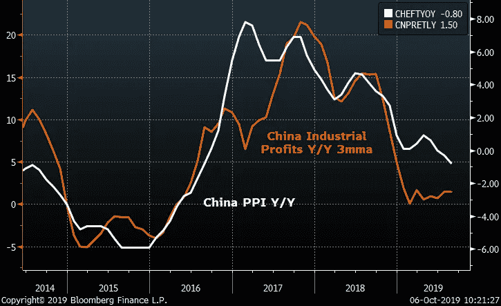
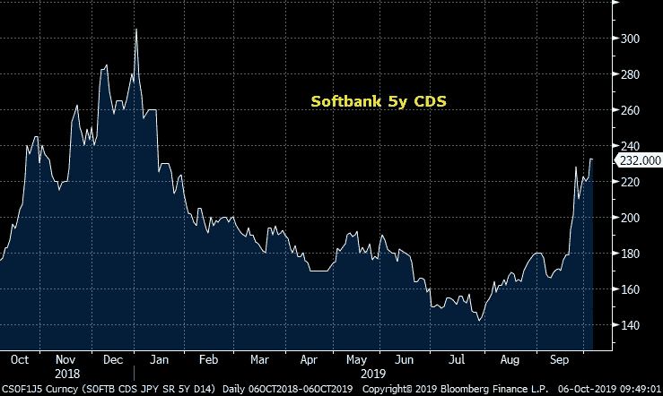
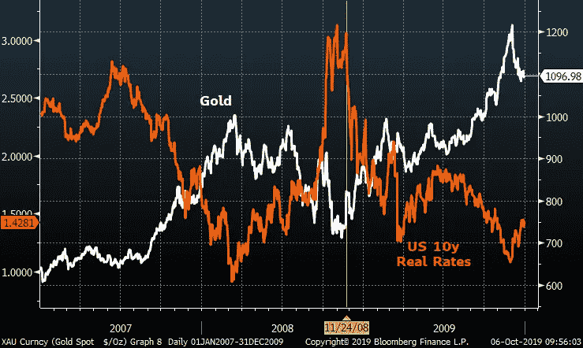
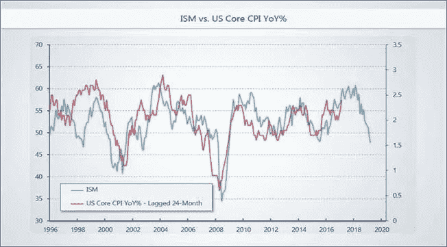

# 比特币讨厌通货紧缩，喜欢对它的反应

> 原文：<https://medium.com/coinmonks/bitcoin-hates-deflation-loves-the-response-to-it-bc62daa6a544?source=collection_archive---------2----------------------->

在最近一期的始终辛辣的来自 Crypt 播客的故事中，Marty 和 Travis Kling 讨论了当前货币制度下的 BTC。当货币因通货膨胀而贬值时，黄金和 BTC 等固定供应资产的表现可以理解，但自 1996 年以来，美国的核心 CPI 从未达到 3%的年比。Travis 警告说，此时市场应该更担心通缩而不是通胀，这是正确的，这对 BTC 是不利的。

在其他条件相同的情况下，不断下降的 CPI 给 T2 实际利率带来了上行压力，这使得持有现金更有吸引力。15 万亿美元的负收益债券已经达到了金融时代的精神，但是许多人没有意识到超过 25 万亿美元的负**实际**利率。这是一个没有历史可比性的货币环境，但这些通缩逆风不是来自德意志银行或日本央行，而是来自中国。

中国正处于文化大革命以来最严重的经济减速之中。他们一方面在打贸易战，另一方面是香港的叛乱，但对 Xi 公司来说，真正的生存威胁是国内失业——他们没有什么好的选择来刺激本地经济。Xi 和他的中国人民银行现在将他们的债务热潮视为政策错误，这些债务热潮曾在 2009 年和 2016 年将全球经济从衰退中拯救出来。中国人以为这些救援会为他们赢得一些国际好感，然而，他们得到的只是西方民粹主义者的反弹。与此同时，过去十年产生的债务仍然像一个沉重的负担悬在他们的经济之上，中国人民银行已经有效地排除了再次进行再杠杆化的可能性。

那是什么意思？除非人民币贬值，否则中国将面临巨大的通货紧缩反弹。由于他们的经济是政府指令的功能，他们可以预期利润会随着价格下降。由于盈利能力推动了失业，我们可以很有把握地假设工作岗位正在流失——并不是说有任何合法/公开的指标来监测中国大陆的就业变化。毫不夸张地说，中国的生产者价格指数(大陆 CPI 被操纵)是本世纪全球增长的最佳领先指标。

不过，这些通缩压力是一个全球性问题。在过去的十年里，中国贡献了全球 GDP 增长的 30%,因此中国经济的放缓对世界各地的价格来说都不是好兆头。尽管特朗普可能没有意识到这一点，但贸易休战不会改善这些力量，因为技术正在同时产生巨大的通缩。

让我们以币安为例。币安真正的创新之处在于能够成为一个拥有分散化劳动力的有效组织。他们有规模，有好的产品，有魅力的领导者，但作为交易所，他们将面临激烈的竞争。他们的优势来自于全天候利用世界各地员工的技能。CZ 公司不会透露他的秘密，但科技公司不可避免地会复制他的秘密……像 WORK (Slack)、ZM (Zoom)和 PTON (Peloton)等分散化平台的优势上市表明这是迟早的事。

权力下放的劳动力会造成巨大的通货紧缩。如果你是旧金山公司的创始人，并且拿到了 500 万美元的投资，也许能获得 5 名工程师。但如果你能从莫斯科、台北等地物色到称职的员工……那就能为你带来 20 名工程师。这是一个极度通缩的概念，对科技行业的薪酬、商业地产和消费者价格都会产生巨大影响。

虽然分散化是大势所趋，但目前尚不清楚市场流动性是否足以维持估值水平。残酷的 IPO 市场，包括上述的 WORK 和 PTON，再加上 WeWork 的破产，表明私募市场正在酝酿一些奇怪的事情。最能说明问题的是软银，它是永久依赖免费资金运营的企业的跳板。过去一个月里，软银的信用违约互换保护变得非常昂贵。在中国，私募甚至是一个问题，腾讯支持的 NIO 的失败在上周震动了整个市场。

如果软银跌跌撞撞，资产市场遭受打击，那将意味着什么？通缩。通缩对 BTC 意味着什么？在真空中，这就是麻烦。价格下跌=实际利率上升=现金作为避风港更有吸引力。人们很容易忘记，在金融危机期间，金价从 2008 年 3 月到 11 月下跌了 30%。原因是各国央行一直保持观望态度，直到 11 月份——也就是雷曼兄弟破产近三个月后——才向实际利率下调施加压力。2008 年 7 月，欧洲央行**上调了**利率，因为他们害怕通胀，这就是我们正在处理的这个问题的预见性的一个迹象！然而，一旦央行注入足够的流动性来稳定市场，黄金在 2008 年 11 月到 2011 年 8 月之间就上涨了 175%。

黄金和 BTC 所钟爱的，是对抗通缩的政策努力。央行官员对通胀了如指掌，尤其是如何控制通胀。他们对通缩以及如何更好地操纵通缩所知甚少。可以肯定的是，他们会尽一切可能去尝试，但预测其如何、何时以及是否足以满足市场预期是很棘手的。这有可能成为美国历史上最离奇的总统大选……谁知道市场还在等着我们。

Expect US CPI to roll over around year end

所有这些都是在说，仅仅因为你读到一个关于即将到来的 QE 或 MMT 的标题，并不意味着 BTC 必须立即反弹。俗话说:市场先生保持非理性的时间可以比你保持偿付能力的时间长……但这种非理性是主观的。市场先生无时无刻不在与全球力量打交道，他的结论可能超出我们的理解范围。关键是要相信 BTC 不可辩驳的基本面，以及当我们走出第四次转折的另一边时，它预示着什么。这片泥沼的另一端是潜在的通货紧缩繁荣，这将在我们的下一篇文章中讨论。