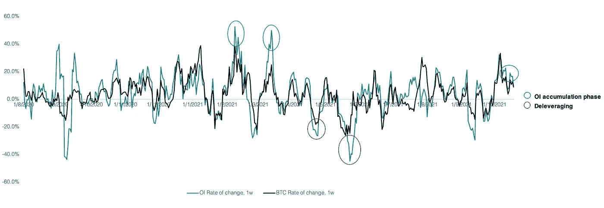
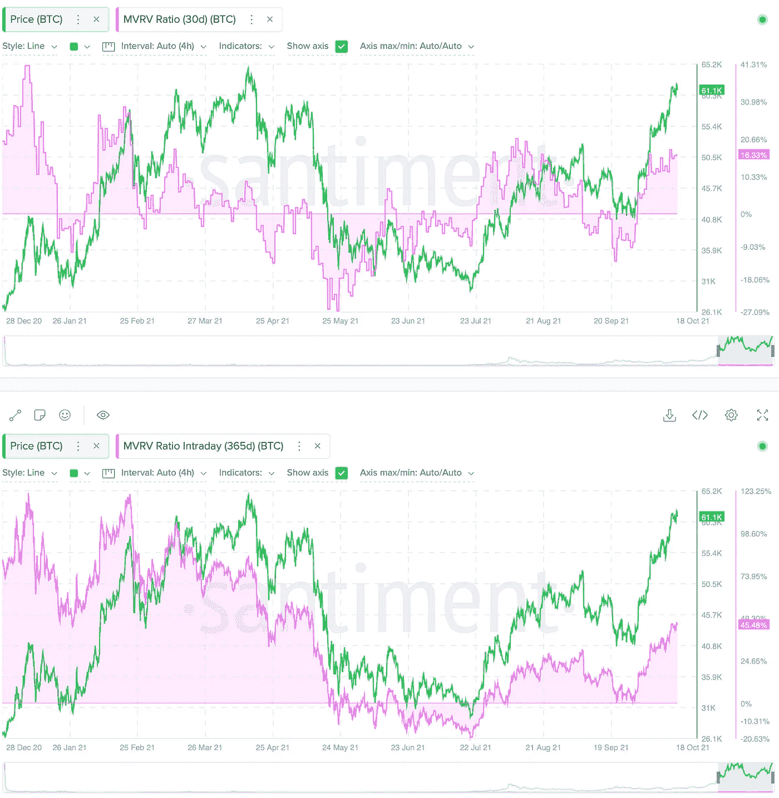
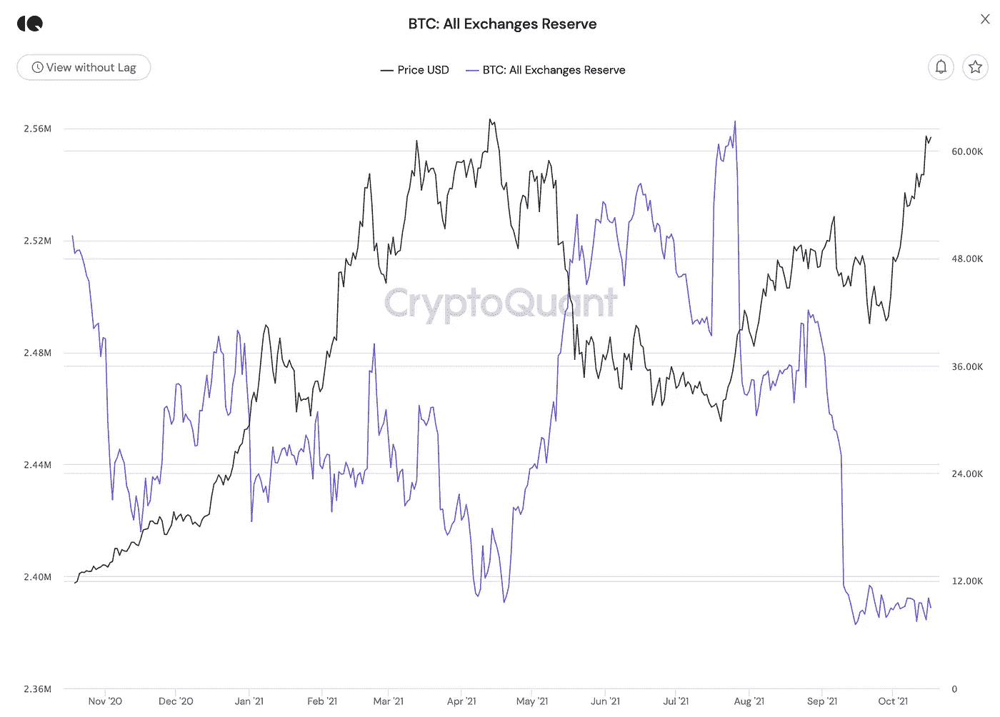

# 比特币健康检查

> 原文：<https://medium.com/coinmonks/bitcoin-health-check-44ac88c2c8ab?source=collection_archive---------10----------------------->

## 周一 BTC 市场概览

Photo: [Pixabay](https://www.pexels.com/@pixabay) | Pexels.com

## TLDR:短期修正，长期月亮

1.  尽管未平仓合约仍在以缓慢的速度进入市场，但在过去的 3 周内一直在累积。随着数周的杠杆积累，短期内可能会出现轻微的去杠杆化修正(高达 10%)。鉴于该领域的“买入谣言，卖出新闻”现象，这种调整可能与比特币期货交易所交易基金的推出相吻合。

Source: app.intotheblock.com | JKL Research

2.抛售压力依然存在，而且越来越大:

> 短期(30 天)BTC 持有者的平均损益为+17%。
> 
> 长期(1 年期)持有者的损益为+46%。

**→可能的短期获利回吐。**

Source: app.santiment.net

3.但是**交易所的储备仍然很低**，因为投资者更喜欢在牛市的预期中持有。融资利率正在上升，表明衍生品交易者一致看好。

> 订阅 [**Coinmonks Youtube 频道**](https://www.youtube.com/c/coinmonks/videos) 获取每日加密新闻。

**通过 ETF 进入的新资金+限量供应=长月。**

Source: Cryptoquant.com

在 twitter 上关注我们，获取更多见解！[https://lnkd.in/dreyfdk6](https://lnkd.in/dreyfdk6)

## 放弃

*本材料的内容未经任何监管机构审核。建议您对本材料的内容保持谨慎。虽然本材料中包含的信息是从据信可靠的来源汇编的，但 JKL 不代表或保证本材料中包含的信息的准确性、完整性或可靠性。如果您对本材料的任何内容有任何疑问，您应该获得独立的专业意见。JKL 或其任何关联公司，或其任何或其各自的董事、高级职员、员工和代表都不会对因使用或依赖本材料中包含的任何信息而导致的任何直接、间接或后果性损失承担任何责任或义务。本材料不构成认购或购买任何金融产品的要约或邀请。其目的不是提供任何信贷或其他评估的基础，也不应被视为购买任何金融产品的建议。*