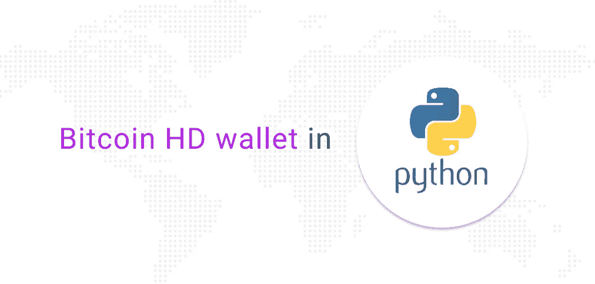

# Python 中的比特币分层确定性钱包

> 原文：<https://medium.com/coinmonks/bitcoin-hierarchical-deterministic-wallet-in-python-5947147e3eda?source=collection_archive---------2----------------------->



在这里，我们开始了一系列的文章，完全涵盖了如何开始与区块链网络工作的主题；从密钥和地址的本地创建到事务创建、签名和向网络广播。我们将比特币作为 UTXO 模型的最佳例子，尽管我们将对基于账户的区块链网络进行同样的追踪。

感谢 Gaurav Agrawal 的精彩帖子。

在本文中，我们将使用 python 语言创建一个比特币 HD(分层确定性)钱包。要了解 HD wallet 的工作原理，可以查看[这篇](/@harshagoli/hd-wallets-explained-from-high-level-to-nuts-and-bolts-9a41545f5b0)文章。

# 先决条件

*   计算机编程语言
*   对编程有基本的了解

从其[官网](https://www.python.org/downloads/)下载并安装 python 的最新版本。

我们需要安装一个名为`[bitcoinlib](https://pypi.org/project/bitcoinlib/#description)`的 python 库来创建和管理比特币钱包。要安装库，请运行以下命令。

```
pip install bitcoinlib
```

# 带 Python 的比特币高清钱包

使用高清钱包，我们可以使用一个种子为不同的加密货币网络生成一套完整的加密钱包。然而，在今天的文章中，我们将只关注比特币以及如何创建一个简单的高清钱包。

因此，让我们创建我们的第一个比特币高清钱包。

```
from bitcoinlib.wallets import HDWalletwallet = HDWallet.create('Wallet1')key1 = wallet.new_key()print(key1.address)
```

在上面的脚本中，我们正在执行以下步骤:

*   正在导入`bitcoinlib`库
*   创建新钱包
*   生成新的 HD 密钥。
*   创建新地址

要运行上面的程序，请用。py 扩展名。(Ex- `hd_wallet1.py`)。然后使用下面命令运行该文件。

```
python hd_wallet1.py
```

# 带助记符的比特币高清钱包

记忆法很受欢迎，因为它们容易记忆。让我们看看如何使用助记符创建一个比特币钱包。

```
from bitcoinlib.wallets import HDWallet, wallet_deletefrom bitcoinlib.mnemonic import Mnemonicpassphrase = Mnemonic().generate()print(passphrase)wallet = HDWallet.create("mWallet1", keys=passphrase, network='bitcoin')key1 = wallet.new_key()print(key1.address)
```

在上面的脚本中，我们正在执行以下步骤。

*   从`bitcoinlib`导入相关类
*   生成一个随机的助记符，你可以传递你自己的
*   创建一个名为`mWallet1`的新钱包
*   生成密钥
*   获取比特币公共地址

要运行此程序，请将它保存在一个文件中。py 扩展名。(Ex- `hd_wallet2.py`)。然后使用下面命令运行该文件。

```
python hd_wallet2.py
```

要了解更多关于`bitcoinlib`库的信息，请查看[官方文档](https://bitcoinlib.readthedocs.io/en/latest/)。

在下一篇文章中，我们将讨论比特币多签名钱包以及如何创建一个。

**注意**:不要公开张贴你的钥匙或记忆法。

## 另外，阅读

*   [最好的加密交易机器人](/coinmonks/whats-the-best-crypto-trading-bot-in-2020-top-8-bitcoin-trading-bot-c16adeb13317)
*   [德里比特评论](/coinmonks/deribit-review-options-fees-apis-and-testnet-2ca16c4bbdb2) |选项、费用、API 和 Testnet
*   [FTX 密码交易所评论](/coinmonks/ftx-crypto-exchange-review-53664ac1198f)
*   最好的比特币[硬件钱包](/coinmonks/the-best-cryptocurrency-hardware-wallets-of-2020-e28b1c124069?source=friends_link&sk=324dd9ff8556ab578d71e7ad7658ad7c)
*   [密码本交易平台](/coinmonks/top-10-crypto-copy-trading-platforms-for-beginners-d0c37c7d698c)
*   最好的[加密税务软件](/coinmonks/best-crypto-tax-tool-for-my-money-72d4b430816b)
*   [最佳加密交易平台](/coinmonks/the-best-crypto-trading-platforms-in-2020-the-definitive-guide-updated-c72f8b874555)
*   最佳[加密借贷平台](/coinmonks/top-5-crypto-lending-platforms-in-2020-that-you-need-to-know-a1b675cec3fa)
*   [莱杰 vs 特雷佐](/coinmonks/ledger-vs-trezor-best-hardware-wallet-to-secure-cryptocurrency-22c7a3fd391e)
*   [block fi vs Celsius](/coinmonks/blockfi-vs-celsius-vs-hodlnaut-8a1cc8c26630)vs Hodlnaut
*   Bitsgap 评论——一个轻松赚钱的加密交易机器人
*   为专业人士设计的加密交易机器人
*   [PrimeXBT 审查](/coinmonks/primexbt-review-88e0815be858) |杠杆交易、费用和交易
*   HaasOnline 评论享受九折优惠
*   Bitmex 的[保证金交易的白痴指南](/coinmonks/the-idiots-guide-to-margin-trading-on-bitmex-dbbd7742c6fc?source=friends_link&sk=7bfa99d2a181142510c8442c8ddb0786)
*   [eToro 评论](/coinmonks/etoro-review-78807ddeb33c) |交易股票、密码、交易所交易基金、差价合约和商品
*   [Bitmex 高级保证金交易指南](/coinmonks/bitmex-advanced-margin-trading-guide-2270c195ce25?source=friends_link&sk=1d986cca731f5084b9a2db4a4bc4a7ad)
*   面向开发者的最佳加密 API
*   [最佳区块链分析工具](https://bitquery.io/blog/best-blockchain-analysis-tools-and-software)
*   [加密套利](/coinmonks/crypto-arbitrage-guide-how-to-make-money-as-a-beginner-62bfe5c868f6)指南:新手如何赚钱
*   顶级[比特币节点](https://blog.coincodecap.com/bitcoin-node-solutions)提供商
*   最佳[加密制图工具](/coinmonks/what-are-the-best-charting-platforms-for-cryptocurrency-trading-85aade584d80)
*   了解比特币最好的[书籍有哪些？](/coinmonks/what-are-the-best-books-to-learn-bitcoin-409aeb9aff4b)

> [直接在您的收件箱中获得最佳软件交易](https://coincodecap.com?utm_source=coinmonks)

[](https://coincodecap.com?utm_source=coinmonks)