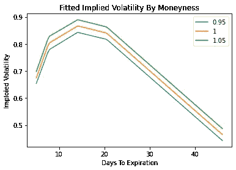

# 比特币隐含波动率表面来自 Deribit

> 原文：<https://medium.com/coinmonks/bitcoin-implied-volatility-surface-from-deribit-70fba845102a?source=collection_archive---------0----------------------->

隐含波动率在交易中有很多应用，加密也不例外。隐含波动率表面是期权隐含波动率的 3D 表示，由履约和到期前时间决定。表面的图形可以用一个图像给交易者详细的波动信息。

在这篇文章中，我给出了一个简单的例子，从 Deribit 的 Rest api 中提取当前期权数据，清理这些数据，并使用它们生成整个波动率表面的 3D 图。

```
import pandas as pd
from pandas.io.json import json_normalize
import numpy as np
from scipy import interpolate
import statsmodels.api as sm

import datetime as dt

import matplotlib.pyplot as plt
from mpl_toolkits import mplot3d
from matplotlib.ticker import FuncFormatter
from mpl_toolkits.mplot3d import Axes3D

%matplotlib inline

def plot_iv_surf(x,y,z,x2=None,y2=None,z2=None,label=''):
    fig = plt.figure(3, figsize=(10,10))
    ax=plt.axes(projection='3d')
    ax.set_title('Bitcoin Implied Volatility Surface')
    ax.set_zlabel('Implied Volatility')
    plt.xlabel('Strike')
    plt.ylabel('Days To Expiration')
    ax.zaxis.set_major_formatter(FuncFormatter(lambda z, _: '{:.0%}'.format(z)))
    if z2 is not None:
        ax.scatter3D(x2,y2,z2, c='r', s=100,label=label)
    ax.plot_surface(x, y, z, rstride=1, cstride=1,alpha=0.5)
    ax.legend()
```

## 从 Deribit 的 API 获取当前选项数据

Deribit 的 api 提供了对在交易所交易的期权数据的访问。获取数据是一个两步过程:

1.  获取所有活动选项的列表
2.  删除价内期权、执行价格与当前价格相差超过 30%的期权以及距离到期日超过 90 天的期权。
3.  遍历选项列表以检索相关数据

我使用了“ticker”数据馈送，但类似的方法也可以用于交易数据。

```
%%time

# Get a list of all active BTC options from the Deribit API.
def get_all_active_options():
    import urllib.request, json
    url =  "https://deribit.com/api/v2/public/get_instruments?currency=BTC&kind=option&expired=false"
    with urllib.request.urlopen(url) as url:
        data = json.loads(url.read().decode())
    data = pd.DataFrame(data['result']).set_index('instrument_name')
    data['creation_date'] = pd.to_datetime(data['creation_timestamp'], unit='ms')
    data['expiration_date'] = pd.to_datetime(data['expiration_timestamp'], unit='ms')
    print(f'{data.shape[0]} active options.')
    return data

# Filter options based on data available from 'get_instruments'
def filter_options(price, active_options):
    # price is the current price of BTC

    #Get Put/Call information
    pc = active_options.index.str.strip().str[-1]

    # Set "moneyness"
    active_options['m'] = np.log(active_options['strike']/price)
    active_options.loc[pc=='P','m'] = -active_options['m']
    # Set days until expiration
    active_options['t'] = (active_options['expiration_date']-pd.Timestamp.today()).dt.days

    # Only include options that are less than 30% from the current price and have less than 91 days until expiration
    active_options = active_options.query('m>0 & m<.3 & t<91')

    print(f'{active_options.shape[0]} active options after filter.')
    return active_options

# Get Tick data for a given instrument from the Deribit API
def get_tick_data(instrument_name):
    import urllib.request, json
    url =  f"https://deribit.com/api/v2/public/ticker?instrument_name={instrument_name}"
    with urllib.request.urlopen(url) as url:
        data = json.loads(url.read().decode())
    data = json_normalize(data['result'])
    data.index = [instrument_name]
    return data

# Loop through all filtered options to get the current 'ticker' datas
def get_all_option_data():
    option_data = get_tick_data('BTC-PERPETUAL')
    options = filter_options(option_data['last_price'][0], get_all_active_options())
    for o in options.index:
        option_data = option_data.append(get_tick_data(o))
    return option_data

option_data = get_all_option_data()### Add additional metrics to dataoption_data['t'] = np.nan; option_data['strike'] = np.nan
# Calculated days until expiration
option_data.loc[1:,'t'] = (pd.to_datetime(option_data[1:].index.map(lambda x: x.split('-')[1]))-pd.Timestamp.today()).days
# Pull strike from instrument name
option_data.loc[1:,'strike'] = option_data[1:].index.map(lambda x: x.split('-')[2]).astype(int)
# Calculate "moneyness"
option_data['m'] = np.log(option_data['last_price'][0]/option_data['strike'])********************************************************************For this run there were388 active options.
133 active options after filter.
Wall time: 56.8 s
```

## 插值曲面

随着隐含波动率数据的收集和清理，我们准备好估计一个完整的表面。

第一种方法是样条插值如果观察点。

```
# Interpolate implied volatility using a cubic spline
# Then plot the implied volatility surface

option_data_ = option_data.iloc[1:].sort_values(['t','strike']).query('t>0')
x = (option_data['last_price'][0]/option_data_['strike'])
y = option_data_['t']
z = option_data_['mark_iv']/100

X,Y = np.meshgrid(np.linspace(.95,1.05,99),np.linspace(1,np.max(y),100))
Z = interpolate.griddata(np.array([x,y]).T,np.array(z),(X,Y), method='cubic')

xyz = pd.DataFrame({'x':x,'y':y,'z':z})
xyz = xyz.query('x>0.95 & x<1.05')
plot_iv_surf(X,Y,Z,xyz['x'],xyz['y'],xyz['z'],'Observed IV')

iv_df = pd.DataFrame(Z, index=np.linspace(10,np.max(y),100), columns=np.linspace(.95,1.05,99))
```


插值曲面有点粗糙，看起来不像是无套利的。然而，它确实给出了表面的快速图片，给出了可用的最新报价。

有一些孤立的选项导致了地表的大幅度移动。这些可能是市场信息或坏的/陈旧的报价。我的猜测是，很可能是后者。下一节试图纠正这一点。

## 调整隐含波动率

因为不是所有的观察都有当前的数据，所以我用一个粗略的方法来估计当前的隐含波动率。

IV+(delta *价格变化)/ vega

```
price_diff = option_data['mark_price'][0]-option_data['underlying_price']
option_data['iv_adj'] = option_data['mark_iv']+(option_data['greeks.delta']*price_diff)/(option_data['greeks.vega'])
option_data_ = option_data.iloc[1:].sort_values(['t','strike']).query('t>0')

Z = interpolate.griddata(np.array([x,y]).T,np.array(option_data_['iv_adj']/100),(X,Y), method='cubic')
iv_df_adj = pd.DataFrame(Z, index=np.linspace(10,np.max(y),100), columns=np.linspace(.95,1.05,99))iv_df.loc[:,1].plot(label='Pre-Adjusted')
(iv_df_adj.loc[:,1]).plot(label='Adjusted')
plt.xlabel('Days To Expiration')
plt.ylabel('Imploied Volatility')
plt.legend()
plt.title('ATM Implied Volatility')
plt.show()
```


# 简单参数化表面模型

隐含波动率表面被估计为线性回归，其特征被设计为对偏斜和时间曲率建模。


这种模式有许多变体，每种都有自己的优点和缺点。[这张](https://core.ac.uk/download/pdf/144147097.pdf)纸是一个很好的起点。

## 砝码

在这个例子中，我根据成交和未平仓利息对 IV 观察值进行了加权。期权离当前价格越远，权重越低。此外，未平仓权益较高的期权权重较高。

我倾向于排除零未平仓合约的期权，并使用 24 小时交易量进行加权，但实际上期权的选择是有限的。

```
weights = 1/(1+((option_data_['m']**2)))+((np.log(option_data_['open_interest']).replace(-np.inf,0)/np.log(option_data_['open_interest']).replace(-np.inf,0).sum()))plt.scatter(option_data_['m'],weights)
plt.title('Observation Weight By Moneyness And Open Interest')
plt.show()
```


## 加权线性回归

在这次特殊的运行中，调整后的 R 约为 7%。回归统计数据远不如获得直观的、对您的目的有意义的结果重要。

```
option_data_reg = option_data.iloc[1:].sort_values(['t','strike'])
t = np.sqrt(option_data_['t']/365)
m = np.log(option_data['last_price'][0]/option_data_['strike'])/t
X = pd.DataFrame({'M':m,'M2':m**2,'M3':m**3,'t':t,'tM':t*m,'t2':t**2})
y = (option_data_['iv_adj']/100)

X = sm.add_constant(X) 
model = sm.WLS(y, X, weights=weights).fit()

print(model.summary())WLS Regression Results                            
==============================================================================
Dep. Variable:                 iv_adj   R-squared:                       0.121
Model:                            WLS   Adj. R-squared:                  0.069
Method:                 Least Squares   F-statistic:                     2.330
Date:                Mon, 14 Dec 2020   Prob (F-statistic):             0.0377
Time:                        12:22:00   Log-Likelihood:                -13.429
No. Observations:                 109   AIC:                             40.86
Df Residuals:                     102   BIC:                             59.70
Df Model:                           6                                         
Covariance Type:            nonrobust                                         
==============================================================================
                 coef    std err          t      P>|t|      [0.025      0.975]
------------------------------------------------------------------------------
const          0.4746      0.109      4.360      0.000       0.259       0.691
M              0.0082      0.097      0.084      0.933      -0.184       0.200
M2             0.0024      0.026      0.095      0.925      -0.048       0.053
M3            -0.0092      0.015     -0.603      0.548      -0.040       0.021
t              4.4316      1.370      3.236      0.002       1.715       7.148
tM             0.4261      0.590      0.723      0.472      -0.744       1.596
t2           -12.5318      3.910     -3.205      0.002     -20.287      -4.777
==============================================================================
Omnibus:                       83.490   Durbin-Watson:                   0.260
Prob(Omnibus):                  0.000   Jarque-Bera (JB):              405.231
Skew:                           2.806   Prob(JB):                     1.01e-88
Kurtosis:                      10.598   Cond. No.                         643.
==============================================================================

Notes:
[1] Standard Errors assume that the covariance matrix of the errors is correctly specified.option_data_ = option_data.iloc[1:].sort_values(['t','strike']).query('t>0')
x = (option_data['last_price'][0]/option_data_['strike'])
y = option_data_['t']
z = model.predict(X)

X,Y = np.meshgrid(np.linspace(.95,1.05,99),np.linspace(1,np.max(y),100))
Z = interpolate.griddata(np.array([x,y]).T,np.array(z),(X,Y), method='linear')

xyz = pd.DataFrame({'x':x,'y':y,'z':(option_data_['mark_iv']/100)})
xyz = xyz.query('x>0.95 & x<1.05')
plot_iv_surf(X,Y,Z,xyz['x'],xyz['y'],xyz['z'],'Observed IV')

iv_df_fit = pd.DataFrame(Z, index=np.linspace(5,np.max(y),100), columns=np.linspace(.95,1.05,99))
```


```
plt.plot(iv_df_fit.loc[:,[.95,1,1.05]])
plt.xlabel('Days To Expiration')
plt.ylabel('Imploied Volatility')
plt.legend(['0.95','1','1.05'])
plt.title('Fitted Implied Volatility By Moneyness')
plt.show()
```



参数化模型比插值模型平滑得多。

## 丰富

1.  包括附加交换

来自 OKEx 和 LedgerX 的期权数据可以调整并包含在数据集中，以更好地反映整个市场。

2.使用更好的型号，如 [SVI](https://www.semanticscholar.org/paper/A-parsimonious-arbitrage-free-implied-volatility-to-Gatheral/0ba2e344d167fb68264aae3315a040d0c5d98b64) 、[赫斯顿](https://www.semanticscholar.org/paper/A-Closed-Form-Solution-for-Options-with-Stochastic-Heston/4011535b91fd869b8138112739fcad535ac1562c)或[卡尔](https://www.researchgate.net/publication/228291043_A_New_Simple_Approach_for_Constructing_Implied_Volatility_Surfaces)

以上方法简单快捷，但不一定无套利。一个更先进的模型将提供更好的隐含波动率估计，但具有更高的复杂性和更长的处理时间。

感谢您的阅读！如果您有任何问题、意见或投诉，请告诉我。

## 另外，阅读

*   最好的[密码交易机器人](/coinmonks/crypto-trading-bot-c2ffce8acb2a)
*   [Uniswap API](https://bitquery.io/blog/uniswap-pool-api) —如何获取 Uniswap 数据？
*   [Deribit 审查](/coinmonks/deribit-review-options-fees-apis-and-testnet-2ca16c4bbdb2) |选项、费用、API 和 Testnet
*   [FTX 密码交易所评论](/coinmonks/ftx-crypto-exchange-review-53664ac1198f)
*   [Bybit 交换审查](/coinmonks/bybit-exchange-review-dbd570019b71)
*   最好的比特币[硬件钱包](/coinmonks/the-best-cryptocurrency-hardware-wallets-of-2020-e28b1c124069?source=friends_link&sk=324dd9ff8556ab578d71e7ad7658ad7c)
*   [密码本交易平台](/coinmonks/top-10-crypto-copy-trading-platforms-for-beginners-d0c37c7d698c)
*   [Bitsgap vs 3 commas vs quad ency](https://blog.coincodecap.com/bitsgap-3commas-quadency)
*   最好的[加密税务软件](/coinmonks/best-crypto-tax-tool-for-my-money-72d4b430816b)
*   [最佳加密交易平台](/coinmonks/the-best-crypto-trading-platforms-in-2020-the-definitive-guide-updated-c72f8b874555)
*   最佳[加密借贷平台](/coinmonks/top-5-crypto-lending-platforms-in-2020-that-you-need-to-know-a1b675cec3fa)
*   [莱杰纳米 S vs 特雷佐 one vs 特雷佐 T vs 莱杰纳米 X](https://blog.coincodecap.com/ledger-nano-s-vs-trezor-one-ledger-nano-x-trezor-t)
*   [block fi vs Celsius](/coinmonks/blockfi-vs-celsius-vs-hodlnaut-8a1cc8c26630)vs Hodlnaut
*   [Bitsgap 评论](/coinmonks/bitsgap-review-a-crypto-trading-bot-that-makes-easy-money-a5d88a336df2)——一个轻松赚钱的加密交易机器人
*   [Quadency Review](/coinmonks/quadency-review-a-crypto-trading-automation-platform-3068eaa374e1) -专为专业人士打造的加密交易机器人
*   [PrimeXBT 审查](/coinmonks/primexbt-review-88e0815be858) |杠杆交易、费用和交易
*   [Altrady 审查](https://blog.coincodecap.com/altrady-reivew)
*   [埃利帕尔泰坦评论](/coinmonks/ellipal-titan-review-85e9071dd029)
*   [SecuX Stone 评论](https://blog.coincodecap.com/secux-stone-hardware-wallet-review)
*   [BlockFi 评论](/coinmonks/blockfi-review-53096053c097) |从您的密码中赚取高达 8.6%的利息
*   [开发人员的最佳加密 API](/coinmonks/best-crypto-apis-for-developers-5efe3a597a9f)
*   [最佳区块链分析工具](https://bitquery.io/blog/best-blockchain-analysis-tools-and-software)
*   加密套利指南:新手如何赚钱
*   顶级[比特币节点](https://blog.coincodecap.com/bitcoin-node-solutions)提供商
*   最佳[加密制图工具](/coinmonks/what-are-the-best-charting-platforms-for-cryptocurrency-trading-85aade584d80)
*   了解比特币的[最佳书籍有哪些？](/coinmonks/what-are-the-best-books-to-learn-bitcoin-409aeb9aff4b)

> [直接在您的收件箱中获得最佳软件交易](/coinmonks/newsletters/coinmonks)

[](https://medium.com/coinmonks/newsletters/coinmonks)