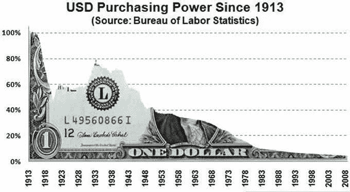
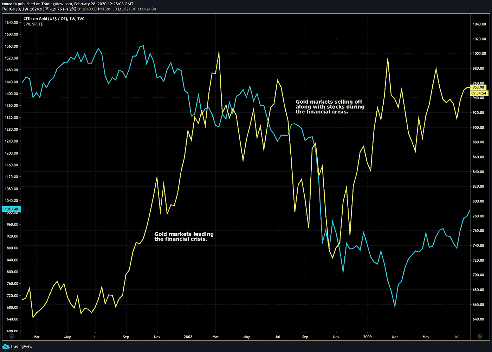
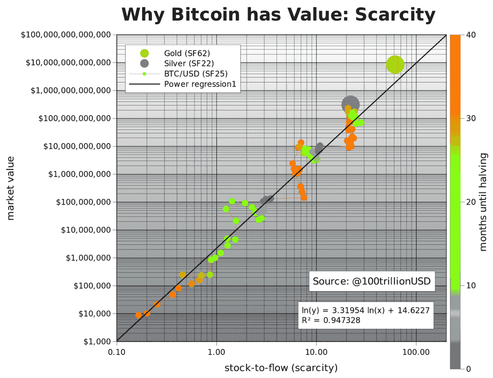

# 美元恐慌中的比特币

> 原文：<https://medium.com/coinmonks/bitcoin-in-a-dollar-panic-2952ae3d905a?source=collection_archive---------0----------------------->

# 介绍

2020 年 3 月 12 日，比特币崩溃，带走了几个加密基金，加密市场人气低迷。许多市场参与者认为，比特币将在总体市场条件下充当避风港，但事实显然并非如此，因为比特币和传统资产之间的相关性从 0 到接近 1。

对于比特币的忠实信徒来说，他们总是知道比特币的当前价格是 1 BTC，没有理由关心为什么我们会出现美元恐慌，所以这篇文章仅仅是学术性的。然而，我们大多数人仍然生活在一个税收必须以美元支付，大多数商品以美元定价的世界里。是的，我们很多人都知道美元最终会灭亡，就像在它之前出现的许多法定货币一样。我们仍然受困于一个问题，即试图从一个破碎的法定货币体系转向健全的货币，无论是比特币还是受比特币启发的其他东西。

# 部分准备金银行和美联储

路德维希·冯·米塞斯(Ludwig Von Mises)在其 1912 年的著作《货币与信用理论》(Theory of Money and Credit)中，将部分准备金银行认定为商业周期的原因。他的想法从未被广泛接受。相反，1913 年的联邦储备法建立了一个中央银行，它立即开始摧毁美元的价值。央行行长们在制造危机和通胀压低本币汇率的双重使命上取得了惊人的成功。每个黄金迷和比特币玩家都见过类似于下图的图表:

在不到 20 年的时间里，新成立的美联储设法监管了如此之多没有实际生产支持的信贷扩张，以至于他们能够制造大萧条。奥地利经济学家弗里德里希·哈耶克(Friedrich Hayek)理解了商业周期的原因，他在 1929 年初警告说，即将发生经济危机，诺贝尔奖委员会在 1974 年授予他诺贝尔经济学奖时也注意到了这一点。

在 1929 年出版的《货币理论与贸易周期》和 1931 年出版的《价格与生产》中，他进一步阐述了米塞斯的商业周期理论。他解释说，在货币供应稳定的情况下，储蓄的供给和对这种储蓄的需求会在一个被称为自然利率的价格上找到平衡。作为一个推论，通过部分准备金银行增加货币供应会增加货币供应量，从而压低货币价格(利率)。这种不正确的货币价格推动了资本和劳动力的错配。这种资本配置不当进而提高了生产资料和原材料的价格，并延迟了向消费品的传导，导致利润率下降。

我们在诸如“铜博士”这样的术语中看到了这一点，这样命名是因为铜价对商业周期的预测相当准确。根据哈耶克的理论，作为许多不同种类生产的投入，货币扭曲应该首先影响这里的一般价格水平。只要信贷继续扩张，繁荣持续的时间就没有理论上的限制，但实际上，资本投资配置不当会使经济更容易受到任何原因的信贷增长放缓的影响。一旦清算周期开始，违约贷款会导致信贷紧缩，进而推动进一步的清算。

这纠正了资本的错误配置，但推动所有无利可图企业清算的信贷缺乏，也将影响一些原本有利可图的企业。我们称这种情况为“流动性恐慌”或“美元恐慌”。在此类事件中，筹集现金以满足追加保证金要求的需求，推动了所有可出售资产的边际抛售，无论是好资产还是坏资产。

# 美元恐慌中的家庭采矿

我们在下面看到一个例子，一家盈利的企业在 1929 年的崩盘中损失了三分之一的价值，然后在接下来的几年里获得了巨大的收益。这是一个极好的例子，说明当其他一切都崩溃，必须满足追加保证金的要求时，由于需要获得美元，一项利润丰厚的业务是如何被出售的。

在恐慌时期，传统(凯恩斯主义)经济理论与奥地利学派经济理论一致。双方都认识到信贷环境过于紧张，并同意清算甚至会影响健康、盈利的公司。奥地利学派认为这只是部分准备金银行导致的资本存量货币扭曲的机械结果。凯恩斯主义者认为，信贷紧缩是由“动物精神”造成的。“动物精神”当然控制着人们的经济决策，除非这些人是央行行长，否则动物精神没有任何作用，我们只能做出冷静理性的决策。不要想太多也是有道理的。

1933 年为解决信贷紧缩而采取的措施包括罗斯福没收黄金和美元对黄金从 20 美元/盎司贬值到 35 美元/盎司。通胀的“成功”最终为完全消除美元与任何稳健货币(即黄金)概念之间的联系提供了理由。

# 欧洲美元和再抵押

如果这是故事的结局，那就已经够糟了，但事情会变得更糟，更糟。输入欧洲美元。即使去除了货币的黄金支撑，部分准备金银行也只能带你走这么远。你仍然有 10%的准备金率，至少提供了一些现实的束缚，我的意思是现实的储蓄供应满足储蓄需求的市场清算价格称为利率。这显然对银行家和政治家没有好处。由于欧洲美元不在美联储的管辖范围内，10%的准备金率不再阻碍我们，我们现在可以一直降到 0%。通过再抵押，单一的美国国债现在可以被抵押作为无限数量贷款的抵押品。当银行家可以用低收益的美国国债作为抵押借款，购买像 MBS、CDO 和 CMBS 这样的高收益产品时，他们为什么要持有低收益的美国国债呢？从宏观层面来看，很容易看出，以无限的杠杆购买风险资产显然是一个糟糕的想法，肯定会导致一系列壮观的繁荣和萧条。你可能会认为这很容易概念化，但这个话题正是圣路易斯联邦储备银行的两位经济学家在 1980 年研究过的(欧洲美元和美国货币供应，巴尔巴赫和雷斯勒)。他们得出结论:“很明显，欧洲美元交易对美国货币供应的影响很小。此外，美联储可以通过适当的公开市场交易轻松抵消这一影响。”。

如下图所示，欧洲美元体系极其复杂。公平地说，没有人完全了解这个系统是如何运作的。

各国央行没有进一步思考这个系统实际上是如何运作的，只是满足于将其视为一种数学抽象，对联邦基金利率等美联储输入做出反应。当他们发现这个系统并不像他们想象的那样工作时，他们已经被连续不断的惊喜所对待。其中包括国债负利率、负掉期息差以及远高于联邦基金利率的伦敦银行同业拆借利率。美联储仍然致力于其多年来演变的双重使命，首先，通过任何必要的手段制造通胀，无论这意味着购买垃圾债券还是从直升机上撒钱，其次，精心制作严肃的声明，给人以他们知道自己在做什么的印象。他们不再需要制造危机，因为我们自 GFC 以来一直处于永久性危机状态，美联储的资产负债表不断扩大，而且没有明确的方法来扭转这种局面。现在，焦点需要继续放在通过精心制作的声明来控制“动物精神”上，我确实相信这有一些优点。虽然“动物精神”与经济决策没有任何关系，但在任何骗局中，保持目标冷静和分散注意力很重要，以免计划失败。

# 美元恐慌中的黄金

在 2008 年大金融危机中，黄金在最初的股市崩盘中损失了 30%的价值，在最严重的抛售期间，黄金与股票的相关性接近 1。这与 1929 年 homestake mining 的情况相同，在最初下跌后，黄金价格在接下来的几年里上涨了近两倍。黄金本身在 1929 年并没有这样做，因为它以 20 美元/盎司的价格与美元挂钩。

# 美元恐慌中的比特币

随着比特币在 GFC 之后推出，2020 年将是见证比特币在股市崩盘时会发生什么的第一年。首先，我们展示了 BTC 和 S&P 的小时相关性，根据你查看的交易所，很容易找出 3 月 12 日比特币在哪里暴跌至近 4000 美元。许多常用的相关性指标会使用每日回报，但回报频率太低，无法在快速抛售时发现。在这种情况下，小时回报率更好地说明了相关性变得非常高时发生的情况，但这只适用于抛售最严重的时期。

就像 1929 年的 homestake mining 和 2008 年的 gold 一样，比特币的长期前景没有任何变化。如果说有什么不同的话，那就是没完没了的量化宽松和财政刺激，以及与之匹配的巨额政府预算赤字，再加上供应冲击，这种宏观环境几乎是未来大规模通胀的完美风暴。虽然黄金可能在 1933 年就被没收了，但在接下来的几年里，没收密码应该会更具挑战性。

在这种环境下，预测加密的时间和程度是不可能的。可以有把握地说，任何形式的健全货币都会相对于长期持续膨胀的货币体系不断升值。

# 法定货币的崩溃

路德维希·冯·米塞斯(Ludwig Von Mises)在《人类行动》(1949)中说，“没有任何手段可以避免信贷扩张带来的繁荣最终崩溃。另一种选择只是，危机是应该作为自愿放弃进一步信贷扩张的结果而提前到来，还是应该作为相关货币体系的最终全面灾难而推迟到来。”。米塞斯在他 1920 年的文章《社会主义联邦的经济计算》中预言了共产主义的经济崩溃。他解释说，“理性的经济活动在一个社会主义的联邦中是不可能的”，这样一个体系将会被资本的错误配置和商品的持续短缺和过剩所困扰。只有通过价格的自由变动来平衡供求，资本配置才能有效进行。

西方世界似乎在货币危机上“孤注一掷”,这让米塞斯看起来比他自己更有先见之明。这是可以预见的，也是令人悲伤的。“货币体系的最终彻底灾难”现在甚至有了一个名字。这就是所谓的现代货币理论(MMT ),也是迈向货币危机的最后一步。当然，如果人们愿意相信“动物精神”是总需求变化的原因，那么就没有理由怀疑 MMT 的概念，即“只要主权赤字以本国货币计价，它们就无关紧要”。保罗·克鲁格曼有力地论证了 MMT 是一个灾难的处方。对他来说不幸的是，主流经济学在 20 世纪初就不再是一门独立的学术学科，直到今天，它还在为政客们掩盖腐败和增加国家权力提供掩护(见 GFC 银行纾困或即将到来的对他们最终称之为病毒危机的任何东西的纾困)。对政治家来说，MMT 显然比主流凯恩斯经济学更有用，因为预算赤字不再重要。我认为这是看待现代经济学的正确视角。

从尼禄剪下第一枚硬币到第三世纪危机，罗马帝国可能用了 200 年的时间通过税收和通货膨胀完全摧毁了他们的经济，带来了瘟疫、内战和经济萧条。以现代的速度和效率，我们只需要一半的时间就可以做到，从我们的现代尼禄罗斯福开始，他在 1933 年首次将黄金从 20 美元/盎司贬值到 35 美元/盎司。悲观地看，我们已经有五分之三的人口面临高税收、瘟疫和酝酿中的经济萧条。没有办法确定货币危机的时间，但现在有充分的理由将加密作为你投资组合的一部分。格雷欣法则可能会让健全的货币暂时退出流通，但当这些法律变得无法执行时，梯也尔法则就会取而代之，将美元逐出流通。这在魏玛德国和 2009 年的津巴布韦都有明显的例子。

# 历史法定货币失败

从高层次来看，所有法定货币失灵看起来都是一样的。它们都始于某种外部原因造成的供应冲击。战争是供应冲击最常见的原因，但在过去，许多其他原因已经足够了。对供应冲击的政策反应会导致价格发现的失败，从而进一步损害经济，进而导致恶性通货膨胀。这种政策反应是自动的，而不是一种选择，法定货币无法承受任何显著的通缩。本·伯南克在这一点上非常明确，参见“通货紧缩:确保它不会在这里发生”。不知何故，这并没有导致任何关于一个需要持续通货膨胀才能生存的系统是否存在任何内在问题的灵魂探索。

这不仅仅是比较印钞相对于经济的规模那么简单，关于新印钞票去向的细节很重要。在一定程度上，新的资金推动了产量的增加，系统将回归平衡。如果新资金只是追逐现有商品，或者更糟的是损害原本良好的企业，恶性通胀螺旋就会形成。

就魏玛德国而言，必须以黄金支付的战争赔款是外因。由于外国人对德国经济的固定价值有明确的要求，国内货币追逐数量减少的商品，这是引起供应冲击的一种迂回方式。印刷更多德国马克的政策反应加剧了问题，导致产量下降，同时对减少战争赔款没有任何帮助。

在津巴布韦，土地改革从专业农民手中拿走土地，分给除了自给农业以外没有任何农业经验的人，这使得 2000 年代的农业产量减少了约 60%,从而造成了供应冲击。这导致农业部门许多从事农产品加工和运输的公司倒闭。随着土地被没收和企业倒闭，外国直接投资降至接近 0。由于该国缺乏通过出口或投资方式进入的外汇，因此不得不印刷当地货币来偿还外币债务。

在美国，部分准备金银行让我们走上了持续通胀的道路。只要新资金找到进入金融资产、艺术品和房屋等领域的途径，这种方式就会奏效。只要我们每年持续增加生产，抑制通货膨胀进入日常商品，如食品和消费品，这个系统将继续发挥作用。当我们受到足够大的供应冲击时，随之而来的政策反应将最终导致这里的恶性通货膨胀。我们无法知道电晕病毒是否会给我们带来足够大的供应冲击，但肯定的是，概率大于 0，因为此时此地肯定存在供应冲击。如果政策反应进一步损害经济，那么我们很可能进入恶性通货膨胀螺旋。虽然这看起来有些牵强，但是这种事情发生的基础已经很明显了。

# 作为健全货币的密码

在加密时代，我们已经看到，在经历经济危机或资本管制的国家中，加密已被明确采用。诚然，这是迄今为止的小规模，但我们可以看到 2013 年当欧盟开始讨论对破产银行的纾困时，塞浦路斯对比特币的争夺。随着委内瑞拉玻利瓦尔的价值达到一个 satoshi 的等值，比特币和 dash 的加密货币使用量普遍增加。据估计，委内瑞拉有 10%的商家接受加密。许多中国人转向加密技术来规避资本管制。

如果有什么阻碍了加密技术的采用，那就是对美元的持续依赖和相对稳定。美元将如何失去其储备地位？“逐渐然后突然”，如其所言。渐进的部分已经开始了。虽然不可能准确地说它将在什么时候突然失去储备货币的地位，但很明显，到那时做任何事情都为时已晚。

关于密码到底是不是钱，已经有了很多讨论。许多黄金迷认为加密不是货币，并说只有黄金才是真正的货币。对他们来说，仅仅通过创造新的密码就能增加更多的可靠资金，意味着供应完全不受限制。我不相信这是一个好的论点，因为钱需要被广泛采用，这对于除了少数几个以外的几乎所有 1000 个加密项目来说是绝对不正确的。

众所周知的“存量-流量”模型认为，货币的市值与其通胀特征相关，在没有政府力量的情况下，交易价格会使其存量/流量与所有其他货币处于同一回归线上。

反对这一模型的一个论点是，随着比特币每隔几年继续减半，该模型将暗示市值最终将达到荒谬的价值。我预计，如果这个模型成立，未来的比特币将不会位于今天计算出的回归线上。我希望看到的是，比特币未来的“存量流动”与未来计算的其他资产“存量流动”在同一回归线上，该线的斜率严格低于今天发现的斜率。换句话说，我预计比特币和黄金将与许多其他资产一起被用作可靠货币，但随着加密技术的日益普及，可靠货币的供应和质量将会增加，这将导致曲线斜率下降。

虽然比特币不一定会成为未来的可靠货币，但在这一点上，它是最有可能的结果。第二个最有可能的结果是 ETH 或 ERC-20 代币。任何可以充当货币的东西都需要被广泛采用，很少有硬币能满足这个标准。正如前加密时代的人们持有黄金一样，在这个新时代，投资组合应该至少包含一小部分加密资产。即使没有正在酝酿的经济危机的背景，这也是正确的，这使得以货币形式提供某种保险变得更加重要，这种保险很难审查或没收。

> [在您的收件箱中直接获得最佳软件交易](https://coincodecap.com/?utm_source=coinmonks)

