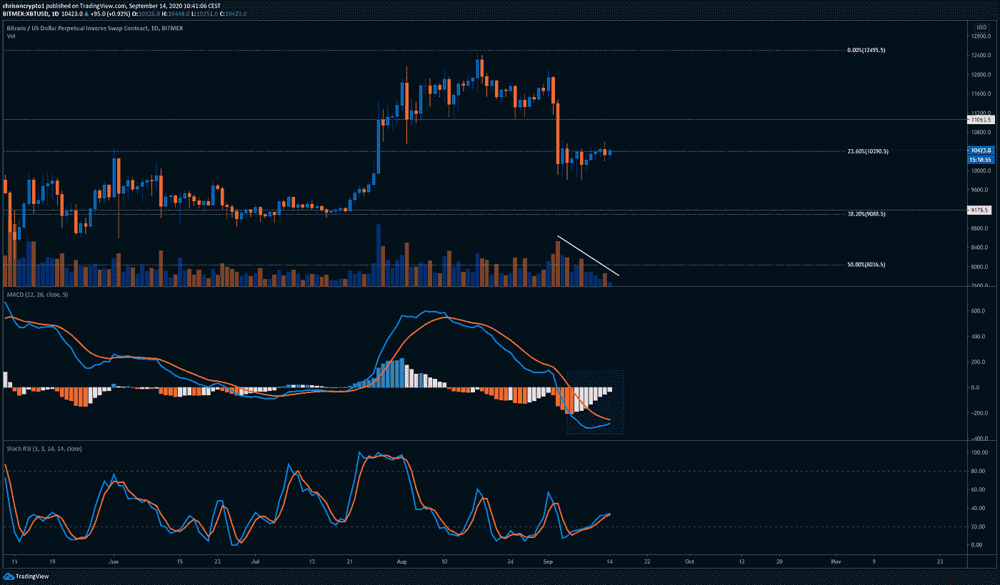
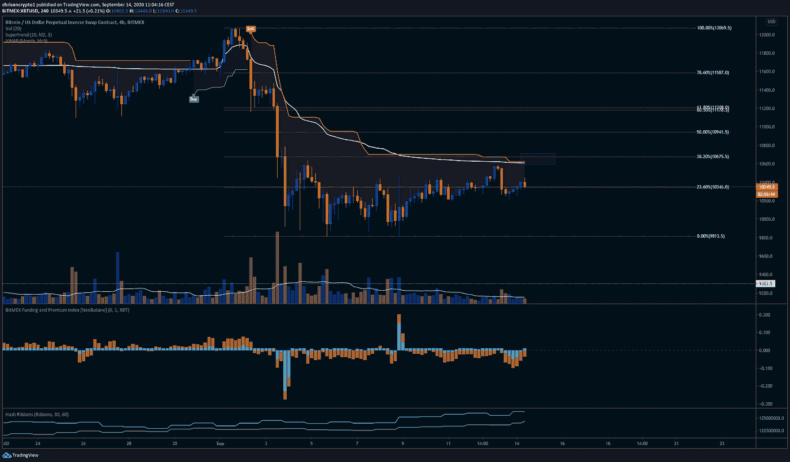
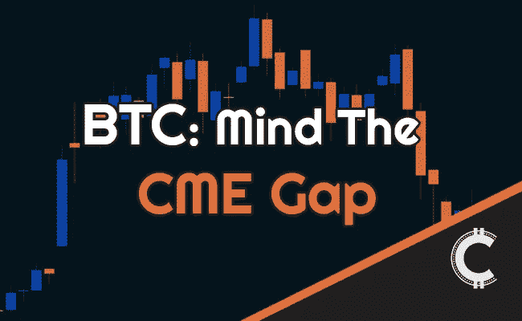

# 在美国大选前的最后一次美联储会议之前，比特币被搁置

> 原文：<https://medium.com/coinmonks/bitcoin-in-limbo-ahead-of-last-fed-meeting-before-us-elections-e6f9c8038d7?source=collection_archive---------1----------------------->

大家好，

我已经开通了一个[电报频道](https://t.me/chrisoncryptochannel)，在那里我将发布最新消息、文章、新闻、交易、可能的短期分析以及随着事态发展人们感兴趣的一般数据。

请注意，这不是一个“买入”通道，我将避免给出交易信号。事实上，我强烈建议你在这个疯狂的市场做任何事情之前，先去 DYOR(做你自己的研究)。

在今天的版本中，我们将从宏观角度更密切地关注央行的动向，因为它们对大多数市场都有影响和相关性。此外，我们将深入研究比特币技术，这开始描绘一幅复杂的画面，特别是在较低的时间框架内。

让我们开始吃吧。

# **FOMC 会议前股市小幅走高**

自比特币首席营销官 Jerome Powell 宣布 T4 对通货紧缩零容忍政策以来，联邦公开市场委员会(FOMC)首次于 9 月 15 日和 16 日召开会议。

随着美国大选日益临近，投资者的注意力将转向经济复苏和美国总统竞选。然而，在此之前，未来两天可能会进一步澄清美联储计划如何在宣布目标为平均 2%的通胀率后使用其前瞻性指引。

在撰写本文时，市场似乎持谨慎乐观态度，S&P 可能因预期明天的会议而小幅上涨几个基点(0.84%)。但据几位分析师和策略师称，明天的会议不太可能有太大影响。

保诚金融(Prudential Financial)首席投资策略师昆西·克罗斯比(Quincy Krosby)表示，股市很容易失望，因为美联储不太可能提供更多关于货币政策的信息，比如购买债券的计划。

“市场担心美联储不会给我们明确的货币政策计划，”她说。众所周知，美联储无限货币的非常政策是股市从 3 月 23 日的低点飙升 50%的背后驱动因素，也被视为限制市场抛售深度的主要因素。

Bleakley Advisory Group 首席投资长 Peter Boockvar 表示，美联储不太可能做出太大调整，因为它将维持每月 800 亿美元的国债购买计划。“我不认为他们会对市场做任何事情，”他说。

由于通货膨胀和通货紧缩的争论激烈，股市在过去一周波动很大，从最高点到最高点下跌了近 8%。

克罗斯比指出了当前市场的这种二分法，这为市场在第三季度末可能不会看到任何重大变化的想法提供了依据。

“有人说现在购买筹码是因为通胀正在上升，有人则说通缩力量仍在向经济蔓延，这两者之间存在一场拉锯战”。

当然，唯一可以合理确定的是一些关于通胀和超过历史 2%目标的可能性的肤浅讨论。由于这是大选前的最后一次美联储会议，杰罗姆·鲍威尔很可能会采取令人放心的立场来支持经济。不过，最终这可能会被解释为暂时不在这里也不在那里。

如果 S&P 不采取任何重大举措，那么比特币出现重大下行风险的可能性就会低得多。

# **泄露:欧盟将成为首个监管加密的司法管辖区**

据新闻网站 Euroactive 报道，一份[泄露的报告](https://chrisoncrypto.com/blog/f/leaked-eu-to-be-first-major-bloc-to-regulate-cryptocurrencies)显示，欧盟将设立一个包括欧洲国家当局在内的监管机构，以监管包括脸书 Libra 在内的“重要”数字货币。这将使欧盟成为第一个在这一层面监管 cyrpto 的主要集团。

简而言之，泄露的报告表明，欧盟将是第一个在这一重要层面上监管加密的主要管辖集团，最明显的是试图平息脸书 Libra 等私人货币以及比特币等公共支持的货币的喧嚣。

欧盟可能将 Libra 视为更大的威胁，因为它有可能达到 27 亿用户，这样做可能会破坏欧元区的稳定。事实上，法国财政部长 Bruno Le Maire 去年 7 月告诉 euractiv:“*我们不会接受 Libra 被转变为一种可能危及金融稳定的主权货币。*

显然，欧盟并没有改变其论调，并可能对任何可能成为目标的生存威胁做出积极回应，比如 Libra 项目。

这份文件没有涵盖央行数字货币(CBDC)，这是一个必然会排除中间人(私人银行)的过程中的下一个合乎逻辑的步骤，同时开放了对新金融生态系统的单边访问。

值得注意的是，随着监管的打击，这份文件可能会加速加密领域的退出骗局。不过，总而言之，鉴于头号加密技术受到良好监管，并且拥有所有数字货币和资产中历史最悠久的记录，它不太可能对比特币产生任何重大影响。

[https://bit.ly/3dvqxiM](https://bit.ly/3dvqxiM)

# 技术上来说

## 守住底线:BTC (HTF)拒绝跌破 1 万美元？

比特币顽固地拒绝花太多时间在 10，000 美元以下，因为买家在这一轮心理水平附近保持着“买入下跌”的心态。

在撰写本文时，比特币在从 10500 美元的关键水平被严厉拒绝后，交易价格略低于 10400 美元。在上周一的[时事通讯](https://mailchi.mp/179be84018dd/nobody-panic-bitcoin-has-done-this-in-the-past?e=%5BUNIQID%5D)中，我们谈到了比特币在芝加哥商业交易所缺口上方形成交易区间的可能性，自那以来，投资者一直抢先交易，不允许比特币跌至 9800 美元以下。

因此，虽然 10，500 美元的水平仍然相关，但谨慎的做法是开始考虑其他可能性——无论风险有多大。

从技术上看，尽管比特币本周收盘跌破 10500 美元，但由于市场犹豫不决，比特币显然不愿意跌破 4 位数。每周的“doji”蜡烛收盘证明了这种优柔寡断。

当我写这篇文章时，BitMEX 和其他交易所的日交易量继续下降，这表明本周某个时候将出现另一次大的波动，可能与明天和周三 FOMC 会议后的股市波动一致。

与此同时，每日 MACD(移动平均线趋同背离)正慢慢接近看涨交叉，这可能会刺激反转或更重要的救济反弹至 11，000 美元的水平。MACD 是一个动量指标，对较高的时间框架和较大的波动交易特别有用。

任何为了“填补 CME 缺口”而持续下行的举措，都可能会过度到更低的水平，因为每个人和他们的妈妈都在谈论它，并期望它得到完美填补。虽然在应用这种思维过程时，你可能会在递归循环中对自己玩心理游戏，但比特币似乎很适合玩球，让所有人都赢。因此，如果比特币走低(从 3 月低点到 8 月高点测量的 fib ),有理由预计比特币将跌至 9150 美元的. 382 fib 水平。

# **4 小时(LTF)技术面利空**

为了估计比特币回到 11000 美元的概率，我们来看看更低的时间框架。

在 4 小时图上，看涨的画面看起来并不令人信服，因为[比特币](https://blog.coincodecap.com/a-candid-explanation-of-bitcoin)在关键水平下徘徊，如果被攻克，将告知更高时间框架的预期。目前，比特币处于三个主要指标之下，这三个指标倾向于决定看涨/看跌的价格行为。

通常，在熊市中，当价格低于超级趋势线(红线)时，人们可以预期该水平会成为阻力点，这里似乎就是这种情况。此外，价格也受到 VWAP 的反弹，该指数是独立于时间框架计算的。简而言之，VWAP 通过分解特定价格点的交易量来确定资产的*真实*平均价格，而不是基于收盘价。

最后，比特币的交易价格也略低于 382 fib(从转储开始计算)，这通常是趋势市场中的最小预期回撤水平。空头将寻求突破 9800 美元的成交量；如果第六次失败，那么一个可能的“双底”结构可能正在形成。

另一方面，bitmex 的融资利率已经转为负值，这可能是多头的一线希望，除了 hash-ribbons 仍然没有在任何有意义的时间框架内看跌。考虑到比特币的 hashrate 再次创下历史新高，这个信号非常有意义。

**总而言之，这里的格局很清楚:当价格接近 10，000 美元时，买家可能会更积极地进入，而卖家将继续压低价格，前提是 10，500 美元至 10，600 美元的水平没有被征服。在这种情况下，有理由期待比特币重回 11000 美元的测试。**

虽然我很痛苦地说，直到价格收盘于 10，500 美元至 10，600 美元以上的几根 4 小时蜡烛线，然后人们可以预计这个市场将重新测试 10，000 美元的趋势，直到证明不是这样。

# **最后的想法**

在 CME 补缺修正的情况下，这并不意味着比特币将归零——远非如此。如果历史是一个指南，那么 30%的回调在比特币牛市中是完全正常的，这样的场景只是提供了另一个机会(也许是最后一个)来购买 4 位数的比特币。

此外，两周内可能会发生很多事情，所以我不会把比特币的价格推高到 9150 美元，然后在同一天内逆转到 10000 美元。在这个阶段，基本面正在超越比特币，鉴于比特币一生中的大部分时间都低于这个价格，它在 1 万美元的表现已经令人印象深刻。

最后，当每个人都投降时，这通常是开始考虑入场的信号。很难说我们是否已经在街头看到了足够多的鲜血，鉴于比特币对黄金、SPX 和美元 DXY 指数等外部因素的依赖程度，关注央行的行动以获得更好的宏观理解是有意义的。当然，在较小的时间范围内，这些大多是不相关的——直到它们不再相关。

在这个宏观牛市中，每个人心中的问题是在哪里“买入”。在很大程度上，这是一种毫无意义的努力，在价格下跌时进行平均很可能是确保未来几个月回报的最佳方式。

愿你的收益高，损失低。

下次再见。

**一如既往，感谢阅读！别忘了分享这些内容，支持平台。这些报道需要时间和大量的研究。非常感谢推荐、商业机会和反馈。**

**不要让你的迷因成为梦想——关注我的**[**Twitter**](https://twitter.com/ChrisOnCrypto1)**&**[**insta gram**](https://www.instagram.com/chrisoncrypto/)**了解更多轻松内容。**

**加入** [**电报频道**](https://t.me/chrisoncryptochannel) **进行实时加密更新！**

**阅读更多:链上分析师提问比特币“CME-Gap”填充叙述**

[https://chrisoncrypto.com/blog/f/on-chain-analyst-questions-bitcoin-cme-gap-fill-narrative](https://chrisoncrypto.com/blog/f/on-chain-analyst-questions-bitcoin-cme-gap-fill-narrative)

[www.chrisoncrypto.com](https://chrisoncrypto.com)

如果你想支持这份免费的时事通讯，请发送一些 **BTC 智士**到这个地址:
**3 eydseypjhn 68 axkncuqbb 7 ebqcxrejamr**

最诚挚的问候，

**克里斯多佛·阿塔尔德**克里斯的创始人
对[www.cityam.com](https://www.cityam.com)的贡献者
直接接通:[电报](https://t.me/chrisoncrypto)

*原载于*[*https://mailchi . MP*](https://mailchi.mp/353f67abb19d/bitcoin-in-limbo-ahead-of-last-fed-meeting-before-us-elections?e=[UNIQID])*。*

## 另外，阅读

*   最好的[密码交易机器人](/coinmonks/crypto-trading-bot-c2ffce8acb2a)
*   [密码本交易平台](/coinmonks/top-10-crypto-copy-trading-platforms-for-beginners-d0c37c7d698c)
*   最好的[加密税务软件](/coinmonks/best-crypto-tax-tool-for-my-money-72d4b430816b)
*   [最佳加密交易平台](/coinmonks/the-best-crypto-trading-platforms-in-2020-the-definitive-guide-updated-c72f8b874555)
*   最佳[密码借贷平台](/coinmonks/top-5-crypto-lending-platforms-in-2020-that-you-need-to-know-a1b675cec3fa)
*   [最佳区块链分析工具](https://bitquery.io/blog/best-blockchain-analysis-tools-and-software)
*   [加密套利](/coinmonks/crypto-arbitrage-guide-how-to-make-money-as-a-beginner-62bfe5c868f6)指南:新手如何赚钱
*   最佳[加密制图工具](/coinmonks/what-are-the-best-charting-platforms-for-cryptocurrency-trading-85aade584d80)
*   [莱杰 vs 特雷佐](/coinmonks/ledger-vs-trezor-best-hardware-wallet-to-secure-cryptocurrency-22c7a3fd391e)
*   了解比特币的[最佳书籍有哪些？](/coinmonks/what-are-the-best-books-to-learn-bitcoin-409aeb9aff4b)
*   [3 商业评论](/coinmonks/3commas-review-an-excellent-crypto-trading-bot-2020-1313a58bec92)
*   [AAX 交易所评论](/coinmonks/aax-exchange-review-2021-67c5ea09330c) |推荐代码、交易费用、利弊
*   [Deribit 审查](/coinmonks/deribit-review-options-fees-apis-and-testnet-2ca16c4bbdb2) |选项、费用、API 和 Testnet
*   [FTX 密码交易所评论](/coinmonks/ftx-crypto-exchange-review-53664ac1198f)
*   [n 零审核](/coinmonks/ngrave-zero-review-c465cf8307fc)
*   [Bybit 交换审查](/coinmonks/bybit-exchange-review-dbd570019b71)
*   3Commas vs Cryptohopper
*   最好的比特币[硬件钱包](/coinmonks/the-best-cryptocurrency-hardware-wallets-of-2020-e28b1c124069?source=friends_link&sk=324dd9ff8556ab578d71e7ad7658ad7c)
*   最佳 [monero 钱包](https://blog.coincodecap.com/best-monero-wallets)
*   [莱杰纳米 s vs x](https://blog.coincodecap.com/ledger-nano-s-vs-x)
*   [bits gap vs 3 commas vs quad ency](https://blog.coincodecap.com/bitsgap-3commas-quadency)
*   [莱杰 Nano S vs 特雷佐 one vs 特雷佐 T vs 莱杰 Nano X](https://blog.coincodecap.com/ledger-nano-s-vs-trezor-one-ledger-nano-x-trezor-t)
*   [block fi vs Celsius](/coinmonks/blockfi-vs-celsius-vs-hodlnaut-8a1cc8c26630)vs Hodlnaut
*   Bitsgap 评论——一个轻松赚钱的加密交易机器人
*   为专业人士设计的加密交易机器人
*   [PrimeXBT 审查](/coinmonks/primexbt-review-88e0815be858) |杠杆交易、费用和交易
*   [埃利帕尔泰坦评论](/coinmonks/ellipal-titan-review-85e9071dd029)
*   [赛克斯石评论](https://blog.coincodecap.com/secux-stone-hardware-wallet-review)
*   [BlockFi 评论](/coinmonks/blockfi-review-53096053c097) |从您的密码中赚取高达 8.6%的利息