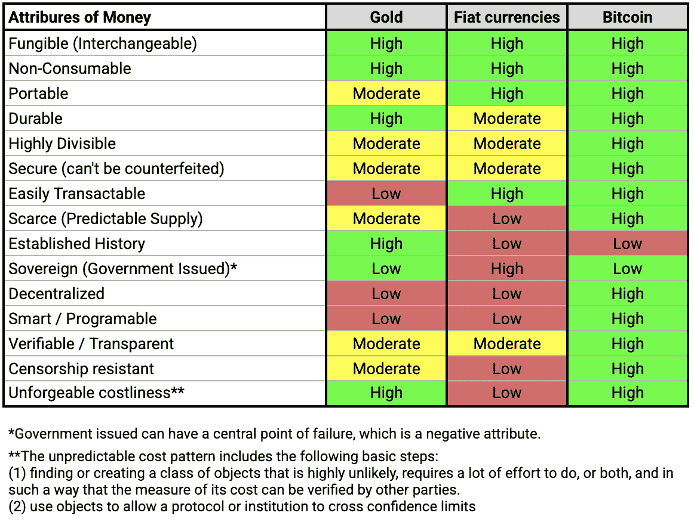
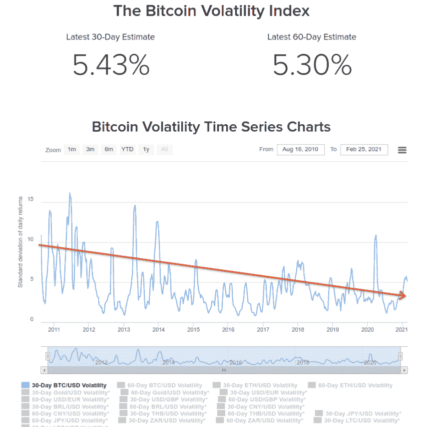
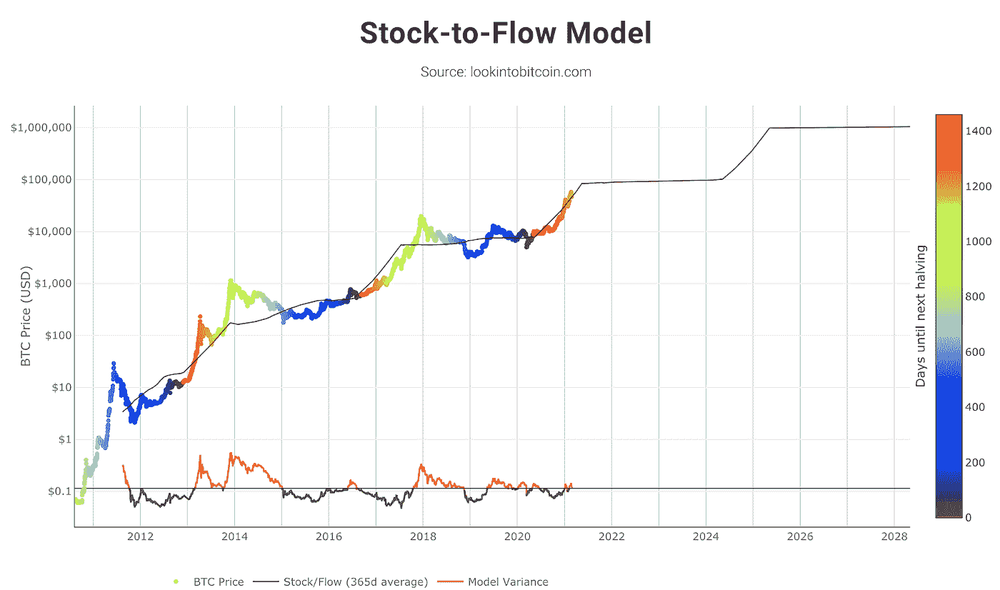

# 比特币:低效率交易。有效的价值储存。

> 原文：<https://medium.com/coinmonks/bitcoin-inefficient-way-of-conducting-transactions-vs-store-of-value-de19c215e6c9?source=collection_archive---------4----------------------->

> *“这是一种效率极低的交易方式”*
> 
> *~珍妮特·耶伦(美国财长)*

比特币被创造出来的目的是成为一个点对点的电子现金系统，没有第三方中介。随着新挑战的出现和新概念的诞生，这一概念和目的也发生了变化，为加密货币世界带来了新的途径和机遇。目前，由于其协议的一些不可改变的因素，如高达 2100 万单位的最大比特币供应量和减半效应，其中包括每 4 年比特币矿工的报酬减半的编程事件(使这种资产通缩，直到 2140 年的最后一个开采部分，届时通货膨胀率将变为零)，主要的叙事是**比特币可能是现有的最佳价值储存手段。**

2017 年，并非所有的网络开发者都同意比特币所传递的价值主张，在罗杰·韦尔(早期比特币投资者)的领导下，比特币被制成了硬分叉，从而创造了比特币现金(BCH)，借口是这是为了保持与中本聪最初提出的“点对点电子现金系统”的一致。通过这种硬分叉，他们将比特币块从约 1MB 更改为约 8MB，从而可以以更快的速度进行更多数量的交易。

这一变化的问题是，它将对比特币最大的属性之一[的去中心化产生负面影响，因为它将成为任何人在家中运行一个节点来支持网络的障碍(目前，超过 10，000 个节点，与其他加密货币相比，它是迄今为止最去中心化的网络)，使挖掘过程、安全性和网络共识主要掌握在大型矿工手中，而较少掌握在希望积极参与网络的普通公民手中。](https://blog.coincodecap.com/a-candid-explanation-of-bitcoin)

从那以后，比特币现金一直是一个失败，因为它无法窃取比特币的可信度(相反，它只给了它更多的力量)，并且它以牺牲比特币最大的属性值之一为代价，部分解决了可扩展性问题。

比特币的可扩展性问题仍然存在，但已经有了比创造“新比特币”更好的解决方案。最知名和受支持的是照明网络(LN)，它在比特币区块链之外创建了一个支付通道网络，使用自主合同来确保网络以分散的方式运行，没有任何风险。

> “比特币是网络空间的银行，由可靠的软件运行，为数十亿没有选择或没有意愿经营自己的对冲基金的人提供一个全球性的、负担得起的、简单的、安全的储蓄账户。”
> 
> 【hope.com*~微软首席执行官迈克尔·塞勒*

无论如何，正如本文导言中提到的，如今比特币本身更倾向于价值储存，而不是一种能够进行大规模即时交易的货币。为此，有大量的其他项目正在开发中，每个项目都有自己的本机令牌用于其网络中，等等。

例如，以太坊是智能合约开发的最大平台，也是当今拥有最多开发者(甚至超过比特币本身)的网络。绝大多数**DeFi**项目都是在以太坊平台上开发的。除了以太坊，其他几个去中心化的智能合约平台也在进行中，比如 **Cardano、Polkadot、Solana、埃尔隆德、Tezos、Neo 等**

因此，比特币不需要像货币一样高效和可扩展才能有价值，正如美国财政部长珍妮特耶伦(Janet Yellen)本周所评论的那样，她表示比特币是“一种效率极低的交易方式”。最重要的是，她说它只为非法交易和洗钱服务，没有提供任何数据来支持这些说法(事实上，只有 0.34%的比特币网络交易被区块链的交易分析公司 Chainalysis 绘制为可疑/非法的，而全球国内生产总值的 2%至 5%，根据联合国的一份报告[约为 8000 亿至 2 万亿美元](https://www.unodc.org/unodc/en/money-laundering/overview.html)。

> *“饶了我吧。她(珍妮特·耶伦)认为印几万亿假美元有效率吗？她不知道她印的假美元越多，比特币就变得越有效率和价值吗？上帝保佑她。”*
> 
> *~罗伯特·清崎《富爸爸穷爸爸》作者*

比特币只需要作为价值储存手段(就目前而言),就可以让它的价值呈指数级增长，并与黄金分享这个位置，顺便说一下，黄金在使这种金属与价值储存目的相关的绝大多数属性上输给了比特币。以下是比特币、黄金和法定货币的对比**:**

Source: self-made based on several online sources.

关于比特币是否可能是价值储存手段，仍有一个反复出现的争论。这个论点是这样的:**高波动性**。下图是比特币的波动性图表，显示了随着其市值的增长，这种资产的波动性越来越小。

Source: [https://www.buybitcoinworldwide.com/volatility-index/](https://www.buybitcoinworldwide.com/volatility-index/)

即使在某些极端情况下，黄金本身也是波动的，但显然它远没有比特币波动性大，因为除了投机性较低之外，黄金的市值为 10-12 万亿美元，而比特币的市值不到 1 万亿美元(截至本文撰写之日)。

因此，随着比特币的应用逐年增加，其波动性越来越低可能只是时间问题。值得一提的是，随着新比特币发行的减少(由于减半效应)和采用的增加，在 12 年的最后 10 年中，这种加密资产的表现超过 100%，迄今为止的平均年回报率(初始日期:2010 年 7 月 17 日，我得到的最早可用日期)约为 365%(以美元计)。波动性论点看起来不再那么有害了，对吗？

下图显示了比特币美元价格的演变，以及基于减半事件和随后的供应冲击的一些价格预测:

Source: [Stock-to-flow Cross Asset Model by PlanB](/@100trillionUSD/bitcoin-stock-to-flow-cross-asset-model-50d260feed12) (Twitter: @100trillionUSD) . Relates Bitcoin’s programmable increased scarcity due to halving events (halving miners’ payoff) every 4 years to the speculative bubbles that have followed. In the image, the price began at $ 0.06 USD in August 2010 until the most recent updated value of ~$ 57,000.00 USD on February 21, 2021\. Total gains of this whole period was ~95,000%. The color variation represents the number of days until the next halving event.

# **最后的想法**

目前有超过 8500 种加密货币在流通(是的，有很多废话)。没有一个项目具有比特币所拥有的合法性，也没有超过 10，000 个节点的支持为网络带来去中心化和安全性，**使其比世界上任何计算机或网络都更安全**。没有其他项目需要(也不太可能成功)取代比特币作为潜在价值储存手段的地位。其他项目将用于不同的情况，不同的地方，购买/销售不同的东西。

我们还有很长的路要走，错误的信息，无论是不是故意的假新闻，都只会迷惑“普通人”，推迟那些不质疑自己并 100%相信那些不理解(或假装不理解)整个现有金融市场破坏性海啸的人所说的话的人的采纳，整个金融市场已经发展了 12 年多，每天 24 小时，每周 7 天运行，年复一年地被越来越多的人采纳，没有一个潜在的失败的中心点。

比特币是，也需要去中心化，让越来越多的人积极参与网络，让地球上的每个人都可以使用。它需要由人民管理，为人民服务。点对点电子现金系统。

— — — — — —

推特:@TheBitcoinizer

— — —
葡萄牙语-BR 文章版本:[https://bitcoinized . medium . com/bit coin-inef ici % C3 % aan CIA-como-moeda-vs-reserva-e-valor-2b 27275 afd2c](https://bitcoinized.medium.com/bitcoin-inefici%C3%AAncia-como-moeda-vs-reserva-e-valor-2b27275afd2c)