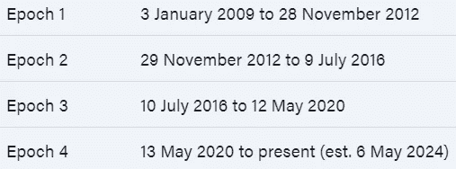
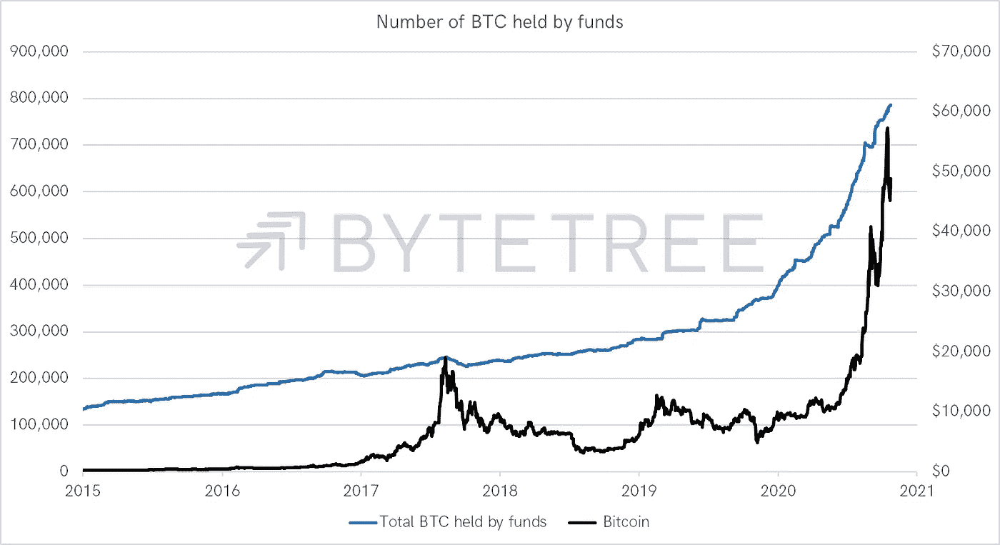
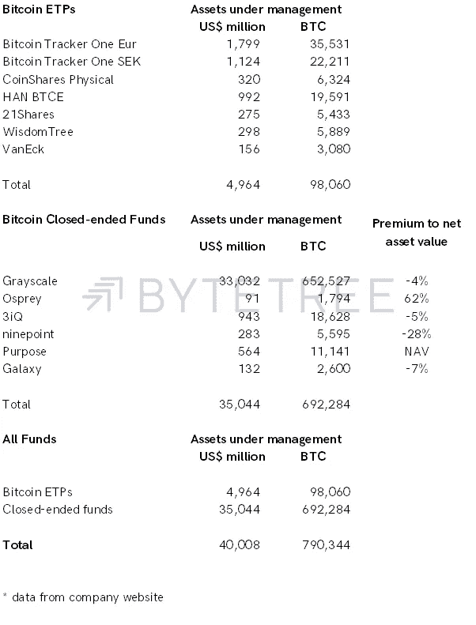
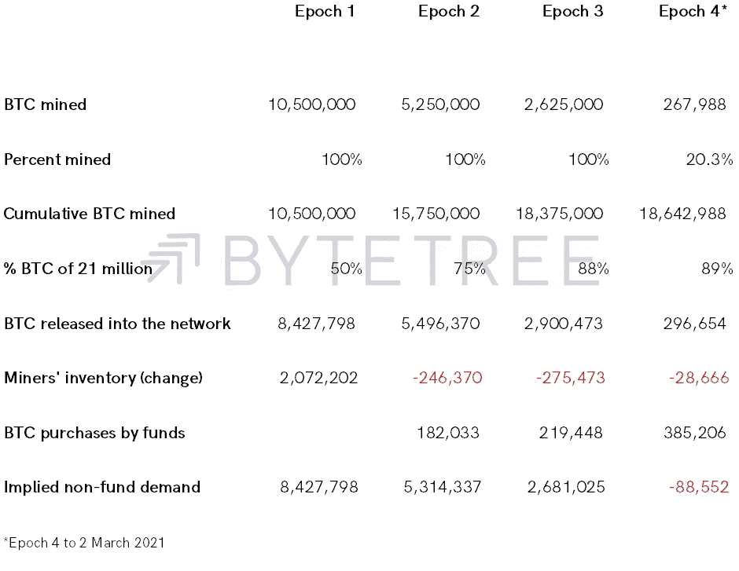
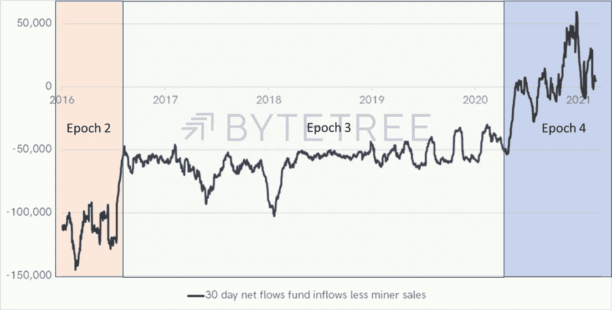
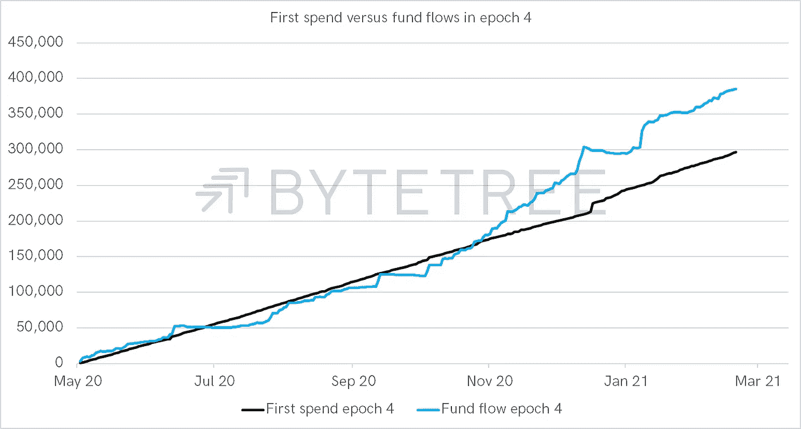
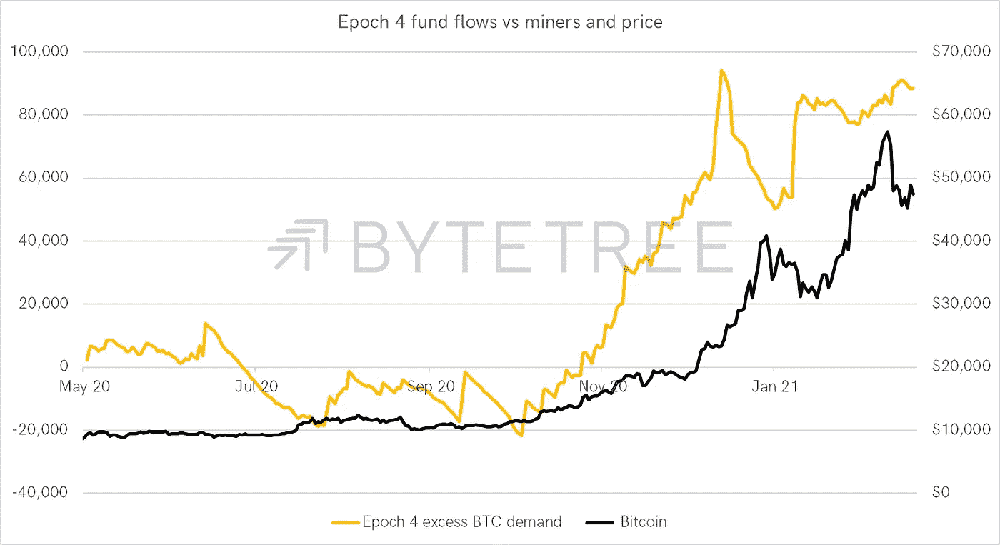

# 比特币机构流动是游戏规则的改变者

> 原文：<https://medium.com/coinmonks/bitcoin-institutional-flows-are-a-game-changer-71c26692fb67?source=collection_archive---------6----------------------->

最近几个月，比特币基金已经把所有被开采出来的比特币都挖走了，还有一些。为了满足贪得无厌的需求，矿商们一直在减少库存(由 ByteTree.com 跟踪)。在这篇文章中，我将带你了解正在发生的事情，并展示机构资金流动如何成为一股主要力量。

比特币早期，没有资金，只有钱包。它们可以免费使用，这很好，但随之而来的保管问题让机构投资者望而却步。这不是一个新问题。在 2003 年推出黄金 ETF 之前，机构投资者很难拥有它，因为他们几乎不能把金条锁在办公室的保险箱里。他们需要一个独立验证并与金融系统相连的安全系统。

ETF 解决了这一问题，因为它使机构黄金所有权以安全、审计和合规的方式蓬勃发展。同样，比特币基金为机构投资者解决了这个问题，因为它们将比特币所有权与客户安全地联系在一起。不需要私钥；只要按下按钮，把比特币当成股票。

## 时代是比特币减半事件之间的时期

在第一纪元没有已知的基金。全球最大的比特币基金 gray(GBTC)于 2013 年 9 月 25 日在第二纪元推出，XBT 提供商(CoinShares)于 2015 年初推出。有一段时间，它们的规模一直很小，直到 2015 年 11 月 17 日才集体突破 1 亿美元。有趣的是，XBT 供应商当时规模更大。

Source: Bloomberg; ByteTree Asset Management. *Number of BTC held by funds*.

图表显示了所有已知公开交易的比特币基金持有的 BTC 总量。2015 年初，BTC 持有量刚刚超过 13.5 万，截至昨日，这一数字已飙升至 79.0344 万 BTC。

资金流动是双向的，资金可以进来，也可以出去。值得注意的是，即使在 2018 年熊市期间，也很少有 BTC 人离开这些基金。部分原因是 GBTC 是一家封闭式基金，据我所知，他们从未出售过比特币。相比之下，欧洲 ETF 根据供求关系每天创建和赎回股票。

我排除了多币基金和企业资金，因为我们无法准确衡量 BTC 持有的数量，也没有可见性。包含的资金都是只做多比特币的，如下图。

Source: Bloomberg; ByteTree Asset Management. *BTC in funds*.

欧洲和北美比特币基金的一大区别是 ETF 与封闭式基金(cef)。GBTC 占据了榜单上所有 BTC 的 85%,这真的很了不起。供求关系决定了 ETF 的流入和流出，而 cef 似乎是单向的。因此，CEF 的供求反映在资产净值的折价和溢价上，而不是 BTC 的持有量上。

第一个时代没有资金流动。第二次购买了 182，033 辆 BTC，第三次购买了 219，448 辆，第四次购买了 385，206 辆(当前)。截至 2021 年 3 月 2 日，已经开采了 18，642，988 BTC，占整个未来比特币供应量的 89%。

Source: Bloomberg; ByteTree.com; ByteTree Asset Management.

矿工们也可以去 HODL。Bytetree.com 计算了第一笔花费(T0)和第一笔花费(T1)，后者衡量的是 BTC 发布到网络上的，最有可能是售出的。BTC 开采和首次消耗之间的差额被记录为库存。在第一个纪元中，这个数字达到了 2，072，2020，在随后的纪元中这个数字不断下降。

资金流动在第二个纪元开始，并开始积累 BTC。在第二个和第三个时期，对资金流的需求与可获得的供给相比都很小。然而，在迄今为止的第四个纪元中，这些资金获得了 385，206 BTC，而只开采了 267，988 BTC。然而，由于矿商减少了库存，他们已经卖出了 296，654 辆 BTC。这是第一次，结果是这些基金攫取了整个新 BTC 的供应量，甚至更多。

底线是第四纪元正在运行 BTC 赤字。在前三个时期，非基金需求通过交易所填补了缺口。这一次，基金是无情的。

通过比较矿商首次支出和 epoch 资金流之间的 30 天净流量，就可以看出这一点。有一个阶段的变化，目前的时代是盈余的。y 轴的测量单位是 BTC。

# 第四个纪元出现了盈余

Source: Bloomberg; ByteTree.com; ByteTree Asset Management.

放大到第四个纪元，我们可以比较 BTC 的首次支出和资金流动。请注意，2020 年 11 月初，资金需求如何越过了矿商的供应线。

Source: Bloomberg; ByteTree.com; ByteTree Asset Management.

最后，我展示了相对于比特币价格的超额资金需求，也就是上面两条线的差额。这多少解释了这次牛市。

Source: Bloomberg; ByteTree.com; ByteTree Asset Management.

重要的一点是，机构需求已经成为决定比特币价格的主导力量。从现在到第四纪元结束(估计于 2024 年 5 月 6 日结束)，还有 1，044，513 枚 BTC 有待开采。如果机构资本流动能够保持这一速度，那就万事大吉了。如果他们能做得更多，那么更高的价格就有可能实现。然而，如果它们降温，预期价格会随之上涨也不无道理。

# CoinShares IPO

在其他行业新闻中，位于泽西岛的比特币资产管理公司 CoinShares 预计将于 3 月 11 日周四在瑞典的纳斯达克斯德哥尔摩上市。该公司将以每股 44.90 SEK 的价格出售 3，364，403 股股票。在这里阅读声明

随着比特币基地和其他人进入市场，加密空间正在股票市场中占据一席之地。我们认为这是积极的，因为它提高了知名度，这反过来将吸引长期投资。

披露:CoinShares 董事长 Daniel Masters 是 ByteTree.com 和 ByteTree 资产管理公司背后的控股公司 Crypto Composite Ltd 的董事会成员。

或许有趣的是，我最近写了 [Atlas Pulse 第 61 期](https://glintpay.com/atlas-pulse-gold-report/atlas-pulse-gold-report-2021/)，这是关于黄金市场的更新，你会看到一些新的指标被添加到 ByteTree Asset Management 的网站上，对[黄金](https://bytetreeam.com/gold)进行估值，并比较[比特币和黄金波动性](https://bytetreeam.com/volatility)。

本文由 ByteTree 的联合创始人兼董事长查理·莫里斯(Charlie Morris)撰写。这篇文章来自 ByteTree Insights，最初发表于 2020 年 3 月 3 日。

[订阅](https://bytetree.com/mailing)我们的邮件列表，通过电子邮件接收我们的每周更新。在推特上关注查理， [@AtlasPulse](http://twitter.com/AtlasPulse) 。

> 加入 coin monks[Telegram group](https://t.me/joinchat/EPmjKpNYwRMsBI4p)学习加密交易和投资

## 另外，阅读

*   最好的[密码交易机器人](/coinmonks/crypto-trading-bot-c2ffce8acb2a)
*   [印度比特币交易所](/coinmonks/bitcoin-exchange-in-india-7f1fe79715c9)
*   [比特币储蓄账户](/coinmonks/bitcoin-savings-account-e65b13f92451)
*   最好的[加密税务软件](/coinmonks/best-crypto-tax-tool-for-my-money-72d4b430816b)
*   [电网交易](https://blog.coincodecap.com/grid-trading) | [区块链审核](/coinmonks/blockfi-review-53096053c097)
*   最佳加密交易所