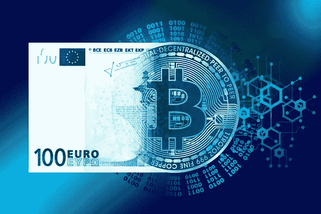

# 比特币是货币

> 原文：<https://medium.com/coinmonks/bitcoin-is-money-d3c928c92cbf?source=collection_archive---------5----------------------->

这部分归功于两个稳定的特征。

Image by [Gerd Altmann](https://pixabay.com/users/geralt-9301/?utm_source=link-attribution&utm_medium=referral&utm_campaign=image&utm_content=5094279) from [Pixabay](https://pixabay.com/?utm_source=link-attribution&utm_medium=referral&utm_campaign=image&utm_content=5094279)

钱是什么？

货币是一个给定社会中的许多人认为可以方便、安全地用来储存和相互转移财富的任何东西，无论是现在还是将来。

为了转移财富，货币必须储存一定数量的财富。或者更具体地说，许多人必须相信这笔钱储存了一些正面的财富，无论是现在还是将来，或者他们为什么要用它来交换商品和服务？

最好但不是必须的是，这笔钱在今天和明天储存的财富数量大致相同；其财富储存能力在短期内相对稳定。这个特点使它成为一种更好的货币。

比特币在 2009 年 1 月 3 日首次推出时是一种货币吗？不会，因为那时候比特币没有价值，不储存财富。如果比特币不储存任何财富，就不能用来转移财富。拥有少量用户的比特币陷入了一个循环的零价值循环。

直到 2009 年 5 月 21 日，一万个比特币换了两个棒约翰披萨。这个私人交易所建立了比特币的第一个正价格，尽管价格非常低。一个里程碑，但没有那么重要，因为两个人真的不能创造一个市场。

2010 年 7 月，第一家比特币交易所 Mt. Gox 开始运营，这是一个更重要的里程碑。尽管最终存在缺陷，但 Mt. Gox 首次根据比特币的实际市场供求制定了比特币价格，即使市场相对较小。

然后丝绸之路发生了。

丝绸之路于 2011 年 2 月由罗斯·乌尔布莱特(又名《T4》中的“恐惧海盗罗伯茨”……)发起，是一个在线市场，用户可以匿名出售和购买大部分非法商品。虽然 Tor 浏览器的使用可以隐藏一个人的 IP 地址，但一种尽可能匿名的远程支付方法是可取的，这在当时是比特币。

(丝绸之路。[https://en . Wikipedia . org/wiki/Silk _ Road _(market place)](https://en.wikipedia.org/wiki/Silk_Road_(marketplace))

虽然丝绸之路在 2013 年 10 月被联邦调查局关闭，但在两年多的运营期间，比特币发挥了有益的作用，即大部分匿名和完全不可信的财富转移，建立了对比特币的广泛市场需求。结合其固有的有限供应，令许多人惊讶的是，比特币现在是一种有价值的金融资产。

在这两年期间，比特币的价格从 1 美元上涨到 150 美元以上。

比特币精灵已经从瓶子里出来了。既然许多人接受了比特币储存财富，它们就可以用来转移财富。由于比特币能够可靠、高效地转移财富，因此具有价值。是的，这是一个循环论证，但仍然是有效的。比特币变成了一种货币。

这是比特币的第一个稳定特性。任何健全的货币都是如此。

比特币网络依赖于挖掘的完整性，集体挖掘的计算机能力越大，网络的完整性就越大，这意味着随着挖掘量的增加，使用比特币存储和转移财富就越安全。网络越安全，人们对网络的信任就越大。

当比特币没有价值时，不需要信任，因为没有什么有价值的东西可以失去。但随着比特币获得价值，随着人们开始使用它们来存储和转移财富，需要更多的信任，需要更多的挖掘。

幸运的是，(或者我愿意按计划去想)，矿工的报酬与比特币的价值成正比。随着比特币价值的增加，有更多的动机去挖掘，这意味着随着比特币价值的增加，网络的完整性越大。这导致了比特币价值的增加，这是另一个循环论证。

这是比特币的第二个稳定特征，是网络货币所独有的。

自最初推出以来，比特币网络表现完美，这也有所帮助。曾经有过设计糟糕的交易所，也不乏用户丢失私钥的情况，但网络本身并没有丢失或挪用任何比特币。这在数学上是完美的。

比特币并不是一个特别好的支付系统，但只有最狂热的反对者才能继续否认比特币不是一种货币，不是黄金的替代品，使用比特币，财富可以远程、安全地转移，并且没有可信任的第三方的开销。

想了解更多？

[www.WTHisAnEconomy.com](http://www.WTHisAnEconomy.com)