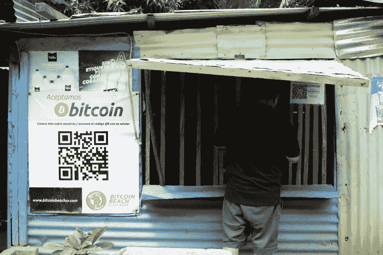
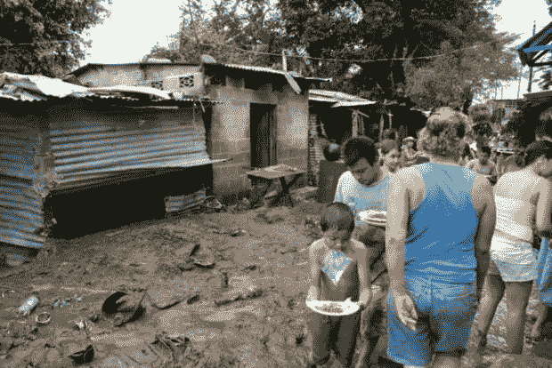
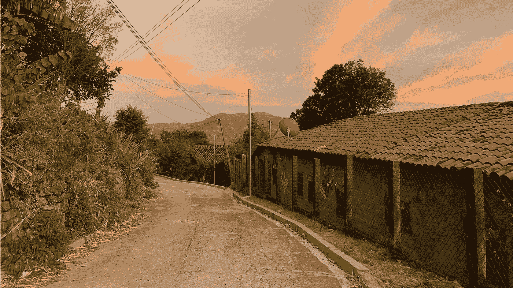
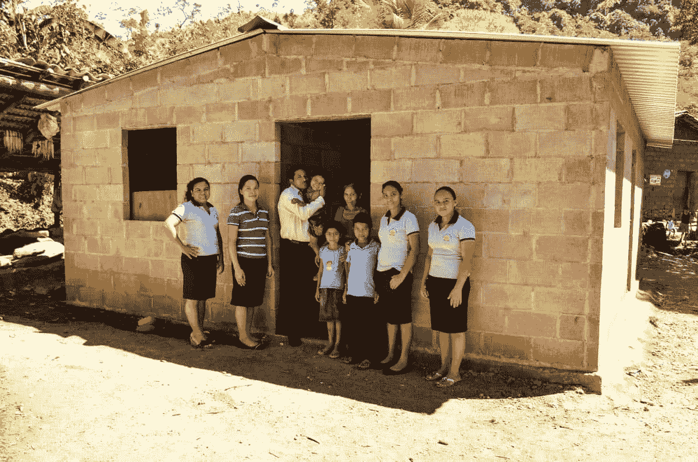
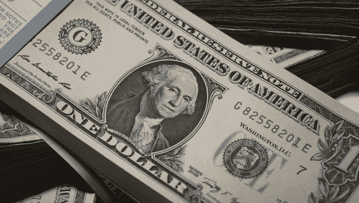
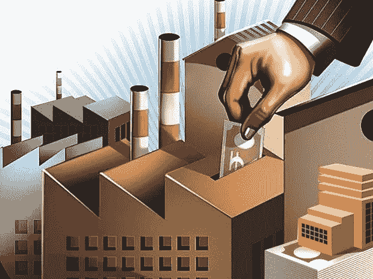

# 比特币不是解决萨尔瓦多经济困境的灵丹妙药——原因如下

> 原文：<https://medium.com/coinmonks/bitcoin-is-not-the-silver-bullet-for-el-salvadors-economic-woes-here-s-why-f66a1fd689d3?source=collection_archive---------4----------------------->

Bukele and his laser eyes. Source: [https://www.indiatoday.in/](https://www.indiatoday.in/)

# ***发生了什么？***

2021 年 6 月 9 日，萨尔瓦多议会通过了总统 Nayib Bukele 提出的立法，使萨尔瓦多成为第一个将比特币作为法定货币的国家。

这不仅对萨尔瓦多来说，而且对整个比特币来说，都被誉为一个划时代的时刻，因为其支持者宣布该法案是朝着加密货币在全球范围内得到更广泛接受迈出的第一大步。然而，许多其他人并不确定。

事实上，这一举动让许多观察家感到困惑——为什么布克勒要将自己的政策空间控制权让给一个无法控制、更重要的是无法问责或信任的全球网络？

这仅仅是一个公关举动，以转移萨尔瓦多手头的真正问题，还是这是一个实际的和深思熟虑的政策实施，以刺激国家的经济？在这篇文章中，我将在向您提供我的价值判断之前，最大限度地考察这两方面。

然而，在此之前，让我们快速了解一下萨尔瓦多作为一个国家，让比特币成为合法货币对她意味着什么。

# ***在萨尔瓦多让比特币成为法定货币意味着什么？***

萨尔瓦多是中美洲最小的国家，经济持续低增长。该国的减贫力度也不大。

她的国内生产总值为 270 亿美元，是世界上最贫穷的国家之一。然而，在过去二十年里，不平等现象有所减少，萨尔瓦多现在是拉丁美洲最平等的国家之一。

萨尔瓦多当地系统中有两种官方货币形式——当地发行的科朗和美元，后者在 2001 年被作为法定货币，作为抑制通货膨胀和增加与美国(其最大的贸易伙伴)贸易的政策改革。

和大多数国家一样，在萨尔瓦多使用比特币已经是合法的，如果双方(买家和商家)都有能力和意愿，你可以在任何特定的交易中自由使用比特币。然而，让比特币成为法定货币将意味着商家现在将被法律要求接受比特币作为支付手段，除非他们能够证明他们缺乏必要的技术来这样做。人们也将被允许用比特币缴税。

A roadside stall that accepts Bitcoin. Source: [https://www.aljazeera.com/](https://www.aljazeera.com/)

正如新的立法所述，

> 每一个经济主体都必须接受比特币作为支付手段，无论是谁购买了一件商品或服务。

现在，这对萨尔瓦多来说真的是一件好事吗？

# ***萨尔瓦多比特币政策分析:比特币是谚语所说的银弹吗？***

我对这个问题的回答将基于 Bukele 总统认为这项政策的实施将给萨尔瓦多带来的好处。

我将分解这些优点，并尽我所能和所知对它们进行评论，看看它们是否成立。如果是这样，那么比特币*就是*解决萨尔瓦多经济困境的银弹。

如果他们没有，我的文章标题保持不变。

我们开始吧。

根据 Bukele 的说法，这种实现有 4 个主要的潜在优势:

1.  汇款最后一英里递送流程的改进
2.  获得金融服务的民主化
3.  对美元的缓冲
4.  吸引外国直接投资

# **汇款最后一英里交付流程的改进**

首先，汇款占萨尔瓦多国内生产总值的很大一部分。2020 年，这些汇款(居住在国外的萨尔瓦多人汇回家帮助家人的钱)总额高达 59 亿美元，占全国 GDP 的 23%。

然而，这些汇款的最后一英里交付过程往往效率低下，非常不方便。因为大多数收到这些汇款的人往往在低收入阶层中占多数，许多人生活在贫困线以下和没有适当交通基础设施的农村地区，所以在汇款真正到达他们手中之前，有许多障碍需要清除。

A rural village in El Salvador. Source: [https://fernandopocablog.wordpress.com/](https://fernandopocablog.wordpress.com/)

例如，由于这些人大多没有银行账户(没有银行账户)，汇款不能简单地汇到他们的账户上。通常情况下，这些钱必须由当地银行以现金形式提取，然后存放在那里，供预定的收款人收取。但是因为预期的收款人通常住在非常偏远和交通不便的地方，到这些银行(通常在城市里)的交通是一个巨大的问题。

此外，就跨境汇款而言，许多中间人会从汇款中抽取一部分作为交易费，随着汇款在各大洲间的流动而逐渐减少。这些费用对我们这些生活在特权条件下的人来说可能显得微不足道，但对萨尔瓦多人来说可能意义更大。

这就是比特币的用武之地。

比特币将允许规避上述所有问题，因为它 [**允许直接的点对点和点对点交易**](https://www.investopedia.com/terms/b/bitcoin.asp)**，从而完全去中介化。**接收者需要的只是一部带有免费比特币钱包的手机，下载起来足够简单。这样，就不会有不必要的额外费用损失，收款人也不必长途跋涉亲自去取钱。

***批判***

虽然到目前为止一切似乎都很好，但我必须提出一些重要的警告。

尽管不可否认和无可争议的是，比特币解决了最后一公里交付和跨境支付的所有上述问题，但这些问题一开始就有意义吗？事实上——这些问题甚至*存在*吗？

首先，向萨尔瓦多汇款已经相对便宜，因为在跨境交易中使用美元意味着支付不需要通过货币兑换。如果一个人坚持用冒号交易，还有 [Wise(以前的 TransferWise)](https://www.exiap.com/reviews/transferwise) ，它没有任何隐藏的汇率加价。传送时间也*不到一天*，使用起来非常安全。

由此，我们意识到比特币表面上解决的中间人费用过高的“问题”可能根本不是问题。即使是这样，也已经有现存的中央解决方案，如 Wise，即使不完美，也运行良好。在这种情况下，中介似乎不是问题，因为影响可以忽略不计——如果有的话*。*

**

*A road linking a rural El Salvadorian town to the city. Source: [https://www.icwa.org/](https://www.icwa.org/)*

*第二，萨尔瓦多的交通基础设施并没有很多人想象的那么落后。当然，它无法与美国、新加坡或德国相比，但也不是机能失调。[农村公路项目](https://www.eulaif.eu/en/projects/rural-road-program-el-salvador)由拉丁美洲投资基金于 2011 年发起，旨在改善萨尔瓦多的农村公路基础设施，使这些地区与主要城市更好地连接起来。这确实大大减少了来自农村地区的收款人在收取汇款时将面临的摩擦，并向我们透露了比特币可能并不真的有必要。*

*最后，让我们诚实地说，你真的想让这些人(他们可能只能靠每月收到的汇款勉强度日)受到所有比特币“鲸鱼”的控制吗(假设他们没有把比特币换成法定货币)？*

*我的意思是，我们在这里谈论的是生存资金。*

***你能想象如果比特币的价格因埃隆马斯克的一条推文而暴跌会发生什么吗？***

*那么这些人将何去何从？*

*对于一个不存在的问题(或者说不是一个大问题)，没有什么灵丹妙药，因为无论如何都没有*需要*来解决。*

*引入它实际上可能会引发更严重的问题。*

# ***获得金融服务的民主化***

*其次，在萨尔瓦多，大约 70%的公民没有银行账户，这意味着他们无法获得基本的银行账户。与此同时，他们也与上述银行账户的所有金融工具(贷款、投资等)隔离开来。).*

***比特币可以为这部分人提供金融包容性**,因为你不需要银行账户就可以使用比特币；你只需要你的手机和一个电子钱包。*

*这些公民然后可以将这些汇款比特币投资于去中心化的金融工具，如流动性池和去中心化交易所(DEX)——所有这些都不需要银行账户。*

****批判****

*然而，这里需要现实一点。萨尔瓦多是美洲互联网使用率最低的国家之一——根据[世界银行数据](https://data.worldbank.org/indicator/IT.NET.USER.ZS?locations=SV)，2017 年为 33%。你认为这些没有银行账户的个人中有多少人能够处理加密货币交易？*

**

*An El Salvadorian household in the rural countryside. Source: [https://blog.compassion.com/](https://blog.compassion.com/)*

*如果他们一开始就不能或不愿意开立银行账户，你凭什么认为他们有能力、甚至愿意建立一个数字比特币钱包？*

*见鬼，甚至我们这些所谓的“第一世界国家”中的许多人也在为此而奋斗！因此，**比特币实际上甚至可能扩大无银行账户者和有银行账户者之间的差距，因为通常是后者更有能力也更愿意使用它。***

*这就是这种银弹的内在矛盾，它将严重抑制布克莱向世界承诺的潜力。*

# ***对美元的缓冲***

*根据 Mallers 的迈阿密演讲幻灯片中的 Bukele 的立法提案的摘录，*

> *“各国央行正越来越多地采取可能损害萨尔瓦多经济稳定的行动。”*
> 
> *“为了减轻中央银行的负面影响，有必要授权一种数字货币的流通，这种货币的供应量不能由任何中央银行控制，只能根据客观和可计算的标准进行改变。”*

*与美元不同，**比特币今天、下个月、20 年后的供应量永远是提前知道的，无法改变。**每 10 分钟就有固定数量的新比特币产生。每四年，创造的比特币数量会减半。比特币的数量永远不会超过 2100 万，而这个最终数字将在 100 多年后的今天达到。*

**

*A US Dollar Note. Source: [https://www.dailyfx.com/](https://www.dailyfx.com/)*

*20 年前，当萨尔瓦多经济“美元化”时，他们实际上把自己置于一个(尽管是必要的)受制于美国政策制定者在货币方面的突发奇想和决定的境地。*

*二十年前，这不是问题。管理美元主要是为了美元的利益，但与其他货币相比，美元是一块石头；一致、可靠，是“万恶之首”。萨尔瓦多指望美元带来相对稳定和可预测的货币政策，而 20 年前，他们得到的正是这些。*

*然而，自 2008 年全球金融危机以来，美国一直在采取一种非常实验性的货币政策形式，包括量化宽松等工具和一家现在直接货币化或购买政府发行的债务以有目的地保持低利率的央行。*

*虽然这些“实验”可能会产生非常积极的结果，但萨尔瓦多在经济美元化时寻求的稳定性和可预测性几乎消失了。*

*客观地看，根据圣路易斯美联储银行的数据，在过去 10 年中，美元的供应量增加了一倍多，从 8 万亿美元增加到 4 月份的 20 万亿美元。事实上，近一半的 11 万亿美元增长发生在过去 18 个月，因为美国政府试图抵消冠状病毒疫情不可避免地带来的负面经济影响。*

*从这个角度来看，在一个全球储备货币几乎完全由政府短期需求决定的世界里，具有讽刺意味的是，比特币成为了看起来更“稳定”(用巨大的引号括起来)的货币形式，可能更好地服务于萨尔瓦多的货币政策*规划*的利益。*

*尽管如此，无论如何，萨尔瓦多引入比特币作为法定货币对*来说更容易*，因为不像许多其他国家有自己的货币和货币政策，**他们已经无法控制现有的货币供应**。*

*因此，实施的机会成本比其他国家低得多，如果他们也这样做，可能会失去更多。*

****批判****

*然而，这最终仍然是我们在谈论的比特币。尽管就其在货币政策制定中的作用而言，比特币可能比美元更稳定，但不可否认的事实是，至少可以说，比特币的*价格*极其不稳定。*

*事实上，在撰写本文时，比特币的价格已经从 2021 年 4 月的高点近 65，000 美元大幅下跌至 38，000 美元左右。*

*我的意思是，我们实际上只需要某个有影响力的人发一条 *tweet* ，价格就能移山倒海。*

*这无疑给货币政策制定带来了一系列新问题。*

*例如，当谈到债务时:如何确定支付债务所需的比特币数量，以及由谁来确定？是基于债务发生时的比特币价格，还是债务到期时的比特币价格？*

***由于比特币的价格波动很大，几天——甚至*小时* —就能产生巨大的影响。***

*此外，比特币的性质使其极不适合需要快速确认时间的交易。举例来说——想象你想从咖啡馆买一杯咖啡。如果你用美元支付，兑换几乎会立即进行。你用现金换取咖啡，收银员把现金收好，价值交换就完成了。*

*然而，如果你使用比特币，那就完全是另一回事了。在比特币区块链中，每 10 分钟*就会有一个区块被发送到网络。对于交易的终结性(或最好的相似性)，需要 6 次确认(需要将 6 个区块附加到您的交易所属的区块)。这意味着您的交易只能在整整 1 个小时后确认和完成！这绝对不是买咖啡的方式。**

*使用比特币进行快速日常交易的不可行性进一步向我们指出了一种可能性，即让比特币成为法定货币实际上可能会破坏萨尔瓦多经济的稳定，而不是帮助它。*

*此外，让我们不要忘记，由于比特币的通缩设计(固定供应，每四年供应减半)，每比特币的价格将*最有可能* *最终*上涨(假设对它的需求保持不变/增加)。为什么会有人想用一种他们知道将来肯定会升值的货币在现在购买东西呢？因此，与花掉比特币相比，拥有比特币的萨尔瓦多人更有可能持有比特币。*

*这可能会给萨尔瓦多的经济带来进一步的问题，**因为** **富人和*穷人*之间的收入差距，前者现在可能有能力购买和持有(许多)更多的比特币，当比特币价格最终飙升时(再次假设需求保持不变/增加)，这一差距可能会在未来成倍扩大**。*

*此外，在使用比特币进行交易时保持匿名的增强能力将给萨尔瓦多政府带来许多严重的问题。随着比特币成为法定货币，洗钱、逃税和黑市经济都更有可能在萨尔瓦多蓬勃发展，因为当局将发现追踪“脏”钱及其流动更加困难。*

*因此，在找到上述所有问题的解决方案之前，比特币很不幸永远不会成为萨尔瓦多美元的更好替代品。*

# ***吸引外国直接投资***

*最后，根据布克勒的说法，*

> *“如果将 1%的比特币投资于萨尔瓦多，我们的 GDP 将增长 25%。”*

**

*Visual Representation of a FDI. Source: [https://www.business-standard.com/](https://www.business-standard.com/)*

***批判 ***

*在布克勒声称的比特币(对萨尔瓦多)的所有好处中，这一点是最令人困惑的。*

*布克勒认为比特币的总市值(流通中的比特币总数乘以比特币的价格)直接等于全世界比特币所有者寻求投资的钱，这是一个极其错误的逻辑。*

*如上所述，大多数人认为比特币本身就是一种投资资产。换句话说，很少有人——如果有的话——购买比特币，然后投资于其他东西。*

*这不是大多数比特币持有者遵循的逻辑！*

*从本质上来说，**世界上持有比特币的许多主要基金或个人不太可能仅仅因为它是萨尔瓦多的法定货币而突然被吸引到萨尔瓦多投资。***

*这只是一个假设性的飞跃。*

*此外，人们还必须记住，外国直接投资并不直接贡献一个国家的国内生产总值。换句话说，**外国投资者在萨尔瓦多用比特币购买土地等有形资产，不一定能增加 GDP**；这只会抬高所述土地的价格。*

*外国直接投资能够真正提振萨尔瓦多 GDP 的唯一途径是，向新的基础设施和/或企业注入大量外国资本，大幅提高劳动力的整体生产率。然而，比特币是否会成为引发这一现象的火花仍有待观察，而且在目前，这似乎不太可能。*

# ***判决结果***

*综上所述，我想我可以肯定地说:比特币不是解决萨尔瓦多经济困境的灵丹妙药。*

*事实上，我甚至可以说，就一个国家的经济规划而言，没有什么灵丹妙药。*

*随着时间的推移，经济问题会通过精心策划、以公民为中心、努力执行和切实有效的政府政策得到解决。根本没有偷懒的办法。*

*最近，在他的政党驱逐萨尔瓦多总检察长和几名高级法官之后，布克莱因在政府中过于权威而受到猛烈抨击。据我们所知，这整个比特币传奇可能只是布克勒的一个公关策略，以转移人们对眼前这些真正问题的注意力。*

*无论情况如何，萨尔瓦多的比特币实验肯定会受到全世界的关注。*

*为了生活在那里的 650 万人，让我们希望有一天我们都能回到这篇文章上，一起开怀大笑，看看我的预测到底有多么错误。*

*另一种选择太令人沮丧，难以想象。*

> *加入 [Coinmonks 电报频道](https://t.me/coincodecap)，了解加密交易和投资*

## *另外，阅读*

*   *[尤霍德勒 vs 科恩洛安 vs 霍德诺特](/coinmonks/youhodler-vs-coinloan-vs-hodlnaut-b1050acde55a) | [隐蝠 vs 哈斯博特](https://blog.coincodecap.com/cryptohopper-vs-haasbot)*
*   *[币安 vs 北海巨妖](https://blog.coincodecap.com/binance-vs-kraken) | [美元成本平均交易机器人](https://blog.coincodecap.com/pionex-dca-bot)*
*   *[如何在印度购买比特币？](/coinmonks/buy-bitcoin-in-india-feb50ddfef94) | [WazirX 审核](/coinmonks/wazirx-review-5c811b074f5b) | [BitMEX 审核](https://blog.coincodecap.com/bitmex-review)*
*   *[比特币主根](https://blog.coincodecap.com/bitcoin-taproot) | [Bitso 评论](https://blog.coincodecap.com/bitso-review) | [排名前 6 的比特币信用卡](/coinmonks/bitcoin-credit-card-bc8ab6f377c6)*
*   *[双子座 vs 比特币基地](https://blog.coincodecap.com/gemini-vs-coinbase) | [比特币基地 vs 北海巨妖](https://blog.coincodecap.com/kraken-vs-coinbase) | [硬币罐 vs 硬币点](https://blog.coincodecap.com/coinspot-vs-coinjar)*
*   *[印度比特币交易所](/coinmonks/bitcoin-exchange-in-india-7f1fe79715c9) | [比特币储蓄账户](/coinmonks/bitcoin-savings-account-e65b13f92451) | [Paxful 点评](/coinmonks/paxful-review-4daf2354ab70)*
*   *[杠杆令牌](/coinmonks/leveraged-token-3f5257808b22) | [最佳密码交易所](/coinmonks/crypto-exchange-dd2f9d6f3769) | [密码交易机器人](https://blog.coincodecap.com/best-crypto-trading-bots)*
*   *[Godex.io 审核](/coinmonks/godex-io-review-7366086519fb) | [邀请审核](/coinmonks/invity-review-70f3030c0502) | [BitForex 审核](/coinmonks/bitforex-review-c4bb28d9e271) | [HitBTC 审核](/coinmonks/hitbtc-review-c5143c5d53c2)*
*   *[Crypto.com 费用](/coinmonks/binance-fees-8588ec17965) | [僵尸加密审查](/coinmonks/botcrypto-review-2021-build-your-own-trading-bot-coincodecap-6b8332d736c7) | [替代品](https://blog.coincodecap.com/crypto-com-alternatives)*
*   *[MXC 交易所评论](/coinmonks/mxc-exchange-review-3af0ec1cba8c) | [Pionex vs 币安](https://blog.coincodecap.com/pionex-vs-binance) | [Pionex 套利机器人](https://blog.coincodecap.com/pionex-arbitrage-bot)*
*   *[我的密码交易经验](/coinmonks/my-experience-with-crypto-copy-trading-d6feb2ce3ac5) | [比特币基地评论](/coinmonks/coinbase-review-6ef4e0f56064)*
*   *[加密货币储蓄账户](/coinmonks/cryptocurrency-savings-accounts-be3bc0feffbf) | [赌注加密](https://blog.coincodecap.com/staking-crypto) | [CEX。IO 审查](https://blog.coincodecap.com/cex-io-review)*
*   *[最佳比特币保证金交易](/coinmonks/bitcoin-margin-trading-exchange-bcbfcbf7b8e3) | [Bityard 保证金交易](https://blog.coincodecap.com/bityard-margin-trading) | [Prokey 点评](/coinmonks/prokey-review-26611173c13c)*
*   *[加密保证金交易交易所](/coinmonks/crypto-margin-trading-exchanges-428b1f7ad108) | [赚取比特币](/coinmonks/earn-bitcoin-6e8bd3c592d9) | [Mudrex 投资](https://blog.coincodecap.com/mudrex-invest-review-the-best-way-to-invest-in-crypto)*
*   *[WazirX vs coin dcx vs bit bns](/coinmonks/wazirx-vs-coindcx-vs-bitbns-149f4f19a2f1)|[block fi vs coin loan vs Nexo](/coinmonks/blockfi-vs-coinloan-vs-nexo-cb624635230d)*
*   *[BlockFi 信用卡](https://blog.coincodecap.com/blockfi-credit-card) | [如何在币安购买比特币](https://blog.coincodecap.com/buy-bitcoin-binance) | [电网交易机器人](https://blog.coincodecap.com/grid-trading)*
*   *[加密复制交易平台](/coinmonks/top-10-crypto-copy-trading-platforms-for-beginners-d0c37c7d698c) | [五大 BlockFi 替代方案](https://blog.coincodecap.com/blockfi-alternatives)*
*   *[CoinLoan 点评](/coinmonks/coinloan-review-18128b9badc4)|[Crypto.com 点评](/coinmonks/crypto-com-review-f143dca1f74c) | [火币保证金交易](/coinmonks/huobi-margin-trading-b3b06cdc1519)*
*   *[顶级付费加密货币和区块链课程](https://blog.coincodecap.com/blockchain-courses) | [币安评论](/coinmonks/binance-review-ee10d3bf3b6e)*
*   *[在美国如何使用 BitMEX？](https://blog.coincodecap.com/use-bitmex-in-usa) | [BitMEX 回顾](https://blog.coincodecap.com/bitmex-review) | [币安 vs Bittrex](https://blog.coincodecap.com/binance-vs-bittrex)*
*   *[最佳免费加密信号](https://blog.coincodecap.com/free-crypto-signals) | [YoBit 评论](/coinmonks/yobit-review-175464162c62) | [Bitbns 评论](/coinmonks/bitbns-review-38256a07e161) | [OKEx 评论](/coinmonks/okex-review-6b369304110f)*
*   *[比特币基地跑马圈地](https://blog.coincodecap.com/coinbase-staking) | [Hotbit 点评](/coinmonks/hotbit-review-cd5bec41dafb) | [KuCoin 点评](https://blog.coincodecap.com/kucoin-review) | [期货交易机器人](/coinmonks/futures-trading-bots-5a282ccee3f5)*
*   *[最佳加密交易信号电报](/coinmonks/best-crypto-signals-telegram-5785cdbc4b2b) | [MoonXBT 评论](/coinmonks/moonxbt-review-6e4ab26d037)*