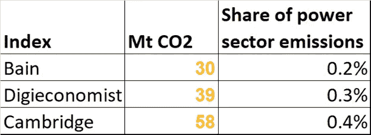
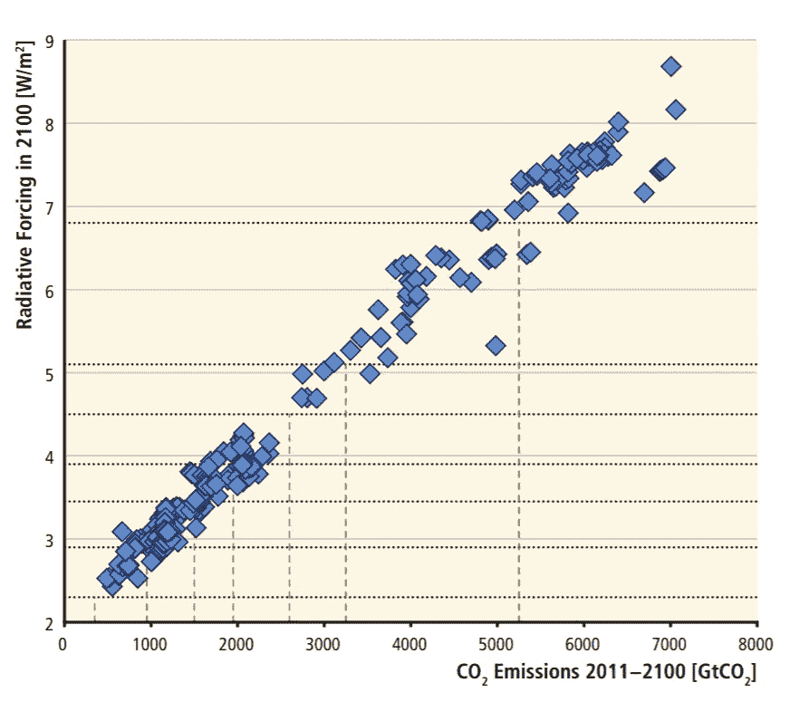

# 比特币没有让地球变暖

> 原文：<https://medium.com/coinmonks/bitcoin-is-not-warming-the-planet-72998bdf6a69?source=collection_archive---------6----------------------->

术语 FUD(害怕不确定性和怀疑)已经成为比特币制造者的常用词汇。但关于比特币的能源使用和对全球变暖的影响的头条新闻和观点不属于 FUD，而是属于无知和缺乏细微差别。正如 [I](https://ricardo-esparzag.medium.com/bitcoin-optimizes-energy-use-conversion-a25297cd765b) 和许多其他人[ [1](https://danhedl.medium.com/pow-is-efficient-aa3d442754d3) 、 [2](https://www.coindesk.com/the-last-word-on-bitcoins-energy-consumption) 、 [3](https://braiins.com/blog/a-summary-of-bitcoins-energy-consumption-debate) 、 [4](https://news.bitcoin.com/bitcoin-energy-consumption-is-far-more-efficient-and-greener-than-todays-banking-system/#:~:text=The%20report%20from%20these%20four,financial%20systems%20on%20the%20planet.) 、 [5](/@dergigi/bitcoins-energy-consumption-6dd7d7a2e463) ]所主张的那样，比特币会消耗更多的能量，它变得越有价值，就像任何东西一样，因此分析必须集中在它通过转换能量获得有用工作的效率上。由于生产比特币的经济性，矿商需要成为非常高效的能源转换器。随着网络增加其能源使用，采矿变得更具竞争力，这无疑降低了效率低下的利润。

Image by [WorldSpectrum](https://pixabay.com/users/worldspectrum-7691421/?utm_source=link-attribution&utm_medium=referral&utm_campaign=image&utm_content=3401786) from [Pixabay](https://pixabay.com/?utm_source=link-attribution&utm_medium=referral&utm_campaign=image&utm_content=3401786)

忽略抽象的、不可量化的和主观的术语，如肮脏、干净或绿色。地球系统由多个层面和维度组成，非特定术语模糊了我们生态系统的重要部分。不可能将增长与自然资源的使用脱钩，而是衡量人类在使用这些自然资源方面变得有多好。任何能量的转移都会以这样或那样的方式影响地球。更好的衡量可持续性的方法是保持恒定产量的能力。因此，它只是事半功倍:效率。在一个理想的世界中，任何商品、产品或服务所涉及的工作量和能量都会反映在价格上，从而衡量有多少自然资源被使用。但这不是一个理想的世界:它充满了失败的大规模中央计划和市场干预，以牺牲其他形式的能源转移为代价来补贴一些形式的能源转移。

比特币的不同之处在于，它与能源的关系是明确关联的。开采比特币的大部分成本是用电。由于比特币是在没有补贴的真正自由市场上运行的，生产比特币的成本在很大程度上反映了它们的真实能源成本。因为矿工需要超高效率来盈利，并且不被其他矿工取代，所以他们需要转换到他们能找到的最便宜的电力形式。因此，他们将寻找否则会被浪费或滞留的电力。言下之意是，无论谁购买新发行的[比特币](https://blog.coincodecap.com/a-candid-explanation-of-bitcoin)，都将通过数字信息购买一种高效的能源转换。购买者的资本是否用于投机、储蓄、投资甚至洗钱都无关紧要，因为他们会将这些资本配置到其他地方。他们必须始终将资本配置在比比特币更能有效转换能源的资产上，以证明比特币正在消耗更多的地球自然资源，但事实并非如此。

而且比特币的目的是让资本配置更有效率。如果没有中央计划者和政府对允许经济活动、货币和生产成本的信息系统的人为干预，生产成本就会得到明确的解释。这意味着消费者只会花他们愿意花的钱，而且总体来说不存在低效的能源使用。随着允许交易的信息系统以及由此产生的能量交换被扭曲，经济行为者需要付出比他们原本愿意付出的更多的努力来满足他们的需求和欲望。因此，这种系统既浪费又污染，加剧了能源的消耗和转化，而这在公平的系统下是不可能发生的。有了一个真正通过工作反映能量的货币体系，消费者只有在愿意的情况下才会愿意从事更有用的工作，而不是因为他们被迫这样做来维持他们的生活水平。

然而，比特币的购买者不知道生产比特币的成本，也不知道比特币的生产是基于电力成本或能源使用。最终，随着比特币应用的增加，对比特币的需求将会增加，其能源足迹也会增加。根据热力学定律，转换能量不可避免地会损失一些性能，从而产生某种不可挽回的影响。任何将能量转化为功以生产其他东西的过程都不可能是 100%高效的，并且涉及到环境中一些不可逆的变化。通过任何方式将能源转化为电力都会导致自然资源枯竭、大气排放、水污染、用水、浪费、土壤污染和土地使用。任何电源都会对其中任何一个产生影响，但每个电源之间和内部的影响程度不同(例如，取决于测量的污染物)。因为这些权衡很难比较，所以比较的最佳方式是衡量哪一个在使用能源方面最有效，因为更高的工作意味着更高的影响。

这意味着在进行交换时，重要的是被替换的是什么。最后，通过有用功获得的资本包含能量，因此总的来说能量流不会改变。所改变的是通过经济交易的替代是否满足了需求并有效地改善了参与者的生计。以足球世界杯为例。2018 年的决赛有 5.17 亿观众。当然，让所有人都在球场上观看比赛是不现实的，但是比起现场观看，人们在观看决赛时会节省多少精力呢？有人在家里的沙发上观看比赛节省了去体育场的能量，离体育场越远节省越多。虽然为他们的电视供电所需的电力、卫星、数据中心或电视台的能源密集型制造和运营是巨大的，但这是一个非常高效的过程，因为它可以为数亿用户提供服务，而不是数十万人可以现场观看比赛。

比特币在类似的条件下运行:使用一个分散的计算机网络，激励计算机寻找可用的最便宜的电力形式，它可以以越来越有效的方式传输信息。电视网络提供商使用电力来传播信息，作为一种产品，然后由客户进行估价，而比特币使用电力来传输信息价值。能量从来不会失去或获得，只是转化，这意味着唯一改变的是有用能量的数量:价值。因此，为了研究对任何自然资源的净影响，必须分析被替代的是什么。如果一个投资者为比特币分配资本，而新发行的比特币来自中国云南省，该省的主要电力来源是现有的水电。如果矿工使用本来不会使用的过剩装机容量的电力，他们基本上是在确保买方不会对地球造成更大的影响(不包括设备的影响)。任何物质或能量流动都必须相对于其他来源进行，以了解对所有方面的影响。

尽管如此，比特币是一个正在发展的行业:设备越来越高效，更多的参与者加入进来，电力的使用也越来越高。因此，分析投资比特币对其他任何东西的相对影响都是徒劳的，因为比特币仍在快速变化，它依赖于投资者将资本分配到哪里(从而要求新的转换或分配到转换的能源)的假设来进行效率比较。无论比特币成功降低了消费还是替代了效率较低的能源使用，都不能改变开采比特币所用的电力对自然资源产生影响的事实。即使相对于任何用途，比特币改善了自然资源的使用，其直接影响也是显而易见的。这就是为什么比特币将通过改变气候来毁灭地球的说法是荒谬的。

温室气体吸收热量。这从 18 世纪中期就已经知道了；如果有人有异议，他们可以去实验室反驳。在寻找密度、性能和便利性方面更优越的能源形式的永恒追求中，人类已经燃烧了大量的碳氢化合物，否则这些碳氢化合物将被储存在地下。虽然在这个过程中会排放出其他副产品，但燃烧的主要产物是二氧化碳。二氧化碳是一种温室气体，它和其他同类气体一起被越来越多地释放到大气中。如果陷阱加热气体的浓度增加，预计会有一些影响是合乎逻辑的。这种影响是小是小，以及人类是否有能力精确和明确地评估过去和未来气候对这些变化以及自然变化的反应，都不在本文的讨论范围之内。比特币使地球变暖的说法是基于这样一种假设，即它会释放大量二氧化碳，而这些二氧化碳会破坏生态系统。事实并非如此。

比特币的直接影响归因于其用电量的巨大。根据每秒的操作量和比特币的价格，对比特币网络的电力供应有几种估计。由于没有关于电力的原始数据，估计最终是基于假设。泰勒·贝恩根据物理学和经济学的结合创造了一个新的估计，这似乎是迄今为止最可靠的。尽管如此，其他流行的估计，如[数字经济学家比特币能耗指数](https://digiconomist.net/bitcoin-energy-consumption/)和[剑桥大学比特币比特币电力消耗指数](https://cbeci.org/)都值得探究。估计数总结如下。

Table 1: Estimates of Bitcoin’s 2020 annual electricity usage.

消耗电力的比特币网络的计算机分布在全球各地，这意味着每台计算机每单位电力的二氧化碳(CO2)排放量不同。 [Stoll 等人(2019)](https://www.sciencedirect.com/science/article/pii/S2542435119302557) 通过研究网络可用 IP 地址的位置，估计了比特币的总二氧化碳足迹。他们考虑不同的估计:查看节点的位置、设备或池服务器。这种方法有其局限性，因为矿工可能使用 TOR 或 VPN 服务，估计网络 21%的计算能力无法本地化。然后，基于通过定位分配的分布式电源的 CO2 强度来估计排放率。

这并不是一个完美的方法，但是对于插图和数量级估计来说很好。作者使用的是各国的平均排放率，这很容易引起误解，因为各国之间的差异很大。例如，2019 年美国的平均电力排放率为每千瓦时 0.418 千克二氧化碳，而各州的最低为每千瓦时 0.003 千克二氧化碳，最高为每千瓦时 0.930 千克二氧化碳。此外，如前所述，矿工被激励寻找与较低排放率相关的最便宜的电价。矿工不会对边际排放率产生影响，因为增量负荷转化为更高的价格。因此，不仅边际排放率不适于估算比特币网络的碳足迹，而且平均水平也具有误导性，因为矿工需要使用闲置或高效的能源。无论如何，这些估计可以作为一个基准。

通过节点 IP、设备 IP 或池服务器 IP，上述方法的网络总发射率在用于分配功率定位的三种不同方法中没有不同。费率分别为 0 . 458 千克二氧化碳当量/千瓦时、0 . 481 千克二氧化碳当量/千瓦时和 0 . 499 千克二氧化碳当量/千瓦时。将池服务器方法作为上限基准，不同用电量估算得出的总排放量如下所示。右边的一栏比较了全球电力行业二氧化碳排放总量在[总量中所占的份额。](https://www.iea.org/reports/global-energy-co2-status-report-2019/electricity#abstract)

Table 2: Share of Bitcoin share of global power sector CO2 emissions

虽然比特币对二氧化碳和温室气体排放的影响不小，但在全球范围内这是无关紧要的。从全球来看，2020 年的二氧化碳排放量为 40 Gt，这意味着比特币占总排放量的 0.1%。至于在温室气体排放总量中所占的份额，由于 Stoll 等人使用了二氧化碳当量因子，因此 058 Gt 二氧化碳当量。与全球排放的 [50 Gt 二氧化碳当量](https://ourworldindata.org/greenhouse-gas-emissions)相比，最大估计值为零。这意味着，保持所有不变，忽略效率收益以及排放的相对影响，如果比特币网络的能源使用量增加 10 倍，它将占全球 GHG 排放量的 1%。比特币是二氧化碳排放的主要驱动力这一未经证实的说法是一种荒谬的夸张。此外，主要关注的是累积排放量，历史上估计为 [1，575 Gt CO2](https://ourworldindata.org/contributed-most-global-co2) 。比特币对大气中二氧化碳浓度的增加毫无作用。

[Source](https://slideplayer.com/slide/13097729/)

无论如何，开采比特币和运行比特币网络导致了二氧化碳的大气排放，这是事实。所以即使很小，又有什么影响呢？在一个黑白分明的世界里，即使是少量的二氧化碳也会被视为灾难。虽然大气中二氧化碳水平的增加与全球平均地表温度的增加有关，但这也导致了植物的更多生长。这并不意味着大气中碳含量的快速大幅变化不会产生影响，而是意味着存在一个不确定性和风险更高的水平。这不是一个关于不同气候模型和理论的表现的帖子，但主流评估可以作为基准。

联合国政府间气候变化专门委员会(IPCC)建议不超过 420 Gt 的二氧化碳保持在低于他们首选的不确定性水平，该不确定性水平以相对于工业化前水平保持低于 1.5°C 变暖的概率的三分之二为标志。到 2100 年，比特币网络将排放 4.6 千兆吨二氧化碳，仅占预算的 1%。在适当的核算和背景下，比特币的碳足迹在全球范围内相当微不足道。如果神奇的是，唯一的二氧化碳排放者是比特币，那么其孤立的碳排放将对全球变暖没有任何影响。这一数量级是如此之小，以至于没有模型能够估算出如此少量的累积排放所导致的辐射作用力的变化。

IPPC AR5 plot of Regression of radiative forcing against 2011–2100 cumulative CO2 emissions. Source: Krey et al., 2014\. Annex II: Metrics & Methodology. In: Climate Change 2014: Mitigation of Climate Change. Contribution of Working Group III to the Fifth Assessment Report of the Intergovernmental Panel on Climate Change.

最后，归因于比特币的排放不是比特币的固有组成部分，而是电力系统的组成部分。一些[报道](https://cointelegraph.com/news/report-76-crypto-miners-use-renewables-as-part-of-their-energy-mix)暗示比特币主要依靠低碳电力运行。但是所有能源都有影响，最好的基准是衡量它们创造价值的效率。作为一个新兴的生态系统，比特币在各个方面都在不断完善。在我写这篇文章的时候，一个比特币的价格已经超过了 5 万美元，这意味着全球数百万用户认为比特币是有价值和有用的。就像任何商品、产品或服务一样，正确的标准必须是收益是否抵消了成本。当谈到对地球的影响时，结论很简单:比特币是一种高效的能源转换器，它创造的价值对全球变暖的影响很小。

> 加入 Coinmonks [电报集团](https://t.me/joinchat/EPmjKpNYwRMsBI4p)，了解加密交易和投资

## 另外，阅读

*   什么是[闪贷](https://blog.coincodecap.com/what-are-flash-loans-on-ethereum)？
*   最好的[密码交易机器人](/coinmonks/crypto-trading-bot-c2ffce8acb2a) | [网格交易](https://blog.coincodecap.com/grid-trading)
*   [3 商业评论](/coinmonks/3commas-review-an-excellent-crypto-trading-bot-2020-1313a58bec92) | [Pionex 评论](/coinmonks/pionex-review-exchange-with-crypto-trading-bot-1e459d0191ea) | [Coinrule 评论](https://blog.coincodecap.com/coinrule-review-a-perfect-trading-bot)
*   [AAX 交易所评论](/coinmonks/aax-exchange-review-2021-67c5ea09330c) | [德里比特评论](/coinmonks/deribit-review-options-fees-apis-and-testnet-2ca16c4bbdb2) | [FTX 交易所评论](/coinmonks/ftx-crypto-exchange-review-53664ac1198f)
*   [n 零复习](/coinmonks/ngrave-zero-review-c465cf8307fc) | [Phemex 复习](/coinmonks/phemex-review-4cfba0b49e28) | [PrimeXBT 复习](/coinmonks/primexbt-review-88e0815be858)
*   [Bybit Exchange 审查](/coinmonks/bybit-exchange-review-dbd570019b71) | [Bityard 审查](https://blog.coincodecap.com/bityard-reivew) | [CoinSpot 审查](https://blog.coincodecap.com/coinspot-review)
*   [3 commas vs crypto hopper](/coinmonks/3commas-vs-pionex-vs-cryptohopper-best-crypto-bot-6a98d2baa203)|[赚取加密利息](/coinmonks/earn-crypto-interest-b10b810fdda3)
*   最好的比特币[硬件钱包](/coinmonks/the-best-cryptocurrency-hardware-wallets-of-2020-e28b1c124069?source=friends_link&sk=324dd9ff8556ab578d71e7ad7658ad7c) | [BitBox02 回顾](/coinmonks/bitbox02-review-your-swiss-bitcoin-hardware-wallet-c36c88fff29)
*   [莱杰 vs n rave](https://blog.coincodecap.com/ngrave-vs-ledger)|[莱杰 nano s vs x](https://blog.coincodecap.com/ledger-nano-s-vs-x)
*   [密码拷贝交易平台](/coinmonks/top-10-crypto-copy-trading-platforms-for-beginners-d0c37c7d698c) | [比特码拷贝交易](https://blog.coincodecap.com/bityard-copy-trading)
*   [Vauld 审查](https://blog.coincodecap.com/vauld-review) | [YouHodler 审查](/coinmonks/youhodler-4-easy-ways-to-make-money-98969b9689f2) | [BlockFi 审查](/coinmonks/blockfi-review-53096053c097)
*   最好的[加密税务软件](/coinmonks/best-crypto-tax-tool-for-my-money-72d4b430816b) | [硬币追踪评论](/coinmonks/cointracking-review-a-reliable-cryptocurrency-tax-software-5114e3eb5737)
*   最佳[加密借贷平台](/coinmonks/top-5-crypto-lending-platforms-in-2020-that-you-need-to-know-a1b675cec3fa) | [杠杆令牌](/coinmonks/leveraged-token-3f5257808b22)
*   [莱杰纳米 S vs 特雷佐 one vs 特雷佐 T vs 莱杰纳米 X](https://blog.coincodecap.com/ledger-nano-s-vs-trezor-one-ledger-nano-x-trezor-t)
*   [block fi vs Celsius](/coinmonks/blockfi-vs-celsius-vs-hodlnaut-8a1cc8c26630)|[Hodlnaut 回顾](https://blog.coincodecap.com/hodlnaut-review)
*   [Bitsgap 审查](/coinmonks/bitsgap-review-a-crypto-trading-bot-that-makes-easy-money-a5d88a336df2) | [四元审查](/coinmonks/quadency-review-a-crypto-trading-automation-platform-3068eaa374e1)
*   [埃利帕尔泰坦评论](/coinmonks/ellipal-titan-review-85e9071dd029) | [赛克斯斯通评论](https://blog.coincodecap.com/secux-stone-hardware-wallet-review)
*   [DEX Explorer](https://explorer.bitquery.io/ethereum/dex)|[w](https://explorer.bitquery.io/graphql)|[local bitcoins 评论](https://blog.coincodecap.com/localbitcoins-review)
*   最佳[区块链分析](https://bitquery.io/blog/best-blockchain-analysis-tools-and-software)工具| [赚比特币](https://blog.coincodecap.com/earn-bitcoin)
*   [加密套利](/coinmonks/crypto-arbitrage-guide-how-to-make-money-as-a-beginner-62bfe5c868f6)指南:新手如何赚钱
*   最佳[加密制图工具](/coinmonks/what-are-the-best-charting-platforms-for-cryptocurrency-trading-85aade584d80) | [最佳加密交易所](/coinmonks/crypto-exchange-dd2f9d6f3769)
*   [如何在印度购买比特币](https://blog.coincodecap.com/buy-bitcoin-app-india)？
*   [印度比特币交易所](/coinmonks/bitcoin-exchange-in-india-7f1fe79715c9) | [比特币储蓄账户](https://blog.coincodecap.com/bitcoin-savings-account)
*   了解比特币最好的[书籍有哪些？](/coinmonks/what-are-the-best-books-to-learn-bitcoin-409aeb9aff4b)

> [在您的收件箱中直接获得最佳软件交易](/coinmonks/newsletters/coinmonks)

