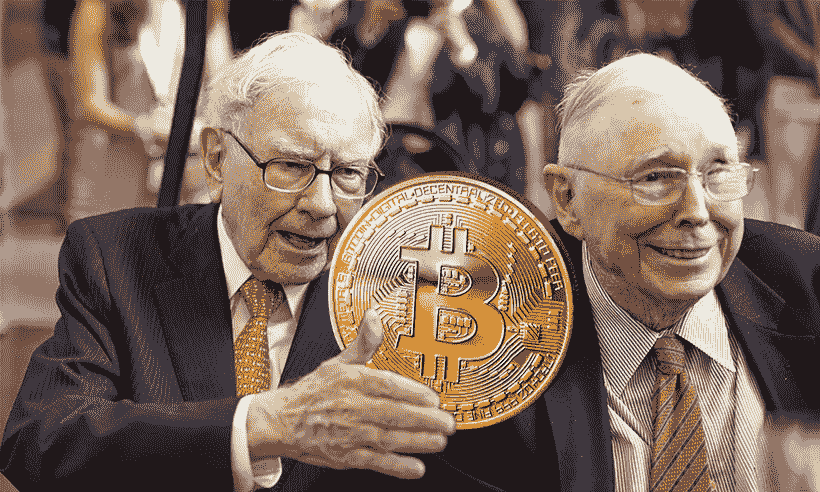

# 沃伦·巴菲特称，比特币是老鼠药的平方

> 原文：<https://medium.com/coinmonks/bitcoin-is-rat-poison-squared-according-to-warren-buffett-2b1bd9cbc4c6?source=collection_archive---------1----------------------->

## …他完全正确

Photo from: zephyrnet.com

沃伦·巴菲特可以说是有史以来最好的投资者。他白手起家，成为世界首富。与[查理·芒格](https://www.google.com/url?sa=t&rct=j&q=&esrc=s&source=web&cd=&cad=rja&uact=8&ved=2ahUKEwiisIDx_rLwAhVMXBoKHTcVCnAQFjAAegQIAhAD&url=https%3A%2F%2Fen.wikipedia.org%2Fwiki%2FCharlie_Munger&usg=AOvVaw1Cg2QbjbJd8jPRyCR0w3MY)一起，他建立了最大的投资帝国 [*伯克希尔·哈撒韦*](https://www.google.com/url?sa=t&rct=j&q=&esrc=s&source=web&cd=&cad=rja&uact=8&ved=2ahUKEwiuz5qD_7LwAhXJyIUKHepnB5sQFjAAegQIAhAD&url=https%3A%2F%2Fwww.berkshirehathaway.com%2F&usg=AOvVaw3vsE9nLNOPFYIzEPt99a0W) 。这无论如何都不是一个容易的成就。许多人在他成功的地方尝试过，但都失败了。