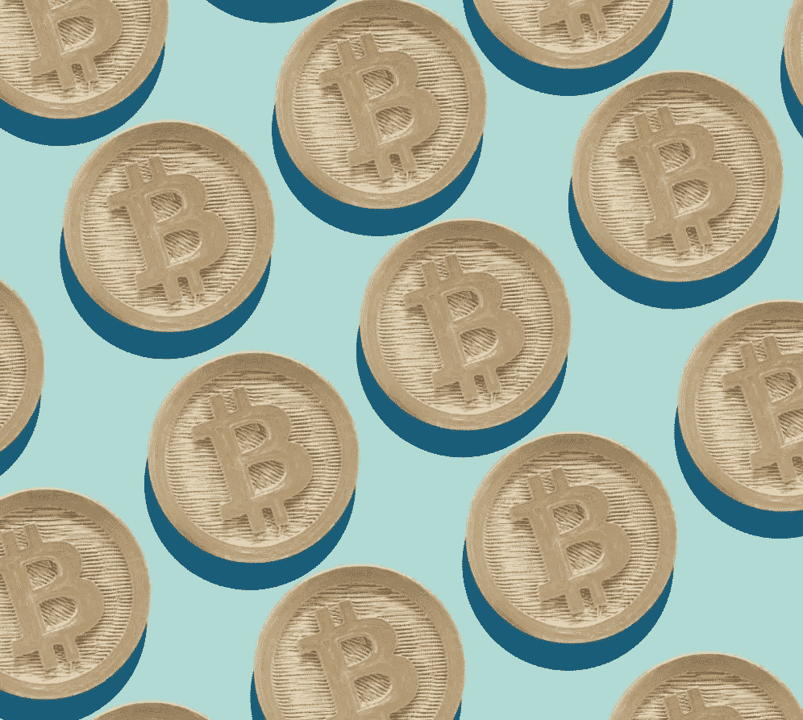

# 比特币将于 2021 年被大规模采用

> 原文：<https://medium.com/coinmonks/bitcoin-is-set-for-mass-adoption-in-2021-44dffc82f907?source=collection_archive---------2----------------------->

## 系好安全带，比特币即将成为世界储备资产的主流

Francesco Carta fotografo - gettyimages

鉴于 2020 年发生的所有疯狂事件，如果 1 月份可以预测的话，2021 年似乎不会变得不那么戏剧化。在过去的 12 个月里，各国政府已经向经济注入了数万亿美元的资金，今年，随着许多国家计划实施第二轮刺激计划，他们不打算放缓经济增长。再加上负利率、低债券收益率和突然变高的个人净资产，企业和基金面临一个重大问题，他们该如何处理自己的现金储备？

在 Glassnode 最近的一份 [**报告中，他们分析了比特币供应的集中度，发现了一些非常有趣但并不令人惊讶的事情，那些拥有大量资金的人正在以越来越快的速度积累比特币。下图显示了余额为 1000 BTC 的独特实体的总数，以及它们在过去 12 个月中持有的比特币供应量的变化。显然，2020 年是一个积累年，考虑到我们看到的最终涉足比特币储备的公司数量，可以在这里找到一份已知最大持有者的名单**](https://insights.glassnode.com/bitcoin-supply-distribution/)****。然而，你可以看到，到目前为止，2021 年鲸鱼总数和总供应量都有了巨大的增长，远远超过了 2020 年的现有增长趋势。****

****

**[Glassnode](https://insights.glassnode.com/bitcoin-supply-distribution/) — The cumulative change (since 2020) in the number of whales/humpback and the supply the hold.**

**这是一个迹象，表明 2021 年将是比特币的重要一年，在这一年，比特币被认为是高净值实体中的一种可信资产，这些实体希望摆脱法定货币严重稀释的困境。我预测，在今年乃至未来十年，我们将看到更多的企业和富裕人士将部分现金储备用于比特币交易，因为央行唯一能够或愿意做的事情似乎是继续向经济注入资金。随着债券利率和负储蓄利率的恶化，这种情况将继续发生，我们不可避免地会看到世界各地持有的大量现金储备涌入价值储存库，资产升值，以击败他们否则将经历的每年贬值。**

> **他明确表示，这一战略是基于比特币稳健的货币政策及其潜在的价值储存，而非某种投机性赌博。**

**比特币将占据这些现金储备的很大一部分，数据已经显示这种情况正在发生。这种方法的第一个推动者是 Microstrategy，他继续以平均成本建立了一个非常大的比特币头寸，现在为 71，079 BTCT3，按今天的价格计算约为 25 亿美元。他们的地位非常引人注目，唯一的原因是他们不是投资基金或比特币企业，他们主要是一家与比特币或加密货币无关的商业智能软件公司。这一举动归功于他们的创始人迈克尔·塞勒，他认为 2020 年代央行的过度注资是开始将现金储备配置到比特币的最终理由。 [**在采访中**](https://www.youtube.com/watch?v=zQ60ehVJYAs) 他明确表示，该战略是基于比特币稳健的货币政策及其潜在的价值储存，而不是某种投机性赌博。**

**作为首批使用比特币作为价值储备资产存储的公司之一，Microstrategy 已经将资金投入其中，并为其他高净值实体效仿铺平了道路。他们也开始教其他处于相同位置的公司如何进行大规模收购，以及这方面的监管要求。最近为企业 举行了一次 [**比特币会议，讨论其作为国库储备资产的用途，有超过 1400 家企业参加，一些著名的与会者包括来自**](https://www.microstrategy.com/en/resources/events/world-2021/bitcoin-summit?CID=7014W0000014yhJQAQ) **[**Space X、Visa、辉瑞和迪士尼的代表。**](https://twitter.com/BTC_Archive/status/1357098582118170626)****

> ****如果这一趋势在十年内持续下去，我们很可能会看到这一演变的下一步，各央行也将比特币分配到其储备中。****

**随着我们进入一个新的十年，比特币跨越了 12 年的大关，它似乎正成为一种正常的可信资产，而不仅仅是高风险对冲基金和散户的投机性赌博。看起来，在经济危机的推动下，它正在快速成熟，并成长为高净值实体开始按规模配置的一项有价值的储备资产。如果这一趋势在十年内继续下去，我们很可能会看到这一演变的下一步，各央行和财政部也将比特币分配到他们的储备中。**

**随着比特币的供应上限和稳定的发行时间表，这意味着来自高净值实体的大量现金储备的涌入将推动比特币对法定货币的升值达到前所未有的水平，这种情况已经发生了。似乎所有的明星都赞同比特币，去年经济危机、大规模通货膨胀、极端不确定性以及负利率，我们也即将迎来减半后的一年，这通常是在周期 **中事情开始好转的时候。**总而言之，2021 年对于比特币作为一种资产的接受度和可信度来说，将是伟大的一年。**

**只要看看下面的美元对比特币 5 年图表，答案很明显，保持你的储备不断稀释，每年对比特币的购买力下降，或者退出贬值的美元，控制你的钱。**

****

**Usd to Btc exchange over the last 5yrs**

**关注我的 [**Medium**](https://lukabankovic.medium.com/) 和[**Twitter**](https://twitter.com/bank0s)**了解更多关于比特币和去中心化世界的信息。****

*****免责声明:以上文章并非理财建议。我拥有比特币已经有一段时间了，还在继续购买。在投资之前，一定要完全了解你在投资什么以及为什么投资。*****

> ****加入 T21 电报集团，学习加密交易和投资****

## ****另外，阅读****

*   ****什么是[闪贷](https://blog.coincodecap.com/what-are-flash-loans-on-ethereum)？****
*   ****最好的[密码交易机器人](/coinmonks/crypto-trading-bot-c2ffce8acb2a) | [网格交易](https://blog.coincodecap.com/grid-trading)****
*   ****[3 商业评论](/coinmonks/3commas-review-an-excellent-crypto-trading-bot-2020-1313a58bec92) | [Pionex 评论](/coinmonks/pionex-review-exchange-with-crypto-trading-bot-1e459d0191ea) | [Coinrule 评论](https://blog.coincodecap.com/coinrule-review-a-perfect-trading-bot)****
*   ****[AAX 交易所评论](/coinmonks/aax-exchange-review-2021-67c5ea09330c) | [德里比特评论](/coinmonks/deribit-review-options-fees-apis-and-testnet-2ca16c4bbdb2) | [FTX 密码交易所评论](/coinmonks/ftx-crypto-exchange-review-53664ac1198f)****
*   ****[n 零审核](/coinmonks/ngrave-zero-review-c465cf8307fc)****
*   ****[Bybit Exchange 审查](/coinmonks/bybit-exchange-review-dbd570019b71) | [Bityard 审查](https://blog.coincodecap.com/bityard-reivew) | [CoinSpot 审查](https://blog.coincodecap.com/coinspot-review)****
*   ****3Commas vs Cryptohopper****
*   ****最好的比特币[硬件钱包](/coinmonks/the-best-cryptocurrency-hardware-wallets-of-2020-e28b1c124069?source=friends_link&sk=324dd9ff8556ab578d71e7ad7658ad7c) | [BitBox02 回顾](/coinmonks/bitbox02-review-your-swiss-bitcoin-hardware-wallet-c36c88fff29)****
*   ****[莱杰 vs n rave](https://blog.coincodecap.com/ngrave-vs-ledger)|[莱杰 nano s vs x](https://blog.coincodecap.com/ledger-nano-s-vs-x)****
*   ****[密码拷贝交易平台](/coinmonks/top-10-crypto-copy-trading-platforms-for-beginners-d0c37c7d698c) | [比特码拷贝交易](https://blog.coincodecap.com/bityard-copy-trading)****
*   ****[Vauld 审查](https://blog.coincodecap.com/vauld-review) | [YouHodler 审查](/coinmonks/youhodler-4-easy-ways-to-make-money-98969b9689f2) | [BlockFi 审查](/coinmonks/blockfi-review-53096053c097)****
*   ****最好的[加密税务软件](/coinmonks/best-crypto-tax-tool-for-my-money-72d4b430816b) | [硬币追踪评论](/coinmonks/cointracking-review-a-reliable-cryptocurrency-tax-software-5114e3eb5737)****
*   ****最佳[加密贷款平台](/coinmonks/top-5-crypto-lending-platforms-in-2020-that-you-need-to-know-a1b675cec3fa)****
*   ****[莱杰纳米 S vs 特雷佐 1 vs 特雷佐 T vs 莱杰纳米 X](https://blog.coincodecap.com/ledger-nano-s-vs-trezor-one-ledger-nano-x-trezor-t)****
*   ****[BlockFi vs 摄氏](/coinmonks/blockfi-vs-celsius-vs-hodlnaut-8a1cc8c26630) | [Hodlnaut 回顾](https://blog.coincodecap.com/hodlnaut-review)****
*   ****[Bitsgap 审查](/coinmonks/bitsgap-review-a-crypto-trading-bot-that-makes-easy-money-a5d88a336df2) | [四种货币审查](/coinmonks/quadency-review-a-crypto-trading-automation-platform-3068eaa374e1)****
*   ****[埃利帕尔泰坦评论](/coinmonks/ellipal-titan-review-85e9071dd029) | [赛克斯斯通评论](https://blog.coincodecap.com/secux-stone-hardware-wallet-review)****
*   ****[DEX Explorer](https://explorer.bitquery.io/ethereum/dex) | [区块链 API](https://explorer.bitquery.io/graphql)|[local bitcoins 评论](https://blog.coincodecap.com/localbitcoins-review)****
*   ****[最佳区块链分析工具](https://bitquery.io/blog/best-blockchain-analysis-tools-and-software)****
*   ****[加密套利](/coinmonks/crypto-arbitrage-guide-how-to-make-money-as-a-beginner-62bfe5c868f6)指南:新手如何赚钱****
*   ****最佳[加密制图工具](/coinmonks/what-are-the-best-charting-platforms-for-cryptocurrency-trading-85aade584d80) | [最佳加密交易所](https://blog.coincodecap.com/crypto-exchange)****
*   ****了解比特币最好的[书籍有哪些？](/coinmonks/what-are-the-best-books-to-learn-bitcoin-409aeb9aff4b)****

> ****[直接在您的收件箱中获得最佳软件交易](/coinmonks/newsletters/coinmonks)****

********