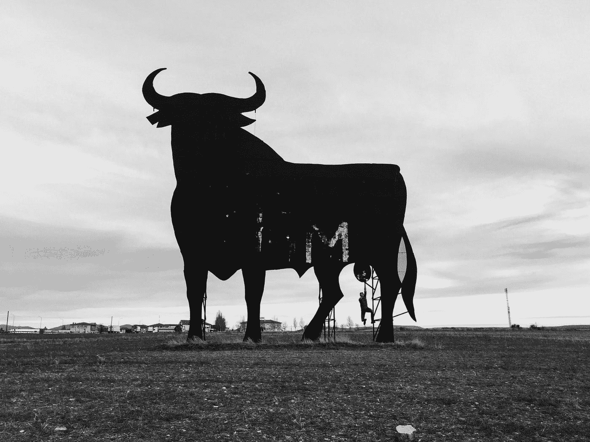

# 比特币:牛市结束了吗？

> 原文：<https://medium.com/coinmonks/bitcoin-is-the-bull-run-over-34cd9a155f43?source=collection_archive---------4----------------------->

哇，好棒的旅程！比特币最近两天跌幅超过 20%。最初的谣言是宣布“末日的开始”。市场已经达到暂时的顶峰了吗？

Is the bull-run over? — Photo by [Jared Schwitzke](https://unsplash.com/@jleeschwitz?utm_source=medium&utm_medium=referral) on [Unsplash](https://unsplash.com?utm_source=medium&utm_medium=referral)

它需要发生。比特币及其公司长达一个月的上升趋势暂时停止。短短 24 小时，总市值暴跌 2000 亿美元。十大加密货币在日线图中苦苦挣扎，与…