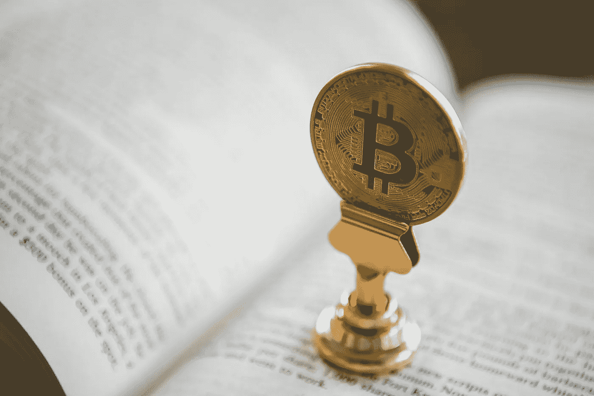

# 比特币是唯一可靠的货币

> 原文：<https://medium.com/coinmonks/bitcoin-is-the-only-sound-money-65607c43677b?source=collection_archive---------3----------------------->

Photo by [André François McKenzie](https://unsplash.com/@silverhousehd?utm_source=unsplash&utm_medium=referral&utm_content=creditCopyText) on [Unsplash](https://unsplash.com/s/photos/bitcoin-ethereum?utm_source=unsplash&utm_medium=referral&utm_content=creditCopyText)

多亏了班克利斯，现在有一个迷因正在 Crypto Twitter 上传播，那就是“Eth 是超健全的货币”。以太坊的创造者维塔利科·布特林甚至[在听了由](https://www.reddit.com/r/ethereum/comments/mf31ia/a_brain_dump_on_pos_vs_pow_arguments/)[贾斯汀·德雷克](https://www.youtube.com/watch?v=bWqhn1hXvVc)主持的无银行播客后，对这个迷因的诞生给予了积极评价。

以太坊核心开发者德雷克提出了一个非常令人信服的案例，即以太应该被视为“超声音货币”，建立在比特币创造者经常称赞的“声音货币”概念上。这里的想法是，EIP-1559 的通缩机制和向 Eth 2.0 的股权证明的过渡将分别增加以太作为货币基础的稀缺性和安全性。

到目前为止，Eth 一直是(事实上，在撰写本文时仍是)一种通胀资产。以太坊被创建为“世界计算机”，并从此发展成为 Web 3.0 的底层和“互联网的价值层”。它托管了绝大多数 DeFi 项目，并准备成为有望取代传统银行业的系统的结算层。

然而，贾斯汀·德雷克和无银行男孩想更进一步。他们不仅想要银行的头皮，也想要中央银行的头皮。

Bankless’ stupid “ETH is Ultra Sound Money” meme

## 黄金是好的

我认为这是令人钦佩的。比特币的全部意义，我敢说，去中心化运动本身，就是要摧毁中央银行系统所体现的掠夺性机构权力。因此，毫不奇怪，Vitalik 和他的开发者热衷于继承衣钵，领导他们自己反对剥夺性货币政策和债务奴役的运动。

然而，这种方法存在一些问题。

一个经济体系的核心是其货币基础。目前，这是一个充斥着债务和通过欺诈手段获得的股票的膨胀沼泽，在此基础上无限期地发行法定货币。比特币制造者希望比特币来填补这个角色。它是反通胀的，符合健全货币的所有标准，本质上反映了黄金的机制，在历史上的许多情况下，黄金都被成功地用作货币基础。

贾斯汀·德雷克在这方面批评比特币。他谴责这种供应机制和哲学是陈旧过时的，并认为他未经检验的货币理论会比“比特币标准”经济产生更好的结果。

这就是第一点傲慢。

实用主义哲学引导我们主要根据一个命题对现实世界的实际影响来评估它。这种情况下，黄金*起作用*。它并不完美，但值得注意的是，黄金作为价值储存手段非常有效，已经成为我们集体心理的一部分。

用炼金术的术语来说，黄金是*价值本身*的同义词。它代表了我们价值层次的最终目标、终点和顶峰。意识是一种原则，通过它所有的东西都可以——也必须——转化为*黄金*。金色代表太阳:世界上最高的东西，生命的给予者，天空中最亮的光，没有它我们无法生存。

上述演讲的重点是概述黄金作为人类价值代表的**功能**。**管用** *。选择功能性和实用性而不是理想主义和理论的原则不应该在 Eth bulls 上丢失。*

有数不清的智能合约平台声称几乎在各个方面都优于以太坊，或许它们确实如此。但以太坊很长时间以来一直在发挥作用，实际上，它已经催生了一个蓬勃发展的 DeFi 生态系统，这个生态系统已经锁定了几十亿美元，用于一些有用且可能具有革命性的金融项目。以太坊蓬勃发展的 NFT“元宇宙”也为一个完全重新想象的内容世界奠定了基础:由于 NFTs 提供的去中心化和所有权，艺术、音乐和游戏都朝着更公平和功能性的系统迈出了步伐。

所以，如果黄金是货币基础，为什么要把婴儿和洗澡水一起倒掉呢？为什么不改进那些不起作用的方面，而不是废弃整个东西，尝试一些完全没有测试过的东西呢？没有人要求将 DeFi 移植到几乎无法工作的卡尔达诺区块链，因为以太坊的天然气费用很高。

## 复杂系统和意外后果定律

当在一个高度复杂的相互关联和相互依赖的变量系统中改变一个核心变量时，实现预期结果的概率**接近零。**典型的例子:欧盟。让我们假设联邦党人的目标实际上是为欧洲创造一个更好的经济，正如欧盟在其邪恶和暴露意图的名称变化之前的原始名称所暗示的那样:欧洲经济共同体。

在这方面，这是一个彻底的失败。许多东欧国家的人才外流，国家经济主权的掠夺，以及财富从像希腊这样苦苦挣扎的经济体向像德国这样富有的资金提供者的重新分配。

假设有可能知道并理解系统中的所有变量，并设计出更好的版本，这充其量是严重无知。

比特币做出了不同的假设。比特币正确地假设，我们当前的通胀体系已经严重崩溃(我同意罗伯特·布里德洛夫(Robert Breedlove)将通胀描述为“道德癌症”)。但比特币的美妙之处在于，它寻求纠正我们系统的邪恶，同时保留给我们一个稳定系统的部分，这个系统至少部分地发挥作用。

这说明了霍布斯的观点，即秩序和稳定不应该完全因为一个系统的腐败而被抛弃。乔丹·彼得森也经常提到这一点，他警告我们不要仅仅因为保守主义和宗教似乎与我们的现代情感格格不入，就将其视为过时。我们不知道某些习俗对我们的社会有多大影响，也不知道它们对我们生活的稳定和功能有多大保障。对社会戒律的表面评估注定会错过那些对我们的凝聚力、稳健性和寿命至关重要的条款。

以酒吧为例:在酒吧狂饮(尤其是在工作日的晚上)和过度消费似乎有悖常理，但酒吧实际上是一个至关重要的核心社会机构，在我们的工作周越来越长的世界里，它允许政治话语、社会交往，当然还有休闲时间。

回到彼得森，回到他关于等级制度的秩序/混沌模型。他解释说，完美的存在状态是秩序和混乱之间的平衡。自然产生的等级制度是自然法则，也受到这种相互作用的影响。过多的秩序和等级制度变得过于僵化，容易滋生腐败。太乱了，层级就失去了整体性和结构性。目前，我们的系统严重腐败，需要一剂混乱来重振它。比特币提供了这一点——它在黄金无法作为菲亚特系统解药的地方取得了成功，这主要是因为它的审查阻力和便携性。以太，以及它的全新系统，可能会引发灾难性的系统不稳定。

**比特币的黄金供应机制可能看起来笨拙而古老，但它们是基于一个我们所知的作为货币基础的模型。放弃这些机制，后果自负。**

## 比特币美丽、优雅、简单

比特币的另一个方面是它的简单性，这使得它适合作为一个极其复杂的系统基础的替代品。

它有很少的输入:基本上只有它的供应机制(稳定和确定)，和市场输入(随着时间的推移越来越不稳定)

以太坊将有非常不同的供应机制(可变费用燃烧，持续和无限期发行，极其可变的削减罚款)，以及来自 DeFi(价值层)的反馈和作为交易货币的使用。再加上来自市场数据的输入和以太坊“世界计算机”功能的反馈，我们有很多变量在起作用。

让我们假设一件事物的复杂性与其输入的数量和波动性都呈非线性关系。 ETH 的投入比比特币多得多，它们的波动性比比特币大得多，可预测性比比特币低得多。

我认为这使得它完全不适合作为一个经济体系的基本价值基础。就像你不希望你的汽车也是一台浓缩咖啡机一样，也许你不希望你的货币基础也是一台世界计算机。也许我们不应该把如此复杂的东西放在这样一个相互依赖的系统的中心。

贾斯汀·德雷克甚至称赞比特币与以太坊相比代码简单。但我认为他并没有意识到这种品质有多么强大。

## 安全问题

对我来说，邮政储蓄和中央银行没什么不同。这里的要点是，中央银行系统完全道德沦丧，欺诈成性。PoS 与去中心化和重建个人主权的精神背道而驰。它将链条上的权力掌握在最富有的人手中，并引入了一种扯淡的“民主”治理结构，将货币政策掌握在机构手中。

这和共产主义一样是荒谬的:共产主义者寻求保持*寡头垄断中完全相同的*权力集中，并简单地将权力重新分配到不同的人群(即无产阶级)手中，徒劳地希望这个新群体的人性不会像他们的前辈一样被权力腐蚀。《工作证明》从根本上成功了，因为它对人性持悲观态度:它知道我们容易腐败、贪婪和愚蠢，并将货币政策的重要任务永远从我们肮脏、不道德的手中夺走。

战俘确实有一个严重问题。hashpower 集中化是一个大问题，必须对此采取措施，可能是紧急措施。如果他们想的话，CCP 肯定会造成一些严重的屠杀，需要自由世界的一致努力来防御性地建立一个 hashrate 来与传言中位于中国的 75%的矿业力量竞争。

但这并不是忽视 PoW 引擎本身的理由。同样，不要把婴儿和洗澡水一起倒掉。认为权力注定将财富集中在富人手中的想法是错误的。采矿是真正的再分配，已经有人在努力将哈希拉特平衡移出中国。例如，肯塔基州为矿工提供税收减免。尽管像许多比特币创造者一样，我对民族国家这个概念非常警惕，但我认为比特币开采不可避免地会成为一个国家安全问题。我认为总的来说，这可能是件好事。再说一遍，我是一个实用主义者，我希望比特币网络得到充分和有竞争力的保护。

我认为中国和西方之间的比特币军备竞赛是不可避免的，我认为这很有可能对技术发展产生积极影响。看看太空竞赛，以及随着科技的发展，普通大众所体验到的好处。

## 通货膨胀与非货币价值腐败后记

我之前对乔丹·彼得森的评论让我重新思考价值和它的意义。价值是一个用货币表示的非货币概念。

我们所做的一切都是价值判断。在这方面，意义地图让我大吃一惊，因为我意识到我们采取的任何行动都是一种估价:

> 作为或不作为 X >作为或不作为 Y

这意味着我们需要可靠稳定的东西来**储存我们的价值判断**。来体现人类的分布式认知。我认为，由法定通货膨胀导致的价值下降，导致我们脱离了我们的核心价值假设。我们不再知道任何东西的价值。法定货币对价值的垄断和通货膨胀导致的堕落使我们与我们真正珍视的东西失去了联系。这将我们带到了一个即时满足、过度负债和权利泛滥的社会，在这个社会中，自私和不诚实占据了主导地位。

比特币制造者与此相反。当我观察大多数没有影响力的比特币玩家时，他们不自私、负责、直率、谦逊、诚实、身体健康，而且往往有精神倾向。

以太人是无神论唯物主义者。身体不健康。脱离实体。不愿意接受冰冷客观的象征意义。

这两个竞争系统的象征意义再明显不过了。

**比特币正确*。***

> 加入 coin monks[Telegram group](https://t.me/joinchat/PmKOYQ9NNKZlZGNl)并了解加密交易和投资

## 另外，阅读

*   最好的[密码交易机器人](/coinmonks/crypto-trading-bot-c2ffce8acb2a) | [电网交易机器人](https://blog.coincodecap.com/grid-trading)
*   [加密复制交易平台](/coinmonks/top-10-crypto-copy-trading-platforms-for-beginners-d0c37c7d698c) | [如何在 WazirX 上购买比特币](/coinmonks/buy-bitcoin-on-wazirx-2d12b7989af1)
*   [CoinLoan 点评](/coinmonks/coinloan-review-18128b9badc4)|[Crypto.com 点评](/coinmonks/crypto-com-review-f143dca1f74c) | [火币保证金交易](/coinmonks/huobi-margin-trading-b3b06cdc1519)
*   [尤霍德勒 vs 科恩洛 vs 霍德诺特](/coinmonks/youhodler-vs-coinloan-vs-hodlnaut-b1050acde55a) | [Cryptohopper vs 哈斯博特](https://blog.coincodecap.com/cryptohopper-vs-haasbot)
*   [杠杆代币](/coinmonks/leveraged-token-3f5257808b22) | [最佳密码交易所](/coinmonks/crypto-exchange-dd2f9d6f3769) | [Paxful 点评](/coinmonks/paxful-review-4daf2354ab70)
*   [如何在印度购买比特币？](/coinmonks/buy-bitcoin-in-india-feb50ddfef94) | [WazirX 评论](/coinmonks/wazirx-review-5c811b074f5b) | [BitMEX 评论](https://blog.coincodecap.com/bitmex-review)
*   [双子座 vs 比特币基地](https://blog.coincodecap.com/gemini-vs-coinbase) | [比特币基地 vs 北海巨妖](https://blog.coincodecap.com/kraken-vs-coinbase)|[coin jar vs coin spot](https://blog.coincodecap.com/coinspot-vs-coinjar)
*   [币安 vs 北海巨妖](https://blog.coincodecap.com/binance-vs-kraken) | [美元成本平均交易机器人](https://blog.coincodecap.com/pionex-dca-bot)
*   [印度比特币交易所](/coinmonks/bitcoin-exchange-in-india-7f1fe79715c9) | [比特币储蓄账户](/coinmonks/bitcoin-savings-account-e65b13f92451)
*   [币安费用](/coinmonks/binance-fees-8588ec17965) | [Botcrypto 审核](/coinmonks/botcrypto-review-2021-build-your-own-trading-bot-coincodecap-6b8332d736c7) | [Hotbit 审核](/coinmonks/hotbit-review-cd5bec41dafb) | [KuCoin 审核](https://blog.coincodecap.com/kucoin-review)
*   [我的加密副本交易经验](/coinmonks/my-experience-with-crypto-copy-trading-d6feb2ce3ac5) | [购买硬币评论](https://blog.coincodecap.com/buycoins-review)
*   [加密货币储蓄账户](/coinmonks/cryptocurrency-savings-accounts-be3bc0feffbf) | [YoBit 审查](/coinmonks/yobit-review-175464162c62) | [Bitbns 审查](/coinmonks/bitbns-review-38256a07e161)
*   [最佳比特币保证金交易](/coinmonks/bitcoin-margin-trading-exchange-bcbfcbf7b8e3) | [萝莉点评](/coinmonks/lolli-review-e6ddc7895ad8) | [比特币保证金交易](https://blog.coincodecap.com/bityard-margin-trading)
*   [加密保证金交易交易所](/coinmonks/crypto-margin-trading-exchanges-428b1f7ad108) | [赚取比特币](/coinmonks/earn-bitcoin-6e8bd3c592d9) | [Mudrex 投资](https://blog.coincodecap.com/mudrex-invest-review-the-best-way-to-invest-in-crypto)
*   [如何在印度购买以太坊？](https://blog.coincodecap.com/buy-ethereum-in-india) | [如何在币安购买比特币](https://blog.coincodecap.com/buy-bitcoin-binance)
*   [顶级付费加密货币和区块链课程](https://blog.coincodecap.com/blockchain-courses) | [币安评论](/coinmonks/binance-review-ee10d3bf3b6e)
*   [MXC 交易所评论](/coinmonks/mxc-exchange-review-3af0ec1cba8c) | [Pionex vs 币安](https://blog.coincodecap.com/pionex-vs-binance) | [Pionex 套利机器人](https://blog.coincodecap.com/pionex-arbitrage-bot)
*   [在美国如何使用 BitMEX？](https://blog.coincodecap.com/use-bitmex-in-usa) | [BitMEX 点评](https://blog.coincodecap.com/bitmex-review) | [币安 vs Bittrex](https://blog.coincodecap.com/binance-vs-bittrex)