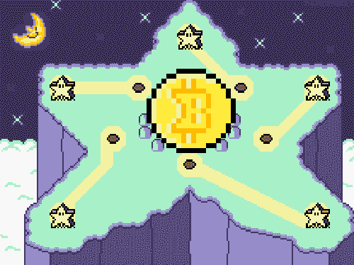
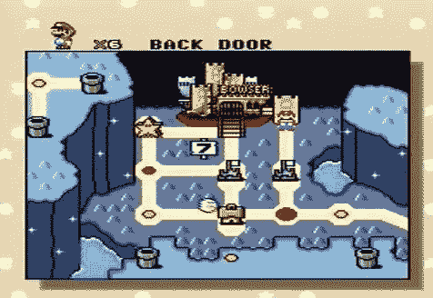

# 比特币是星际捷径(英文)

> 原文：<https://medium.com/coinmonks/bitcoin-is-the-star-world-shortcut-737ee1681a51?source=collection_archive---------8----------------------->

## 为老派游戏玩家解释健全的金钱

以前在 SNES 玩超级马里奥世界(SMW)，但是不懂比特币？那么这篇文章就送给你了。正如《星际世界》是任天堂在数字世界的捷径一样，比特币是 Satoshi 在现实世界的捷径。用更少的时间，更快的到最后的 boss。游戏结束！

# 明星之路:一条捷径

当你从 SMW 开始，你会一级一级地经历这个世界。你成功到达城堡，但是你的公主在另一座城堡里。你可能需要几个星期才能到达布瑟并救出你的女儿，因为这就是我们所做的一切。但是也许你还没走到那一步，就在游戏进行到一半的时候把操纵杆摔在了地上。

**但是如果我告诉你**你不用这么努力工作呢。半小时后你就可以和你的公主结婚了。起初听起来不可思议，但是当你第一次传送到星光大道后，你就在数字高速公路上了。十五分钟后，你找到了布瑟城堡的后门，游戏结束。

Bitcoin is the Star Road naar de Back Door. Easypeasy!

在游戏世界里，这是可能的。它是数字化的。在这里可以做得更好更快。但是现在在现实世界中也是可能的，肉空间，生命本身的游戏。有些人已经走在你们前面，分享了他们如何做到这一点的知识。现在轮到你更快地完成你的游戏了。

# 比特币:Satoshi 的捷径

[中本聪](https://nakamotoinstitute.org/)在 2009 年创造了网络货币。因为这种货币只存在于数字领域，它有三个特殊属性。它在现实世界中永远不会拥有的特性:

1.  **光速交易**
2.  **绝对稀缺**
3.  **长生不老**

有趣的是，在你可以无限复制的数字世界里，Satoshi 发现了如何在那里制造永远无法复制的东西，以及一行代码决定比特币最大数量的地方:**2100 万**。

这个规则是世界上最难和最好的钱被铸造的地方。这与我们当代的纸币形成了鲜明的对比。每个月都有更多的法定货币被创造出来，导致其贬值。**比特币解决了这个问题**,因为它的供应量有限，是一种通货紧缩的货币。随着越来越多的商品和服务将进入经济，你可以用比特币购买越来越多的东西。

相比之下，90 年代的电脑越来越便宜，越来越好。有了比特币，这适用于你想买的任何东西。比特币的价格正在下跌。对于没有硬币的人(还没有比特币的人)来说，比特币看起来越来越贵了。

**比特币是时间**
金钱是你储存作品的电池。你可以在以后用这种能量来交换别人的工作。但是那个电池的购买力取决于其他玩家有多少电池。在 meatspace 游戏中，有一个玩家可以免费无限充电。这位玩家以牺牲其他玩家的利益为代价入侵了 meatspace 游戏。简而言之，这意味着你将失去你的时间，你需要更多的时间来完成人生的游戏。

SMW 的星光大道是一条捷径。这样可以节省你到达最终 boss 的时间。比特币是 **Satoshi 的捷径**，在现实生活中为你节省时间。比特币制造者将他们的工作时间储存在一个无法稀释的硬币中，因为没有人可以调整 2100 万的限制。也许这也是游戏中速度赛跑的魅力所在。通过黑客手段，人类有一种比你想象的更快完成游戏的驱动力。现实生活中也是如此。

## 比特币是一种快车

除了 2100 万是硬编码，比特币也是不朽的。这就像是马里奥一直抓着一颗星星。没有人能伤害你，你能战胜一切。比特币可以与 Bittorrent 相媲美，Bittorrent 是一个分散的网络，运行在世界各地的数千台 PC 上。它不是一个有办公室的公司。因此，政府无法阻止电影和音乐的自由传播。它生活在网络空间，因此是不可战胜的。没有什么能够阻止 Bittorrent。没有什么会扼杀比特币，因为它同样是去中心化的。

# 其他人在你之前已经走了

也许你知道[滴滴太虎图](https://www.youtube.com/watch?v=cy1BkMfYBwM&ab_channel=MadelonVos)？他是那个卖了房子，全押在比特币上的荷兰比特币制造者。媒体让这看起来像是一个特例，但这个世界上有很多迪迪。所有这些人都看到这就是他们在现实生活中寻找的捷径，并在认真研究后做出了不可避免的全押举动。
我就是其中之一。许多人在我之前。也许我看到它是因为我曾经是一个超级马里奥游戏玩家。这是了解游戏规则，并按照你的意愿去做。

模拟世界正变得越来越数字化。这就赋予了现实世界越来越多游戏世界的特征。货币现在以比特币的形式获得了超能力。因此，它变得像光一样快，超级稀缺和不朽。这就是为什么它会赢。这是本世纪的淘金热，你可以好好利用它。走中本聪给你的捷径，赢得比赛。

祝你好运！

Game Over! You win!

喜欢这篇文章吗？阅读我的其他作品:

1.  我使用比特币还不算太晚吗？(我不打算投资)
2.  [比特币 G](/@sjorsvanheuveln/bitcoin-woordenboek-d28d17eafb7a) 亏损
3.  我是如何掉进比特币兔子洞的(我的故事)

> 加入 Coinmonks [电报频道](https://t.me/coincodecap)和 [Youtube 频道](https://www.youtube.com/c/coinmonks/videos)了解加密交易和投资

## 另外，阅读

*   [加拿大最好的加密交易机器人](https://blog.coincodecap.com/5-best-crypto-trading-bots-in-canada) | [赌注加密](https://blog.coincodecap.com/staking-crypto)
*   [如何在印度购买比特币？](/coinmonks/buy-bitcoin-in-india-feb50ddfef94) | [WazirX 审查](/coinmonks/wazirx-review-5c811b074f5b)
*   [最佳网上赌场](https://blog.coincodecap.com/best-online-casinos) | [硬件钱包](/coinmonks/hardware-wallets-dfa1211730c6)
*   [如何在 WazirX 上购买柴犬(SHIB)币？](https://blog.coincodecap.com/buy-shiba-wazirx)
*   [比特币主根](https://blog.coincodecap.com/bitcoin-taproot) | [排名前 6 的比特币信用卡](/coinmonks/bitcoin-credit-card-bc8ab6f377c6)
*   [最佳免费加密信号](https://blog.coincodecap.com/free-crypto-signals) | [YoBit 评论](/coinmonks/yobit-review-175464162c62) | [Bitbns 评论](/coinmonks/bitbns-review-38256a07e161)
*   [huo bi 的加密交易信号](https://blog.coincodecap.com/huobi-crypto-trading-signals) | [BitMEX 评论](https://blog.coincodecap.com/bitmex-review)
*   [7 个最佳零费用加密交换平台](https://blog.coincodecap.com/zero-fee-crypto-exchanges)
*   [分散交易所](https://blog.coincodecap.com/what-are-decentralized-exchanges) | [比特 FIP](https://blog.coincodecap.com/bitbns-fip) | [Pionex 审查](https://blog.coincodecap.com/pionex-review-exchange-with-crypto-trading-bot)
*   [用信用卡购买密码的 10 个最佳地点](https://blog.coincodecap.com/buy-crypto-with-credit-card)
*   [OKEx 评论](/coinmonks/okex-review-6b369304110f) | [Kucoin 交易机器人](/coinmonks/kucoin-trading-bot-automate-your-trades-8cf0ca2138e0) | [期货交易机器人](/coinmonks/futures-trading-bots-5a282ccee3f5)
*   [AscendEx Staking](https://blog.coincodecap.com/ascendex-staking)|[Bot Ocean Review](https://blog.coincodecap.com/bot-ocean-review)|[最佳比特币钱包](https://blog.coincodecap.com/bitcoin-wallets-india)
*   [霍比审核](https://blog.coincodecap.com/huobi-review) | [OKEx 保证金交易](https://blog.coincodecap.com/okex-margin-trading) | [期货交易](https://blog.coincodecap.com/futures-trading)
*   [Godex.io 评审](/coinmonks/godex-io-review-7366086519fb) | [邀请评审](/coinmonks/invity-review-70f3030c0502) | [BitForex 评审](https://blog.coincodecap.com/bitforex-review)
*   [Crypto.com 费用](/coinmonks/binance-fees-8588ec17965) | [僵尸密码审查](/coinmonks/botcrypto-review-2021-build-your-own-trading-bot-coincodecap-6b8332d736c7) | [替代品](https://blog.coincodecap.com/crypto-com-alternatives)
*   [有哪些交易信号？](https://blog.coincodecap.com/trading-signal) | [Bitstamp vs 比特币基地](https://blog.coincodecap.com/bitstamp-coinbase) | [买索拉纳](https://blog.coincodecap.com/buy-solana)
*   [ProfitFarmers 回顾](https://blog.coincodecap.com/profitfarmers-review) | [如何使用 Cornix Trading Bot](https://blog.coincodecap.com/cornix-trading-bot)
*   [MXC 交易所评论](/coinmonks/mxc-exchange-review-3af0ec1cba8c) | [Pionex vs 币安](https://blog.coincodecap.com/pionex-vs-binance) | [Pionex 套利机器人](https://blog.coincodecap.com/pionex-arbitrage-bot)
*   [我的密码交易经验](/coinmonks/my-experience-with-crypto-copy-trading-d6feb2ce3ac5) | [比特币基地评论](/coinmonks/coinbase-review-6ef4e0f56064)
*   [CoinFLEX 评论](https://blog.coincodecap.com/coinflex-review) | [AEX 交易所评论](https://blog.coincodecap.com/aex-exchange-review) | [UPbit 评论](https://blog.coincodecap.com/upbit-review)
*   [AscendEx 保证金交易](https://blog.coincodecap.com/ascendex-margin-trading) | [Bitfinex 赌注](https://blog.coincodecap.com/bitfinex-staking) | [bitFlyer 点评](https://blog.coincodecap.com/bitflyer-review)