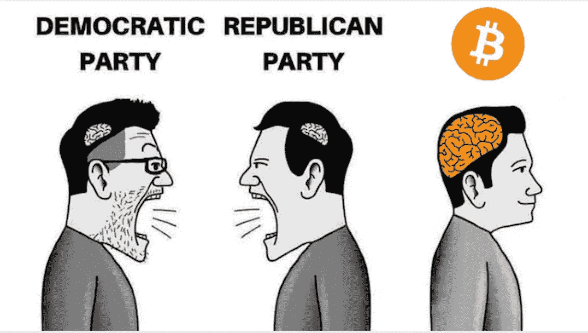
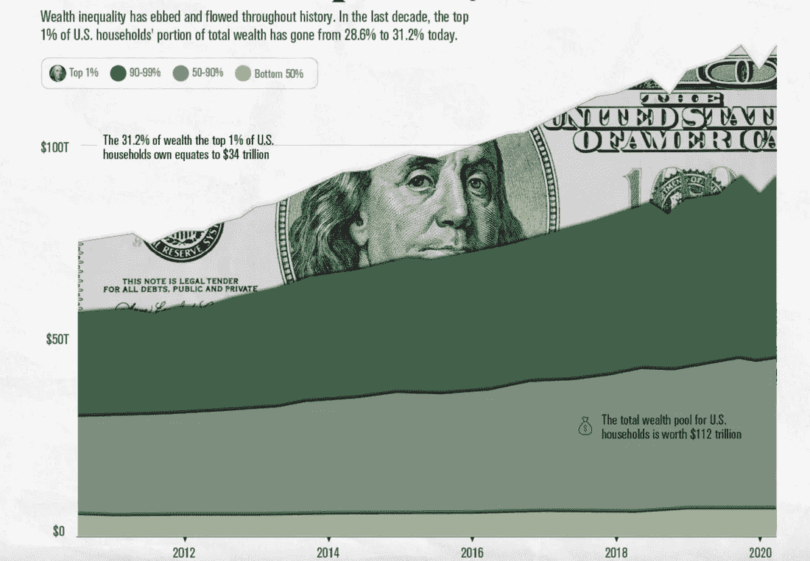
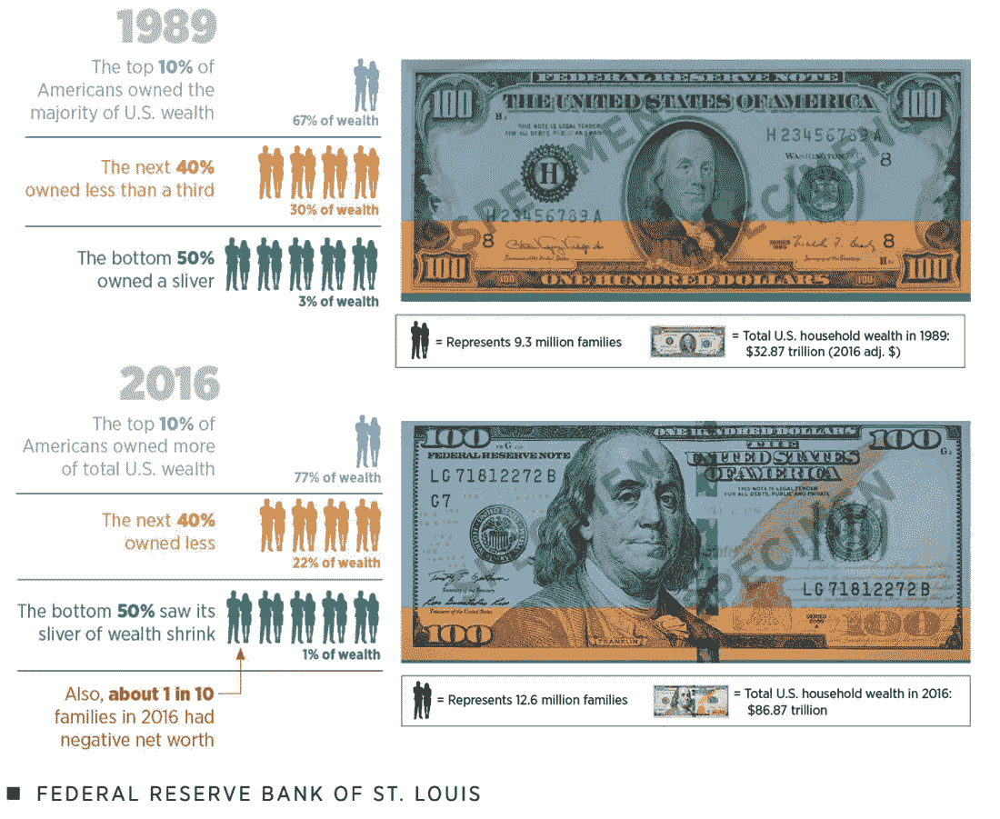
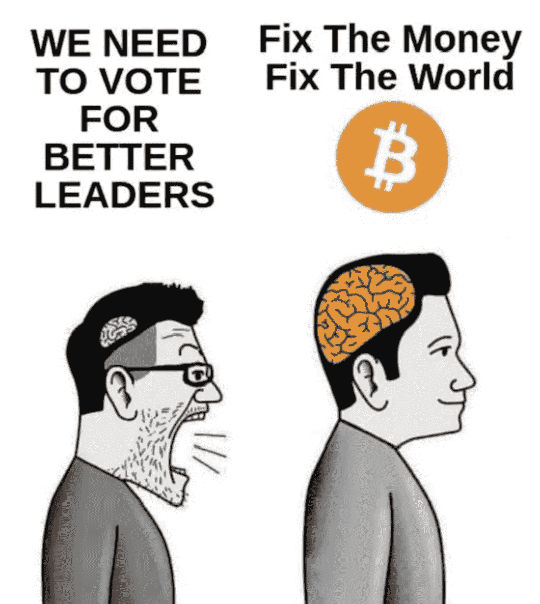

# 比特币是终极政治运动

> 原文：<https://medium.com/coinmonks/bitcoin-is-the-ultimate-political-movement-ba13125766a6?source=collection_archive---------6----------------------->

## 为什么以及如何比特币将改变政治和崩溃我们的两党范式。

群众从来不会自发地反抗，也不会仅仅因为被压迫而反抗。事实上，只要不允许他们有比较的标准，他们甚至永远不会意识到他们被压迫。”——乔治·奥威尔

随着年底的临近，对于比特币来说，这是极其重要的一年，我想花一些时间思考一下，我认为比特币作为一种社会政治力量代表了什么，以及我认为它正在积聚的能量(和进口)的意义。

上面引用的奥威尔的话，摘自 *1984* ，值得一读不止一遍。引起强烈共鸣的是第二句话，因为它包含的含义是，如果一个政府或一个系统能够阻止比较标准的出现，或者如果这样的比较标准能够被成功地混淆或玷污，就没有反叛的威胁。我认为这就是货币政策对话的结果。从幼年开始，我们就被灌输了一套基本的经济信念，这些信念常常被误认为是经济事实，货币政策的细微差别被弄得看起来和听起来都过于复杂，以至于普通人往往会觉得这些话题超出了他们的理解范围，应该交给“专家”来处理。

大多数花时间学习经济学的人，不管是在学校还是自学，都在不知情的情况下，花时间学习凯恩斯经济学*理论*。这一经济学理论在过去 75 年中变得无处不在，以至于现在几乎所有的经济学教授都是凯恩斯主义者，从凯恩斯主义者写的教科书中授课。当然，这些经济学家在政府和政府机构中接受工作和任命，并承担制定经济政策的任务。因此，在我们大多数人从未学习或知道存在其他经济学理论(比如，奥地利学派经济学)的情况下，这些理论的首要原则可能更令人信服，我们已经构建了一个货币体系，并完全基于凯恩斯理论制定了货币政策。在这样一个智力同质的环境中，用奥威尔的话来说，任何“比较标准”都很容易被抛弃、怀疑或忽视。

举例来说，我认为这很能说明问题，我们当然被允许，事实上也被邀请去比较组织的社会经济体系(例如，资本主义与社会主义和共产主义)。另一方面，我们不被鼓励去比较货币体系本身，也就是说货币是健全的还是不健全的。当社会主义情绪变得更加普遍时，我们会让人们想起苏联的救济队伍，并把他们指向古巴和中国。这些都是简单的比较，他们做了很多繁重的工作。说说你对资本主义的看法吧(就其价值而言，我认为裙带资本主义和真正的资本主义之间有着显著的区别，由可操纵的法定货币支撑的前者肯定不是后者)，它胜过了救济队伍和威权主义。然而，当我们比较健全的货币和不健全的货币时，同样容易得到的稻草人并不存在。我相信这很能说明问题，我相信这是一种藏球的方式。

我们都知道当今世界的状况存在根本性的问题。我认识的人都直观地感受到了这一点。但是，只要摆在我们面前的备选方案没有确定问题的位置，我们就不会有任何进展。但如果我们把问题准确定位在钱本身的层面，一切就变得清晰了。

考虑到这一点，我要说一些起初听起来有些夸张的话，但之后我会解释为什么我认为这是真的。开始了。比特币可能是我们有生以来见过的最具社会政治变革性的技术。原因如下。

在美国当前严重两极分化的两党制政治中，我们倾向于大约每十年轮换一次选举哪个政党。然而，行政部门的权力范围不断扩大，不管白宫中的政党是什么。每次选举，大约 49-53%的公民投票给获胜的候选人，这意味着我们的民主总是和持续地由越来越微弱的多数行使越来越广泛的权力。

一次又一次的选举，每一个政党都坚信，如果我们能任命一个特定的候选人，一个特定的易犯错的人来掌舵，一切都会改善，繁荣将广泛实现，棋盘将不再如此明显地向那些最接近权力的人倾斜，等等。与此同时，财富差距越来越大，外交政策基本保持不变，货币不断贬值，人们在指责他人的集体欲望中变得越来越疏远。

Chart from [Visual Capitalist](https://www.visualcapitalist.com/what-the-data-says-about-wealth-inequality/)

每个选举周期，每个政党都诊断反对党是所有社会弊病的问题和根源。换句话说，我们被告知问题存在于政策层面，而非系统层面。因此，如果我们让正确的决策者负责，政策层面的问题将得到解决，这艘船将得到航向修正(至少在下一个选举周期之前)，我们将逐渐向完美世界靠近。

但这当然不是真的，正如最近的历史所突出表明的那样。为什么？因为我们都在错误诊断(和错误定位)根本问题。这个问题存在于比政党更基础的层面上。要深得多。该体系中真正的首要缺陷在基础层:钱。两党(以及世界上每一个主要的西方经济体)都在无情地扩大货币供应，并且毫无疑问会继续这样做。这导致了一连串的下游效应，我们现在倾向于错误地将其归因于我们不喜欢的政党的政策决定。现实中，双方都制造了这个问题，而且双方都会继续加剧这个问题。他们会这样做，因为这是他们力所能及的，这很容易，而且可以用来实现连任。

> *比特币是我们见过的最具社会政治变革性的技术，因为它可以实现范式转变，而不需要安装特定的人类来实施特定的政策。*

比特币通过缩小政治家可以行使权力的领域来实现变革。更准确地说，比特币排除了对货币供应(以及必要的延伸，货币的稳健性)施加任何影响，货币是社会的基础。表达价格的货币协调经济活动。准确的价格信号激励必要的经济活动，抑制不太必要的活动。这样就创造了效率，解决了问题。当我们通过操纵货币供应将错误信息引入基础层时，错误信息会渗透到更大的经济中，从而培育出一个道德风险的环境，产生不良激励，允许错误投资，并使社会游戏棋盘向那些从错误信息中获益最大的人倾斜。

Photo by [Joshua Sukoff](https://unsplash.com/@joshuas?utm_source=medium&utm_medium=referral) on [Unsplash](https://unsplash.com?utm_source=medium&utm_medium=referral)

没有一个政客能抵制操纵货币供应的冲动，因为这让他们可以无一例外地过度承诺，这是获得连任的一个非常有用的工具。由于美国国会没有任期限制(而且当选公职的财务收益也很丰厚)，不可否认的是，追求连任比其他任何事情都更有动力。

但是，一届又一届政府一次又一次地操纵资金，只是推迟了后果。酗酒者一直喝酒以避免最终的宿醉。“我们说的每一个谎言都会招致真相的亏欠。这笔债迟早是要还的。”从本质上讲，扩大货币供应是在说谎。我们每做一次，真相的后果就变得更重。

> *几十年来，经济就像一辆汽车，由一群醉醺醺的司机轮流驾驶。比特币拿走了钥匙。*

正如奥地利经济学家弗里德里希·哈耶克(Friedrich Hayek)的名言:“在我们从政府手中拿走东西之前，我不相信我们会再次拥有好的货币，也就是说，我们不能以暴力的方式从政府手中拿走它们，我们所能做的只是通过一些狡猾的迂回方式引入一些他们无法阻止的东西。”

比特币是“他们无法阻止的东西”。它不需要一场战争，一场血腥的革命，也不需要选举任何特定的政党或政治家。它并不要求赋予一个人或一个团体代表所有其他人行事的权力。相反，每个人都可以自己选择加入这个新系统，这个新技术。随着每一个这样的个人选择，无领导、去中心化的比特币网络得到加强，而国家对货币的垄断权力逐渐减弱。

用[道杜·阿曼塔纳](https://dawdu.medium.com/the-bitcoin-perspective-why-you-should-invest-1cf84adb65eb)的话来说，比特币“是一种无声的抗议，正在侵蚀腐败的政治、金钱和对人类主权的统治。”

因此，随着这重要的一年接近尾声，着眼于 2022 年和比特币轨迹的下一步，我鼓励你们继续参与，继续了解更多，继续与朋友和家人分享，继续倡导，继续选择。

我是千禧一代。我这一代人已经见证了法定货币世界的动态所造成或加剧的社会创伤。但是，在我之前的几代人也承担了不健全货币的沉重代价，除非我们改变现状，否则我之后的几代人将承担越来越沉重的代价。

对于我的婴儿潮一代的读者来说，回想一下尼克松为了支付越南战争而让我们放弃黄金，这场战争是那些最接近印钞机的人不需要打的。

对于我这一代人来说，请记住，从海湾战争到阿富汗战争，捍卫石油美元体系(在尼克松让我们放弃黄金后，我们过渡到的全球法定货币体系)是我们干预中东的潜在和有影响力的力量。

我们千禧一代已经应对了大金融危机和新冠肺炎政府关门，这两次危机最终都惩罚了普通人，同时填满了最接近印钞机的人的口袋。

是时候改变了，朋友们。真正的改变。在 2020 年的总统竞选中，参议员伊丽莎白·沃伦敦促“大的结构性变革”，她的版本只是意味着改变现有结构的负责人。特朗普想要“抽干沼泽”，同时让“沼泽”及其不断扩张的势力范围保持完整和不受削弱。如果我们真的想要“大的结构性改变”，我们需要从根本上改变结构本身，这需要从修复货币开始。

如果你厌倦了道德风险、不良激励以及法定制度所带来的系统性机会不公平；如果你厌倦了你的钱失去购买力，通过设计，每年；如果你厌倦了允许、促进和鼓励歧视的货币体系；如果你厌倦了政府能够印钱打仗；如果你厌倦了一个系统，因为它必须无止境地成长才能生存，它保证了我们环境的毁灭；如果你厌倦了一小撮最有关系的人不成比例地获得新创造的货币，来加入我们，了解比特币。

回到奥威尔的名言，比特币最终给了我们一个比较的标准，一个可以看到被操纵的货币如何在社会底层延续压迫的镜头。我们有一个世代的机会来实现范式转变，为了所有人的集体利益，在比特币标准的基础上重建世界。我们不能让它过去。

你喜欢这篇文章吗？如果是，请点击👏按钮，分享，订阅 [**想比特币**](https://thinkbitcoin.substack.com/) **，我的免费比特币周报。**

**在 Twitter 上关注我**[**FI 的为什么**](https://medium.com/u/8c9a638a2ccb?source=post_page-----ba13125766a6--------------------------------)

在 Instagram 上关注我

[**订阅**](https://thinkbitcoin.substack.com/) **想比特币**

**免责声明**:我不是投资顾问，这不是投资建议，也无意成为投资建议。这不是买卖任何证券或数字资产的建议。本文仅用于教育和信息目的。

> 加入 Coinmonks [电报频道](https://t.me/coincodecap)和 [Youtube 频道](https://www.youtube.com/c/coinmonks/videos)了解加密交易和投资

## 另外，阅读

*   [如何开始用加密贷款赚取被动收入](https://blog.coincodecap.com/passive-income-crypto-lending)
*   [加密货币储蓄账户](/coinmonks/cryptocurrency-savings-accounts-be3bc0feffbf) | [加密交易机器人](https://blog.coincodecap.com/best-crypto-trading-bots)
*   [BigONE 交易所评论](/coinmonks/bigone-exchange-review-64705d85a1d4) | [CEX。IO 审查](https://blog.coincodecap.com/cex-io-review) | [交换区审查](/coinmonks/swapzone-review-crypto-exchange-data-aggregator-e0ad78e55ed7)
*   [最佳比特币保证金交易](/coinmonks/bitcoin-margin-trading-exchange-bcbfcbf7b8e3) | [比特币保证金交易](https://blog.coincodecap.com/bityard-margin-trading)
*   [加密保证金交易交易所](/coinmonks/crypto-margin-trading-exchanges-428b1f7ad108) | [赚取比特币](/coinmonks/earn-bitcoin-6e8bd3c592d9)
*   [WazirX vs CoinDCX vs bit bns](/coinmonks/wazirx-vs-coindcx-vs-bitbns-149f4f19a2f1)|[block fi vs coin loan vs Nexo](/coinmonks/blockfi-vs-coinloan-vs-nexo-cb624635230d)