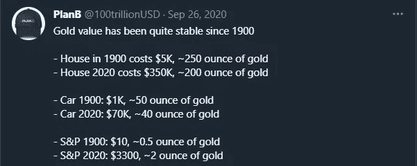

# 比特币是时间——我们将再次建造纪念碑

> 原文：<https://medium.com/coinmonks/bitcoin-is-time-we-will-build-monuments-again-d246a59080eb?source=collection_archive---------3----------------------->

免责声明:这不是财务建议。行动风险自担。

大家都知道“时间就是金钱”这句名言。如果比特币是货币，并且在我看来，比特币是最好的货币形式，这意味着比特币是……时间。让我告诉你为什么。

Photo by [Gaurav D Lathiya](https://unsplash.com/@gaurav_81?utm_source=medium&utm_medium=referral) on [Unsplash](https://unsplash.com?utm_source=medium&utm_medium=referral)

## 高时间偏好

你还记得一个建筑或纪念碑，它的建造是最近完成的，和上面显示的金字塔一样壮观吗？当时，他们花了 85 年的时间建造。21 世纪的人类失去了建造像吉萨金字塔或大教堂这样令人印象深刻的纪念碑的能力，有什么原因吗？自从我们能够建造这样的建筑以来，艺术或建筑才能有所下降吗？我不这么认为。我们只是因为资金的原因停止了这种规模的建设。规划和执行一个需要几十年建设时间的项目可能风险太大。货币问题，尤其是通货膨胀，导致了这样一个事实:我们不想冒险建造“文艺复兴时期规模”的纪念碑和大教堂。

> ***我们总是需要赶着把事情做好，因为我们不知道我们是否还能负担得起未来预想的投资。***

用专业术语来说，我们所谓的“时间偏好”很高。也许你在读 Saifedean Ammous 的《比特币标准》时知道这个短语。如果没有，我强烈推荐阅读他的书。

高度的时间偏好会导致你购买那些你目前并不真正需要的东西，但你不确定将来是否能买得起。你只能通过投资那些确保你不会失去购买力的资产来减少你的时间偏好。说到购买力，你首先需要赚些钱。

## “时间就是金钱”

做好你的日常工作意味着把你的宝贵时间换成金钱。然而，如果你得到的是法定货币，即来自中央银行的钱，而你没有花掉这些钱，这些钱就会贬值，这是由通货膨胀引起的。

> 结果，通货膨胀偷走了你的购买力，也偷走了你的时间。

在比特币发明之前，黄金几千年来一直是最好的价值储存手段。将资产像黄金一样储存起来，意味着保护你的购买力，因此也保护了你未来工作时间的价值。让我们看看下图中 PlanB 关于购买力储存的发现。

在这条推文之后，我们可以预计，大约 200 盎司的黄金将永远足以购买一栋同等价值的房子，但以美元衡量的价格却不同。汽车也有类似的历史。

记住这一点，我们不需要现在就买房子，因为我们可以假设在特别需要的时候，房子仍然是用黄金买得起的。

## **比特币比黄金更能保护你的时间**

与黄金相比，比特币显示出各种优势，是一种新的替代价值储存手段。它最重要的特点是永远只有 2100 万 BTC 的不可撤销的数量，而黄金供应可以通过生产更多的黄金来增加(但有一个未知的限制)。比特币的特点是不仅通胀率低于黄金，而且是一种通缩资产，因为一些 BTC 可能会永远消失。这使得比特币成为终极价值储存手段。

此外，比特币在便携性(纸上 24 个字)、可分性(1 BTC 等于 1 亿个 satoshis)和数字存储方面是“更好的黄金”。

以上只是比特币应该作为一种有长期投资意向的资产的几个理由。了解这些事实会降低你的时间偏好，尤其是比黄金更能降低你的时间偏好。

在比特币处于价格发现阶段期间，它是一种高度不稳定的资产类别，因此，你应该意识到风险，但也有很多从中获利的[机会](https://www.amazon.com/dp/B08HL8C81M)。

## 再次建造纪念碑

> “我只是在努力思考未来，不要难过。”——埃隆·马斯克

比特币如何影响像吉萨金字塔这样的纪念碑的创建？

比特币作为人类的第一个通缩资产，可能会让我们不用担心失去未来的购买力。这可能会促使建筑师和建筑商规划建筑，而这些建筑不一定需要尽快完工。这些人最终能够再次专注于质量和美丽，并为财务目的而忙碌。

**此外，它恢复了我们实现耗时目标的能力，因此，我们正在重新找回失去的建造壮观纪念碑的能力。**

> 加入 Coinmonks [Telegram group](https://t.me/joinchat/EPmjKpNYwRMsBI4p) 学习加密交易和投资

## 另外，阅读

*   最好的[密码交易机器人](/coinmonks/crypto-trading-bot-c2ffce8acb2a) | [网格交易](https://blog.coincodecap.com/grid-trading)
*   [加密复制交易平台](/coinmonks/top-10-crypto-copy-trading-platforms-for-beginners-d0c37c7d698c) | [如何在 WazirX 上购买比特币](/coinmonks/buy-bitcoin-on-wazirx-2d12b7989af1)
*   [CoinLoan 点评](/coinmonks/coinloan-review-18128b9badc4)|[Crypto.com 点评](/coinmonks/crypto-com-review-f143dca1f74c) | [火币保证金交易](/coinmonks/huobi-margin-trading-b3b06cdc1519)
*   [尤霍德勒 vs 考尼洛 vs 霍德诺特](/coinmonks/youhodler-vs-coinloan-vs-hodlnaut-b1050acde55a) | [Cryptohopper vs 哈斯博特](https://blog.coincodecap.com/cryptohopper-vs-haasbot)
*   [杠杆代币](/coinmonks/leveraged-token-3f5257808b22) | [最佳密码交易所](/coinmonks/crypto-exchange-dd2f9d6f3769) | [Paxful 点评](/coinmonks/paxful-review-4daf2354ab70)
*   [加密套利](/coinmonks/crypto-arbitrage-guide-how-to-make-money-as-a-beginner-62bfe5c868f6)指南| [如何做空比特币](/coinmonks/how-to-short-bitcoin-568a2d0b4ae5)
*   [如何在印度购买比特币？](/coinmonks/buy-bitcoin-in-india-feb50ddfef94) | [瓦济克斯审查](/coinmonks/wazirx-review-5c811b074f5b)
*   [印度比特币交易所](/coinmonks/bitcoin-exchange-in-india-7f1fe79715c9) | [比特币储蓄账户](/coinmonks/bitcoin-savings-account-e65b13f92451)
*   [币安收费](/coinmonks/binance-fees-8588ec17965) | [僵尸加密审查](/coinmonks/botcrypto-review-2021-build-your-own-trading-bot-coincodecap-6b8332d736c7) | [热点审查](/coinmonks/hotbit-review-cd5bec41dafb)
*   [我的密码副本交易经验](/coinmonks/my-experience-with-crypto-copy-trading-d6feb2ce3ac5) | [购买硬币评论](https://blog.coincodecap.com/buycoins-review)
*   [逐位融资融券交易](/coinmonks/bybit-margin-trading-e5071676244e) | [币安融资融券交易](/coinmonks/binance-margin-trading-c9eb5e9d2116) | [超位审核](/coinmonks/overbit-review-9446ed4f2188)
*   [加密货币储蓄账户](/coinmonks/cryptocurrency-savings-accounts-be3bc0feffbf) | [YoBit 审查](/coinmonks/yobit-review-175464162c62) | [Bitbns 审查](/coinmonks/bitbns-review-38256a07e161)
*   [Botsfolio vs nap bots vs Mudrex](/coinmonks/botsfolio-vs-napbots-vs-mudrex-c81344970c02)|[gate . io 交流回顾](/coinmonks/gate-io-exchange-review-61bf87b7078f)
*   [最佳比特币保证金交易](/coinmonks/bitcoin-margin-trading-exchange-bcbfcbf7b8e3) | [萝莉点评](/coinmonks/lolli-review-e6ddc7895ad8) | [比特币保证金交易](https://blog.coincodecap.com/bityard-margin-trading)
*   [创造并出售你的第一个 NFT](https://blog.coincodecap.com/create-nft) | [本地比特币评论](/coinmonks/localbitcoins-review-6cc001c6ed56)
*   [加密保证金交易交易所](/coinmonks/crypto-margin-trading-exchanges-428b1f7ad108) | [赚取比特币](/coinmonks/earn-bitcoin-6e8bd3c592d9) | [Mudrex 投资](https://blog.coincodecap.com/mudrex-invest-review-the-best-way-to-invest-in-crypto)
*   [如何在印度购买以太坊？](https://blog.coincodecap.com/buy-ethereum-in-india) | [如何在币安购买比特币](https://blog.coincodecap.com/buy-bitcoin-binance)
*   [顶级付费加密货币和区块链课程](https://blog.coincodecap.com/blockchain-courses) | [Pionex vs 币安](https://blog.coincodecap.com/pionex-vs-binance)

> [直接在您的收件箱中获得最佳软件交易](/coinmonks/newsletters/coinmonks)

