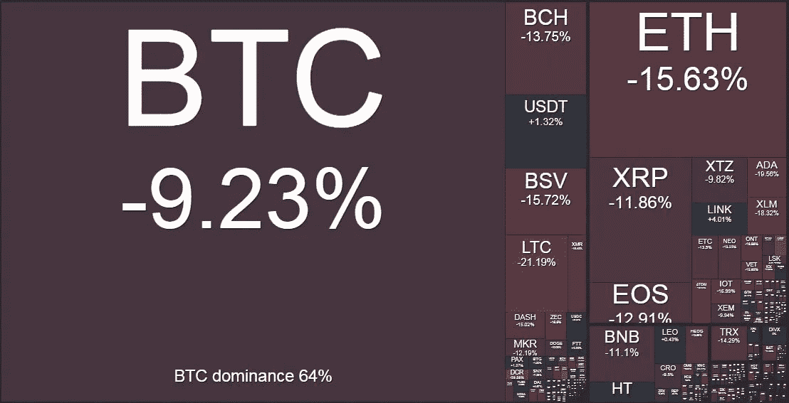

# 比特币是真理

> 原文：<https://medium.com/coinmonks/bitcoin-is-truth-799cea7a1d6a?source=collection_archive---------4----------------------->

## **本周在 Crypto**

新冠肺炎引发的波动上周席卷全球股市，标准普尔 500 一周内下跌超过 12%——仅周一和周二的交易时段就抹去了 1.7 万亿美元的价值。总而言之，这一损失是历史上最糟糕的一周，也是 2008 年以来最糟糕的一周。股市无一幸免，富时和 EuroStoxx50 的表现也好不到哪里去。最好的去处是 30 年期美国国债(又名“长期债券”)，其收益率跌至 1.78%的历史新低。

尽管不同，加密货币本周也面临类似的压力，全线回调约 15%。然而，我们不认为这是由推动股市上涨的新冠肺炎恐慌直接导致的，而只是近期反弹的部分重置。重要的是要正确看待本周的下跌——比特币在年初至今仍上涨*约 25%,瑞士联邦理工学院*约 65%,其他如 BCH 和 BSV 甚至更高。**

作为一家市场中立的高频交易公司，Kenetic Trading 在交易量和波动性增加的情况下蓬勃发展，我们的算法能够从市场中错位和低效的数量增加中获利。不用说，对于我们的交易部门来说，这是一个很好的月份，因为我们在交易量和盈利能力方面都创下了记录。

接下来是“比特币作为安全港”的主题…许多怀疑论者会很快意识到，比特币未能发挥其避险资产的作用，因为它无法抵御股票市场的损失，而且就在需要避险资产的时候，它与其他风险资产呈现出高度的正相关性。然而，这种观点有些短视——从更长期的角度来看，相关性接近于零——显然不如大范围低迷期间的负相关资产，但仍是一个优秀的投资组合组成部分。

对于方向交易者来说——展望未来，我们对两个方向都没有强烈的市场观点，因为我们仍然牢牢地盘踞在我们上周描述的长期三角形中。在这个阶段，我们肯定会做多，但是我们认为这种观点的最佳表达方式是通过看涨期权比率，而不是完全的多头三角形头寸，因为缺乏证明完全多头头寸的技术信号。

## **比特币是真理**

随着世界变得越来越互联，人们可以实时观察到互联网带来的人类进步的惊人进展，值得看看这种即时、分散、随时可用的信息流的一些后果，任何拥有智能手机或笔记本电脑的人都可以接入这种信息流。历史上从未有过如此不费力气和成本就能获得信息和数据的情况。同样，一个人的信息从未能以如此微不足道的成本和努力传达给如此多的全球受众。

这种“人人自由”的局面已经迎来了不信任的时代。由于任何拥有智能手机的人都会收到铺天盖地的新闻、更新和通知，我们依赖信息的能力慢慢受到侵蚀。我们应该相信谁？应该相信什么？什么时候应该相信？人们甚至可以称之为信息悖论——信息如此之多，然而我们知道该依赖什么、该忽略什么的能力却在不断下降。

当美国总统可以利用 280 个字符开展外交，一时兴起影响社会、贸易协定、市场和政界人士时，这种数据狂欢已经到了何种程度的完美例子显而易见。广受好评的纪录片《大黑客》(The Great Hack)令人不安地揭示了这个通过社交媒体制造假新闻、谎言和操纵的时代。最近，围绕新冠肺炎的新闻报道突出了信息质量和传播的问题。政府、科学家、记者和政治领导人都根据他们的政治和商业动机，提出不同的、往往是相互矛盾的信息。当潜在风险像全球流感疫情一样高时，世界需要准确的报告和分析。中国人已经证明了他们对数据的审查和来自武汉爆炸中心的报道(或缺乏报道)是多么明目张胆地夸大事实。

尽管取得了进步，但互联网(特别是社交媒体)呈现出越来越强的误导倾向，这在全球灾难和普遍恐慌面前造成了重大问题。你获取新闻和时事的方式会直接影响你对世界的看法，不同的人口统计数据、年龄、性别和宗教都会对相同的主题形成截然不同且往往两极分化的观点。这与美国党派色彩浓厚的有线新闻网没有什么不同，几十年来，有线新闻网塑造了观众对各种话题的看法，然而，在线新闻的可访问性和现在社交媒体上分享观点的频率导致同一事实几乎立即以数十种方式被报道。

当今天的主题是生死攸关或保护工作、财富和储蓄时，赌注就高得不能再高了:

我们应该相信朝鲜政权真的不构成任何重大军事威胁，而且美国已经控制了一切吗？

*我们应该相信世界经济是强劲的，我们从 2008 年 GFC 吸取的教训得到了重视吗？*

*对于即将退休的婴儿潮一代来说，养老金是否得到了适当的资本化和保障，或者我们是否都被误导和出卖了？*

当下一次金融危机来袭时，政府有计划吗？他们真的知道自己在做什么吗？

新冠肺炎有多认真，我们有计划吗？有什么风险？

可悲的是，这些问题的答案很难确定，即使对于那些工作就是在所有噪音中寻找真相的人来说也是如此。对于从互联网和社交媒体获取线索的普通人来说，合法的、一口大小的包裹中未经检查和不可靠的信息的影响是一个危险的组合。

继续这个主题，本周有很多关于比特币作为避险资产的作用失败的讨论。随着全球股市遭受重创，[比特币](https://blog.coincodecap.com/tag/bitcoin/)价格也跌入红色，而黄金最初保持稳定，传统的安全港——美国国债和日元——都大幅走强。那么，比特币如果不是避风港，那是什么？我们不是都被告知这种“神奇的互联网货币”是黄金 2.0 吗？这只是更多的假新闻只是为了抬高价格吗？我们应该相信吗？

从本质上来说，[比特币](https://blog.coincodecap.com/tag/bitcoin/)是数学和计算机科学的结合，可能不同于我们以前见过的任何其他资产，因此目前很难对其进行分类。我们知道的是，比特币不会说谎、不会被窃取、不会被操纵或伪造。比特币区块链每 10 分钟左右就会产生一个又一个区块，让全世界都看到，而且这种情况可能会持续很长时间。比特币是一种数字资产，具有预先编程的通缩时间表，任何人都可以根据自己的意愿获取。你不能打印更多的它，你不能真的关闭它而不招致巨大的成本和努力，它是极其可靠的。在这个虚假和欺骗越来越多的世界里，比特币是绝对真理的一个受欢迎的来源。

纳撒尼尔·惠特莫尔(Nathaniel Whittemore)本周提醒我们彭博的一篇文章,前脸书高管、现风投公司 Social Capital 创始人查马斯·帕里哈皮蒂亚(Chamath Palihapitiya)早在 2013 年就写了这篇文章，但在引用 OG 的文章时经常被引用，OG 首先发现了比特币，并预见了该技术巨大的不对称投资潜力。

查马斯写道:

*自 2008 年金融危机以来，我们看到对金融服务行业的信任大幅下降:雷曼兄弟、贝尔斯登、美国国际集团、“伦敦鲸”、塞浦路斯和一系列不太严重的丑闻促使消费者响亮而明确地说出一件事:“我不信任你。”或者“你只是为了自己。”或者“谁让你当国王的？”或者一些非常合理的变体。似乎金融服务业的最佳回应是，“相信我，我上过哈佛商学院。”*

*关键是，这种根本的信任不再存在；取而代之的是比特币。*

我告诉过我的朋友，将你 1%的资产投资于比特币是完全理性的——我也是这样做的。称之为笨蛋保险。

正如我们之前说过的，将人们的投资组合配置到比特币的投资案例很难被忽视。在最好的情况下，随着法定货币被取代，一种数字化的、非主权的价值储存手段取而代之，这将带来巨大的意外收获。在最坏的情况下，这是廉价的笨蛋保险。

Crypto weekly performance: 2nd March 2020\. Source [www.bitgur.com](http://www.bitgur.com)

点击 [www.kenetic.capital](http://www.kenetic.capital) 订阅我们的每周简讯

> [直接在您的收件箱中获得最佳软件交易](https://coincodecap.com/?utm_source=coinmonks)

