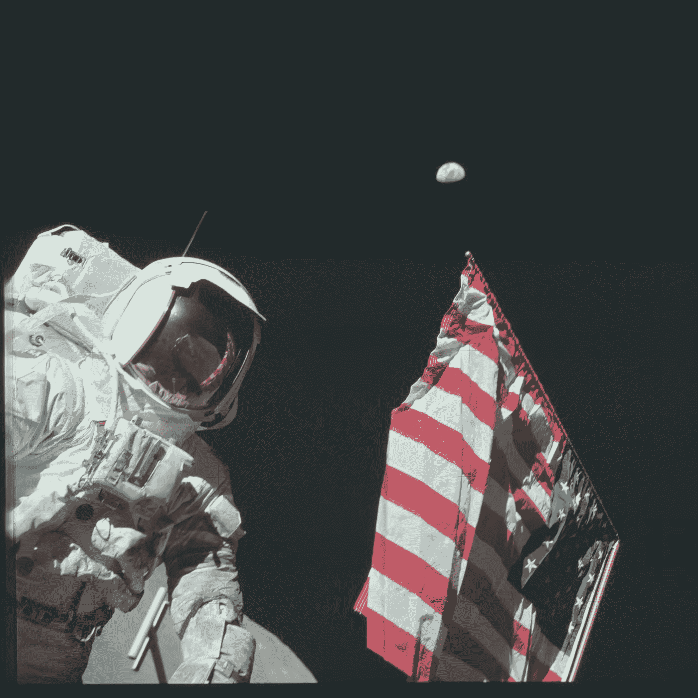
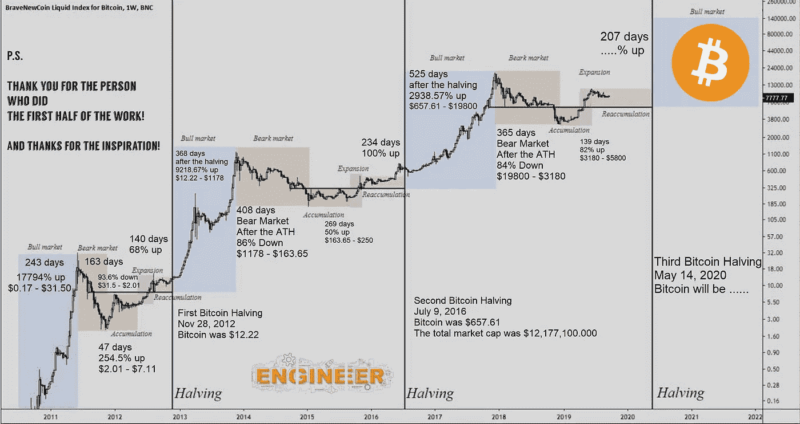

# 比特币发行减半

> 原文：<https://medium.com/coinmonks/bitcoin-issuance-halving-250497fb6b38?source=collection_archive---------0----------------------->

## 这对以太坊意味着什么

作为一种内在机制，比特币每四年将发行减少一半。自 2008 年 BTC 成立以来，发行规模已经缩减了两次。第一次“减半”导致了持续一整年的牛市。以任何标准来看，涨幅都是荒唐的，最高涨幅为+9200%，从 12 美元涨到 1200 美元。在接下来的三年里，在经历了-84%的修正后，BTC 保持了相对稳定。在类似的举动中，第二次比特币减半催化了近 3000%的历史最高牛市——从 650 美元到 19981 美元。还是那句话，之后的三年，经过大幅度的回调，相对稳定。下一次减半将发生在 2020 年 5 月 13 日。这一切都优雅地显示在下面的图表中。

[https://masterthecrypto.com/wp-content/uploads/2019/10/bitcoin-halving-price-usd-exchange-rate-values.jpg](https://masterthecrypto.com/wp-content/uploads/2019/10/bitcoin-halving-price-usd-exchange-rate-values.jpg)

如果前两次减半能告诉我们下一次的情况，那么有理由预计比特币牛市将持续到 2021 年。人们可能会认为，BTC·哈尔文斯应该已经被“定价”了，但这样的断言是以一个理性、有效的密码市场为前提的。这不是道琼斯指数。这是一个投机市场，知识水平很低，投资者几乎已经忘记了 2018 年 85%的 BTC 修正。全球谷歌趋势数据显示，比特币搜索量已恢复到 2016 年第二次减半后的最高水平。在 2012 年减半后经历了 9200%的牛市后，人们预计在 2016 年下一次减半前市场效率会更高，但这从未发生。因此，随着我们在 5 月份接近下一次减半，有理由认为比特币将继续被低估。

> [发现并回顾最好的比特币软件](https://coincodecap.com)

当然，两个不是一个模式，但这是我们到目前为止要做的全部工作。第二次牛市减半大约是第一次的 33%。如果下一次减半紧随其后，我们可以预计 2022 年将出现 1000%的牛市。在撰写本文时，BTC 徘徊在 8000 美元左右。算一算，每比特币 8 万美元似乎有些疯狂。然而，大多数人会认为你在临床上疯了，因为你认为比特币在 2012 年能达到 1200 美元，在 2018 年能达到近 2 万美元。

## 矿工盈利能力

下面的话，即使你不明白比特币“矿工”是什么，也应该说得通。[如有需要，点击此处获取入门](https://spectrum.ieee.org/computing/networks/ethereum-plans-to-cut-its-absurd-energy-consumption-by-99-percent)。

开采一枚比特币的成本是衡量矿商盈利能力以及比特币价格的重要指标。据大多数估计，中国占世界矿工总数的 65%或更多。2018 年由 [Elite Fixtures](https://www.elitefixtures.com/blog/post/2683/bitcoin-mining-costs-by-country/) 发布的一份报告估计，在中国开采一枚比特币的成本约为 3200 美元。显而易见，如果比特币价格跌至 3200 美元或更低，矿商将开始持有比特币，而不是亏本出售。2019 年 12 月，比特币跌至 3 年来的最低价格:3200 美元，这一事实似乎验证了这一假设。当 5 月 13 日减半时，发行将从每十分钟 12.5 个比特币减少到只有 6.25 个。结果，开采一枚比特币的成本翻了一番，达到约 6400 美元。

你可能会想，每枚比特币 6400 美元的新理论价格下限并不令人印象深刻，因为今天一枚比特币已经价值约 8000 美元。然而，我们不得不考虑一个事实，即矿商现在每比特币只能赚 1600 美元，而不是 4800 美元。这并不是说矿商将完全停止出售他们的比特币，但可以肯定的是，3200 美元的底线将使他们不那么渴望以 8000 美元的价格出售。此外，矿商现在习惯于预期在减半事件后的牛市。对市场的最终影响是供应的简单减少。

由于比特币市场的低效率，如流动性和投资者知识，通货膨胀率的大幅下降对价格产生了同样剧烈的影响。一系列的连锁反应形成了，随之而来的价格上涨达到了逃逸速度——一个巨大的投机泡沫出现了，直到 85%的修正让我们回到现实。

## 以太坊呢？

[看一下对数图](https://bitinfocharts.com/comparison/price-btc-eth.html#log)可以看出，尤其是在过去的 3 年里，以太和比特币有着相当的相关性。Coinmetrics.io 的年初至今数据显示，瑞士联邦理工学院和 BTC 大学的相关性达到了 0.81 或更高。如果这种趋势持续到 2021 年，没有理由认为 ETH 不会受益于 10 倍的 BTC。

以太坊在以太坊 2.0 方面取得了真正的进展，但 2.0 的全部功能最早要到 2021 年才能上线。Eth 2.0 和正在进行的比特币牛市的融合使得以太坊在未来几年充满希望。从投机投资的角度来看，我不知道任何其他资产有如此不对称的上涨。至少，以太坊应该会在 2021 年搭上比特币的顺风车。如果 Eth 2.0 同时实现，到 2022 年增加 10 倍似乎是可能的。此外，如果 2.0 像目前的测试显示的那样有效，那么排除 ETH 发动政变的可能性还不算太晚。不难想象，一种拥有无限多的使用案例和更低费用的[环保加密货币](https://spectrum.ieee.org/computing/networks/ethereum-plans-to-cut-its-absurd-energy-consumption-by-99-percent)将取代比特币的头把交椅。

总之，我的论点不变。我很长以太坊，直到 Eth 2.0 才重新评估。我有根据的猜测是，到 2022 年每 ETH 3000 美元。

感谢阅读。我很乐意听到其他意见或想法，所以请在这里留下任何意见或反馈，或者直接给我发电子邮件。

> [在您的收件箱中直接获得最佳软件交易](https://coincodecap.com/?utm_source=coinmonks)

