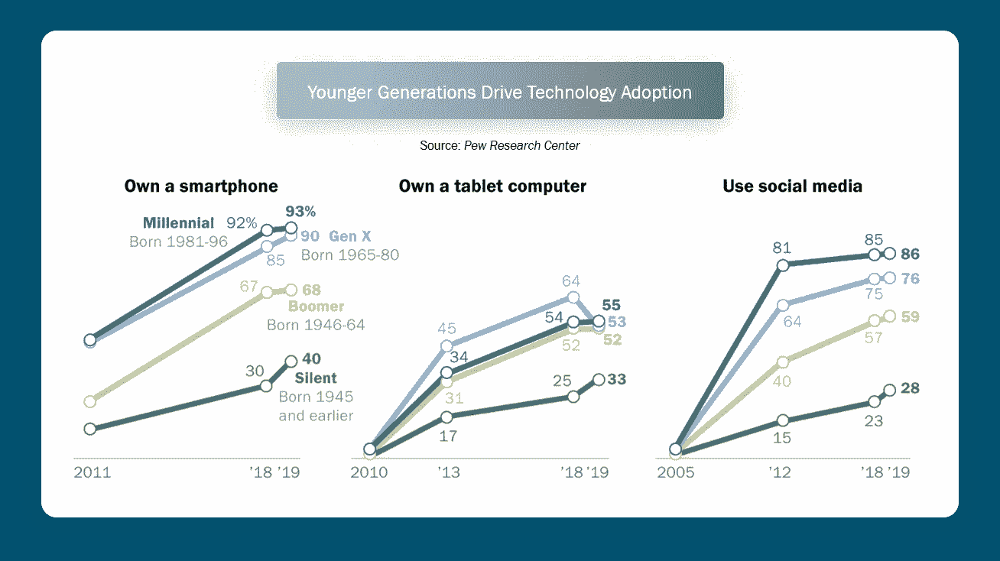
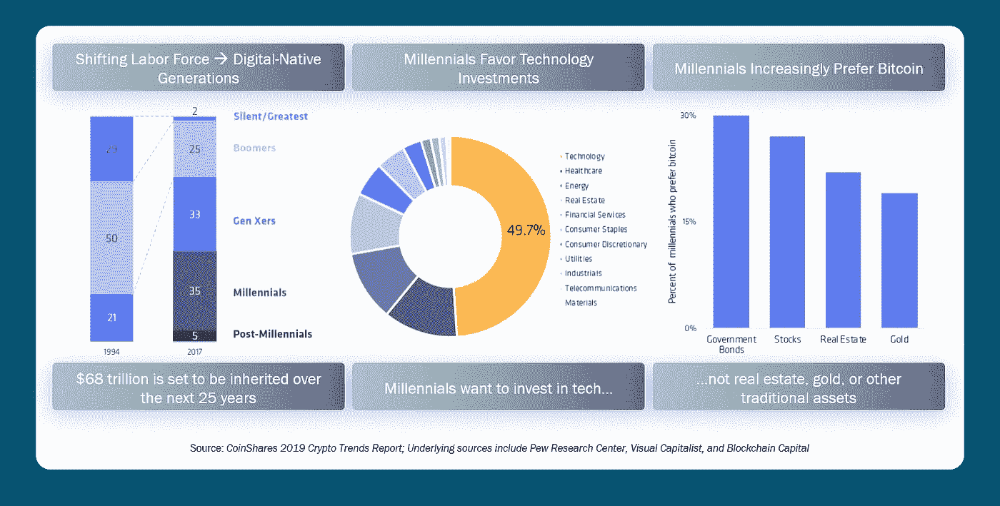
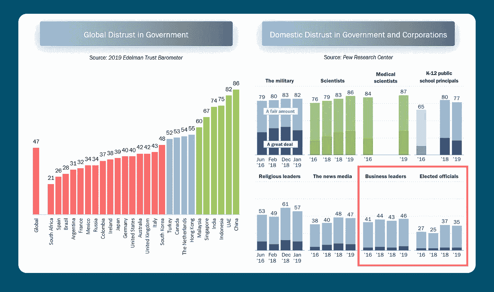

# 比特币:趁早不晚[上]

> 原文：<https://medium.com/coinmonks/bitcoin-its-not-too-late-to-be-early-part-1-2642446ba240?source=collection_archive---------2----------------------->

# **激励的力量**

这个世界是由激励驱动的。每个人都明白这一点——不管是有意识的还是无意识的——因为激励决定了人类的行为。激励有多种形式——一些激励是为了获得物质回报(如就业),而另一些激励是为了促使个人承担道德责任(如因谋杀而入狱)。每天都有数以千计的激励结构被测试。我们的微观决策反映了我们对这些结构的内在理解和认同。认识到激励的重要性——特别是社会和经济动机——对理解一群人的行为大有帮助。当社会的核心租户之一——金钱——面临代际分裂时，尤其如此。

> [发现并回顾最好的比特币软件](https://coincodecap.com)

# **内部结构**

我相对年轻的职业生涯完全是在资本市场投资者这一边度过的，过去几年专门专注于风险资本和技术。出于各种原因，那些理论上应该最了解激励结构的人——资本市场投资者——在很大程度上继续将比特币误诊为一种没有任何支持的投机资产。诚然，比特币没有实物资产的支持(尽管考虑到开采比特币所需的计算能力，这一点也存在争议)，但它有一些支持:矿商之间简单而平衡的创造性激励结构，矿商提供网络安全以换取收入；节点，在开发者更新后决定主导协议版本；还有用户，他们通过比特币的使用(发送交易，支付网络费用)和存储(储存，从流通中移除单位)来支持网络经济。这种结构奖励那些投入资源来构建和保护网络的人(矿工)和那些投入资源来获取和持有网络的人(用户)，平衡网络并为每个参与者提供一个在构建、维护和复合价值中的积极角色。简而言之，比特币受到其货币属性可信度的支持。这些都是建立在健全的激励结构之上的。有了它，资产就永远有价值。

这些激励措施有助于比特币实现其“公平货币”原则，这是其竞争优势背后的基础:固定、透明、可验证的发行；全球交易。以及不管外部环境如何都提供主权控制。有些人出于竞争原因贬低比特币([恰当的例子](https://www.forbes.com/sites/billybambrough/2019/05/15/a-u-s-congressman-is-so-scared-of-bitcoin-and-crypto-he-wants-it-banned/#7bdcd4166405))，但大多数人这样做是因为比特币背后的激励机制是建立在不信任的基础上的，但它创造了一个更公平的体系，与历史上依赖于对中央权力机构的信任的资本体系背道而驰(这个体系肯定缺乏公平性)。金融市场内部对比特币的谴责，既是对比特币的公投，也是对当今货币腐败本质的公投。声明“不要相信比特币”——这种货币具有可审计的输入和功能，没有情感或议程——的政党还要求公众相信由政治任命的官员组成的小团体定义的货币。对一个系统的信任应该和对其潜在动机的信任一样强。

比特币网络内部的激励结构是创新，就像允许创新的技术一样。中本聪没有忘记激励的重要性——比特币白皮书中有一个章节专门讨论这一点。其激励结构的美妙之处在于，它鼓励网络参与者按照自己的最大利益行事:要创建一个不需要信任的系统，该系统的结构必须确保好行为比坏行为更有利可图。这就是比特币解决方案的独特之处。那些寻求攻击系统的人很快发现，遵守规则(验证合法区块以收集区块奖励)比违反规则更有利可图。摧毁系统需要集合比所有其他节点加起来还要多的 CPU 能力，并利用这种优势对系统进行双重攻击，使区块链变得一文不值，从而使攻击者在其中获得的价值变得一文不值。这是比特币的内部激励结构，驱动供应的激励，吸引最早的采用者。

从早期参与者发展到大规模采用将取决于推动需求的外部激励因素。

# **外部催化剂**

如上所述，对比特币作为全球性、不受政府控制的价值储存手段的潜力的信念，应该从根本上植根于它对网络参与者的激励。在一个稀释性和不透明的货币体系的世界里，货币具有透明廉洁的供应面。

任何加密货币的成功都需要网络效应，而网络效应需要需求。决定比特币等加密货币需求的因素通常是看黄金、财富和衍生品市场的规模等(以及其他加密货币不同使用情况下的变化)。又大又圆的数字会成为头条新闻，引发话题。黄金市场约为 8.5 万亿美元；法定货币占近 40 万亿美元的价值，另外 50 万亿美元存在货币市场账户以及储蓄和定期存款中；另外还有 30 万亿美元存在离岸银行账户中。但是可寻址的市场规模仅仅是可寻址的，直到需求被吸引用户到网络平台的激励措施切实实现。比特币的内部激励机制为该网络利用外部催化剂创造了基础；虽然比特币肯定需要将用户“拉”进它的网络(改善用户体验，建立第二层服务/工具)，但它已经变得真正引人注目，因为当前的系统正在慢慢地将个人“推”向不可信的社交和货币网络。

推动比特币的催化剂来自不断变化的人口结构(数字化的千禧一代和新生代)、文化变迁(对政府和大公司缺乏信任)、脆弱的金融体系(负利率、膨胀的资产价格、看似无限的央行干预)以及监控资本主义的兴起(利用个人数据)，所有这些都在推动个人寻求不同形式的财富和信息存储。

这些都是推动个人质疑现状的力量。尽管个人以前没有什么动力离开现有的货币体系，但现在存在着巨大的动力——不仅仅是离开当前的体系，而是采用比特币来取代它。我们已经看到了这一点，最明显的是从个人的角度——比特币的“宏观案例”中，个人脱离了传统的金融机构和国家货币——但也越来越多地从它的制度化中看到了这一点。

然而，尽管对个人(个人主权)和机构(不对称风险回报资产)来说，采用比特币的激励在全球范围内都存在，但需求尚未达到显著规模。比特币的第一个十年被用来证明其弹性，并揭示其产生背后的原因。在接下来的十年里，比特币将迈出“回归常态”的第一步，人们越来越确信，和之前的互联网一样，比特币具有合理的价值，并被广泛接受为一种社会必需品。

# **需求的激励**

从本质上讲，今天的金融体系掌握在中央银行手中，中央银行是一组由政府运营的小团体，它们决定着货币的供应和流动。央行拥有增加或减少各自货币流通供应量的权力，其运作几乎独立于政府。

冒着过度简化中央银行角色的风险，并假设理性行为，它们增加供给以鼓励支出(通常在经济放缓时期)，减少供给以鼓励储蓄(通常在有机繁荣的经济时期)。然而，在最近的记忆中，这在很大程度上是一条单行道:自 2008 年以来，各国央行不断向全球金融体系注入新资金，最初是作为全球金融危机后支持世界经济的反措施，随后是因为越来越依赖于防止自繁荣以来的经济重新陷入动荡时期。过去十年，美元的基础货币供应量增加了 5 倍。踢球者？过去十年之前是几十年同样的事情(尽管程度较轻)，购买力下降，刺激消费而不是储蓄。而且，即使[雷伊·达里奥对市场走向的预测是正确的，这种情况也不太可能很快结束，原因很简单:印刷新钞票是支撑资产价格和支撑脆弱市场最简单、最安静的方式，而且不会招致公众的监督——即使这条路的后果包括加剧富人和穷人之间已经很大(并且正在扩大)的财富、机会和政治差距。如果我们处在一个巨大的信贷泡沫中，这可能更接近于一种可能性，我们只需要看看个人和企业被激励去做什么(借入低息贷款)，就能明白我们是如何走到这一步的。](https://www.linkedin.com/pulse/world-has-gone-mad-system-broken-ray-dalio/)

2008 年后，降低利率作为最初的应对措施是合理的做法，因为美国和世界经历了这一代人最大的经济衰退。消费者和企业都需要低息贷款来刺激经济活动(例如，为消费者购物，为企业在 R&D 投资)。然而，这种反应的持续时间和规模已经将曾经的暂时刺激变成了永久刺激。虽然过去的金融体系使用廉价资本来支持其增长，但今天的迭代已经变得依赖于它来简单地维持现状。由于缺乏更好的例子，它在某些方面类似于美国最近(和正在进行的)阿片类药物危机:尽管一些人只是开始使用阿片类药物来暂时支撑一段时间的疼痛(如在一次大手术后)，但剂量和使用之间缺乏纪律可以在人和药物之间产生依赖关系，从而导致成瘾行为；然后，这个人开始依赖这种药物来维持日常功能。十多年前金融危机之后，为了避免任何形式的调整，各国央行无意中(尽管不一定令人惊讶)创造了一个充满深度综合风险的“新”系统。

这一点可以在金融体系和各种资产类别中看到:信誉良好的人可以免费获得资金，但最需要的人却拿不到；大政府面临着巨大的(且不断增加的)赤字，在加息会削弱全球市场和经济的情况下，如果不加息，这些赤字是无法克服的；鉴于预期的市场回报，养老金和医疗保健负债付款即将到期，而负责支付这些债务的人不太可能履行这些义务；投资者付钱给政府借钱给他们(合理的疯狂)，驱使这些投资者在风险更高的股票市场“保存”他们的财富；大公司继续利用廉价(~免费)资金启动大规模股票回购计划，人为抬高股价和“经济”指标。所有这些都凸显了当今资产价格对廉价信贷的依赖。再一次，过去的十年加剧了一个问题，这个问题始于纠正众所周知的船的努力。

比特币有可能扭转这种不正当激励的趋势。其健全的货币原则——最显著的是其透明的稀缺性、抗审查性、便携性和安全性——激励个人参与其网络，并将其作为今天储存价值的手段，并在未来潜在地作为日常交换媒介。

**稀缺**

*   为什么稀缺性很重要？主要是因为今天的主要货币和控制它们的小集团没有任何相似之处——中央银行可以而且确实看似随意地印刷钞票，创造了一个严重依赖于支出而不是储蓄和资产(美元、欧元、英镑等)的金融系统。)看到他们的购买力逐年下降。

> “这些传统货币‘天生就越来越容易被操纵。’”——帕克·刘易斯，[被解放的资本](https://medium.com/u/f100a44dc744?source=post_page-----2642446ba240--------------------------------)

*   在上个世纪，美元——整个时期的世界储备货币——[相对于黄金的购买力下降了约 98%](http://www.goldchartsrus.com/chartstemp/AUPPBasket.php),这种衰退是由一小部分个人(通常是富裕的个人)决定的货币政策造成的。质疑这些货币政策决策是否(1)是由最有能力这样做的人做出的(或者这是否是一小群精英应该决定的事情)，并不是没有道理的；即使这是最好的制度(2 ),也存在着这样的问题，那就是这个小团体的行为是否符合全体人民的最佳利益(很可能不是)。央行行为者本质上并不道德，他们只是操作一个受政府政策影响的系统的控制(容易出现人为错误和情绪影响)，并激励某些行为。更有可能的是，央行将继续增加基础货币供应，以支持任何可能的经济增长，因为没有办法软着陆我们今天可能面临的信贷推动的资产泡沫(正如 [@jamesob](https://twitter.com/jamesob) 在上面几段的链接中详细描述的)。货币政策已经转向一个方向，央行别无选择，只能继续走这条路，而不是冒险进行另一次严重的经济调整，并以极端且可能不可逆转的方式让本币贬值。

*   比特币的稀缺性——在程序上和密码上保证永远只有 2100 万个比特币——并不仅仅因为 2100 万个比特币小于 1.7 万亿个比特币而具有价值。相反，这是因为一项资产只有 2100 万个单位，其供应不能被政府或个人操纵(无论是有意还是无意)，而且总的未偿单位可以立即核实，这是一个透明和负责的发行系统。正如 Dalio 在上面链接的文章中指出的，新资本继续流入已经过度资本化的生态系统**将威胁到主要世界储备货币作为可行的财富储存库的可行性**。(比起比特币，他更喜欢黄金，但嘿，至少我们在同一个球场上。)任何资产的价格都遵循经济学 101 课堂上任何人都会学到的第一课:价格由供求关系决定。随着个人对当前的货币体系越来越失望——要么是因为他们口袋里的货币今天比五年、十年或五十年前买得少，要么是因为他们不想持有一种可以被[限制](https://www.bloomberg.com/news/articles/2019-09-01/argentina-imposes-currency-controls-as-debt-crisis-escalates)、[没收](https://www.texastribune.org/2018/05/04/customs-and-border-protection-took-41000-texas-woman-six-months-ago-th/)或[兼而有之](https://www.nytimes.com/2019/02/23/opinion/sunday/venezuela-bitcoin-inflation-cryptocurrencies.html)的货币——并寻找替代品，对比特币等去中心化的数字货币的需求只会加剧，而供应仍然是程序化的和有限的。

**防审查**

*   虽然对第三方机构的信任度一直在下降，特别是在与金融和个人数据市场相关的领域，但去中心化的加密货币提供了一种独立于这些私人机构和主权实体的财富存储和价值交易方式。与中央集权货币不同，比特币不能被非自愿没收。它允许生活在腐败地区的个人安全地储存他们的财富。比特币也不会因种族、性别、职业或国籍而有所歧视——尽管银行可能不愿意为那些在某些职业领域工作的人(如大麻、性工作者)提供服务，但积累和持有比特币的机会向所有人开放。简而言之，比特币用户可以成为自己的银行，因为他们可以在不泄露个人信息的情况下自由存储自己的钱，并向世界任何地方的任何人交易或汇款。
*   即使在今天，全世界仍有数十亿人生活在腐败或过度侵略的政权统治之下。根据人权基金会的数据，目前有超过 40 亿人——超过 50%——生活在独裁政权或全面独裁统治下。替代货币市场已经存在。虽然资本管制或任意没收资产对生活在发达国家的人来说似乎不太可能，但事实是，这些是世界上很大一部分人口面临的问题，这些人口往往缺乏更幸运的人所享有的特权。在过去五年中，占世界 GDP 近四分之一、人口超过四分之一的国家——包括中国、俄罗斯、巴西、阿根廷、印度尼西亚、台湾和希腊——已经实施或正在实施某种程度的资本管制。此外，叙利亚处于世界上最大的难民危机的中心，近 600 万叙利亚难民流离失所，无法进入他们的金融账户。政府规定的限制比许多美国人(可能还有欧洲人)可能理解的要广泛得多，这让特权阶层很容易忽视比特币等资产给弱势群体带来的机会。从这个角度来看，不难看出，通过无许可和抵制审查的可用性来缓解这些问题的资产，如何足以激励个人远离他们已经不信任的本地货币和系统。
*   此外，虽然用户体验在许多方面仍有缺陷，但如果一个人从头开始他们的金融生活，相对于传统的替代方案(去实体场所，通过共享个人信息来证明身份，阅读/接受有目的的复杂法律文件，提供初始存款，等待帐户激活)，成为自己的银行很简单(下载钱包，接收资金)。抵制审查不仅提供了所有权保证，还越来越有利于设置和接受。比特币使用者的用户体验只会随着需求(以及对更好工具的需求和资源)的增加而改善。

**便携性**

*   随着世界继续走向由数字货币主导的世界——由中国、印度和其他新兴市场的大型移动优先经济体驱动——个人将寻求可移动和无国界的货币。现在的生活是数字化和全球化的——年轻一代希望在任何有互联网连接的地方都可以获得产品和服务，他们可以在一天中的任何时间与世界上的任何人交谈和交易，这已经成为惯例，而不是例外。非主权数字货币的存在减少了历史上与全球商业相关的摩擦(比现有的支付轨道已经做的更多)，无论是在网络经济中还是在国外旅行时。一旦拥有一种可以在任何时间任何地点使用的货币成为现实，接受在网上购买某些商品应该受到信用卡管辖区的限制，以及在跨境时支付费用将一个国家的货币兑换成另一个国家的货币，将显得荒谬。
*   更重要的是，比特币的便携性还允许个人和家庭秘密、安全、放心地跨境转移财富，帮助他们抵御查封、通胀和审查。这些人在经济上不再受政府控制移民的限制；此外，他们可以向在不同国家的家人汇款(通过比特币),而不会面临被腐败的政府官员没收的风险。资本外逃是以前只有超级富豪和人脉深厚的人才能享受的特权，比特币让这一特权变得微不足道，任何拥有安全加密货币钱包的人都可以获得。尽管迄今为止对比特币的需求在很大程度上被归类为投机，但这种情况将会改变，随着个人——特别是那些越来越以移动为先的发展中国家的个人——寻求摆脱政府干预和金融腐败，并采用一种不受国界限制的货币，总体需求将大幅膨胀。
*   (值得一提的重要一点是:虽然便利是个人放弃现金购买数字支付解决方案的主要驱动力，但另一个主要驱动力来自政府对资本监控力量的理解。各国政府(如希腊的 T1)正在发起运动，阻止使用现金作为支付手段。这被宣传为帮助他们的公民参与到“无现金经济”中，但这是一种将交易从阴影中推出并置于他们监控之下的非常透明的方法。这是安德烈亚斯·m·安东诺普洛斯多年来一直关注的一点。)

**安全**

*   尽管互联网的出现推动了以前不可想象的效率，并且在很大程度上使世界变得更好，但保护财富变得更加困难，因为坏人可以在半个地球之外攻击系统漏洞。随着网络威胁越来越多地以个人为目标，无论是直接还是通过企业数据蜜罐，这一点尤其如此，因为低成本和低风险的攻击具有潜在的盈利能力。货币和财富的安全性在历史上要求信任第三方，如银行和政府，但这些机构中很少有技术能力来抵御攻击者不断提高的技能，公众对这些机构的信任度总体上处于历史低点。从安全的角度来看，个人开始意识到将他们的用户名和密码组合信任给远程实体所带来的风险，尤其是像[这样的故事并不少见。](https://www.cnn.com/2019/07/29/business/capital-one-data-breach/index.html)
*   任何金钱的成功都源于使用者的信任。比特币的工作证明共识机制提供了任何银行、金融机构或公司实体都无法比拟的会计保证。比特币作为一种声誉良好的货币形式之所以成为可能，是因为它创造了一个防篡改的会计账簿。一种分散的货币只有在它的分类账不变的情况下才有价值。任何想要成为全球价值存储或交换媒介的加密货币都必须提供透明的不变性。比特币通过鼓励所有网络参与者按照自己的最佳利益行事来实现安全游戏化，调整激励措施以确保网络安全。工作验证机制需要大量的成本和努力，因此对抗网络是一个(大量)赔钱的提议。此外，它的开源性质允许任何人验证任何交易，并大大降低了欺诈活动的可能性。正因为如此，比特币是第一个为其基础数据提供绝对保证的会计系统，在个体层面上为货币带来了前所未有的安全性，这是传统金融服务提供商无法比拟的。
*   十多年来，世界各地的个人和团体都曾试图入侵、操纵和攻击比特币网络。区块链每增加一个合法的路障，挑战者攻击的成本就会高得多。比特币区块链是一个会计账本，不仅在回顾过去时是透明和不可改变的，而且在未来的每一天都在加强。对个人数据的利用、对管理财富和信息的机构的依赖以及互联网的全球性质为犯罪机会主义者创造了一个完美的风暴:以最小的被捕风险获得巨大的潜在经济利益。比特币解决了这一问题，激励个人收回对其金钱和个人数据的主权控制权。

比特币的信徒通常会指出其底层加密技术和创新的分布式账本模型，这些技术和模型创造了其网络的不可信任性质，因此他们有理由相信比特币的长期成功。从本质上来说，比特币的广泛接受将受到社会力量的推动——推动个人采用这种新货币形式的激励——也将受到其代码的推动。比特币提供了个人主权和获得廉洁货币的途径，而此时数十亿人正意识到他们对大型组织和政府无能为力，并被限制性、可审查和为少数人利益而操作的货币所束缚。比特币不仅是货币的技术革命，也是激励机制的革命。

免责声明:观点仅代表我个人，并不代表 SVB 资本的观点。

> [在您的收件箱中直接获得最佳软件交易](https://coincodecap.com/?utm_source=coinmonks)

