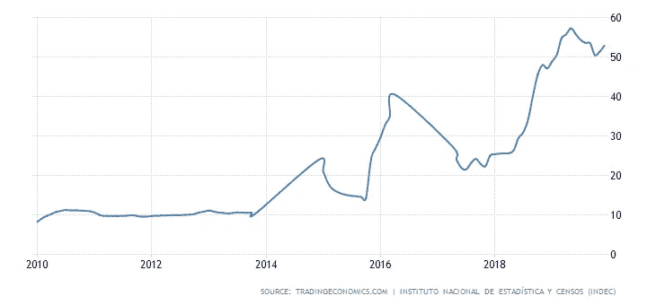
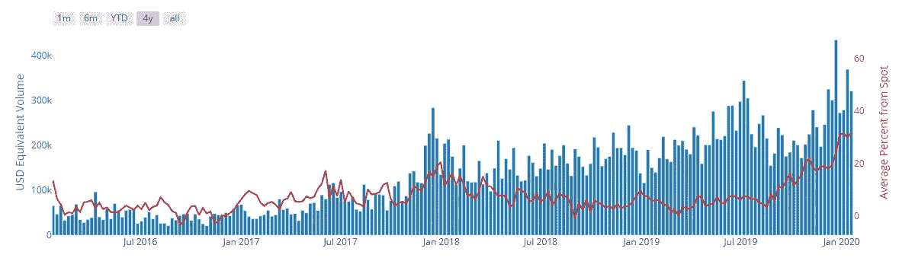
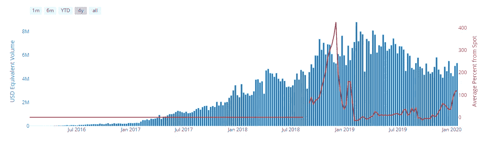
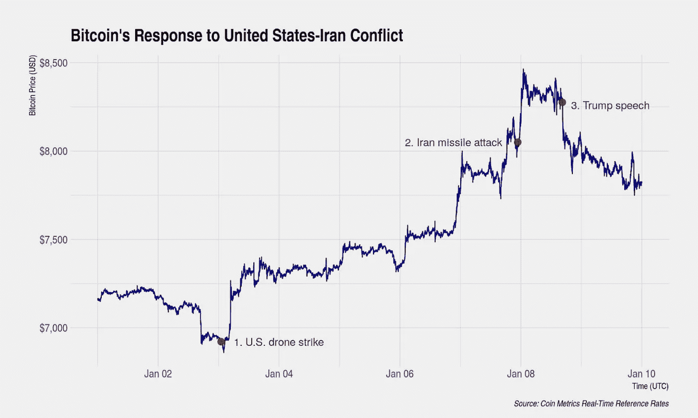
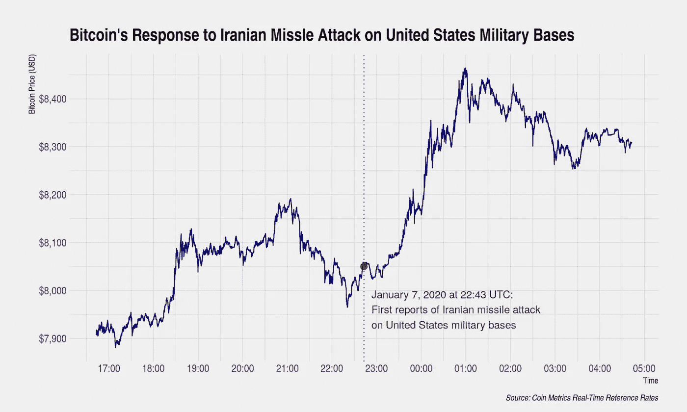
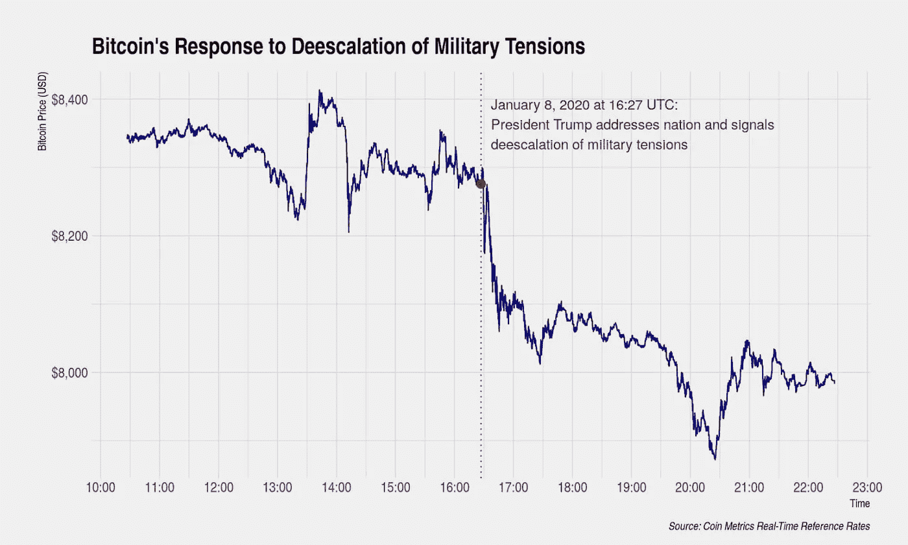

# 比特币:趁早不晚[第二部分]

> 原文：<https://medium.com/coinmonks/bitcoin-its-not-too-late-to-be-early-part-2-f70946f024b8?source=collection_archive---------0----------------------->

比特币的创新经常被与互联网的创新相提并论，它的前十年产生了一种常见的主流叙事:对这种很少使用、看似复杂、容易出现“泡沫”和性能困难的技术的广泛怀疑。听起来熟悉吗？互联网被忽视了——直到微软在 1995 年末声明它将成为“互联网的中坚力量”之前，没有任何公司对它给予任何有意义的支持。它还被极少数人使用(1995 年不到 1%的世界人口使用互联网，2000 年不到 7%的人使用互联网)，难以解释，尽管缓慢且昂贵，但仍然在世纪之交导致了规模近 7 万亿美元的资产泡沫。

这些相似之处都没有让比特币更有可能成功。但它们确实说明了两点，这两点应该提醒乐观主义者，也是批评者保持开放态度的理由:**现在为时不晚**和**范式转换创新的承诺在当前几乎总是没有得到充分重视**。

# 用户采用

根据 BitInfoCharts，持有 1 美元或以上比特币的地址总数现在约为 3000 万个。这个数字有一些警告，这一系列推文[强调了这一点](https://twitter.com/intangiblecoins/status/1202950870939422720?ref_src=twsrc%5Etfw%7Ctwcamp%5Etweetembed%7Ctwterm%5E1202950870939422720&ref_url=https%3A%2F%2Fwww.newsbtc.com%2F2019%2F12%2F06%2Fbitcoin-all-time-high-bottom%2F)，这使得拥有比特币的真实人数可能超过 3000 万。然而，即使在最乐观的情况下，目前也不太可能有 1%的世界人口(7500—8000 万人)拥有比特币。

[作为参考，当今世界近 60%的人口(45 亿人)是活跃的互联网用户。值得注意的是，Blockchain.com 有大约 4500 万钱包用户，尽管个人可以有多个比特币地址，据报道，比特币基地有超过 3000 万用户，尽管不一定都持有比特币。]

显然，广泛的用户采用仍在发展中。然而，有早期迹象表明比特币适合产品市场，特别是作为生活在压迫性政权或崩溃的中央银行系统下的个人的价值储存手段。这一点在拉丁美洲表现得最为明显，该地区有多种货币的价值在最近几年被摧毁，原因是管理不当(最好的情况)或恶意(最坏的情况)的央行政策导致了严重的恶性通货膨胀。

这一点在阿根廷最为明显:在过去十年中，通货膨胀率从 10%左右飙升至 50%以上，而阿根廷比索相对于美元已经贬值了近 94%。最糟糕的情况发生在过去两年——通胀率接近 3 倍——与此同时，尽管比特币现货价格下跌，加密市场看跌，但阿根廷本地比特币的周交易量以比索计算增长了约 6 倍，以美元计算增长了 2-3 倍。

或许更重要的是，对比特币等更稳定、更抗审查的资产的需求创造了一个卖方市场，过去四年比特币交易一直高于其现货价格，过去六个月更是如此。

Source: [UsefulTulips.org](https://www.usefultulips.org/)

委内瑞拉是另一个与恶性通货膨胀和国家货币贬值作斗争的国家，其信誉因 2017 年政治干预的看法而受到损害。自那以后，该国引入了一种新的机制来稳定比索，但信任需要多年来建立，也有瞬间失去的时候。因此，毫不奇怪，委内瑞拉在过去几年中通过本地比特币进行的交易量最大，每周比特币交易量超过 500 万美元，售价是比特币当前现货价格的两倍多。仅去年一年，超过 3 亿美元的比特币交易是通过委内瑞拉的本地比特币完成的。

Source: [UsefulTulips.org](https://www.usefultulips.org/)

早期采用比特币作为价值储存手段的另一个可能迹象是:阿根廷和哥伦比亚之间比特币活动的反比关系。如上所述，在阿根廷购买的比特币是通过支付溢价获得的——在这个市场上，需求大于供应。然而，哥伦比亚的情况正好相反:在过去两年中，通过本地比特币交易的比特币一直有 5-10%的折扣。那些最接近该地区的人指出，这是资产在公众眼中储存价值的证据——为了保护他们的美元财富，同时在委内瑞拉玻利瓦尔兑换时面临国内政府的审查，委内瑞拉人在本国购买比特币(推动需求上升)，然后跨境在哥伦比亚出售比特币(推动供应上升)。

最近，比特币的宏观案例在伊朗全面展示。在有报道称美国下令对伊朗少将、伊朗最有权势的人之一 Qasem Soleimani 实施无人机袭击后，比特币的价格明显上涨。不到一周后，当伊朗对伊拉克的一个美国基地发动报复性导弹袭击时，这一问题被进一步推高。然而，在报复性袭击的一天之内，地缘政治气氛转变为降级，比特币与黄金一道遭到抛售。在第二次升级(伊朗导弹袭击)和随后的降级(特朗普的讲话)之后，直到一个小时，比特币的反应就像人们预期的储值方式一样，也与黄金一致:随着地缘政治紧张局势和不确定性的上升，比特币的价格上涨；随着这些压力的减弱，价格上涨势头也有所降温。

尽管传统的价值存储采用通常以霍德林术语表示——钱包中持有的比特币数量长期保持不变——但拉丁美洲对价值的积极保护和伊朗对比特币(和黄金)的逃离同样重要。

虽然比特币作为价值储存手段显示出早期前景，但它作为交易媒介的使用案例仍处于基础阶段。虽然现在全球有超过 100，000 个组织接受比特币，但通过商家交易的价值仍然很低——在比特币区块链上交易的所有价值中，约有 1%来自经济活动。然而，有几个创业公司和项目希望利用比特币作为交易媒介的潜力——作为现金(可能是假币)和信用卡(可能存在欺诈性退款)的替代品——与商家和个人不愿使用比特币作为经济活动的促进者之间的差距。像 [lolli](https://www.lolli.com/) 、 [fold.app](https://foldapp.com/) 和 [Moon](https://paywithmoon.com/) 这样的公司要么充当比特币分销中心(通过比特币返还商户关系)，要么充当支付服务商(提高那些希望在线消费比特币的人的易用性)，扩大持有比特币的消费者可以与之互动的商户范围，而不一定要求商户自己接受比特币。

# 网络价值

虽然个人采用仍处于初级阶段，但比特币的网络价值已经超过 1500 亿美元——这只是黄金市场(8.5 万亿美元的约 2%)和菲亚特市场(30 万亿美元的约 0.4%)的一小部分。比特币前面的机会甚至比人们经常提到的 8.5 万亿美元的数字黄金潜在市场还要大。世界上很多地方都没有获得证券化黄金的监管渠道。考虑到世界上最稳定和最受欢迎的五种货币——美元、欧元、瑞士法郎、英镑和日元——只代表了世界上近 80 亿人口中的 10 亿人，今天的黄金市场可能只有不到 20%—25%的世界人口可以进入。比特币改善了黄金的货币属性，然后扩大了它可以触及的市场。如果比特币成功了，至少在中期内，它更有可能不会以黄金的市值为代价，而是作为黄金的补充和附加。假设采用率稳定，比特币将把价值市场的储存量扩大数万亿美元，如果不是目前规模的数倍的话。

> “黄金有 8 万亿美元的市值，但没有商家采用。那么，为什么主流媒体认为比特币只有在用于咖啡支付时才会有价值呢？”— Dan Held，Interchange 的联合创始人

如上所述，比特币作为交换媒介的用例更是未经证实。如果我们将成功定义为达到 50%的全球渗透率，考虑到该领域的主导市场领导者(黄金)的商户采用率为零，比特币可能通过一次使用、作为价值储存手段来实现这一点。但是比特币不仅仅是因为它是黄金的替代品而令人兴奋。这是令人兴奋的，因为它有潜力*变得更加*。它是否能抓住双方的重要部分——作为价值储存手段和支付选择——还有待观察，但如果它做到了，它无疑将成为一代人的决定性力量，并伴随它几十年的突出地位，就像之前的互联网一样。

*免责声明:观点仅代表我个人，并不代表 SVB 资本的观点。*

> [直接在您的收件箱中获得最佳软件交易](https://coincodecap.com/?utm_source=coinmonks)

