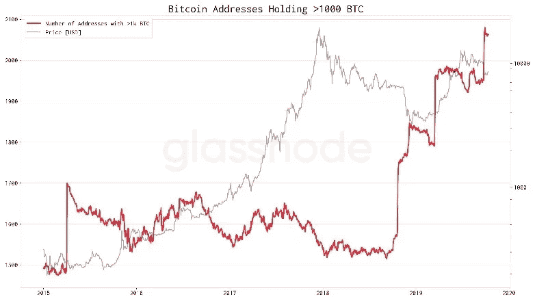
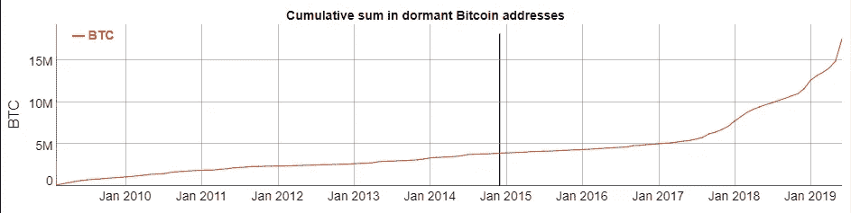
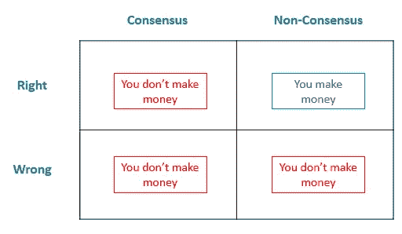

# 比特币:趁早不晚[第三部分]

> 原文：<https://medium.com/coinmonks/bitcoin-its-not-too-late-to-be-early-part-3-b32f2a9257ed?source=collection_archive---------2----------------------->

众所周知，比特币的固定供给曲线是理解其价值主张的核心。比特币的支持者经常指出，它的稀缺性是其价值主张的核心原则之一，推动其成为未来的货币。与央行控制的法定货币不受约束的性质相反，比特币将永远只存在 2100 万枚。2100 万这个数字的意义仅在于它是比特币协议发行时间表的一个输出。如果人们相信一项资产将保持或增加其价值，而该资产的发行利率正在下降或固定为零，那么对其未来的确信就是一场数学游戏:在经济力量推高价格之前，由此产生的供给只需要这么多需求。

> [发现并回顾最好的比特币软件](https://coincodecap.com)

经济理论的这一基本基石是比特币的组成部分，大约每四年比特币的整体回报减半时，这一点就会凸显出来。继 2009 年 1 月推出比特币协议后，比特币的总块奖励已经减半两次:第一次是在 2012 年 11 月，从 50 块降至 25 块；而最近一次是在 2016 年 7 月，从 25 到 12.5。前两次减半后的价格图表展示了经济理论付诸实践的力量。仅在每个减半日期之后的 12 个月内——2012 年 11 月 28 日和 2016 年 7 月 9 日——一个比特币的价格分别上涨了约 7，983%和约 300%，而每个减半事件之后的几年都导致比特币价格的年度低点更高。几乎没有证据质疑供应率减半对比特币价格的影响。

[供参考:在 2012 年减半后的一年里，一个比特币的价格从约 12 美元上涨至约 970 美元。在 2016 年减半后的一年里，一个比特币的价格上涨了约 650 美元，至约 2600 美元。]

对于早期比特币采用者和铁杆密码朋克来说，将比特币视为一种可投资资产的想法充其量是令人不安的；最糟糕的是，这证明了比特币未能保持其最初的精神特质。大多数其他人都会同意，比特币的金融化是一种不可避免的让步，让它能够实现其作为真正全球性、无政府货币的潜力。无论你原则上站在哪个立场，都很难否认对比特币的投资兴趣，特别是来自机构的投资兴趣，将为比特币和更广泛的加密网络空间带来前所未有的关注。无法否认的是，该资产类别的机构化正在到来(如果不是已经到来)，因为 2017 年牛市期间不可用的投资服务和工具已经进入市场，包括合格的托管解决方案；注册经纪交易商；以及结构性产品，如期货合同、波动性对冲和保险。

找出其需求的驱动因素对理解其潜力至关重要，投资界越来越有可能在个人使用的同时参与进来。随着上述个人采用率的增加——我预计这一数字将稳步增长，但需要几年时间——了解机构给市场带来的中期需求潜力非常重要。

简单来说，有三大投资集团推动着对可广泛获得的资产的需求:**散户**(个人)；**机构**(养老金、捐赠基金、基金会、家族理财室、投资基金、银行/保险公司)；以及**民族国家**(主权财富基金)。接下来的章节将会更深入地探讨这些比特币需求的来源。从投资的角度来看，很明显，机构可能在推动比特币的近期和中期需求方面发挥最大作用。

根据目前的排放速度，每日对比特币的需求需要达到或超过 1800 个比特币的价值，才能维持目前的价格。按照今天的价格(约 8500 美元)，这需要每天约 1500 万美元的购买需求，每月约 4 . 5 亿美元。假设比特币的价格在现在和减半事件之间停滞不前，**总奖励为每块 12.5 个比特币(每天 900 个)的第一天开采将只需要约 770 万美元的购买需求**；任何高于这个数字的价格都会随着需求超过新的供给而推高价格。(这是假设已经流通的比特币的买卖是净中性的。如果个人和机构将比特币作为一种值得长期持有的资产，那么缺乏卖方流通的比特币也会对价格产生积极影响，反之亦然。)

# 零售

散户投资者是被视为非专业投资者的个人，他们通过传统或在线经纪公司购买股票，通常通过比特币基地等主要交易所购买比特币，来买卖证券、共同基金或比特币。虽然零售市场的 it 投机者在 2017 年底零售驱动的泡沫之后基本上被“挖掘”，但现实是，我们最近刚刚超过了持有一定数量比特币的比特币地址数量的历史最高水平。(之前的高点是在 2017 年的巅峰。)我们显然还处于比特币采用曲线的早期，因为目前全世界只有不到 1%的人拥有比特币。冒着重复这一点的风险:**我们现在还很早**。

即便如此，有理由承认，大多数可能以今天的价格购买比特币**的散户投资者已经这样做了——新用户衡量的短期采用上升空间很小。到目前为止，[大约三分之二的钱包拥有价值不到 100 美元的比特币](https://bitinfocharts.com/top-100-richest-bitcoin-addresses.html)。尽管数量很少，但这一群体完全有可能继续积累，即使承认 2017 年让“零售”影响价格的市场动态(FOMO 推动的突然热情突然发生)不太可能重演。事实上，事后来看，个人投资者不太可能在很长一段时间内以显著的方式(相对于更广泛的市场)进入这个市场，他们对比特币近年来上涨的影响既是噪音，也是信号。**

然而，有两个零售投资来源可以合理地被视为未来几个月和几年个人投资的“地板”，并支持一小群个人主导零售需求的观点:Square 的现金应用程序和灰度比特币信托。(需要说明的是，灰度比特币信托最初是一种私募、以机构为重点的工具，但在 2019 年获得了 FINRA 的批准，并公开上市，可用于某些个人退休账户、罗斯个人退休账户、经纪账户和投资者账户的零售投资。)

2019 年第三季度，Square 的现金应用程序从比特币购买中获得了 1.48 亿美元的收入。假设平均交易费为 1.75%，所有交易中有三分之二是购买(剩下的三分之一是销售)，Square 的现金应用程序产生了需求净盈余，相当于平均每天超过 3000 万美元*。自 2017 年 11 月 Square Cash 应用团队推出比特币交易所以来，比特币交易的收入大幅增长:从 2018 年 Q1 的约 3400 万美元到 2019 年第三季度的约 1.48 亿美元，在不到两年的时间里实现了大幅增长(> 4 倍)。2018 年通过 Square 的 Cash 应用程序进行的比特币交易总额产生了约 1.67 亿美元的收入(交易的比特币价值约为 90 亿美元)；在 2019 年前三个季度，这一数字为 3.39 亿美元(交易额约为 190 亿美元)。截至 2019 年第三季度，比特币收入现在占所有现金应用收入的近一半。更令人印象深刻的是，对于一家估值 300 亿美元的上市公司来说，比特币交易收入已经占到总收入的近 12%。最近几天，Square 甚至获得了一项专利，详细说明了一个支付系统，该系统将使用户能够参与无缝的加密到菲亚特交易。考虑到他最近在[宣布](https://twitter.com/jack/status/1204766078468911106?ref_src=twsrc%5Etfw%7Ctwcamp%5Etweetembed%7Ctwterm%5E1204766078468911106&ref_url=https%3A%2F%2Fu.today%2Fdecentralized-twitter-jack-dorsey-introduces-bluesky)启动 [@bluesky](https://twitter.com/bluesky) ，杰克·多西正在为两家公司做着其他 CEO 很少能为一家公司做的事情:无缝整合去中心化技术，为未来定位 Web 2.0 业务。

让我们来看一下这个计算，因为它很重要，而且令人大开眼界。Square Cash 应用程序产生了 1.48 亿美元的收入，这意味着通过该应用程序交易的比特币实际交易量远高于此。Square 以前通过加价向用户收取“费用”;2019 年 11 月，Square 决定将费用从价差中分离出来，以提供更大的透明度。“打新”费用为 1.75%。因为 Cash App 可能会在买卖交易之外的服务上产生比特币相关的收入，所以上面使用的假设是之前的费用(计入价差)接近 1.75%。假设 1.48 亿美元的收入来自 1.75%的手续费，那么这相当于上述期间交易的比特币价值约为 85 亿美元。假设三分之二的交易是购买，三分之一是销售，这导致该季度的净需求约为 28 亿美元，分为 2019 年第三季度的 92 天。不可否认，三分之二到三分之一的买入卖出偏差是一个手指波计算，假设 Square 的比特币交易现金应用的用户(1)更有可能对比特币的未来持乐观态度(因此更有可能买入而非卖出)；以及(2)一般不使用该应用进行交易(再次导致用户更倾向于购买并持有而不是出售)。]

出于零售比特币需求的目的，并使用上述假设，Square 的现金应用程序在 2019 年第三季度提供了 3000 万美元的净平均日需求(“nADD”)，同时环比增长 18%。假设从 2019 年第三季度到 2020 年日历年，Square 的用户将在 2020 年上半年占 nADD 的约 3500 万至 4000 万美元(几乎所有这些都将在减半之前实现)，在 2020 年下半年占 nADD 的 4500 万至 5000 万美元。**在价格减半后，维持 8500 美元价格水平所需的日均需求的五倍以上将来自 Square 的现金应用**，不涉及比特币基地、币安、央行或生活在通胀制度下的公民(假设美国能在未来几个月避免这种区别)。

第二个需要了解的重要零售需求是灰度的首款比特币产品灰度比特币信托(“GBTC”)。2019 年第四季度，GBTC 的资金流入量为 1.94 亿美元，是该产品六年历史上最大的季度流入量，超过了上一季度的纪录(1.72 亿美元)，同比增长约 9 倍。季度资金流入为 210 万美元。即使考虑到 GBTC 在 2019 年 5 月和 6 月都对资金流入关闭，该基金在 2019 年仍看到资金流入大幅持续增长:Q1 4200 万美元；Q2 6400 万美元(基本上是一个月)；第三季度 1.72 亿美元；第四季度为 1.94 亿美元。根据 Square 的 Cash 应用程序，应用 2020 年全年 15%的季度增长的相对保守的预期，会导致超过 11 亿美元的额外流入 GBTC 产品，为减半前后的平均每日需求提供另外数百万美元。

*【robin hood，一家迎来免佣金交易时代的高增长创业公司，也为个人投资者提供加密货币交易功能。在发布之前，Robinhood 建立了一个超过 100 万人的等候名单；该公司的加密货币产品(比特币等)现已在 46 个州推出。然而，Robinhood 没有公开报告他们加密货币产品需求的统计数据，因此这里的假设是该公司对比特币的零售需求为零。这种方法可能是保守的。]*

零售仍然是一个重要的相对未开发的市场(当展望未来和超越当前用户时)，即使它可能是比特币需求的补充，而不是大规模采用前的驱动力。仅在美国，就有超过 5000 万家庭是股票市场的某种散户投资者，而全球另有约 4 亿家庭拥有某种类型的投资产品，这表明如果比特币作为投资的论点在美国和国际上扩展，将会出现巨大的机会。

# 机构

全球资本市场由机构参与者主导——作为代理，机构拥有大型上市美国公司约 80%的股票市值。其中最大的群体——养老金和退休基金——已经发展到管理将近 35 万亿美元的资产，超过了所有其他主要机构投资者群体的总和(约 25 万亿美元)，不包括中央政府(约 75 万亿美元)和资产管理公司(约 100 万亿美元)。必须指出的是，这些数字是如此之大，它们是形象化的(也许是字面上的)不可能想象或完全理解的。这是 235 万亿美元打出来的样子:2350 亿美元。

虽然比特币迄今为止的反弹被誉为由散户推动的，早期采用者在社交媒体上描绘了邀请机构加入他们的合唱，但事实是，散户投资者在 2017 年底达到峰值之前的影响可能被夸大了，自那以来进入市场的机构的影响继续被低估。

对于最早的采用者来说，比特币是个人先于机构进入市场的首批资产类别之一。然而，对于几乎所有(未来的)散户投资者来说，比特币正在遵循一个类似的脚本:大型机构——养老基金、捐赠基金、家族理财室和投资基金——正在抢先一步。来自 [Glassnode](https://twitter.com/glassnode) (下图)的链上研究支持这样一种观点，即大型玩家在 2018 年末和 2019 年的大部分时间里积累比特币，而[持有的比特币比以往任何时候都多](https://bitinfocharts.com/top-100-dormant_5y-bitcoin-addresses.html)，而不是交易或交易的。比特币的信徒和媒体一直在等待并敦促机构投资者进入市场；势头似乎正悄悄地朝着那个方向转移。**起初缓慢，后来突然。**

Source: [BitInfo Charts](https://bitinfocharts.com/top-100-dormant_5y-bitcoin-addresses.html)

## 养老金和退休基金

作为最大的机构投资者群体，养老金和退休基金对于理解资本市场流动非常重要。因此，任何值得投资的传统资产在某种程度上都属于这些基金。举个例子:截至最近的 13F 文件，美国最大的养老基金 CalPERS 持有价值约 50 亿美元的微软和苹果股票。

养老基金对资本市场(以及比特币的潜在需求，我们将很快讨论)同样重要，因为在当今负收益率的债务环境下，养老基金发现自己处于令人担忧的境地:它们资金不足，5—10 万亿美元中有 2 万亿美元。低波动性债券(目前为负收益率)的收入潜力不足，导致养老基金资金进入风险市场(股票、低质量信贷)，并迫使它们将储蓄过度暴露于股市，以寻求收益率。明确地说，2 万亿美元的资金不足承诺是假设养老基金能够实现 7%—8%的年回报率——有效地实现了目标，但没有表现突出——任何低于这一水平的承诺只会扩大差距。

> “我认为，很有可能在未来几年的某个时候，(1)当经济疲软时，央行将耗尽刺激市场和经济的手段，以及(2)将有大量债务和非债务负债越来越多地到期，无法用资产融资。”— [雷伊·达里奥](https://medium.com/u/a29615f64d53?source=post_page-----b32f2a9257ed--------------------------------)

这些基金现在依赖于股票和公司债券市场的良好表现，这种情况在历史上是没有先例的。有鉴于此，不难看出，作为一种高上行、潜在不相关的资产，比特币在养老金投资组合中所扮演的角色，即便只占很小的比例。

从比特币的角度来看，在一年的时间里，每只养老基金每天执行 25 个基点的分配，将导致约 750 亿美元进入当前市值约 1500 亿美元的资产。如果在接下来的一年里每天从养老基金投资组合中分配等量的资金(暂时排除明显的价格影响)，那么每天将为一项资产提供超过 2 亿美元的需求，而在不到六个月的时间里，这项资产每天维持价格所需的需求将从大约 1500 万美元下降到不到 800 万美元。养老金规模的警告——这些基金不可能在不大幅升值的情况下购买价值 750 亿美元的比特币——正是这一点:相对于那些有动力提供比特币的人的支票簿，比特币的需求微乎其微。

即使只有少数中等规模的养老基金(资产总计约 1 万亿美元)批准了这 25 个基点的分配，这些基金也可以提供当今大宗奖励所需需求的一半以上，并在 2020 年年中比特币发行减半时提供需求盈余。

这在理论上听起来很棒，但也有一些愤世嫉俗的理由(至少在中短期内):养老基金今天不一定会关注比特币(他们管理着有限资源和全球跨资产类别范围的大量预算)，并期望大型官僚投资团队在比特币(或任何加密资产)可能是傻瓜的黄金一样新生、被误解和技术性的资产中建立信念，至少在短期内。(愚人黄金和比特币是一个等待发生的双关语。养老基金等大型机构很少会率先投资于新的投资策略或技术，因为在处理退休基金时，人们有一种(理所当然的)规避风险的倾向。此外，就目前情况而言，比特币不太可能在重大市场调整期间升值(至少在最初，因为目前的假设是，比特币仍被视为一种“有风险”的资产)。

## 家族办公室

另一个大型投资者群体——家族理财室——出于不同的原因与比特币相关。尽管 AUM 养老基金管理的庞大规模有效地确保了指数镜像投资组合的构建，但家族理财室在构建投资组合时可以有更多的自由。家族理财室管理的资本较少受制于具体的支付义务(尽管这些义务在一定程度上仍然存在)，为投资于高风险、高回报的策略(信贷、新技术)提供了更大的灵活性。此外，重要的是要记住，这些基金的资产可能是从反向观点中诞生的:巨大的价值创造(导致创建家族办公室结构的那种)来自于非常正确，而且可能非常反向。这不仅是一种更有利于对新资产采取更积极主动的方法的结构，也是一种由有经验的人拥有的结构，他们看到了永远不会成功的事情。这应该是最早接触新技术、最能接受新资产类别(如比特币)的机构资本类型。

尽管如此，大多数家族理财室仍坚持投资组合构建趋势，与养老金、捐赠基金和基金会团队中的同行保持一致。正因为如此，家族理财室因其对传统资产类别的敞口而面临类似的风险。

考虑到这些投资者的性质以及他们日益增强的(感知的)风险承受能力，有理由将家族理财室管理下的 6 万亿美元资产视为进入其他机构投资者群体的门户。假设由一小群亿万富翁科技创始人领导的家族理财室在 365 天的时间内将同样的 25 个基点分配投资于比特币，**仅家族理财室在此期间对比特币的每日需求就将超过 4000 万美元**。

愤世嫉俗者:家族理财室可能更愿意投资于风险更高的资产，但尽管他们更愿意将财富复利化，但维持账户余额，而不是过度暴露于风险之中，可能也是可以接受的；相对于养老基金和捐赠基金，家族理财室没有支付义务，依赖性也要小得多(少了数百万或数十亿)。因此，以比特币的形式承担额外“风险”的价值主张被削弱了。同样值得一提的是，大多数家族理财室并非建立在科技财富之上，因此可能不太倾向于看到科技产品的全球潜力。

## 捐赠和基金会

捐赠基金和基金会是一群投资者，负责超过 2 万亿美元的资产，通常是养老金和家族理财室的混合体:像家族理财室一样，较小的资本基础为反向投资风格提供了更大的灵活性；像养老基金一样，奖学金和研究基金的核心目的要求对波动性(以及随之而来的短期现金流风险)进行深思熟虑。

这个群体在机构投资者市场中确实占据着独特的地位:它被誉为投资组合管理的先驱和现代化者，为其群体中最大的成员提供了影响其他机构的机会。相关说明:在过去的两年里，捐赠基金和基金会已经开始投资更广泛的加密资产类别。其中大多数是通过对加密基金的承诺(如 [a16z Crypto](https://a16z.com/crypto/) )，但也有一些头条新闻事件，包括哈佛管理公司在 2019 年直接投资 Blockstack 的代币销售。众所周知，许多较小的捐赠基金和基金会期待他们的大型同行发出信号——随着哈佛、耶鲁和其他人在加密领域投入时间，其他人将感到有能力自学，并可能将一小部分投资组合投资于加密产品(其中大部分围绕比特币)。养老基金和家族理财基金也希望这些投资者能够理解同行的动态策略。

仅哈佛捐赠基金的一小笔拨款就可以提供数百万美元的比特币日均需求。如果其他公司效仿，这个数字可能会成倍增长。

愤世嫉俗者:捐赠基金和基金会面临着与前两类类似的障碍，最明显的是合法性信念:比特币和其他加密网络是值得研究和投资的资产(必要时有合法的服务和程序来促进行动)。同样，尽管有新的产品(来自[比特币基地](https://custody.coinbase.com/)、[安克雷奇](https://anchorage.com/)和[富达](https://www.fidelitydigitalassets.com/overview)的机构托管解决方案)；现金和实物结算的比特币期货来自 [CME Group](https://www.cmegroup.com/trading/equity-index/us-index/bitcoin_quotes_globex.html) 和 [Bakkt](https://www.bakkt.com/index) ，这不会在一夜之间发生。

## 其他人

对本次讨论具有重要意义的其他机构投资者包括另类资产基金(对冲基金、私募股权、风险资本和加密专用基金)。总体而言，这一群体拥有近 10 万亿美元的资产。尽管比特币的波动性(和市场低效率)与对冲基金的商业模式非常契合，但其创新的早期阶段和技术性质使其非常适合长期导向的风险投资者。这两个群体都对比特币表现出越来越大的兴趣(在某些情况下，还表现出越来越大的参与度)，尽管还没有达到可以提供上述投资者群体影响力的水平。那些最接近加密创新生态系统的人——加密基金，在私人(风险投资)和公共(对冲基金)市场的交叉点上运作——仍在建立他们的资金池(目前总资产约为 200 亿美元)，并经常专注于寻找新的衍生创新，而不是简单地购买比特币。

## （被突出宣传的）明星或大人物

资产管理公司(银行、保险公司；～100 万亿美元)、中央政府(～75 万亿美元)和主权财富基金(～8 万亿美元)占据了另外近-200 万亿美元的资产。当然，如果我们到了公司银行、中央银行和民族国家正在积累比特币(或将其作为全球资产接受)的地步，上面的大部分分析都将是微不足道的。这种接受将标志着个人和政府如何看待货币的不可逆转的转变，很可能彻底改变寡头金融机构和国家管理机构的角色。这将标志着金融范式的转变，为货币(和信息)可以归个人所有的观点带来广泛的合法性。

免责声明:观点仅代表我个人，并不代表 SVB 资本的观点。

> [在您的收件箱中直接获得最佳软件交易](https://coincodecap.com/?utm_source=coinmonks)

