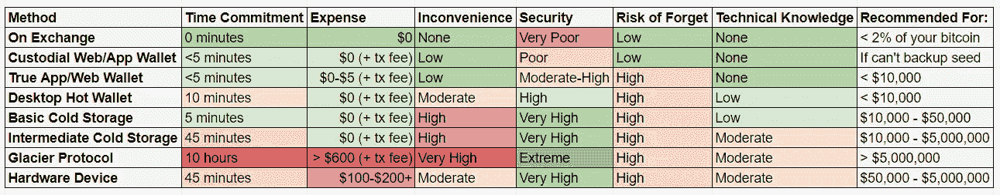

# 比特币密钥及其存储方式

> 原文：<https://medium.com/coinmonks/bitcoin-keys-and-how-to-store-them-1238a1d9ba0a?source=collection_archive---------1----------------------->

最近我和一群人谈论比特币，密钥存储成为话题。一位业内专业人士提到，一家大型交易所的安全主管教他将密钥分成三份，并将这三份分别存放在不同的地方。这是储存你的比特币的最好方法吗？

这让我开始思考。有很多不同的方法来保护你的密钥安全，其中许多方法都有风险，加密货币的新手可能不会完全意识到这一点。

如果你只是想要推荐，点击[这里](/p/1238a1d9ba0a#9bdf)跳到那个部分。如需查看选项对比，请点击[此处](/p/1238a1d9ba0a#3449)。

*2021 年 1 月 19 日更新:“高级冷藏”一节最初描述了一种通用的高级冷藏发电方法。冰川协议取代了它作为一个更彻底的研究和有效的先进冷藏方法。*

*免责声明:本人持有比特币和多个 altcoins。这篇文章不是由任何人赞助的。内容完全基于我自己的研究和观点。如果你储存了大量的资金，一定要从多个渠道获取建议；本文仅作为一般建议。*

# 什么是钥匙，为什么需要保管好它？

比特币使用密码术来证明所有权和安全交易。现存比特币的每一部分都被分配给一个私钥。私钥是一个 256 位的数字，通常由 64 个字符(0–9 和 A-F)表示。私钥通常源自种子，种子也是很长的数字，但通常表示为 12-24 个字，以帮助人们阅读和备份。当你第一次收到比特币时，你需要设置一个钱包，并被要求备份你的种子(种子短语、主种子、私钥、恢复短语——所有这些对我们来说都是等效的),通常为 24 个单词。如果你有一个存储比特币的硬件设备，它实际上只是一个安全的外壳，用于保护这 24 个字不被泄露到网上或计算机病毒。你的恢复短语就是你的种子，把它放进软件钱包，你就能获得同样的比特币。

那么比特币种子有多安全呢？如果这一句话是我安全的全部依靠，它最好是安全的。

是的，这些种子提供了坚实的保护。

密码学家使用“安全位”作为对密码方案进行暴力攻击(随机猜测，直到找到正确答案)的难度的粗略指示。64 位安全意味着攻击者必须尝试大约 2⁶⁴种不同的种子，才能找到正确的种子。128 位安全被广泛认为是 2020-2030 年的最低要求，256 位被推荐用于 2030 年以后的任何应用。因为这些位对攻击者来说是最坏的情况，而攻击者通常有办法稍微减少它，所以安全性需要远远领先于当前实现的黑客攻击。[这个堆栈交换答案](https://crypto.stackexchange.com/a/63537)给出了一个世界超级计算机遭受攻击需要多长时间的想法。基本上，一台像样的家用电脑可以在一小时内破解 50 位，任何低于 70 位的安全问题都可以在一天内被一台超级计算机破解，而世界上的计算资源可能在一年内破解 100 位。如果大规模计算资源可能破解你的密钥看起来不可信，考虑多重碰撞攻击；有人可以在一台超级计算机上用一天时间破解每一个不到 70 位安全的比特币地址，大约相当于破解一个安全的比特币地址所需的时间。你真的不想使用小于 100 位的任何东西，因为记住，这是最好的情况。

比特币种子是 256 位的熵，使用椭圆曲线加密法编码。这大约有 128 位的安全性。太好了！它是安全的…当攻击者对你的密钥一无所知时。如果攻击者知道 24 字密钥的前三分之一，即 8 个字，未知位仅代表 85 位安全。如果他们知道你密钥的一半，未知的那一半只代表 64 位安全。很明显，如果你想保证比特币的安全，保持整个密钥的秘密非常重要。

如果我失去了我的种子怎么办？

你的比特币不是储存在你的钱包里，无论是硬件还是软件。你的比特币存储在账本上，你的种子提供所有权级别的访问权限。这提供了一种直观的方式来理解为什么备份您的种子而不与任何人共享它如此重要:

*   如果你失去了你的种子和访问任何已经用它“登录”的钱包，没有人能找回你的比特币。没有人。没有“忘记密码”链接或恢复工具。它不见了。
*   如果你和任何人分享你的种子，他们现在和你一样拥有你的比特币。你实际上已经和他们开了一个只需要一个签名的联合银行账户，除非你把所有的比特币转移到一个新账户，否则没有办法把他们从账户中移除。

现在我们知道了为什么不与任何人分享你的种子如此重要，我们可以回顾一下储存你的比特币的一些常见方法以及每种方法的优缺点。

# 在交易所储存比特币

你买了你的第一个比特币，并在交易所交易。把它转移到你自己的钱包里要花一大笔交易费，而且这听起来很复杂。把它放在现有的交易所里要便宜得多，也简单得多，对吧？

当然，但是它不安全。交易所是存储加密货币最不安全的地方。当你购买比特币时，你应该立即将它从交易所转移到你自己的账户中。

在交易所存储比特币的优势:

*   快速获得您的资金。
*   不需要支付交易费或提现费。
*   简单。
*   几乎不需要担心失去你的种子。

在交易所存储比特币的缺点:

*   不是你的钥匙，不是你的硬币。这句话你可能听过很多，但是怎么说都不够。谁控制了我们之前说的种子，就全世界而言，谁就是你比特币的主人，他们随时可以决定把你锁在外面。加密货币是如此之新且不受监管，以至于交易所实际上经常窃取客户资金并退出骗局。
*   许多交易所使用部分储备系统，这意味着他们甚至不会保留你所有的比特币，只会保留一部分。如果每个人都试图从交易所提取比特币，交易所将无法支付。
*   交易所经常被黑。每年有数亿美元的加密货币从主要交易所被盗。有些交易所能够收回大部分资金，有些则不能。遭到黑客攻击后，你可能再也看不到你储存在交易所的任何比特币。
*   如果你的电子邮件被黑或身份被盗，你的比特币也可能受到威胁。

不要把你的比特币放在交易所里。

再者，有些“交易所”根本不允许你取款。在撰写本文时，这包括 PayPal 和 Wealthsimple 以及其他可能的公司。我不建议在这样的平台上购买加密货币，因为没有办法获得你的硬币的所有权或确定“交易所”是否真的为你持有它们。据称，一些交易所根本不代表他们的客户持有一些硬币(如 Crypto.com 持有除比特币、以太币、莱特币、比特币现金和 XRP 以外的所有硬币)。

太好了。但是在哪里？怎么会？我如何保证我的种子安全？

第一种选择是纸质钱包。还记得我说过你的比特币存储在账本上，你的种子提供所有权级别的访问权限吗？如果你只是写下一个随机的种子，做一些数学计算来找出它的公共地址，并把它也写下来，你就创造了一个纸钱包。为了确保正确计算并获得真正随机的种子，您可以并且通常应该使用为此目的而设计的应用程序。我没有推荐任何具体的来源，但是这个网站和 T2 这个网站看起来都有很好的声誉，使用起来也很简单。(对那些只推荐某个特定来源加密的东西的人要持保留态度)你应该意识到纸质钱包对用户来说并不友好，第一次你想花你的比特币时，你需要把它导入钱包，这很可能会损害离线安全性。纸质钱包非常安全，但不适合频繁使用；它们是长期持有的。

纸质钱包的首要任务是确保你不会丢失它。制作多份副本，并将它们存储在独立、安全的位置。也可以考虑为此目的设计一个金属备份；一些备份是防火和防腐蚀的，或者提供其他奇特的功能。

# 基本冷藏

要生成具有合理安全性的纸质钱包，请访问生成器网站。让网站加载，然后关闭电脑的互联网连接，等待几秒钟。来回晃动鼠标，直到填满熵条。它将从你的鼠标移动中生成一个随机种子，为它制作一个二维码，计算公共地址，并为此制作一个二维码。打印结果页面， [**清除浏览器缓存**](https://support.google.com/accounts/answer/32050?co=GENIE.Platform%3DDesktop&hl=en) ，然后重新打开计算机的互联网。如果你这样做了，只要你的电脑没有病毒，你就能确保你的纸钱包是“离线生成”的，从未接触过互联网。这是最简单的“冷藏”方法，也是我推荐采取的最少措施，所以我们称之为基本冷藏。对于数量非常大、甚至改变生活的比特币来说，基本的冷藏可能没问题，但如果你有技术知识和时间，我还是推荐中级冷藏。请注意，冷藏会带来丢失钥匙的巨大风险，这一点不应该被低估或忽视。

# 中间冷藏

为了在 windows 上更安全地生成纸钱包，而不需要一台有气隙的计算机，通过右键单击并保存来下载网站的 HTML，重新启动计算机进入[安全模式](https://www.howtogeek.com/howto/windows-vista/force-windows-to-boot-into-safe-mode-without-using-the-f8-key/#:~:text=Pressing%20the%20F8%20key%20at,several%20times%20in%20a%20row.)(没有联网)或使用 [Linux 引导驱动器](https://opensource.com/article/20/4/first-linux-computer)，打开你下载的网页并生成你的密钥，然后删除临时文件并进行[计算机刷新](https://support.microsoft.com/en-us/windows/how-to-refresh-reset-or-restore-your-pc-51391d9a-eb0a-84a7-69e4-c2c1fbceb8dd#:~:text=To%20refresh%20your%20PC&text=(If%20you're%20using%20a,tap%20or%20click%20Get%20started.)。您应该验证您使用的密钥生成程序的源代码，例如这里的[这里的](https://github.com/pointbiz/bitaddress.org)或[这里的](https://github.com/koraylinux/paper-wallet)。如果你事先在电脑上安装了最新的防病毒软件，你通常可以相信这种方法，因为比特币的数量会改变你的生活。我们称之为中间冷库。请注意，冷藏会带来丢失钥匙的巨大风险，这一点不应该被低估或忽视。

# 高级冷藏(冰川)

在没有高级编程知识的情况下，您可以在家中实现最高级别的冷钱包安全性，这需要更多的时间和不便。有一个名为 [Glacier](https://github.com/GlacierProtocol/GlacierProtocol) 的特定协议，它是为安全存储大量比特币和消除单点故障而开发的。如果你想要最大程度的安全，请严格遵守。我建议考虑的唯一捷径是使用一套隔离硬件，而不是两套。时间承诺:至少 8 小时，可能 10 小时。在实践中，Glacier 是一个比许多真实的交易所和保管钱包所采取的措施更广泛和彻底的协议；该行业的巨头们依靠他们冰冷的钱包安全来换取价值数亿美元的加密货币。请注意，冷藏会带来丢失钥匙的巨大风险，这一点不应该被低估或忽视。假设您亲自检查或不使用 Glacier 脚本，Glacier 比硬件钱包(如下)更安全，因为它更彻底地考虑了包括社会工程和胁迫在内的其他攻击媒介。请注意，冷藏会带来丢失钥匙的巨大风险，这一点不应该被低估或忽视。

我会提供一个冰川的替代方案，但是我找到的最好的替代方案，[地狱犬](https://github.com/Clavestone/Cerberus)，没有达到同样的彻底性。

顺便说一下，如果你是一家企业或持有数千枚比特币，冰川应该是它的起点，而不是终点。但是在这一点上，你真的不应该接受互联网上一个匿名人士的关键安全建议。

如果连基本的纸钱包听起来都太不方便。没事的。有更友好的选择。

# 网络/应用钱包和桌面钱包

存储比特币的手机应用和网站比在交易所存储比特币进步了一大步。它们通常很容易使用，也不是很不方便。非托管钱包也提供了一个非常大的安全跳跃，将你的比特币储存在交易所。一定要备份你的种子，因为不像密码，如果它丢失了绝对没有办法恢复。这意味着，如果你的手机被封了或被偷了，你的孩子把它扔进了厕所，你重新格式化了你的电脑，或者你忘记了加密密码**如果你没有在其他地方备份比特币，你就没有办法拿回它。**

有各种各样的应用程序可以存储你的比特币。

第一类选择是保管钱包，如 freewallet.org。这些就像交易所如何储存你的比特币；不是你有钥匙，而是他们有钥匙，你通过他们的网站或应用程序有一个登录用户名和密码。保管钱包的好处很少，风险与交易所相同，尽管它们通常在如何保管你的资金方面有更多的审计和/或透明度。我不推荐给任何人保管钱包，除非你，在你自己的个人评估中，认为你不能保证你的种子安全。记住这句格言，不是你的钥匙不是你的密码。

第二类选择是非保管钱包，也经常被称为软件钱包或热钱包。其中一些比其他的更有声望。有些是开源的，有些不是。有些有很棒很时尚的界面，有些没有。有的只存储一种加密货币，有的可以存储上百种不同的加密货币。它们的设置很简单——只需下载手机上的应用程序或电脑上的程序，或者导航到一个网站，写下你的种子，然后点击几下就可以存入一些比特币。与将硬币留在交易所或保管钱包相比，这些应用在安全性上迈出了一大步，只要你安全地备份种子并选择一个有信誉的应用，这些应用就很棒。桌面应用程序通常比手机和网络应用程序提供更好的安全性，因为它们通常受到更多的审查，并且构建的准确性更容易验证，但这并不是一个非常大的差异。Web 应用程序在接受审查的级别上与桌面应用程序相当，但每次加载网站时可能会运行不同的代码，并且更有可能因为这样或那样的原因需要重新输入种子，因此总体上也比桌面应用程序稍不安全。知名的手机应用程序、网络应用程序和桌面应用程序，统称为软件钱包，是大多数人应该以最少的麻烦和体面的安全性保存比特币的地方。

我不推荐流行的软件钱包，但似乎是有信誉的选择，包括:

出埃及记(Exodus)—一款流行的安卓、苹果商店和桌面应用

[比特币基地钱包](https://apps.apple.com/ca/app/coinbase-wallet/id1278383455)——一个流行的苹果商店应用程序(不同于比特币基地交易所)

[菌丝体](https://wallet.mycelium.com/) —一款流行的共享源码安卓应用

一个古老而流行的免费软件桌面应用

共享源代码意味着你可以阅读完整的源代码并自己编译，但是许可证不允许你自己修改和分发。自由软件意味着你可以阅读和贡献完整的源代码，也可以修改和分发它。开源是一个不精确的术语，可以指从自由软件到共享源代码的任何东西，所以为了清楚起见，我在这里避免使用它。我在本文的其他地方使用它来表示至少是共享源代码的软件。

# 硬件钱包

最后一个选择是硬件钱包，这也是长期持有大量比特币的人最常推荐的选择。这些小型计算机可以安全地存储您的种子，并允许您离线签署交易，而无需将您的种子暴露在互联网上。它们有些不方便，而且你仍然需要绝对确保你备份了你的种子，但是它们比纸钱包更容易使用。它们通常也要 100-200 美元。我并不推荐流行的硬件钱包，但它们似乎是不错的选择，包括:

[Coldcard](https://coldcardwallet.com/) —一款历史悠久、声誉卓著的纯比特币硬件钱包，拥有许多先进的安全功能

[tre zor](https://trezor.io/)——兼容多种加密货币的硬件钱包

# 比较

下面的图表比较了上面讨论的每个存储选项，以及我建议何时使用它们。

Comparison of cryptocurrency storage methods. Time commitment refers to initial set-up time, while inconvenience refers to ongoing inconvenience of using this storage method.

正如你所看到的，我推荐应用程序/桌面/网络钱包来存储价值低于 10，000 美元的硬币，纸质钱包或硬件设备可以存储更多的硬币。我将硬件设备标记为不如 Glacier 安全，因为有几个基于社会工程和胁迫的攻击载体 Glacier 缓解了硬件设备不考虑的问题。

还要注意，在“遗忘风险”上没有妥协，即由于备份被破坏、不准确或不可访问而无法访问种子的风险。要么是因为你把你的硬币存放在一个有“重设密码”链接的交易所或保管钱包里，要么是因为你的硬币确实是你自己的，所以它很低。这是加密货币最大的学习曲线，有很多恐怖的故事，即使是技术高超的人也无法获得他们的种子。如果你使用上面列表中的方法，至少具有“高”安全性，**你很可能会失去你的种子，而不是你的种子会受到损害**。因此，备份的重要性怎么强调都不为过。

# 备份。数量、地点和方式？

通常，一个好的基准是您应该在一个安全的地方有一个完整的未加密的种子备份。

许多人更喜欢数字备份，将他们的种子存储在云存储提供商的加密文件中，或者更鲁莽的是，只存储在他们的本地计算机上。这不是最佳实践，但却是一种选择。如果你选择以数字方式存储你的种子，它应该总是用高度安全的密码加密…不幸的是，这很难记住。这就是问题所在，即使是非常细心和精通技术的人也会忘记他们的加密密码，就像种子本身一样，无法重置。总的来说，加密云备份理论上是一种防止破坏的好方法，但它只是将风险转移到了记住一个唯一的、强有力的、无法重置的密码上。

出于类似的原因，以任何方式对纸质备份进行编码都不是最佳做法；你可以忘记编码，甚至突然死亡，你的继承人将永远无法获得你的比特币财富。最佳做法是备份应该以纯文本形式离线进行。

保留多个备份。如果发生室内火灾会发生什么？如果你的律师错放了你委托给他们的信封怎么办？如果你储存了大量的比特币，银行保险箱是一个不错的选择。然而，保管箱的年费很可能会让那些金额适中的持有者望而却步。

如果你想增加安全性，并且不想让任何发现你的备份的人能够窃取你的资金，考虑一个 multisig 账户。多签名账户需要不止一个私钥来转移资金。您可以设置两个或三个、三个或五个、四个或七个 multisig 账户，需要使用两个、三个或四个不同的密钥来转账。这些特定的配置还提供了冗余，让您可以分别丢失一个、两个或三个密钥。一个高度安全的 multisig 备份实际上就像把七把钥匙作为“非常重要的信封”交给七个亲密的朋友或家庭成员来保管一样简单。如果你想转账，找其中四个要回信封。他们中没有一个人，甚至三个人一起工作，可以转移你的资金。没有一个人，甚至三个，丢失信封会使你的资金永远无法使用。

有时，人们建议将你的密钥分割成多个块，作为一个“更简单”的多重签名。然而，正如我们在*中所讨论的，什么是密钥，为什么你需要保证它的安全*，这会降低你的密钥的安全性，甚至三分之一的泄露都有可能使你遭受足够坚定的攻击者的暴力攻击。另一方面，泄露多签名帐户的一个密钥并不会使攻击者更容易使用暴力。此外，如果你没有每个块的多个*备份，任何单个块的丢失都将使你的比特币极难恢复；你需要自己用蛮力攻击它。总的来说，这种方法不是最佳实践，如果您决定将您的密钥拆分，那么您应该使用多签名帐户。*

# 推荐

至此，你已经听到了很多禁忌，是时候听听我*如何推荐你储存比特币了。*

**如果你想储存价值不到 10，000 美元的比特币:**

把你的比特币转移到一个声誉好的开源/共享的非托管钱包应用程序，如 Electrum 或菌丝体。不要在一个交易所持有超过 2%的股票超过 24 小时。为你的纸质钱包制作至少三份完整的打印备份，并将它们存放在三个不同的物理位置。

**如果你想储存价值超过 10，000 美元的比特币，并打算经常使用它:**

考虑一个硬件钱包。100-200 美元的投资可能是值得的，因为它增加了安全性。如果您选择不使用硬件钱包，请为您的大部分资金使用纸质钱包，为您经常使用的资金使用声誉良好的、开放/共享资源的非托管钱包。对于备份，强烈考虑抗火和其他威胁的金属备份，如 [Billfodl](https://privacypros.io/products/the-billfodl/) 或[crypto steel](https://cryptosteel.com/)——尽管你可能会节省 100 美元，并用项目刀自己将你的种子雕刻成金属，并获得大部分好处。最后，如果你不放心把你的钥匙放在一个地方，使用三个五个或四个七个多签名的钱包，并相应地备份钥匙。

**如果你想储存价值超过 10，000 美元的比特币，并打算很少使用它:**

使用纸质钱包。选择上面描述的你觉得舒服并且有时间的最高安全方法。如果您不愿意将完整的钥匙放在一个地方，请使用五分之三或七分之四的多签名钱包，并相应地备份钥匙。

**如果您寻求存储其他加密货币:**

几乎所有上述建议都适用。然而，你可能很难找到一个开源的多币种钱包，因为这些钱包通常只由盈利的公司创建，对他们来说，发布他们的软件开源会大大伤害他们的底线。因此，对于你想存放大量货币的每一种货币，使用专用钱包可能更容易达到理想的安全水平。

**最终外卖:**

加密货币有许多不同的存储方式和许多具体的考虑因素。但如果你相当勤奋，那么资金损失最可能的原因就是丢了钥匙。因此，在多个不同的地方进行多次备份是一个好主意。如果您想避免由此导致的多个单点故障，请使用多签名钱包。

> 加入 Coinmonks [电报集团](https://t.me/joinchat/EPmjKpNYwRMsBI4p)，了解加密交易和投资

## 另外，阅读

*   什么是[闪贷](https://blog.coincodecap.com/what-are-flash-loans-on-ethereum)？
*   最好的[密码交易机器人](/coinmonks/crypto-trading-bot-c2ffce8acb2a)
*   [3 商业评论](/coinmonks/3commas-review-an-excellent-crypto-trading-bot-2020-1313a58bec92) | [Pionex 评论](/coinmonks/pionex-review-exchange-with-crypto-trading-bot-1e459d0191ea) | [Coinrule 评论](https://blog.coincodecap.com/coinrule-review-a-perfect-trading-bot)
*   [AAX 交易所评论](/coinmonks/aax-exchange-review-2021-67c5ea09330c) | [德里比特评论](/coinmonks/deribit-review-options-fees-apis-and-testnet-2ca16c4bbdb2) | [FTX 密码交易所评论](/coinmonks/ftx-crypto-exchange-review-53664ac1198f)
*   [零审核](/coinmonks/ngrave-zero-review-c465cf8307fc)
*   [Bybit Exchange 审查](/coinmonks/bybit-exchange-review-dbd570019b71) | [Bityard 审查](https://blog.coincodecap.com/bityard-reivew)
*   [3Commas vs Cryptohopper](/coinmonks/3commas-vs-pionex-vs-cryptohopper-best-crypto-bot-6a98d2baa203)
*   最好的比特币[硬件钱包](/coinmonks/the-best-cryptocurrency-hardware-wallets-of-2020-e28b1c124069?source=friends_link&sk=324dd9ff8556ab578d71e7ad7658ad7c)
*   [总账 vs 平均](https://blog.coincodecap.com/ngrave-vs-ledger)
*   [密码本交易平台](/coinmonks/top-10-crypto-copy-trading-platforms-for-beginners-d0c37c7d698c)
*   [莱杰 nano s vs x](https://blog.coincodecap.com/ledger-nano-s-vs-x)
*   [Vauld 评论](https://blog.coincodecap.com/vauld-review) | [YouHodler 评论](/coinmonks/youhodler-4-easy-ways-to-make-money-98969b9689f2) | [BlockFi 评论](/coinmonks/blockfi-review-53096053c097)
*   最好的[加密税务软件](/coinmonks/best-crypto-tax-tool-for-my-money-72d4b430816b) | [CoinTracking 评论](/coinmonks/cointracking-review-a-reliable-cryptocurrency-tax-software-5114e3eb5737)
*   最佳[加密贷款平台](/coinmonks/top-5-crypto-lending-platforms-in-2020-that-you-need-to-know-a1b675cec3fa)
*   [莱杰纳米 S vs 特雷佐 one vs 特雷佐 T vs 莱杰纳米 X](https://blog.coincodecap.com/ledger-nano-s-vs-trezor-one-ledger-nano-x-trezor-t)
*   [block fi vs Celsius](/coinmonks/blockfi-vs-celsius-vs-hodlnaut-8a1cc8c26630)|[Hodlnaut 评论](https://blog.coincodecap.com/hodlnaut-review)
*   [Bitsgap 审查](/coinmonks/bitsgap-review-a-crypto-trading-bot-that-makes-easy-money-a5d88a336df2) | [Quadency 审查](/coinmonks/quadency-review-a-crypto-trading-automation-platform-3068eaa374e1)
*   [埃利帕尔泰坦评论](/coinmonks/ellipal-titan-review-85e9071dd029) | [赛克斯斯通评论](https://blog.coincodecap.com/secux-stone-hardware-wallet-review)
*   [BlockFi 评论](/coinmonks/blockfi-review-53096053c097) |在您的密码中赚取高达 8.6%的利息
*   [DEX Explorer](https://explorer.bitquery.io/ethereum/dex) 和[区块链 API](https://explorer.bitquery.io/graphql)
*   [加密套利](/coinmonks/crypto-arbitrage-guide-how-to-make-money-as-a-beginner-62bfe5c868f6)指南:新手如何赚钱
*   最佳[加密制图工具](/coinmonks/what-are-the-best-charting-platforms-for-cryptocurrency-trading-85aade584d80)
*   了解比特币最好的[书籍有哪些？](/coinmonks/what-are-the-best-books-to-learn-bitcoin-409aeb9aff4b)

> [在您的收件箱中直接获得最佳软件交易](/coinmonks/newsletters/coinmonks)

