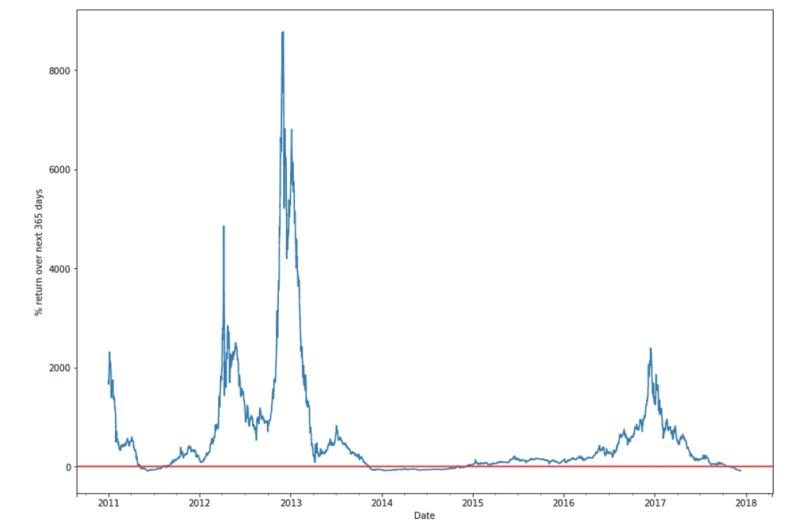
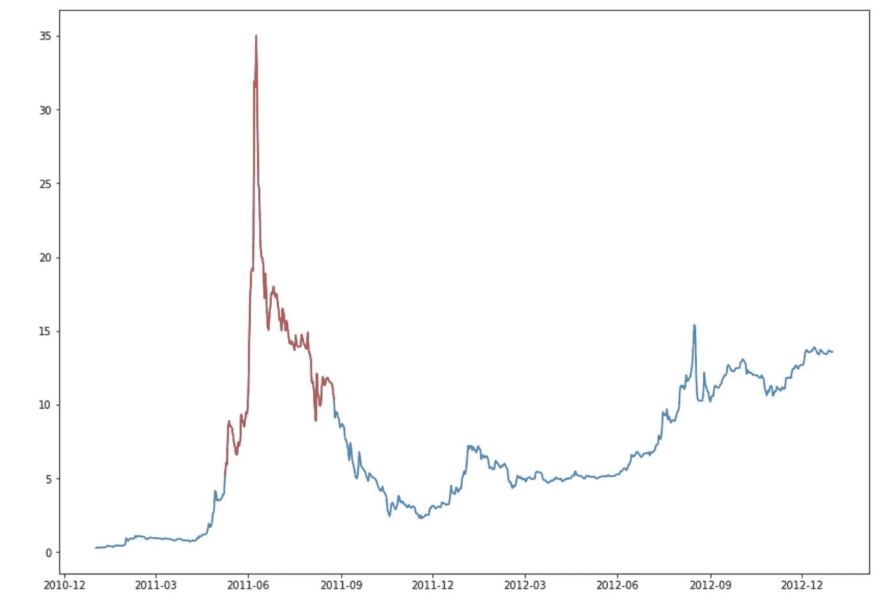
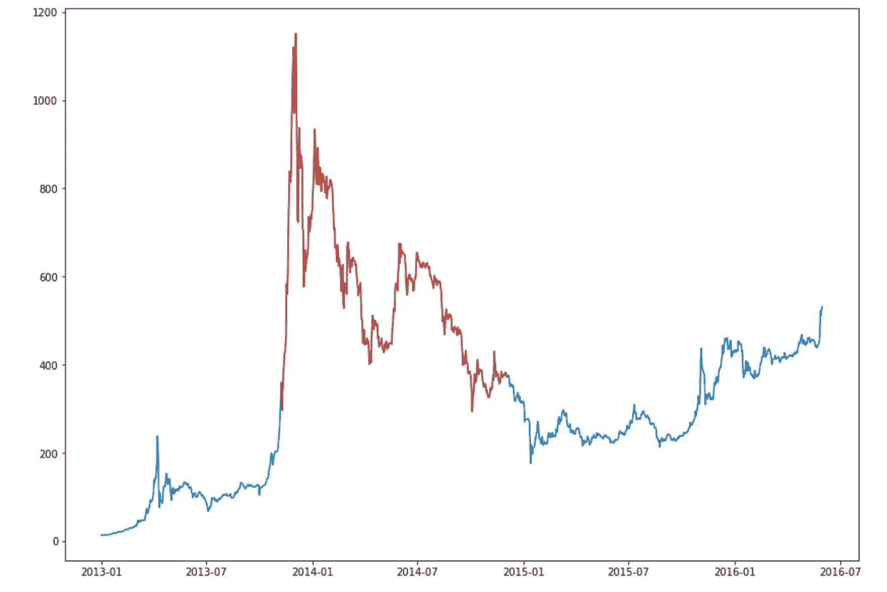
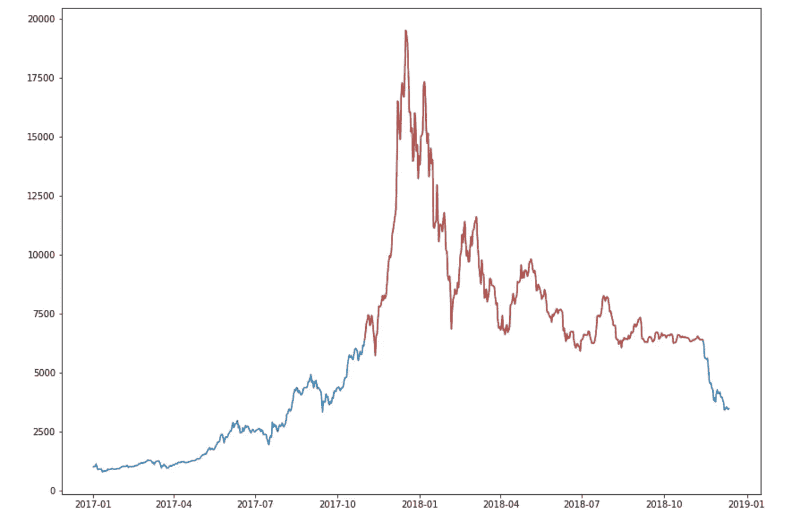

# 比特币:知道何时不买

> 原文：<https://medium.com/coinmonks/bitcoin-knowing-when-not-to-buy-b5bf476b1ff4?source=collection_archive---------1----------------------->


Photo by [Isaiah Rustad](https://unsplash.com/@isaiahrustad?utm_source=medium&utm_medium=referral) on [Unsplash](https://unsplash.com?utm_source=medium&utm_medium=referral)

查理·芒格喜欢说“[反转，总是反转](http://jameslau88.com/charlie_munger_on_invert_always_invert.htm)”作为解决问题的方法。今天，我将尝试把这个建议应用到比特币投资中。与其问什么时候是买入的好时机，我会反过来问什么时候是买入的坏时机。如果你能确定哪些是可能的糟糕时期，那么你也会知道哪些是可能的好时期。反演的想法是，通常更容易思考或找到相反情况的解决方案。这是从数学中借鉴来的技巧。

首先，我需要定义我所说的不好是什么意思。就本文的目的而言，我将“坏”定义为任何时候你买入，而在接下来的 365 天里回报是负的。因此，如果我今天购买了[比特币](https://blog.coincodecap.com/a-candid-explanation-of-bitcoin/)，一年后回报为负，那就糟了。很简单，一年后赔钱是相当糟糕的。你可以用任何你喜欢的方式定义坏，并用你自己的定义重复这个练习。

使用坏的定义，让我们创建一个比特币 365 天未来回报的图表，看看坏的时期何时发生。使用 Python 这很容易做到。

```
# Get some price data from Quandl
bitcoin = quandl.get("BCHAIN/MKPRU")
bitcoin = bitcoin.shift(-1) # data set has daily open, we want daily close
bitcoin = bitcoin.loc['2011-01-01':] # Remove the 0's
bitcoin.columns = ['Last']# For each day calculate the return if you held for 365 days
bitcoin['RollingRet'] = (bitcoin['Last'].shift(-365) / bitcoin['Last'] - 1) * 100# Plot a chart
ax = bitcoin['RollingRet'].plot(figsize=(14,10))
ax.set_ylabel("% return over next 365 days")
plt.axhline(y=0, color='r', linestyle='-');
```



Bitcoin 365 day rolling future returns

因此，你可以看到 2011 年有一段时间是负的，2013 年底和 2014 年大部分时间都是负的，然后是 2017 年底的一段时间。2018 年我们还不知道，因为我们还没有未来 365 天的价格，但我认为我们可以假设 2018 年也将是负面的。

接下来，让我们得到按年份分组的糟糕天数的实际计数。

```
# Count days each year where return over next 365 days would have been negative  
neg_return = bitcoin[bitcoin['RollingRet'] < 0 ]
neg_return.groupby(neg_return.index.year).count()#Results
2011 95 days
2012 0 days
2013 50 days
2014 329 days
2015 0 days
2016 0 days
2017 41 days
```

因此，尽管 2011 年是迄今为止价格下跌最严重的一年([下跌 93%](/@danielcimring/a-study-of-bitcoin-price-crashes-c61051ee5f20) )，但“只有”95 天是糟糕的投资日。2013 年和 2014 年是同一个熊市的一部分，所以我们可以将它们加在一起，总共 379 天。2012 年、2015 年和 2016 年没有糟糕的一天。

现在，让我们确定这些糟糕日子的确切开始和结束日期，然后将它们可视化在价格图表上，以查看完整的背景。

```
# Get the bad day start and end dates for 2011 and see what was happening with price at those times
print neg_return['2011'].index[0]
print neg_return['2011'].index[-1]# Start 2011-05-09
# End 2011-08-25
```

下面的图表显示了相关的时间段，红色显示的是购买比特币的糟糕日子。

```
# Plot a chart showing the bad days
fig, ax = plt.subplots(figsize=(14,10))
ax.plot(bitcoin.loc['2011':'2012','Last'].index, bitcoin.loc['2011':'2012','Last'])       
ax.plot(bitcoin.loc[neg_return['2011'].index[0]:neg_return['2011'].index[-1]].index, bitcoin.loc[neg_return['2011'].index[0]:neg_return['2011'].index[-1],'Last'], color='#CB4335');
```



Red shade indicates the bad days to have bought

糟糕的日子开始于接近(但不是在)垂直上升的起点，然后在到达最后低点之前结束。从 35 美元左右的高点到红色时期结束时 10.30 美元左右的价格的总跌幅为 70%。以下是 2013 / 2014 年期间的同一图表。



Red shade indicates the bad days to have bought

同样，糟糕的日子开始于接近(但不是在)垂直上升的起点，然后在到达最终低点之前结束。从 1，151 美元左右的高点到红色时段结束时 371 美元左右的价格的总跌幅为 68%。

对于 2018 年，让我们假设截至 2018 年 11 月 13 日的整个一年也将是糟糕的。11 月 13 日的价格约为 6400 美元，然后开始下降到目前的 3400 美元左右。这意味着，在当前的熊市中，我们在 2018 年有 316 个糟糕的日子，加上 2017 年的 41 个，总共有 357 天。这非常接近 2013 / 2014 年的总数。在这种假设下，这就是 2017 / 2018 年图表的样子。



Red shade indicates the bad days to have bought (assumed)

另一种看待我们假设的方式是，在之前的两次熊市中，从高点到红线末端的总跌幅约为 70%。如果我们使用 19，498 美元作为 12 月 17 日的高点，那么 70%的下跌将使价格下跌到 5，849 美元，这意味着上面假设的红线将比上面显示的晚几天结束。

这一切意味着什么？对我来说，这意味着我们正在或接近这样一个点，即购买比特币不会是坏事(导致未来 365 天的亏损)。如果你有一年或一年以上的时间跨度(越长越好)，那么现在可能是积累的好时机。很多人看到这里会想“你完全疯了！”。请记住，这些人中有许多人在 2017 年底大声疾呼投资比特币，当时比特币的价格比现在高得多。对于一个长期持有人来说，买入的时候是你最不想买的时候，卖出的时候是你和其他人敲门买入的时候。

```
A Jupyter Notebook with the full Python code is on [Github](https://github.com/dcimring/crypto-price-analysis/blob/master/bitcoin_rolling_returns.ipynb)
```

*请注意，本文中的任何内容都不应被视为投资建议。以上是我个人的看法。如果你走到这一步，那么你可能已经意识到比特币是极其不稳定的。在投资比特币或其他任何东西之前，请做好自己的研究，做出自己的决定。*

> [在您的收件箱中直接获得最佳软件交易](https://coincodecap.com/?utm_source=coinmonks)

[](https://coincodecap.com/?utm_source=coinmonks)[](https://cryptofi.co)