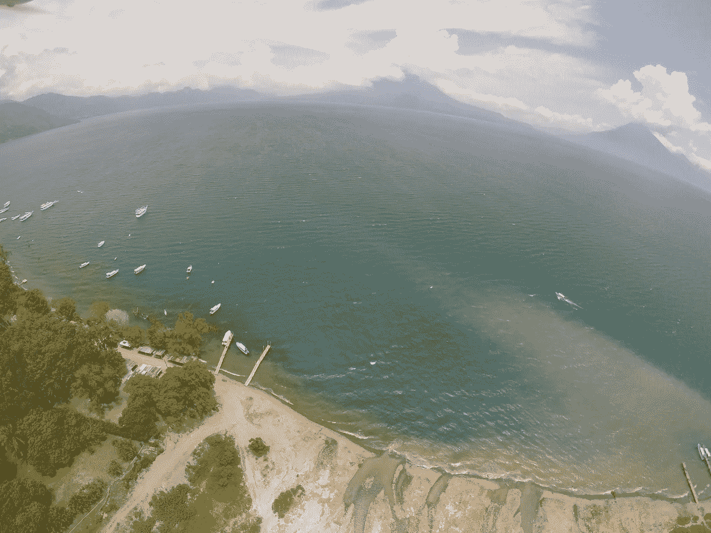
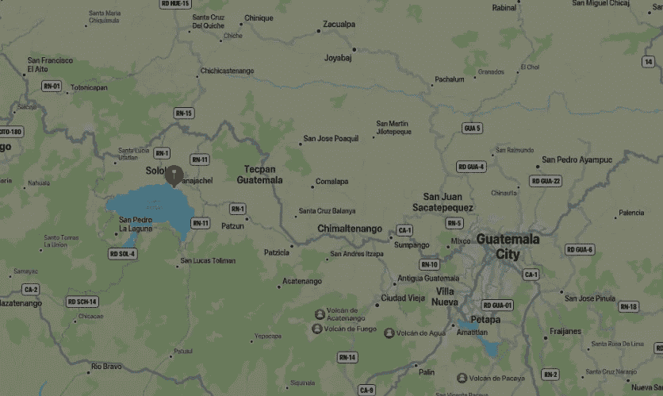
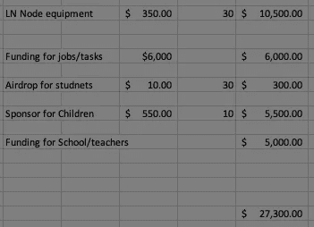

# 比特币湖——第一阶段

> 原文：<https://medium.com/coinmonks/bitcoin-lake-phase-one-128b54c85907?source=collection_archive---------3----------------------->

The Big Picture — Lake Atitlan, Panajachel, Guatemala

好了，我们要一起开始这美妙的旅程了！如果你还没有读过之前的文章，你可以在这里找到它。该系列的下一篇文章是[这里是](https://67corvette.medium.com/sustainable-bitcoin-mining-panajachel-guatemala-907802df9247)。

萨尔瓦多埃尔宗特的比特币海滩的成功很大程度上是由于一位匿名捐助者想要实施比特币循环经济，结合[罗曼·马丁内兹的](https://twitter.com/romanmartinezc)当地知识和对社区的热爱。

比特币湖开始于[我的家人对危地马拉帕纳哈切尔的热情](/coinmonks/bitcoin-lake-the-plan-a4d783113793)，上帝提供了联系。

## **第一阶段的目标:**

1.  创建比特币感知社区和比特币循环经济。
2.  在 Centro Educative jo sue[教孩子们(和有限数量的成年人)](https://www.centroeducativojosue.com/)比特币、闪电、运行节点。额外的计算机技能很可能会自然而然地随之而来。孩子们的年龄在 12-16 岁之间。
3.  开始阿蒂特兰湖的清洁工程。这将是孩子们赚钱开始循环经济的最初方式。我们将围绕这个项目开发一个主题“我的湖，我的骄傲，我的家！比特币解决了这个问题！我的拉戈，我的奥古洛，我的卡萨！比特币解决方案 Esto！
4.  招募企业和服务提供商开始采用比特币。

**时间线**

该校校长南希·希福恩特斯准备在危地马拉新学年于 1 月初开始时推进这一计划。

在冬季和春季(2022 年)，比特币培训将通过现场翻译的虚拟教学进行(乔苏和弗洛·希福恩特斯)。Josue 和 Flor 将在 2021 年 11 月 15 日左右开始他们的比特币培训。

到春季/夏季(2022 年)，足够多的儿童、成人和企业将熟悉比特币，以继续进入第二阶段，这将是更广泛的商业采用。此外，到 2022 年春末夏初，人们希望对比特币有足够的兴趣和采用，比特币游客将有能力在 Panajachel 及其周边地区消费比特币。

如果你想了解更多关于 Panajachel 的信息，可以阅读原文[比特币湖计划](/coinmonks/bitcoin-lake-the-plan-a4d783113793)。

**资金需求**

我们愿意为每个孩子提供设备来组装和运行一个完整的节点。我们将使用 Umbrel 节点软件和推荐的[硬件设备。](https://getumbrel.com/)

为了激励孩子们，我们将在阿蒂特兰湖开始一个清洁项目。

每个孩子将获得 10 美元空投。

有 6-10 名儿童需要下一学年的赞助以及教师和学校的一般资金。

目前的预算是:

一旦教育和运作安全建立，资金将被转移到学校的节点。

请分享关于这个项目的任何意见或问题。

Twitter 句柄

我的推特 [@entsurg](https://twitter.com/entsurg)

比特币湖推特[@比特币湖](https://twitter.com/LakeBitcoin)

比特币湖、比特币湖、拉戈比特币和拉戈比特币是医学博士帕特里克·c·梅尔德尔的商标

任务:比特币播客，我将在其中记录进展——[@ mission 21m](https://twitter.com/Mission21M)

BTC 地址:3 F8 vtnd 2 wtkttuhapqavfabdarp 5 nmix 8 r

**闪电地址:**

**为二维码:**[**https://coinos.io/lakebitcoin**](https://coinos.io/lakebitcoin)

**如果你想送礼但更喜欢信用卡或其他传统方式:**[**https://www.centroeducativojosue.com/donate**](https://www.centroeducativojosue.com/donate)

> 加入 Coinmonks [电报频道](https://t.me/coincodecap)和 [Youtube 频道](https://www.youtube.com/c/coinmonks/videos)了解加密交易和投资

## 也阅读

 [## 最佳加密交易所| 2021 年十大加密货币交易所

### 编辑描述

blog.coincodecap.com](https://blog.coincodecap.com/crypto-exchange)  [## 2021 年 10 大最佳加密贷款平台| CoinCodeCap

### 编辑描述

blog.coincodecap.com](https://blog.coincodecap.com/crypto-lending)  [## 2021 年最佳免费加密交易机器人

### 2021 年币安、比特币基地、库币和其他密码交易所的最佳密码交易机器人。四进制，位间隙…

medium.com](/coinmonks/crypto-trading-bot-c2ffce8acb2a)  [## 最佳 4 个加密交易信号电报通道

### 这是乏味的找到正确的加密交易信号提供商。因此，在本文中，我们将讨论最好的…

medium.com](/coinmonks/best-crypto-signals-telegram-5785cdbc4b2b)  [## BlockFi 评论 2021:利弊和利率| CoinCodeCap

### 编辑描述

blog.coincodecap.com](https://blog.coincodecap.com/blockfi-review)  [## 如何在印度购买比特币？2021 年购买比特币的 7 款最佳应用[手机版]

### 如何使用移动应用程序购买比特币印度

medium.com](/coinmonks/buy-bitcoin-in-india-feb50ddfef94)  [## 加密税务软件——五大最佳比特币税务计算器[2021]

### 不管你是刚接触加密还是已经在这个领域呆了一段时间，你都需要交税。

medium.com](/coinmonks/best-crypto-tax-tool-for-my-money-72d4b430816b)  [## 存储比特币的最佳加密硬件钱包[2021] | CoinCodeCap

### 编辑描述

blog.coincodecap.com](https://blog.coincodecap.com/best-hardware-wallet-bitcoin)  [## Pionex 评论 2021 |免费加密交易机器人和交换

### Pionex 是为交易自动化提供工具的后起之秀。Pionex 上提供了 9 个加密交易机器人…

medium.com](/coinmonks/pionex-review-exchange-with-crypto-trading-bot-1e459d0191ea)