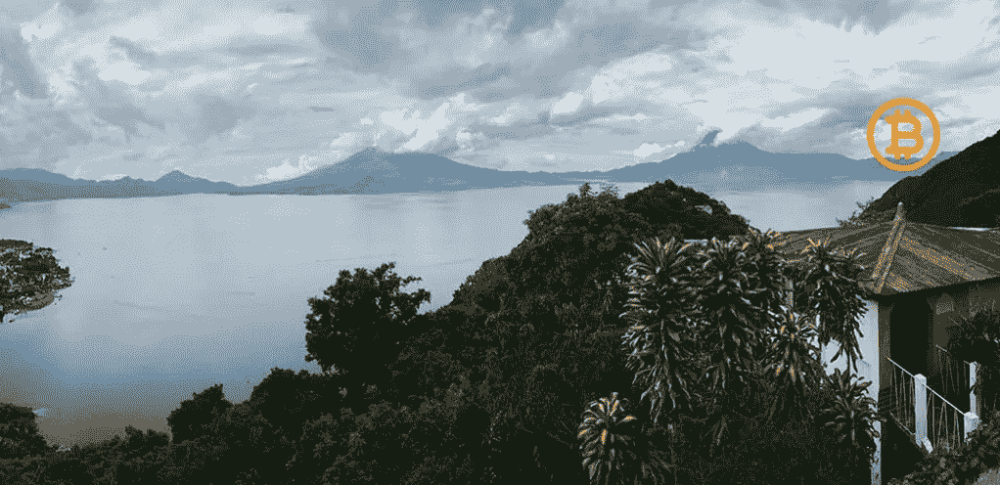
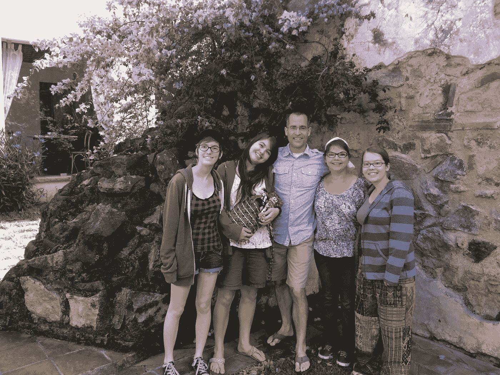
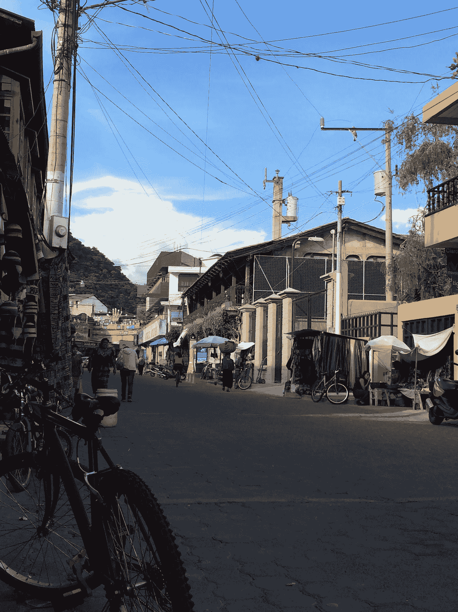

# 比特币湖——计划

> 原文：<https://medium.com/coinmonks/bitcoin-lake-the-plan-a4d783113793?source=collection_archive---------1----------------------->

注意:请原谅错别字/语法。这是一个活的文档，将会随着进度和注释而更新。这个系列的下一个是这里的。

## **历史**

从 2012 年到 2018 年，我和我的家人每年夏天都去瓜地马拉的 Panajachel，帮助在 Panajachel (Pana)的基督教事工，以及为 [Centro Educative Josue](https://www.centroeducativojosue.com/) 的课外活动。在我们的女儿大学毕业并开始自己的事业和生活后，我们的帕纳家庭旅行结束了，但我们对我们所做的事情以及帕纳和危地马拉人民的爱并没有结束。

我的外科实践和创业开始消耗我所有的时间和精力。

在过去的 12-18 个月里，我们重新参与社区活动的愿望重燃，所以我和妻子开始祈祷机会。

2021 年初，我了解到萨尔瓦多的[比特币海滩](https://twitter.com/Bitcoinbeach)。轮子开始转动。我的愿望是将比特币海滩模型带到 Panajachel，这是危地马拉高地阿蒂特兰湖的一个美丽小镇。阿蒂特兰湖一直被评为世界上最美丽的湖泊之一；然而，外表是会骗人的。该湖周围都是农业社区。农民们没有使用可持续的技术，而是使用最终会流入湖中的化学物质。和大多数发展中国家一样，基础设施和环境保护不是政府的优先事项。在湖周围的渔村，水中和陆地上的碎片是常见的场所。

## **视觉**

目标是在巴拿马创建比特币循环经济。帮助 Centro Educative Josue 的学校项目和资金需求。激励人们清理阿蒂特兰湖。并为这个充满活力的危地马拉小镇创造经济机会。

一旦这项工作完成和/或取得进展，我们的目标将是让湖边的其他社区也参与进来。

长期目标是将比特币采矿引入 Pana，并帮助该社区建设更好的电力基础设施电网。

## **实施**

在我的播客[任务:比特币](https://feeds.captivate.fm/mission-bitcoin/)中，我有幸与来自萨尔瓦多比特币海滩的[钦贝拉](https://twitter.com/romanmartinezc)聊天。Chimbera 在 El Zonte 的经历告诉我们，试图首先教育商家或老年用户不是正确的方法。钦贝拉热爱他所在社区的年轻人。像大多数中南美洲的社区一样，他们的机会有限。对许多人来说，唯一的选择是加入帮派或移民美国。首先，向年轻人传授比特币的知识可以提供一个热情的团队来帮助“宣传”比特币的应用。

该计划将从 Centro Educative Josue 开始，对学校的孩子们进行比特币教育。这立即实现了两个目标:1)向学校中的孩子们介绍一种新技术，这将为这些孩子提供立即的机会，为比特币创新的浪潮做准备。毗邻萨尔瓦多，这些年轻人可以为西班牙语比特币的招聘热潮做好准备。2)这些年轻人可以成为社区的比特币传播者。3)这些年轻人可以立即开始清理帕纳的湖滨，以换取基于比特币海滩模型的 sat。

由于我们将与 Centro Educative Josue 合作，计划将为学校提供比特币节点，并介绍计算机科学技能。也非常欢迎其他讲西班牙语的比特币玩家来帮忙。

为了开始循环经济，孩子们可以在做模拟比特币海滩的家务时获得 sat 报酬。在这种情况下，清洁阿蒂特兰湖将是最初的目标。由于帕纳是一个充满活力的城镇，有许多小商店、自动人力车司机、船上出租车和手工艺品供应商都是比特币的目标。

巴拿马的经济严重依赖旅游业。来自世界各地的人们来到帕纳，所以有一个重要的机会让外国佬参与到小镇的“扔橘子”活动中来。

## **前往帕纳**

根据交通状况，Pana 距离危地马拉城约 2-2.5 小时。私人出租车可往返于 Pana。

## **帕那镇**

帕纳是一座海拔超过 5000 英尺的古雅城市。晚上可能会很凉爽，虽然蚊子可能是一个问题，但由于海拔高，疟疾和其他由蚊子传播的疾病并不常见。

像这个纬度的大多数国家一样，有雨季和旱季。大约从八月到十二月，暴雨和洪水是常见的。

从清晨到傍晚，街道交通繁忙，但帕纳是一个适合步行的城镇。任何犯罪都可能是小偷小摸，总体来说非常安全。

狗确实会在街上游荡，而且通常没有威胁——但你应该看看你走路的地方，偶尔会有便便和地雷。

阿蒂特兰酒店有各种各样的食物，从街头小贩到中国、意大利、德国甚至高端美食。

住宿的地方从旅馆到酒店都有。VRBO 和 AIRBnB 住宿也是可用的。

Grounds of Hotel Atitlan

自 60 年代末以来，Pana 吸引了来自世界各地的外籍人士。许多企业由外籍人士所有。

晚期阿蒂特兰周围是村庄和城镇。每一个都有自己独特的性格和工艺/艺术。这些都可以在湖边乘坐出租车到达。

该地区及其周围可以进行滑翔伞、皮划艇、滑索和钓鱼。

许多富有的危地马拉人在湖边拥有自己的房子。

在 Twitter 上关注@LakeBitcoin，了解更新和进展。

比特币湖、比特币湖、拉戈比特币、拉戈比特币和“G”标志是马里兰州帕特里克·c·梅尔德尔的商标

查看我的播客获取更多更新:[https://feeds.captivate.fm/mission-bitcoin/](https://feeds.captivate.fm/mission-bitcoin/)

> 加入 Coinmonks [电报频道](https://t.me/coincodecap)和 [Youtube 频道](https://www.youtube.com/c/coinmonks/videos)了解加密交易和投资

## 另外，阅读

*   [什么是融资融券交易](https://blog.coincodecap.com/margin-trading) | [成本平均法](https://blog.coincodecap.com/dca)
*   [支持卡审核](https://blog.coincodecap.com/uphold-card-review) | [信任钱包 vs 元掩码](https://blog.coincodecap.com/trust-wallet-vs-metamask)
*   [Exness 回顾](https://blog.coincodecap.com/exness-review)|[moon xbt Vs bit get Vs Bingbon](https://blog.coincodecap.com/bingbon-vs-bitget-vs-moonxbt)
*   [如何开始通过加密贷款赚取被动收入](https://blog.coincodecap.com/passive-income-crypto-lending)
*   [BigONE 交易所评论](/coinmonks/bigone-exchange-review-64705d85a1d4) | [电网交易 Bot](https://blog.coincodecap.com/grid-trading)
*   [新加坡十大最佳加密交易所](https://blog.coincodecap.com/crypto-exchange-in-singapore) | [收购 AXS](https://blog.coincodecap.com/buy-axs-token)
*   [投资印度的最佳加密软件](https://blog.coincodecap.com/best-crypto-to-invest-in-india-in-2021) | [WazirX P2P](https://blog.coincodecap.com/wazirx-p2p)
*   [7 个最佳零费用加密交易平台](https://blog.coincodecap.com/zero-fee-crypto-exchanges)
*   [分散交易所](https://blog.coincodecap.com/what-are-decentralized-exchanges) | [比特 FIP](https://blog.coincodecap.com/bitbns-fip)
*   [用信用卡购买密码的 10 个最佳地点](https://blog.coincodecap.com/buy-crypto-with-credit-card)
*   [加拿大最佳加密交易机器人](https://blog.coincodecap.com/5-best-crypto-trading-bots-in-canada) | [Bybit vs 币安](https://blog.coincodecap.com/bybit-binance-moonxbt)
*   [火币的加密交易信号](https://blog.coincodecap.com/huobi-crypto-trading-signals) | [Swapzone 审查](/coinmonks/swapzone-review-crypto-exchange-data-aggregator-e0ad78e55ed7)
*   最佳[密码交易机器人](https://blog.coincodecap.com/best-crypto-trading-bots) | [购买索拉纳](https://blog.coincodecap.com/buy-solana) | [矩阵导出评论](https://blog.coincodecap.com/matrixport-review)
*   [Coldcard 评论](https://blog.coincodecap.com/coldcard-review) | [BOXtradEX 评论](https://blog.coincodecap.com/boxtradex-review)|[unis WAP 指南](https://blog.coincodecap.com/uniswap)
*   [阿联酋 5 大最佳加密交易所](https://blog.coincodecap.com/best-crypto-exchanges-in-uae) | [SimpleSwap 评论](https://blog.coincodecap.com/simpleswap-review)
*   购买 Dogecoin 的 7 种最佳方式 | [ZebPay 评论](https://blog.coincodecap.com/zebpay-review)
*   [最佳期货交易信号](https://blog.coincodecap.com/futures-trading-signals) | [流动性交易回顾](https://blog.coincodecap.com/liquid-exchange-review)
*   [3 商业评论](/coinmonks/3commas-review-an-excellent-crypto-trading-bot-2020-1313a58bec92) | [Pionex 评论](https://blog.coincodecap.com/pionex-review-exchange-with-crypto-trading-bot) | [Coinrule 评论](/coinmonks/coinrule-review-2021-a-beginner-friendly-crypto-trading-bot-daf0504848ba)
*   [莱杰 vs n rave](/coinmonks/ledger-vs-ngrave-zero-7e40f0c1d694)|[莱杰 nano s vs x](/coinmonks/ledger-nano-s-vs-x-battery-hardware-price-storage-59a6663fe3b0) | [币安评论](/coinmonks/binance-review-ee10d3bf3b6e)
*   [Bybit 交易所评论](/coinmonks/bybit-exchange-review-dbd570019b71) | [Bityard 评论](https://blog.coincodecap.com/bityard-reivew) | [CoinSpot 评论](https://blog.coincodecap.com/coinspot-review)
*   [3 commas vs crypto hopper](/coinmonks/3commas-vs-pionex-vs-cryptohopper-best-crypto-bot-6a98d2baa203)|[赚取秘密利息](/coinmonks/earn-crypto-interest-b10b810fdda3)
*   最好的比特币[硬件钱包](/coinmonks/hardware-wallets-dfa1211730c6) | [BitBox02 回顾](/coinmonks/bitbox02-review-your-swiss-bitcoin-hardware-wallet-c36c88fff29)
*   [BlockFi vs 摄氏度](/coinmonks/blockfi-vs-celsius-vs-hodlnaut-8a1cc8c26630) | [Hodlnaut 审核](/coinmonks/hodlnaut-review-best-way-to-hodl-is-to-earn-interest-on-your-bitcoin-6658a8c19edf) | [KuCoin 审核](https://blog.coincodecap.com/kucoin-review)
*   [Bitsgap 评审](/coinmonks/bitsgap-review-a-crypto-trading-bot-that-makes-easy-money-a5d88a336df2) | [Quadency 评审](/coinmonks/quadency-review-a-crypto-trading-automation-platform-3068eaa374e1) | [Bitbns 评审](/coinmonks/bitbns-review-38256a07e161)
*   [加密复制交易平台](/coinmonks/top-10-crypto-copy-trading-platforms-for-beginners-d0c37c7d698c) | [Coinmama 审核](/coinmonks/coinmama-review-ace5641bde6e)
*   [印度的加密交易所](/coinmonks/bitcoin-exchange-in-india-7f1fe79715c9) | [比特币储蓄账户](/coinmonks/bitcoin-savings-account-e65b13f92451)
*   [OKEx vs KuCoin](https://blog.coincodecap.com/okex-kucoin) | [摄氏替代品](https://blog.coincodecap.com/celsius-alternatives) | [如何购买 VeChain](https://blog.coincodecap.com/buy-vechain)