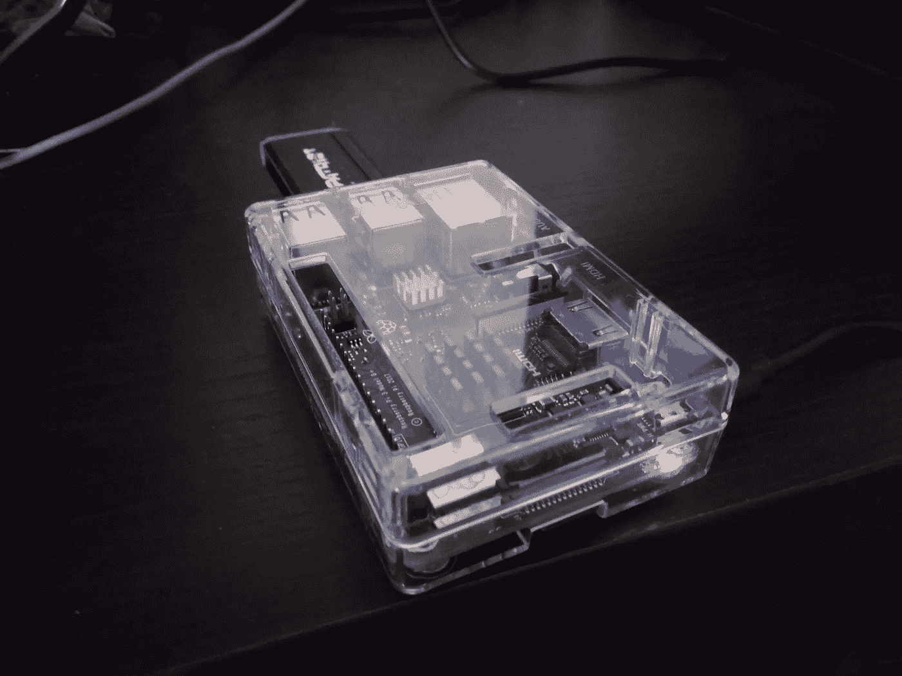
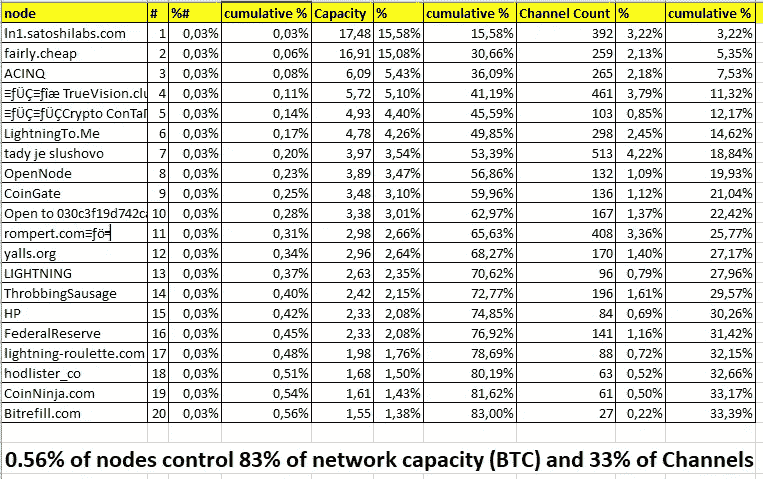

# 比特币闪电网络:在家里运行你的节点的乐趣和(无)利润⚡🤑

> 原文：<https://medium.com/coinmonks/bitcoin-lightning-network-run-your-node-at-home-for-fun-and-no-profit-da5b61be2ba9?source=collection_archive---------0----------------------->

你有没有考虑过在自己的硬件上安装一个比特币闪电网络？我是这样做的。

# 闪电网络是什么？

引自[闪电网](https://lightning.network/)

> 可扩展的即时比特币/区块链交易

闪电网络正试图解决比特币目前面临的几个问题:**可扩展性**(每秒交易数量，目前比特币每秒处理约 7 笔交易)**速度**(确认交易所需的时间)，**成本**(支付每笔交易的费用)。

奇怪的是，交易速度和成本也是比特币正在解决的一些问题，但*“一分钟有多长取决于你在浴室门的哪一边”。*

## 它是如何工作的？

基本想法是在两个参与者(让我们假设爱丽丝和鲍勃)之间创建一个“渠道”,并投入一些资金，例如每人 1 BTC。这需要在比特币区块链上进行交易，将资金锁定在一个 2 multisig 地址。下面是开放频道的情况:

```
Alice <= 1 BTC == 1 BTC => Bob # opening of a new channel
```

爱丽丝和鲍勃现在可以“离线”进行任意多的交易，他们只需要交换更新的“资产负债表”:即由另一方签署的交易(因此缺少一个签名)，该交易没有传播到比特币 mainnet(还没有)，并向参与者支付更新的资金。

因为交易是“离线”存储的，爱丽丝和鲍勃不需要等待主区块链的确认(**即时交易**)，也不需要向 mainnet 矿工支付费用(**低费用**)。

下面是交易发生时公开渠道的情况:

```
Alice <= 0.8 BTC == 1.2 BTC => Bob # Bob   sent 0.2 BTC to Alice
Alice <= 0.9 BTC == 1.1 BTC => Bob # Alice sent 0.1 BTC to Bob
Alice <= 0.4 BTC == 1.6 BTC => Bob # Alice sent 0.5 BTC to Bob
…
…
```

在任何时候，参与者都可以让资产负债表变得“真实”,签署从另一方收到(并由另一方签署)的最新 multisig 交易，并将其作为常规比特币交易进行广播:该通道现已关闭。

但是闪电网络的真正力量是“六度分离”的想法:如果“路由”已知，参与者可以在几跳内到达任何其他人。因此，如果爱丽丝与鲍勃有一个开放信道，而鲍勃与查理有一个开放信道，则爱丽丝可以与查理进行交易，并向他发送例如 0.5 BTC。以下是交易前渠道的情况:

```
Alice <= 1 BTC == 1 BTC => Bob     # Bob has 3 BTC on 2 channels
Bob   <= 2 BTC == 2 BTC => Charlie
```

交易结束后:

```
Alice <= 0.5 BTC == 1.5 BTC => Bob     # Bob is still having 3 BTC
Bob   <= 1.5 BTC == 2.5 BTC => Charlie
```

鲍勃的总余额保持不变，而查理的余额增加了 0.5 BTC，爱丽丝的余额减少了 0.5 BTC。

> 如果你不想麻烦，但仍然想支持比特币网络，请查看[顶级比特币和闪电节点提供商](https://blog.coincodecap.com/bitcoin-node-solutions/)。

# 选择要使用的闪电网络实施

目前我在比特币 mainnet 上只找到了*完全*符合[闪电网络规范(BOLTs)](https://github.com/lightningnetwork/lightning-rfc) 的两种主要解决方案:

*   **闪电网络守护进程**[(https://github.com/lightningnetwork/lnd](https://github.com/lightningnetwork/lnd))
*   **c-lightning** 按元素项目**[(https://github.com/ElementsProject/lightning](https://github.com/ElementsProject/lightning))**

**我花了一些时间阅读每个项目实现的功能，然后决定安装 LND，因为:**

*   **这两个项目都需要在同一台主机上运行完整的 bitcoind 后端守护程序(或通过网络可达的主机)，但 LND 也支持在 *prune* 模式下的 bitcoind 节点:这意味着你不需要在本地存储完整的比特币区块链(目前超过 200 GB)，所以磁盘空间需求较少，我的备用 128 GB USB 笔驱动器足够了。**
*   **LND 对比特币轻型客户端[中微子](https://github.com/lightninglabs/neutrino)后端(目前只有 testnet)提供了实验支持，这进一步降低了磁盘空间需求:我打赌它迟早会达到生产就绪质量，我可以改用它。**
*   **LND 有一个自动频道管理(`[autopilot](https://github.com/lightningnetwork/lnd/tree/master/autopilot)`)，它创建和管理频道。**
*   **LND 具有“nat”功能:这允许向网络通告节点，只要它在单个 NAT 之后，自动处理公共 IP 地址的改变，因此在节点上需要较少的脚本技巧。**

# **让我们有趣的开始:准备闪电网络节点**

**在安装之前，我阅读并消化了一些好的指南，这是我必须给出的学分:**

*   **树莓派官方指南:[https://www.raspberrypi.org/documentation/](https://www.raspberrypi.org/documentation/)**
*   **[LND https://github . com/lightning network/lnd/blob/master/docs/install . MD](https://github.com/lightningnetwork/lnd/blob/master/docs/INSTALL.md)**
*   **极好的斯塔迪库斯️⚡Lightning️⚡树莓派初学者指南[:https://github.com/Stadicus/guides/tree/master/raspibolt](https://github.com/Stadicus/guides/tree/master/raspibolt)**

## **硬件设置**

**我有一个树莓 Pi 3 型号 B+在家里大多没有使用，一个备用的 128GB USB 笔驱动器和一个良好的网络连接，所以我试图重复使用这些组件。请记住，您需要 24/7 运行您的节点，所以一个无声的主机是更可取的。我在 Pi 上安装了一些散热器，以避免风扇一直运行，同时将 CPU 温度保持在安全范围内。在整个安装过程和进一步的日常运行操作中，CPU 的温度从未超过 65°C，安全地低于 85°C 的最高温度:任何高于这一温度的温度，Pi 都会调节 CPU 频率，使温度降下来。**

## **树莓 Pi 上操作系统的设置**

**在 Pi 上安装操作系统非常简单:我决定运行一个无头主机，所以我从官方仓库下载了 Raspbian lite 映像，这里是:【https://downloads.raspberrypi.org/raspbian_lite_latest】T4，并将映像写入 MicroSD 卡，如下所述:[https://www . raspberrypi . org/documentation/installation/installing-images/](https://www.raspberrypi.org/documentation/installation/installing-images/)**

**记住在 MicroSD 的根目录中添加一个空文件`ssh`:这是激活 ssh 远程连接所必需的，否则您无法从网络登录到 Pi 并对其进行配置。**

**然后使用 nmap 映射工具，我找到了我的家庭路由器给 Pi 的 ip 地址**

```
> $ nmap -sP 192.168.1.0/24
```

**并使用默认用户`pi`和密码`raspberry`启动了一个 ssh 会话。**

```
> $ ssh pi@192.168.1.134
```

**为了完成 Pi 的配置，我从命令行运行`raspi-config`工具，调整参数以配置 WiFi SSID 和预共享密钥、地区、时区，启用 ssh 连接。因为节点是无头运行的，所以我还在内存分割中减少了 GPU 可用的内存量。**

**然后，我阅读了 raspberry guide[https://www . raspberry pi . org/documentation/configuration/external-storage . MD](https://www.raspberrypi.org/documentation/configuration/external-storage.md)中的“安装硬盘”一节，将我的 USD pen drive 作为**

## **锻炼**

**因为这是连接到互联网的节点，并且正在管理“钱”，最好进入“偏执狂”模式。**

**按顺序，我做了:**

*   **删除了默认用户 pi，并创建了一个新用户作为连接到 Pi 的主用户。**
*   **按照本指南[https://www . raspberrypi . org/documentation/remote-access/ssh/passless . MD](https://www.raspberrypi.org/documentation/remote-access/ssh/passwordless.md)配置无密码 ssh，然后只允许通过 SSH 证书登录，将文件`/etc/ssh/sshd_config`中的设置`ChallengeResponseAuthentication`和`PasswordAuthentication`更改为`no`**
*   **创建了一个“服务”用户`bitcoin`来运行与闪电网络互动所需的恶魔，运行`sudo adduser bitcoin`**

**我还应该做什么:**

*   **安装 [fail2ban](https://www.fail2ban.org) 自动禁止多次密码失败的 IP 地址。我的 Pi 在一个不转发 ssh 端口的家庭路由器后面，所以这不是严格要求的，但这可以防止来自我家庭网络中其他受损设备(智能手机、笔记本电脑、智能电视等)的攻击。)**
*   **安装防火墙**

## **公用事业**

**下面是我添加到`~**/**.bashrc`中的一些方便的别名，让生活变得更简单:**

```
# handy aliases
alias ..=’cd ..’
alias …=’cd ../..’
alias ….=’cd ../../..’
alias …..=’cd ../../../..’
alias ……=’cd ../../../../..’
alias 1=’cd -’
alias _=sudo
alias afind=’ack -il’
alias d=’dirs -v | head -10'
alias l=’ls -lah’
alias la=’ls -lAh’
alias ll=’ls -lh’
alias md=’mkdir -p’
alias rd=rmdir
```

**记得重新加载`~**/**.bashrc`**

```
source ~**/**.bashrc
```

**然后我安装了 iftop，这是一个有用的工具，用来监控终端上运行的网络流量**

```
sudo apt install iftopsudo iftop -i wlan0
```

## **油灰配置**

**我用油灰连接到 RaspberryPi。下面是我如何更改连接的默认配置:**

*   **终端→键盘→功能键和小键盘→ Linux**
*   **连接→保持活动之间的秒数→ 30**

# **在 Raspberry Pi 上安装比特币核心**

**https://bitcoincore.org(bitcoind)作为后端，所以我首先安装了最新的比特币核心软件。我很快准备了一个脚本，可以在我的下一个项目中重用，以下载比特币核心，验证校验和并安装二进制文件。只需将 BITCOIND_VERSION 更改为最新版本，您可以从[https://bitcoin.org/en/version-history](https://bitcoin.org/en/version-history)获得**

```
BITCOIND_VERSION=0.17.1
ARCH=arm-linux-gnueabihf
BITCOIND_ARCHIVE=bitcoin-${BITCOIND_VERSION}-${ARCH}.tar.gzcd /tmp \
    && wget [https://bitcoincore.org/bin/bitcoin-core-${BITCOIND_VERSION}/${BITCOIND_ARCHIVE](https://bitcoincore.org/bin/bitcoin-core-${BITCOIND_VERSION}/${BITCOIND_ARCHIVE)} \
    && wget [https://bitcoincore.org/bin/bitcoin-core-${BITCOIND_VERSION}/SHA256SUMS.asc](https://bitcoincore.org/bin/bitcoin-core-${BITCOIND_VERSION}/SHA256SUMS.asc) \
    && wget [https://bitcoin.org/laanwj-releases.asc](https://bitcoin.org/laanwj-releases.asc) \
    && SHA256=`grep "${BITCOIND_ARCHIVE}" SHA256SUMS.asc | awk '{print $1}'` \
    && echo $SHA256 \
    && echo "$SHA256 ${BITCOIND_ARCHIVE}" | sha256sum -c - \
    && gpg --import ./laanwj-releases.asc \
    && gpg --verify SHA256SUMS.asc \
    && tar -xzf ${BITCOIND_ARCHIVE} \
    && sudo install -m 0755 -o root -g root -t /usr/local/bin bitcoin-${BITCOIND_VERSION}/bin/* \
    && rm -rf /tmp/* \
    && bitcoind --version
```

**按照 Stadicus 指南的建议，我将 bitcoind 数据目录`/home/bitcoin/.bitcoin`链接到外部 USB pendrive 上的一个目录:**

```
sudo su bitcoin
ln -s /mnt/hdd/bitcoin /home/bitcoin/.bitcoin
```

**并创建了`/home/bitcoin/.bitcoin/bitcoin.conf`，激活了*修剪*模式(注意`prune=550`参数)。**

```
vim /home/bitcoin/.bitcoin/bitcoin.conf# Bitcoind options
server=1
daemon=1
txindex=0
disablewallet=1
prune=550# Connection settings
rpcuser=XXXXX
rpcpassword=YYYYYonlynet=ipv4
zmqpubrawblock=tcp://127.0.0.1:29000
zmqpubrawtx=tcp://127.0.0.1:29001# Raspberry Pi optimizations
dbcache=100
maxorphantx=10
maxmempool=50
maxconnections=40
maxuploadtarget=5000
```

**现在是耗时的任务，[初始块下载](https://bitcoin.org/en/glossary/initial-block-download)，系统需要下载**并验证**所有块(从 2009 年开始)以赶上当前最佳区块链的尖端。**

**我之前说过`lnd`支持在 *prune* 模式下的比特币核心后端，这意味着旧的块从本地磁盘中被清除，**但它们仍然被下载和验证**:我开始了这个过程，但我很快意识到整个过程将需要 10 多天……有人建议使用一个独立的设备，一个更强大的 CPU，来下载和验证这些块，然后在 Pi 上复制经过验证的块。**

## **生成 Amazon EC2 实例来加速 IBD**

**我没有足够快的备用设备来留下 24/7 处理数据，所以我很快在 Amazon EC2 上生成了一个 m4.large 实例，带有一个额外的 50 GB EBS 卷，显示为`/dev/sdf`。我使用了本机支持`docker`的`amzn-ami-2018.03.a-amazon-ecs-optimized (ami-c91624b0)`，然后使用 docker 映像运行 bitcoind。这里快速回顾一下:**

*   **格式化并安装额外的 EBS 卷**

```
sudo mkfs.ext4 /dev/sdf
sudo mkdir /mnt/bitcoin-data
sudo mount /dev/sdf /mnt/bitcoin-data/
```

*   **克隆存储库并构建 docker 映像**

```
sudo yum install git
git clone https://github.com/dougvk/lightning-node.git
cd lightning-node
docker build . -t bitcoind
```

*   **第一次运行`bitcoind`节点检查进度**

```
docker run --name bitcoind_mainnet -d -v /mnt/bitcoin-data/bitcoind:/data -p 8333:8333 bitcoinddocker logs --tail 10 --follow bitcoind_mainnet
```

*   **几分钟后停止 bitcoind_mainnet 进程，并将`prune=550`添加到 config 以激活块修剪**

```
docker stop bitcoind_mainnet
docker rm bitcoind_mainnet
sudo yum install vim
sudo vim /mnt/bitcoin-data/bitcoind/bitcoin.conf
```

*   **再次启动 bitcoind_mainnet 进程并等待初始块下载**

```
docker run --name bitcoind_mainnet -d -v /mnt/bitcoin-data/bitcoind:/data -p 8333:8333 bitcoinddocker logs --tail 10 --follow bitcoind_mainnet
```

**然后我等了大约 15 个小时，终于有了`progress=1.000000`**

```
2018–09–19 18:57:35 UpdateTip: new best=00000000000000000020aaf1f04a1ae2025408d044d936100a65c4b6e22a0853 height=542137 version=0x20000000 log2_work=89.696461 tx=342737382 date=’2018–09–19 18:57:22' progress=1.000000 cache=83.4MiB(410453txo) warning=’6 of last 100 blocks have unexpected version’
```

**m4.large 实例的成本是 0.10 美元/小时，所以这是一项可以承受的投资。**

**现在可以停止 bitcoind_mainnet 进程，并将**

*   **`/mnt/bitcoin-data/bitcoind/blocks`**
*   **`/mnt/bitcoin-data/bitcoind/chainstate`**
*   **`/mnt/bitcoin-data/bitcoind/database`**

**到`/home/bitcoin/.bitcoin`中的 RaspberryPi 并终止 EC2 实例(记住也要删除额外的 EBS 卷)。**

## **开始 bitcoind**

**最后，我创建了一个 systemd 服务，使用了这个配置(从 Spadicus 的指南中偷来的)**

**`sudo vim /etc/systemd/system/bitcoind.service`**

```
[Unit]
Description=Bitcoin daemon
Wants=getpublicip.service
After=getpublicip.service

[Service]
ExecStartPre=/bin/sh -c 'sleep 30'
ExecStart=/usr/local/bin/bitcoind -daemon -conf=/home/bitcoin/.bitcoin/bitcoin.conf -pid=/home/bitcoin/.bitcoin/bitcoind.pid
PIDFile=/home/bitcoin/.bitcoin/bitcoind.pid
User=bitcoin
Group=bitcoin
Type=forking
KillMode=process
Restart=always
TimeoutSec=120
RestartSec=30

[Install]
WantedBy=multi-user.target
```

**最后启动了服务**

```
sudo systemctl enable bitcoind.service
sudo systemctl start bitcoind.service
sudo systemctl status bitcoind.service● bitcoind.service - Bitcoin daemon
   Loaded: loaded (/etc/systemd/system/bitcoind.service; enabled; vendor preset: enabled)
   Active: active (running) since Sun 2018-09-19 10:25:05 CEST; 6min ago
  Process: 9482 ExecStart=/usr/local/bin/bitcoind -daemon -conf=/home/bitcoin/.bitcoin/bitcoin.conf -pid=/home/bitcoin/.bitcoin/bitcoind.pid (code=exited, sta
  Process: 9353 ExecStartPre=/bin/sh -c sleep 30 (code=exited, status=0/SUCCESS)
 Main PID: 9485 (bitcoind)
   CGroup: /system.slice/bitcoind.service
           └─9485 /usr/local/bin/bitcoind -daemon -conf=/home/bitcoin/.bitcoin/bitcoin.conf -pid=/home/bitcoin/.bitcoin/bitcoind.pid
```

# **在树莓派上安装 LND**

**最后安装了 LND([https://github . com/lightning network/lnd/blob/master/readme . MD](https://github.com/lightningnetwork/lnd/blob/master/README.md))**

**我首先准备了一个小脚本(我想在另一个项目中重用它:在 Docker 上运行 Lightning 网络节点)，作为“admin”用户运行:**

```
LND_VERSION=v0.5-beta
ARCH=linux-armv7
LND_ARCHIVE=lnd-${ARCH}-${LND_VERSION}.tar.gzcd /tmp \
    && wget -q [https://github.com/lightningnetwork/lnd/releases/download/${LND_VERSION}/${LND_ARCHIVE](https://github.com/lightningnetwork/lnd/releases/download/${LND_VERSION}/${LND_ARCHIVE)} \
    && wget -q [https://github.com/lightningnetwork/lnd/releases/download/${LND_VERSION}/manifest-${LND_VERSION}.txt](https://github.com/lightningnetwork/lnd/releases/download/${LND_VERSION}/manifest-${LND_VERSION}.txt) \
    && wget -q [https://github.com/lightningnetwork/lnd/releases/download/${LND_VERSION}/manifest-${LND_VERSION}.txt.sig](https://github.com/lightningnetwork/lnd/releases/download/${LND_VERSION}/manifest-${LND_VERSION}.txt.sig) \
    && wget -q [https://keybase.io/roasbeef/pgp_keys.asc](https://keybase.io/roasbeef/pgp_keys.asc) \
    && SHA256=`grep "${LND_ARCHIVE}" manifest-${LND_VERSION}.txt | awk '{print $1}'` \
    && echo $SHA256 \
    && sha256sum ${LND_ARCHIVE} \
    && echo "$SHA256 ${LND_ARCHIVE}" | sha256sum -c - \
    && gpg --import ./pgp_keys.asc \
    && gpg --verify manifest-${LND_VERSION}.txt.sig \
    && tar -xzf ${LND_ARCHIVE} \
    && sudo install -m 0755 -o root -g root -t /usr/local/bin lnd-${ARCH}-${LND_VERSION}/* \
    && rm -rf /tmp/* \
    && lnd --version
```

**现在，systemd 服务启动脚本受 Stadicus 指南的启发:**

**`sudo vim /etc/systemd/system/lnd.service`**

```
[Unit]
Description=LND Lightning Daemon
Wants=bitcoind.service
After=bitcoind.service[Service]
ExecStart=/usr/local/bin/lnd
PIDFile=/home/bitcoin/.lnd/lnd.pid
User=bitcoin
Group=bitcoin
LimitNOFILE=128000
Type=simple
KillMode=process
TimeoutSec=180
Restart=always
RestartSec=60[Install]
WantedBy=multi-user.target
```

**因为我用`nat`选项运行`lnd`，所以不需要显式设置`--externalip=x.x.x.x`启动参数。**

**在 lnd 守护进程运行之后，我创建了一个新的钱包地址来使用:**

**`lncli create`**

**然后生成一个新的比特币地址来接收链上的资金:**

**`lncli newaddress np2wkh`**

**给它送去了一些 BTC。**

**过了一段时间，lnd 开始在闪电网络上创建新的频道:**

```
lncli listchannels{
 "channels": [
 {
 "active": true,
 "remote_pubkey": "02ad6fb8d693dc1e4569bcedefadf5f72a931ae027dc0f0c544b34c1c6f3b9a02b",
 "channel_point": "a33efe63ce594592cd6f8a3a6e8a68998f0dfa6b02b4e599df8b2f80f5d17f49:1",
 "chan_id": "596552128324173825",
 .....
 .....
 },
 {
 "active": true,
 "remote_pubkey": "02fcc4b0a87749b022f05568d5ef893b7893bcbaa99276bbbb55d9e9abc1bdced0",
 "channel_point": "878461d5557ba4b72951a1d0d02439ff8ed076a25a585b8b75e3666778e53895:0",
 "chan_id": "596558725467734016",
 .....
 .....
 }
 ]
}
```

****

**The Raspberry Pi3 running a Lightning Network node**

# **让我们(没有)利润开始吧**

**我的 Lightning 网络节点只运行了几天，但很明显，正如我所料，它根本没有产生任何利润:**

```
lncli feereport{
 "channel_fees": [
 …
 …
 …
 ],
 "day_fee_sum": "0",
 "week_fee_sum": "0",
 "month_fee_sum": "0"
} 
```

**为什么？好吧，闪电网络仍处于初级阶段，但我认为根本原因是网络本身的拓扑结构:**它根本不是分布式的**。**

**让我更好地解释一下:根据[https://1ml.com/](https://1ml.com/)的说法，今天我们有 3544 个节点，在 12160 个频道中提供 112.16 BTC 的网络容量，但猜猜看**:BTC 容量排名前 20 位的节点，仅占其中的 0.56%，控制了 BTC 总容量的 85%和总频道的 33%。****

****

**the “not decentralized” distribution of lightning network capacity**

**因此，很容易看出，实际的拓扑结构是基于几个“超级枢纽”的，这些“超级枢纽”路由大部分支付，并收取费用。**

**这是不是一件*坏事*？我会在接下来的报道中揭露我的观点。**

***更新 2019–04–03*:想找一个好看的 GUI 用在 LND 上面？下面是如何改进这个设置:[在树莓 Pi 上安装 RTL⚡🍓](/@simonluca.landi/installing-rtl-on-raspberry-pi-3cad96c25652)**

```
*Feel free to connect my Lightning Network node:
>$ lncli connect* 039401f72bc0d40efb58b01de15527a2a5ae1943d7c29067b725a1467a93c7e66f@2.238.144.76:9735
```

> ***更新 2019–05–09*:现在你已经有一个照明网络节点启动&运行，阅读[为什么⚡Lightning Network⚡没有意义😱](/coinmonks/why-lightning-network-makes-no-sense-39ca172f50d1?source=your_stories_page---------------------------)**
> 
> **加入 Coinmonks [电报频道](https://t.me/coincodecap)和 [Youtube 频道](https://www.youtube.com/c/coinmonks/videos)获取每日[加密新闻](http://coincodecap.com/)**

## **另外，阅读**

*   **[密码电报信号](http://Top 4 Telegram Channels for Crypto Traders) | [密码交易机器人](/coinmonks/crypto-trading-bot-c2ffce8acb2a)**
*   **[复制交易](/coinmonks/top-10-crypto-copy-trading-platforms-for-beginners-d0c37c7d698c) | [加密税务软件](/coinmonks/crypto-tax-software-ed4b4810e338)**
*   **[网格交易](https://coincodecap.com/grid-trading) | [加密硬件钱包](/coinmonks/the-best-cryptocurrency-hardware-wallets-of-2020-e28b1c124069)**
*   **[最佳加密交易所](/coinmonks/crypto-exchange-dd2f9d6f3769) | [印度最佳加密交易所](/coinmonks/bitcoin-exchange-in-india-7f1fe79715c9)**
*   **[开发人员的最佳加密 API](/coinmonks/best-crypto-apis-for-developers-5efe3a597a9f)**
*   **最佳[密码借贷平台](/coinmonks/top-5-crypto-lending-platforms-in-2020-that-you-need-to-know-a1b675cec3fa)**
*   **杠杆代币的终极指南**
*   **[加密交易的最佳 VPN](https://coincodecap.com/best-vpns-for-crypto-trading)**
*   **[最佳加密分析或链上数据](https://coincodecap.com/blockchain-analytics) | [Bexplus 评论](https://coincodecap.com/bexplus-review)**
*   **[NFT 十大市场造币集锦](https://coincodecap.com/nft-marketplaces)**
*   **[AscendEx Staking](https://coincodecap.com/ascendex-staking)|[Bot Ocean Review](https://coincodecap.com/bot-ocean-review)|[最佳比特币钱包](https://coincodecap.com/bitcoin-wallets-india)**
*   **[Bitget 评论](https://coincodecap.com/bitget-review)|[Gemini vs BlockFi](https://coincodecap.com/gemini-vs-blockfi)|[OKEx 期货交易](https://coincodecap.com/okex-futures-trading)**