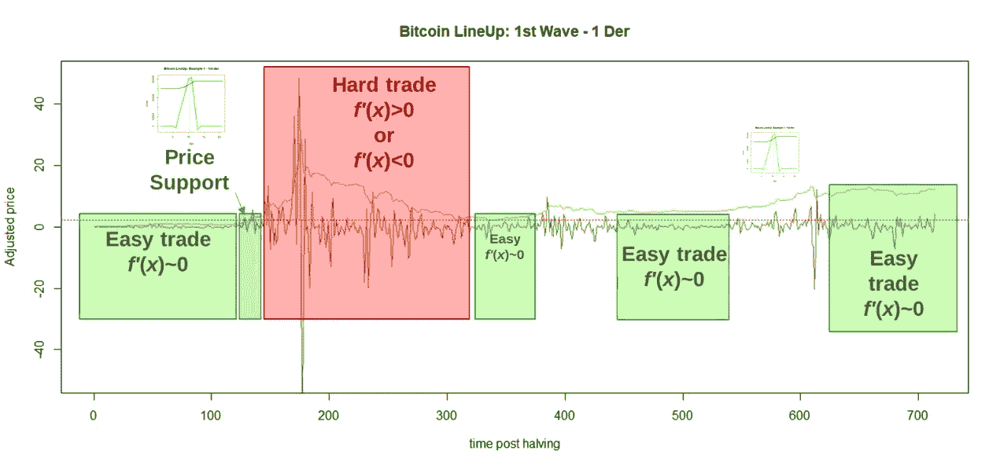
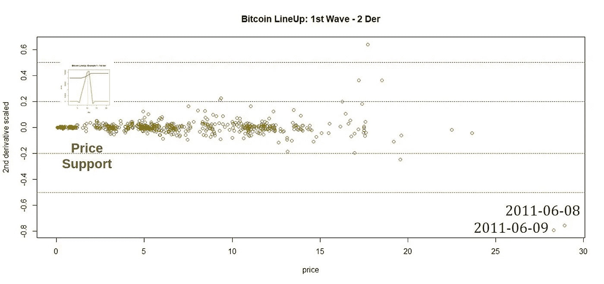
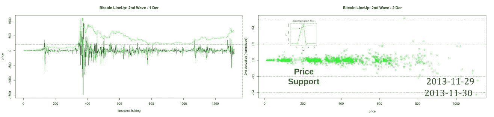
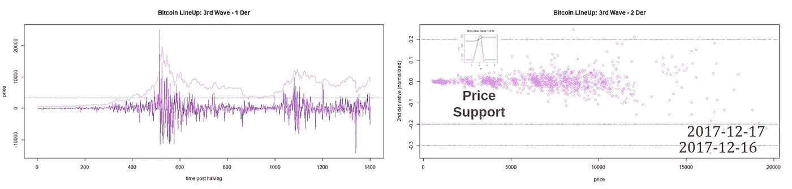
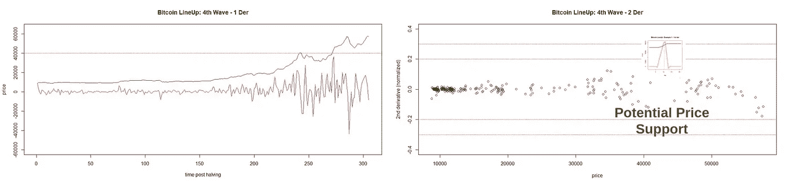

# 比特币阵容:价格支持模型的线性转换

> 原文：<https://medium.com/coinmonks/bitcoin-lineup-a-linear-transformation-for-price-support-modeling-e513715b8288?source=collection_archive---------2----------------------->

## **简介**

当新手想开始学习比特币时，他们总是想知道何时买入。本文提出了比特币价格的线性变换，以评估价格支持，并为有趣的持有策略找到比特币的最佳条目。
在之前的一篇文章中，我提出了一种基于*比特币波动*的比特币价格建模新方法，指向买入区和卖出区[1]。对于这一提议，*比特币波*模型旨在通过将未来波近似为先前波的线性组合来预测下一波。
因此，本研究旨在调查寻找临界点的微分(微积分基本定理)和导数测试的潜力，换句话说，当你可以购买并持有而不遭受损失时。

## **比特币阵容数据处理**

从 2010 年到 2021 年，使用了 Coinmetrics 的价格[2]。考察了四个减半波(2010 年> 2012 年，2012 年> 2016 年，2016 年> 2020 年，2020 年> 2021 年)。接下来，通过计算一阶和二阶导数对波进行导数测试。
使用 R 软件[3]和信号处理(信号)包[4]进行数据导入、预处理和多变量程序。所有的数据处理都是使用 R 统计计算基金会的免费软件进行的。

## **比特币阵容模型**

作为优化的起点，使用了第一波(图 1)。导数测试用于定位比特币价格函数的临界点。当在一个区域时，一阶导数趋于零(f′(x)~ 0)，它被认为是一个容易交易的买入区域，因为它正在形成价格支撑。

Figure 1\. Bitcoin LineUp: 1st wave — 1st derivative test

另一方面，当一阶导数达到最高或最低值时，它表明一个硬交易区，只是对专业交易者而言。如果 f (x)>0，市场在增长，如果 f (x) <0, the market remains decreasing. The second-derivative test can help to find the time to sell, as can be observed in Figure 2.

Figure 2\. Price of Bitcoin vs 2nd derivative scaled (autoscaling).

The first important information from Figure 2 is that in the best moments to sell, the 2nd derivative is very negative. Next, the second important piece of information is the price support, it appears in a region with a gap between prices.
类似地，一阶和二阶导数应用于第二波(图 3)、第三波(图 4)和第四波(图 5)。

Figure 3\. Bitcoin LineUp: 2nd wave — 1st and 2nd derivative tests

Figure 4\. Bitcoin LineUp: 3rd wave — 1st and 2nd derivative tests

Figure 5\. Bitcoin LineUp: 4th wave — 1st and 2nd derivative tests

尽管众所周知的事实是，在比特币市场中，人们为了获得自由市场的无形之手而采取了行动，但衍生品测试可能对新手有用，或许对专业人士也有用。

## **结论**

衍生产品测试已经被证明是一个很好的感知支持价格的模型，可以显示卖出的时间。这里提出的用于支持价格确定的比特币排队方法对于初学者是有利的，尤其是在作为比特币市场难以操作的市场中。此外，这种方法可以帮助找到最佳销售区。

如果喜欢这个内容可以考虑提示:
BTC:BC 1 qljlmuwq 9 gyvn 7 uhvwwypsj 4x 8 hcetuzhw 9 quh 0
BNB:bnb 159am 7 huy 53mg 7 sygnklrtxkahkdk 2 qxzmnk 0 GW
BUSD:bnb 159am 7 huy 53mg 7 sygnklrtxkahkdk 2 qxzmnk 0 GW

## **致谢**

作者感谢、Hal Finney、Nick Szabo、赵昌鹏、Sabrina Moraes、Fernando Ulrich、André Fauth、Criptomaníacos 和 Vela Trader。

## **参考文献**

1.[https://edgarmaraes . medium . com/bit coin-waves-a-linear-combination-for-price-modeling-2b 89 f 72 e 552d](https://edgarmoraes.medium.com/bitcoin-waves-a-linear-combination-for-price-modeling-2b89f72e552d)

2.[https://coinmetrics.io/](https://coinmetrics.io/)

3.[https://www.R-project.org/](https://www.R-project.org/)

4.[https://www . rdocumentation . org/packages/signal/versions/0.7-6](https://www.rdocumentation.org/packages/signal/versions/0.7-6)