# 在安卓手机上使用比特币&闪电网络

> 原文：<https://medium.com/coinmonks/bitcoin-ln-on-mobile-android-using-the-bitcoin-lightning-wallet-to-make-ln-payments-1427510967f0?source=collection_archive---------1----------------------->

***注:*** *闪电目前处于内测。本指南将向您展示如何在您的移动 Android 手机上同时使用来自不同开发商的两个钱包，从而成为比特币超级用户并获得最佳体验*

在本指南中，您将安装 [Samourai 钱包](https://play.google.com/store/apps/details?id=com.samourai.wallet)和[比特币闪电钱包](https://play.google.com/store/apps/details?id=com.lightning.walletapp)。

使用 Samourai 的目的是因为它支持发送和接收的每种地址格式，并且非常适合与 BLW 配对，以便在移动 Lightning 钱包中拥有良好的 UTXO 管理和高级用户功能所需的所有功能。

Samourai 有许多很好的隐私功能，如跳弹和反向硬币控制能力，所以它通常是一个很好的钱包。它还让你能够发送和接收每一个比特币地址格式。另一方面，BLW 只支持 bech32 地址(本地 P2WPKH 是开销最少的 UTXOs)。由于 bech32 由 Samourai 支持，您将能够将 BTC 发送到您的比特币闪电钱包。

> 另读:[最佳比特币硬件钱包](/coinmonks/the-best-cryptocurrency-hardware-wallets-of-2020-e28b1c124069)

OpenNode 是一个基于网络的销售点平台，支持 Lightning，接受 LN 支付不收费。如果您使用 LN 提取 BTC，他们也不收取任何费用。在本指南中，您可以使用 OpenNode 来测试 mainnet LN wallet 使用比特币 Lightning Wallet 进行支付和取款，或者使用诸如 [Y'alls](https://yalls.org/) 和 [LightningSpin](http://LightningSpin.com) 之类的服务。

👇

**第一步:**安装 [Samourai 钱包](https://play.google.com/store/apps/details?id=com.samourai.wallet)和[比特币闪电钱包](https://play.google.com/store/apps/details?id=com.lightning.walletapp)

**步骤 2:** 设置您的 SamouraiWallet:

*   通过使用 BIP39 规范创建一个密码短语来启动您的新钱包。您将需要此密码以及 12 个单词的种子短语来找回您的钱包。
*   跳过制作 PayNymID(您可以稍后再做)
*   设置打开钱包的 pin 码
*   用三个点进入设置→钱包→显示助记键。
*   写下你的 12 字种子助记符
*   现在，您可以开始使用 Samourai 钱包收发信息了

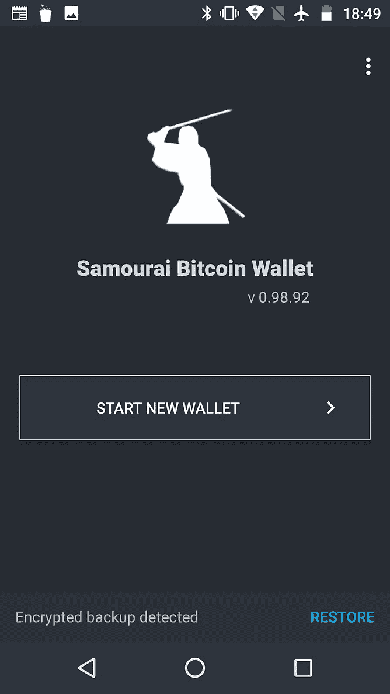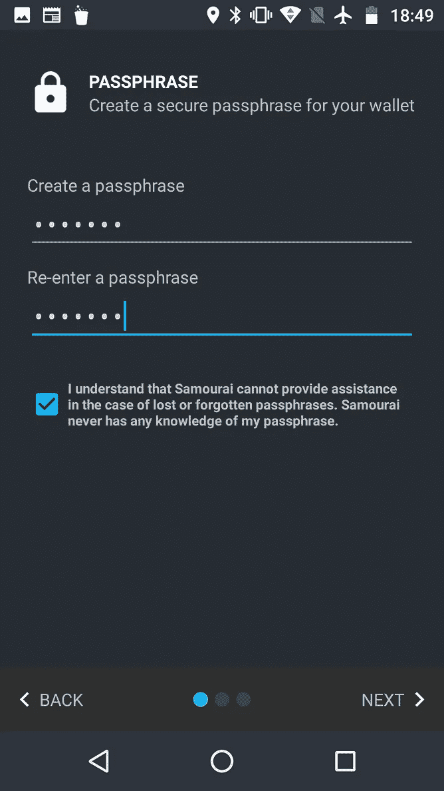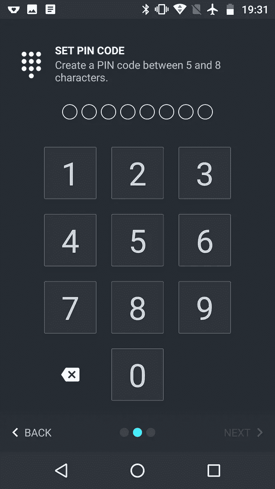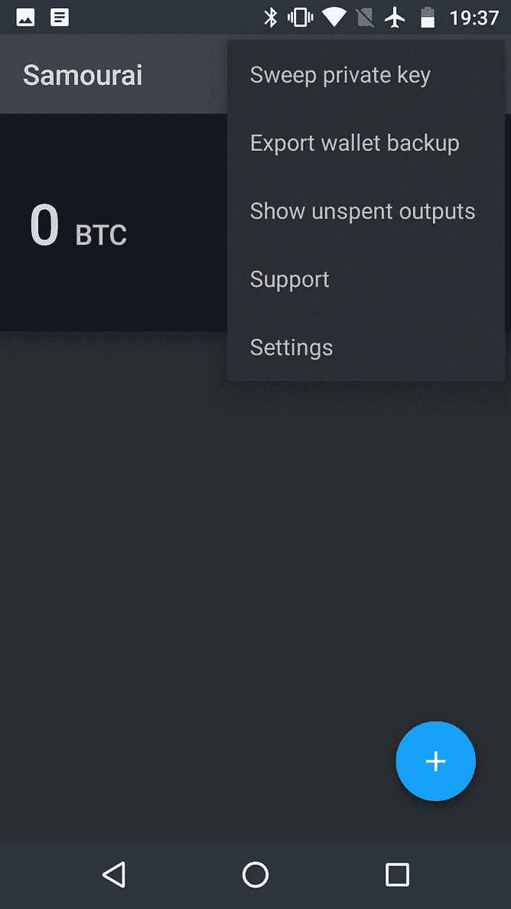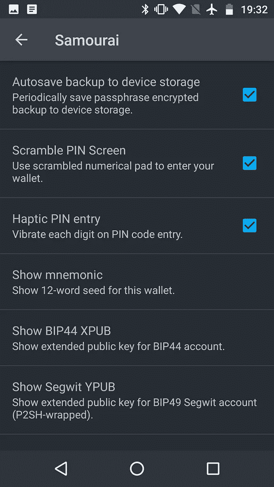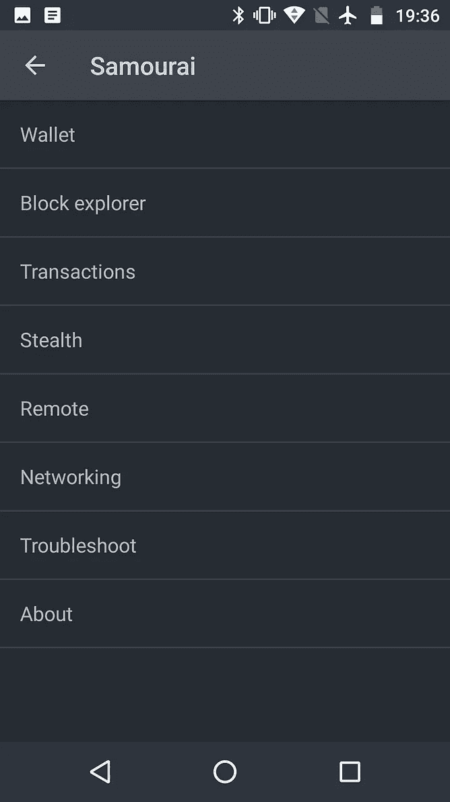

After you create a wallet and pin code, go to your settings using the 3 dots at the top right, then navigate to ‘Wallet’, tap ‘Show mnemonic’, and write down your 12 world seed phrase.

**第三步:**将硬币存入你的 SamouraiWallet

点击钱包主屏幕上的蓝色圆圈(+)。然后点击接收，生成发送比特币的地址。

为了将比特币存入你的钱包，SamouraiWallet 允许你生成 bech32 地址，以及 P2SH 或 P2PKH 地址(1 或 3)。你也可以发送到比特币闪电钱包，无论你的钱包使用什么输入(UTXOs)。

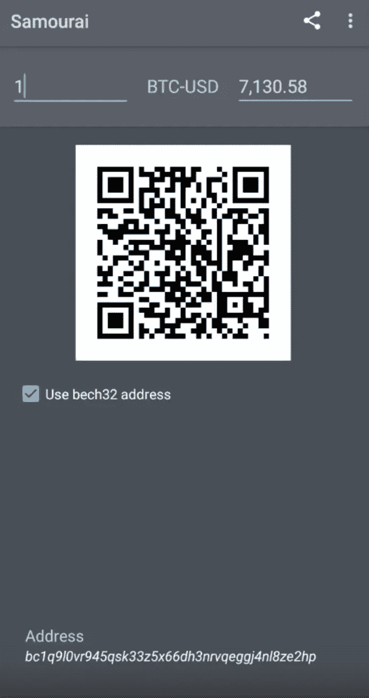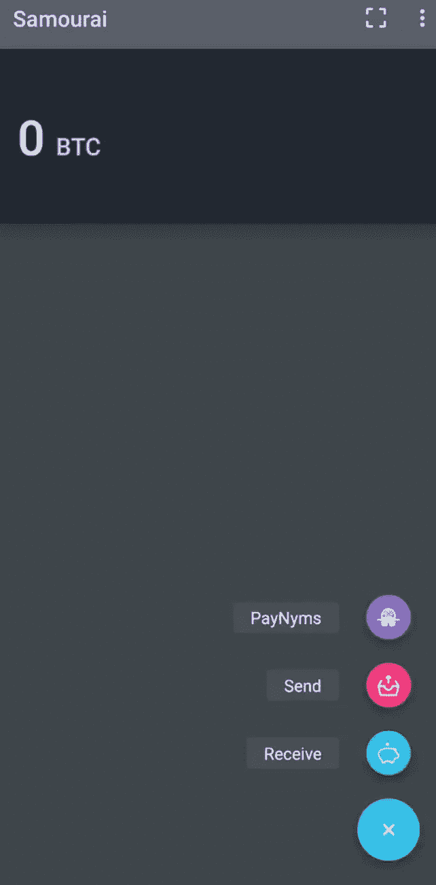

Click the blue (+), then click receive to generate an address. Unselect ‘Use bech32’ if you need a bitcoin address in anolder format.

一旦你在 SamouraiWallet 上收到了一些 BTC，你就可以发送一些到你的比特币闪电账户上。让我们开始设置 BLW。

**第四步:**用‘新钱包’设置比特币闪电钱包。

按照说明，写下你的助记种子短语。你会看到 BLW 使用 Bech32 地址接收 BTC 链，SamouraWallet 可以发送到。从大多数用户的角度来看，基本上有两种不同的地址格式，即常规地址和 bech32 地址。常规地址可以以 1 或 3 开头，包含数字、大写字母和小写字母的组合。

第二种类型，bech32 地址以 **bc1** 开头，混合使用小写字母和数字。因为它们没有混合大写和小写，所以被认为是“人类可读的”——因为它们可以很容易地通过电话或无线电阅读。在二维码下方，您可以看到钱包为接收资金而生成的 bech32 地址示例:

BC 1 qax 4 r 46 cmkfzd 4 LH 2 c 7 meh y0 DH 9n 0054 dsrl 8 ha*(请做* ***不要*** *发送任何东西到这个地址，除非你想把它当成烧过的比特币)*

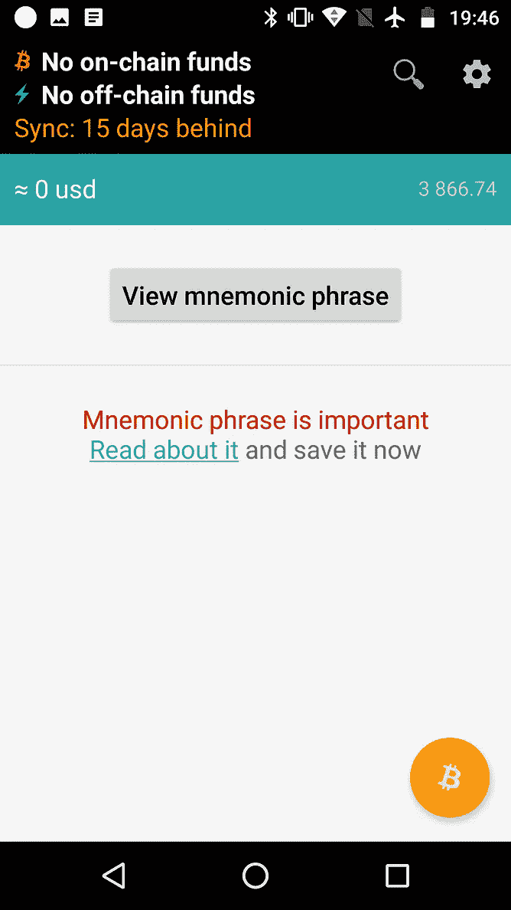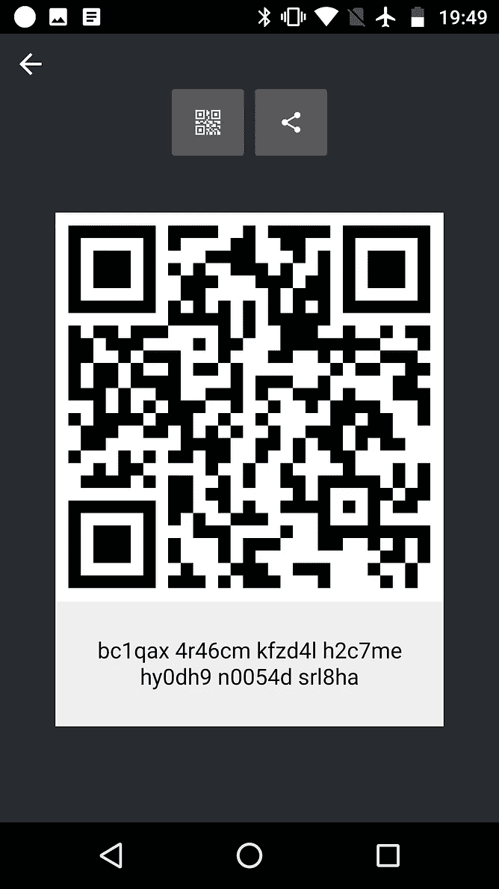

之后，您可以生成一个如上所示的接收地址，并从 Samourai 发送给它。一旦您的交易被确认，然后您就可以打开一个渠道。

**第五步:打开一个通道**

在您可以在闪电网络上消费之前，您的首次交易需要 3 次确认。当你打开一个通道时，钱包建议使用 ACINQ 节点，因为它也支持接收付款。查看 1ml.com 来寻找其他好的节点，例如由 Lightning 应用程序开发者 Pierre Rochard 运行的节点

一般来说，移动用户不需要一两个以上的频道，但是你可以选择打开任意多个。我建议从一个大通道开始到 ACINQ node，比如$25，只是为了开始玩 Lightning，从那里你可以打开另一个通道，如果必要的话直接到你认为你可能会经常使用的服务。

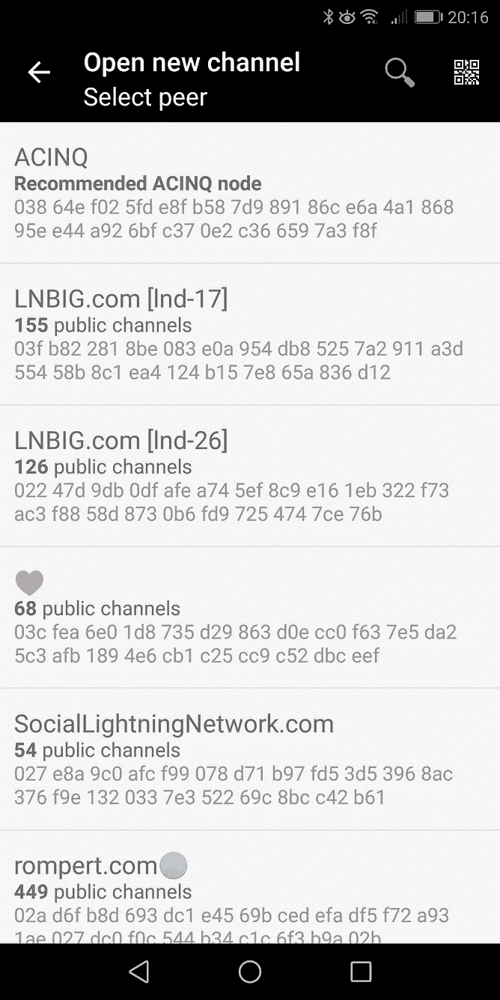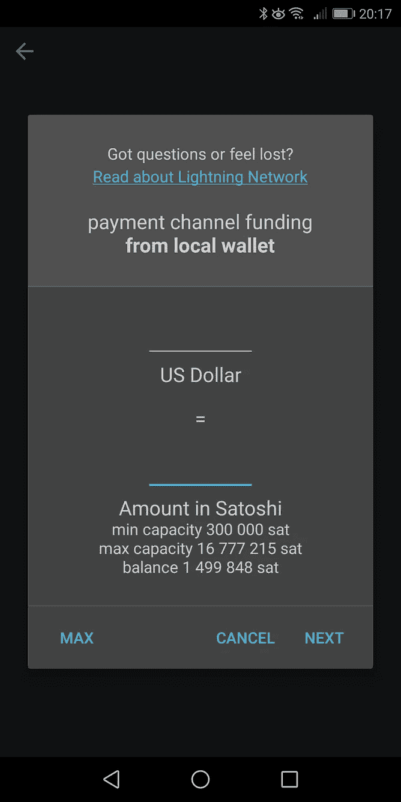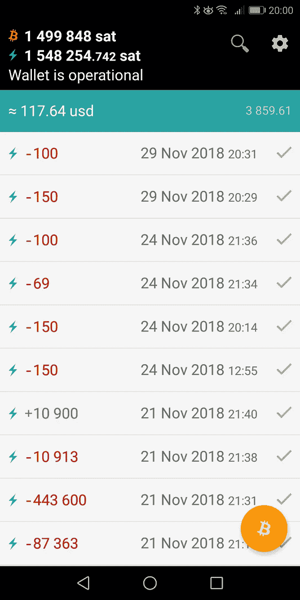

第六步:支付一些款项

您需要进行一些支付，或者使用 zigzag.io 等服务来创建传入渠道流动性，然后才能接收 LN 支付。最简单的办法就是支付几个 satoshis 来测试类似于[yalls.org](https://yalls.org)的东西，或者去 [Bitrefill](https://www.bitrefill.com/buy) 买一张礼品卡。

LN 真正的亮点在于低于 100 美元的付款。闪电渠道的大部分流动性都在这个范围内，至少在比特币价格上涨之前是如此，比特币价格上涨对闪电网络的流动性产生了指数增长效应。

现在，你可以去 LightningSpin 玩游戏，或者用 [OpenNode](https://opennode.co/dashboard) 开发票，或者给我发个提示:[https://tippin.me/@BrickstringTech](https://tippin.me/@BrickstringTech)

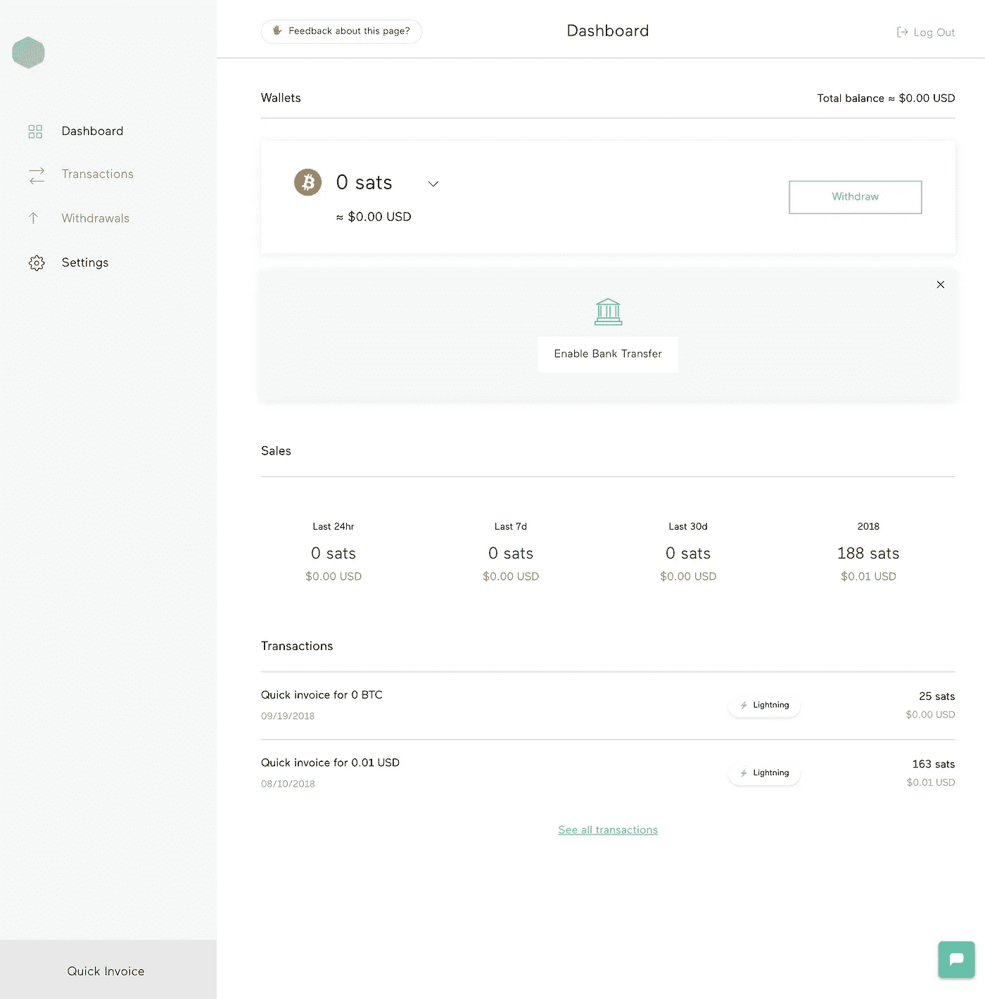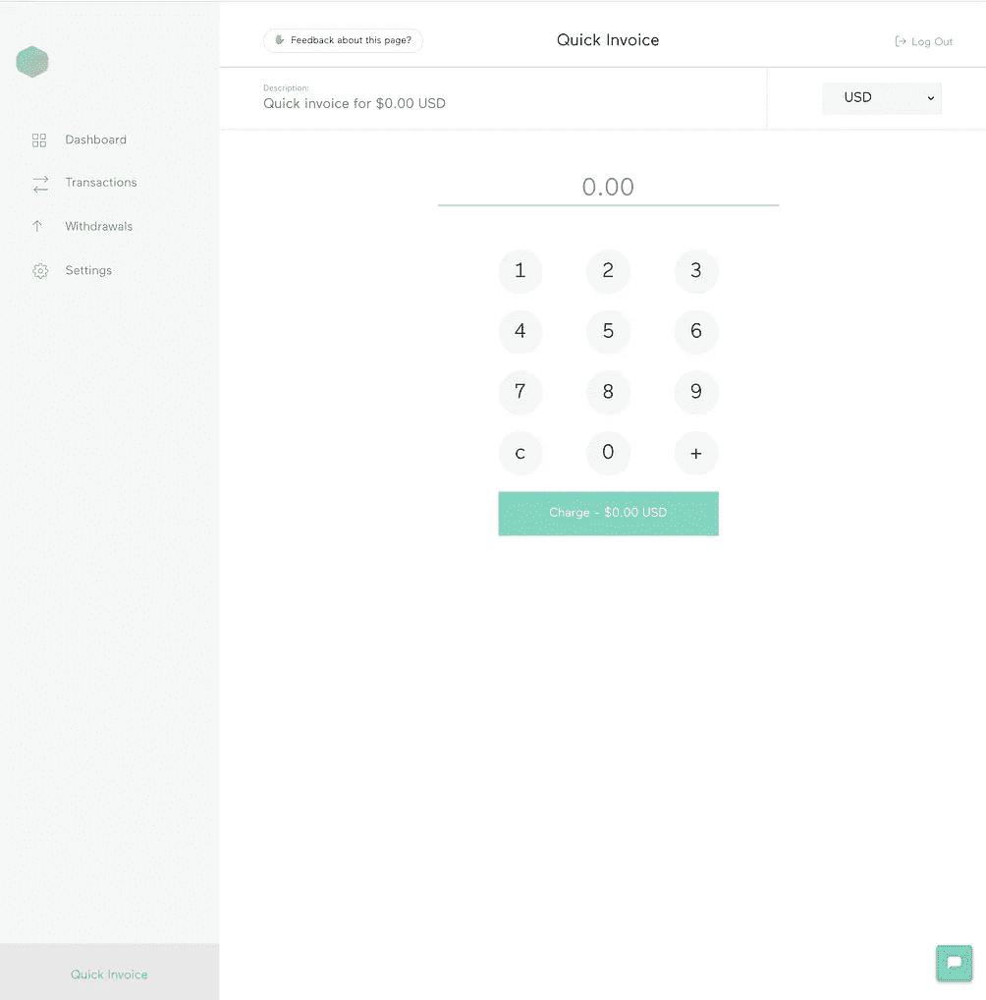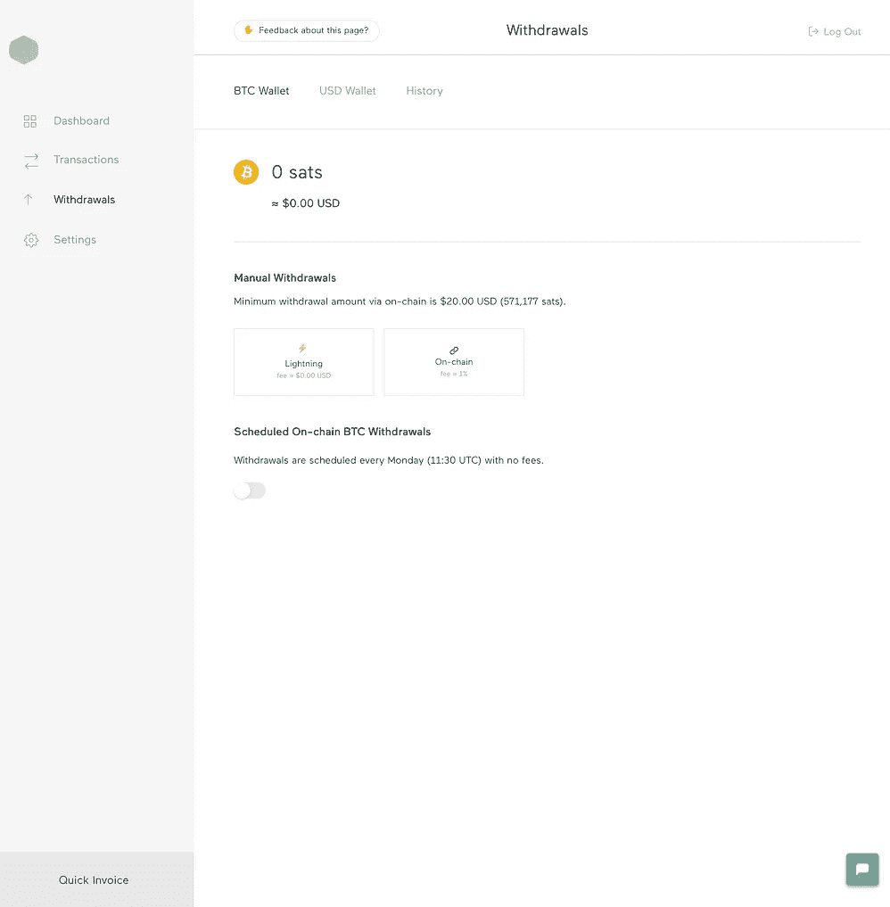

> [直接在您的收件箱中获得最佳软件交易](https://coincodecap.com/?utm_source=coinmonks)

