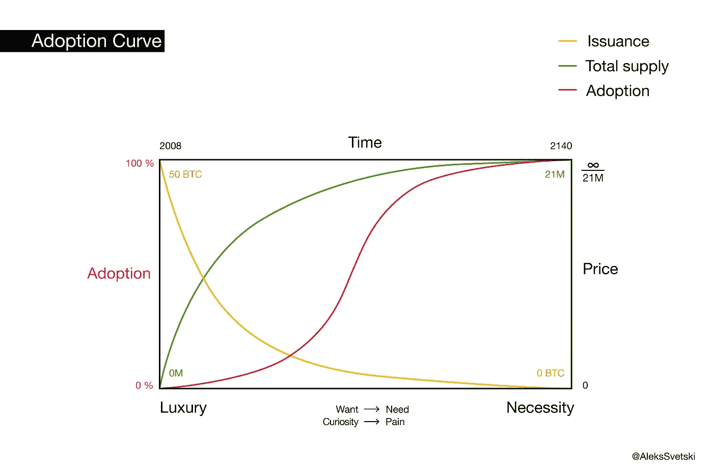
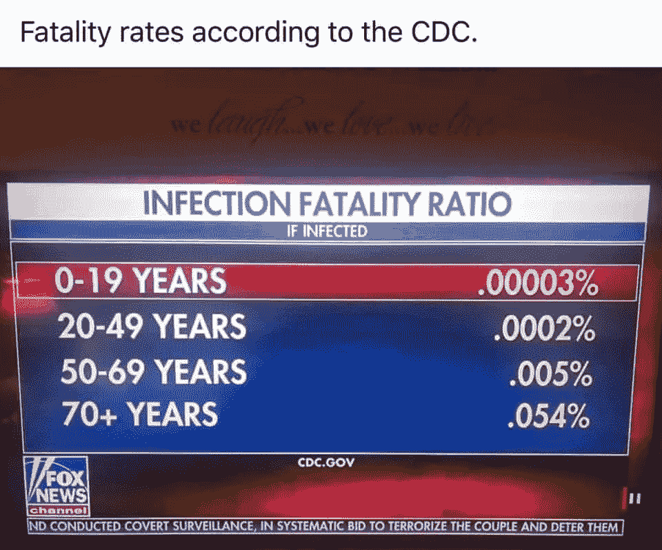
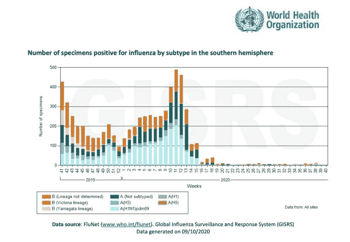
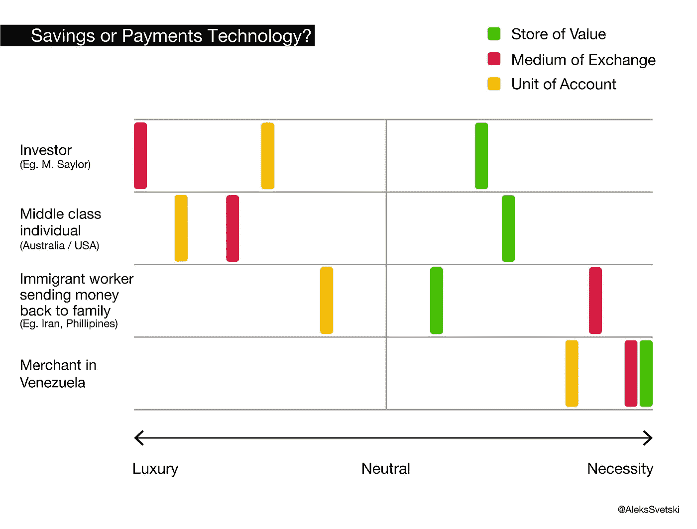
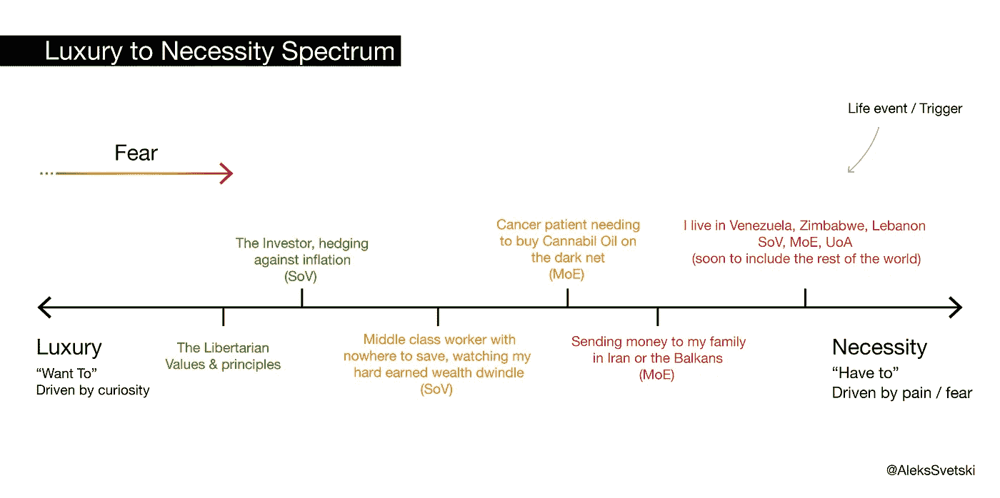
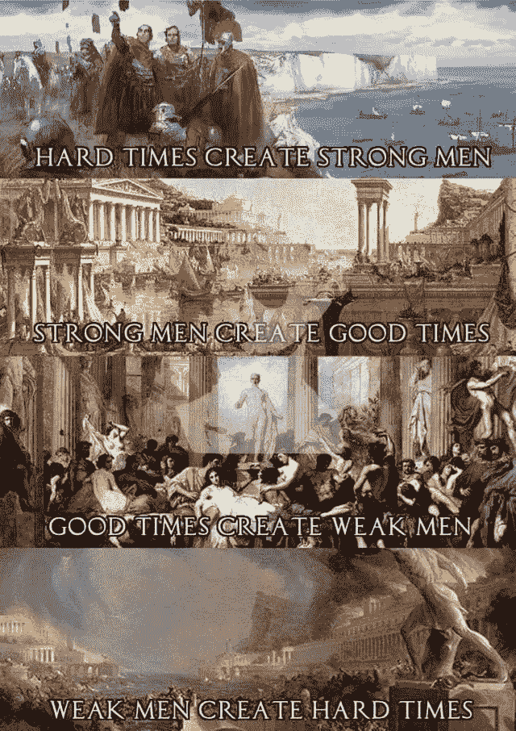

# 比特币和锁定

> 原文：<https://medium.com/coinmonks/bitcoin-lockdowns-9a4f41a6a6ff?source=collection_archive---------1----------------------->

## 进化中。从奢侈品变成必需品

对一些人来说，比特币曾经是，而且在许多方面仍然是一种奢侈品。对另一些人来说，这从一开始就是必须的，无论是作为一种储存财富的机制，还是作为一种不受审查的收款方式。

对我们其他人来说，它介于奢侈品和必需品之间。

在这篇短文中，我将认为，随着时间的推移，比特币将成为我们所有人*的必需品，跨越它的所有维度(苏联、莫伊、UoA)，如果这些愚蠢、严厉的封锁做了什么，他们已经加速了比特币从一些人可能“想要”的东西到每个人基本上“需要”的东西的转变。*

# *自由和审查阻力*

*自从共产主义的东德、苏联或者甚至是德国国家社会主义党(即德国社会党)以来，基本自由和自由目前受到的侵蚀还没有达到这种程度(至少在现代或西方世界是这样的)。纳粹的)在世纪中叶的欧洲。*

*我这么说并不是为了煽动阴谋论或锡纸帽迷因。我非常坦率地这样说。*

*看看事情的现状就知道了。
在 2019 年，谁会想到在 2020 年:*

*   *世界上超过一半的人口会连续几周或几个月被强制宵禁。*
*   *有些人不被允许离家 5 公里以外的地方冒险。*
*   *你需要得到许可才能拜访朋友、家人和爱人。*
*   *你会被告知你能和谁在一起，不能和谁在一起*
*   *咖啡馆、酒吧和餐馆等现金交易场所会拒绝接受现金。*
*   *你会为自己是一个年轻健康的人在户外散步、晒太阳和呼吸新鲜空气而感到羞愧。*
*   *你将不再能够经营自己的生意，参加社交聚会或去当地的教堂*
*   *如果你提出一个问题，表达不同的观点或者质疑主流叙事的有效性，你会被审查或者取消。*
*   *如果没有棉签塞入你的鼻子和喉咙来检测你没有任何症状的东西，你将不能去任何地方旅行。*
*   *非医务人员会强迫你戴上无效的、无意义的口罩，这种口罩限制了你对重要氧气的摄入，同时回收了你呼出的二氧化碳。*
*   *母亲会在孩子的足球比赛中被超重的“保安”检查，尽管她坐在离其他人 3 米远的地方。*
*   *警察会指控并逮捕理发师，因为他们剪了某人的头发，就好像他们隐藏了大规模杀伤性武器*
*   *警察会掐住你的脖子，殴打你，甚至开车撞倒你，因为你决定走在街上，把你的健康掌握在自己手中。*
*   *如果“政府”认为你或他们可能感染了病毒，而你却没有任何症状，那么年幼的孩子将违背他们的意愿被带离他们的父母，而你的孩子有 99.999%的机会不会受到病毒的影响。*

*尽管有大量相反的数据，如 CDC 最近发布的数据，概述了 Covid 导致的大约 20 万例死亡中的 94%实际上是共病病例，其中大多数是老年人患的严重疾病:*

> *CDC 本身在八月底引起了一场骚动，他们估计这种病毒只直接导致了 6%的死亡，也就是现在 187000 例死亡中的 11000 例。大多数死者是老年人。*
> 
> *其余 94%的人死于冠状病毒，而不是仅仅死于冠状病毒。这些人平均年龄较大，有 2.6 倍的其他健康问题。这意味着很大一部分死亡患者有三种或三种以上的共病。换句话说，冠状病毒导致的大多数死亡都发生在重病患者身上。*

*或以下内容:*

******

*Think about this the next time you‘re in the mood to defend a lockdown or another draconian mandate.*

*我可以继续下去，但这不是一篇反电晕/锁定的文章。*

*我只想说，我们的先辈过去以共产主义和法西斯主义的形式努力阻止的多数人暴政和统治，现在又以全球主义、社会主义和虚假的“民主”的形式抬头了。*

*我们现在就在这里，看着基本的自由和为我们自己思考、说话和行动的能力在一个五音不全、含糊不清的“为了你的安全”的信息背景下被废除。*

## *法定权力是暴政。*

*无知的统计学家做出傲慢无知的下意识决定，他们把每个人都当成电子表格上的一个数字，这已经超越了犯罪*。**

*这种封锁的后果将导致比任何病毒都希望达到的多几个数量级的社会、环境、精神、身体、家庭、经济和心理损害，并且相关的死亡人数(直接和间接)将是惊人的。*

*这就是为什么，与他们想让你相信的相反， ***自由远比安全*** 重要。*

*盲目服从毫无根据的[法定]权威是他们所依赖的，他们的目标是通过你的无知或者通过压制和审查那些说出来的人。*

*这就是一项能够颠覆审查、集中控制和没收的技术的绝对必要性所在。*

*这是维持未来希望的唯一方法。*

*言论和表达的自由是最基本的，而最基本的表达形式来自你的时间和精力，我们用一种叫做金钱的工具来衡量。*

*这就是比特币重要的原因。它保护思想、行动、劳动、言论和选择的自由。*

**在这里阅读更多:**

* [## 为什么比特币很重要

### 这比你想象的更重要

medium.com](/hackernoon/why-bitcoin-matters-c8bf733b9fad) 

许多人警告多年的事情正在发生。我们正眼睁睁地看着社会滑向暴政。

剩下的唯一问题是你会醒来还是被叫醒。你是要为此做点什么，还是沾沾自喜，或是串通一气？

# 好奇和痛苦

2019 年 6 月，在[比特币](https://blog.coincodecap.com/a-candid-explanation-of-bitcoin) 2019 年会议上，我与马特·奥德尔和[马蒂·本特](https://medium.com/u/67c7d3965b07?source=post_page-----9a4f41a6a6ff--------------------------------)挤在一个豆荚上(见下面的链接)，我提到了我在那年早些时候提出的一个概念，以此来理解人们为什么会选择比特币。

我称之为好奇的痛苦光谱。

简而言之，我认为人们进入、拥抱、了解或发现自己置身于比特币中有两个主要原因:

1.  好奇心
2.  疼痛

我考虑了三分之一，即:

3.贪婪

但也许这实际上跨越了两个关键原因，因为贪婪是一种增强生存能力的生物机制，并且(当被控制时)有助于满足快乐和避免痛苦……*但我将把这个讨论留到未来的文章*。

现在先用 ***好奇心 VS 痛苦的框架。***

在“西方”，在社会仍然有稳定的“外表”的地方，进入比特币真的需要一定程度的好奇心，而许多人并不具备这种好奇心(当今世界最常见的特质似乎是顺从)。

它需要你有足够的勇气去质疑历史，质疑社会如何运作，质疑强制的道德，质疑国家，质疑暴力垄断的危险，质疑道德和经济等等。

你一定对如此广泛的话题感到好奇，难怪很少有人在早期接触比特币，以及为什么大多数人只会跟随。事实上，我非常确定这一点，我可以预测:

> 最后 50 亿人采用比特币的时间可能会和前 500 万人一样长。

不管你怎么努力，这种差异永远不会改变。

从定义上来说，反向投资者在大众中所占的比例总是较小的，而羊群行为总是会跟随。

不是说谁对谁错，因为他们从根本上需要对方。反向投资者需要足够正确，羊群总有一天会到来，否则他只是一个疯狂的隐士，而羊群需要反向投资者质疑现状，发现尚未被广泛接受的东西。

唯一需要回答的问题是，你是一开始就足够好奇的逆势群体的一员，还是最终太痛苦时才出现的群体。

你属于哪一类取决于你选择好奇的程度，以及你愿意承受何种痛苦，因为每个人都有自己独特的痛苦形式。逆向投资者被称为激进分子，他们必须忍受嘲笑，走一条更孤独、更少人走的路，直到有一天被救赎，而羊群中的羊会在数量上找到避难所，但在救赎之日会付出更高的代价。

一是有意识。另一个不太好。你会选择哪一个？

这就引出了我的下一个观点..

## 想要 VS 不得不

太多的人愿意在生活中随波逐流，无知，盲目，顺从和浅薄，直到他们被某种外力震惊而采取行动。

> 我经常对我认识的人和我遇到的人说:*真正的全球疫情是一个严重缺乏个人勇气&好奇心的人。*

需求不仅是所有发明之母，也是所有变化的祖母。对许多人来说，他们的自满导致他们生活在“不得不”做的事情中，而不是生活在“想要”做的事情中。

当环境改变时，不管他们喜欢与否，他们也被迫改变，不幸的是，这往往会削弱他们的前景或限制他们的选择，导致他们不得不做他们不想做、不想成为或不想拥有的事情。

正是对这些变化的预期使人们与众不同，而这种准备的先决条件是思考、提问、学习和行动的好奇心和勇气。

这就是当我说人们因为好奇或痛苦而来到比特币时的意思，也是为什么前者是一种更深刻的方式，因为*的选择是你自己的意志*。

当然，这个规则也有例外。生活中有一种我们谁也无法消除的随机因素，再多的准备也无法保护你。有些事件不幸导致死亡、疾病、痛苦或损失，而这些都不是你的直接“过错”。

这是你 ***无法*** 改变的事情。自然是完美的，因为它是不规则的。*因为*有随机性的成分。

也有法定权力的强加，我们发现自己受制于我们出生的地方，我们出生的时代和我们成长的社会。

在某种程度上，后者是 2020 年菲亚特权力机构的锁定和严厉的过度延伸。我认为没有人真正准备好事情会发展得如此之快。

虽然我们无法改变这些情况，但我们中的一些人已经做好了更充分的准备，因为我们已经足够好奇，可以在更早的时候开始通往主权的旅程。

许多人被抓了个措手不及，现在正忙着弄清楚下一步要干什么。

这是 2020 年的一线希望:

***新一波人来比特币，是因为他们的好奇或痛苦的门槛被跨过了。***

虽然对一些人来说，这是一个哭泣的受害者，并乞求更多相同的原因，但对另一些人来说，这是一个唤醒思考更深层次的电话。

**这个**就是为什么比特币的采用会一波一波发生。
人们出于不同的原因会变得好奇，他们的疼痛阈值也各不相同。

他们进入的动机是不同的，要么是因为他们想进入，要么是因为他们不得不进入，这就是为什么下一节的图表比本页的文字更有价值。

# 比特币的转型:奢侈品→必需品

比特币的全球采用将与比特币的必要性相关联，与它的价格相关联，与它的流动性相关联，与它的供应上限相关联，与它的发行率、散列率等等相关联。

以下是我在视觉上表现这一点的尝试。

Curves are approximations, for illustrative purposes. I’m not a quant. H/t [Knut Svanholm](https://medium.com/u/f12c589770d1?source=post_page-----9a4f41a6a6ff--------------------------------) for the Infinite/21m.

一些比特币人希望明天实现超级比特币化，另一些人希望有更多的时间积累，然后像我一样的其他人在以下两者之间徘徊:( a)希望更慢、更平稳、暴力程度更低的过渡;( b)看到一个强大的经济和私有产权体系加快步伐，颠覆/瓦解现有的腐败体系，我认为事实的真相是，这一切联系太紧密了。

混乱是不可避免的，因为比特币的出现不是因为我们今天拥有的是一个公正健全的社会体系。

它的出现是因为“丹麦这个国家有腐败的东西”。
菲亚特系统的整个庞氏骗局持续了一个多世纪，并在 1971 年加速，已经侵蚀了一切，从私有财产权(文明的基石)，到自然法、金钱、哲学、心理学、伦理学、历史、科学、教育、我们的健康、食物、家庭、环境、我们的稀缺资源、我们的个人代理&责任、我们的个性和我们的理智。

比特币不仅仅是某种“替代货币”。
这是我们需要的救生艇，因为我们所居住的腐败腐朽的大厦将在自身无能和背离自然现实的重压下分崩离析。

随着这一点的临近，比特币的必要性将会增加。随着比特币必要性的增加，与之相关的痛苦和动荡也会增加。

问题是需要多长时间？它会延续一个世纪，还是需要十年？

无论答案是什么，比特币的价格和总采用率将保持同步。这一点我几乎可以肯定。

# 储蓄技术+支付技术

关于比特币的争论由来已久，到目前为止理智的人占了上风。

比特币早期形成的关键是其总经济规模，因此 buy & hodl 是必要的，以确保在建立更快、更私人支付的基础设施的同时，不可审查的结算担保到位。

尽管比特币的发展“总体上是渐进的”，但它从第一天起就体现了货币的所有属性和功能(SoV、MoE、UoA ),这一事实意味着来自世界各地不同地区的不同人将以不同的速度、出于不同的原因沿着这个光谱前进。

All move to the right as time marches on.

在新兴世界，它既是一项储蓄技术，也是一项支付技术。

在一些地方，账户单位元素也变得至关重要，因为它们率先向循环比特币经济转型。

在第一世界，比特币还不是(广义地说)“必需品”，但随着经济政策破坏者和政府打手的每一项新命令，这种情况每周都在发生更快的变化。

首先，从储蓄的角度来看，它正慢慢成为一种必需品，随着令人厌恶的 KYC 变得更加繁重&现金消失，它也将成为一种支付机制的必需品。

Life events will trigger to flight to Bitcoin for different reasons.

比特币的美妙之处在于，从储蓄、支付和会计的角度来看，它可以抵御审查。

设备和网络准备就绪。他们很稳定。它们已经被证明，并且在个体层面上是可以验证的。

这些成分是吸收资本流入所必需的，因为它在财富储存和管理的所有重要方面变得更加必要。

我要离题讲一个关于 KYC 的小(但相关的)笔记。

## KYC 违背了金钱的目的。

[贾科莫·祖科](https://medium.com/u/557ceedfc78?source=post_page-----9a4f41a6a6ff--------------------------------)是比特币最真实、最聪明的人之一。我不是追星族，他也没有付钱让我这么说，但我只是实话实说。

不久前，他写了一个关于比特币和隐私的精彩的两部分系列，我认为其中一个关键的观点是，金钱是一种发明，它允许我们通过提取信任或了解交易另一方是谁的需求来衡量社会的复杂性！

金钱允许不知道对方是谁(也不想知道)的两方互相交换时间、精力、资源和商品。

复杂繁荣的社会就是这样建立起来的。
这就是创新和新想法得以产生的原因。

这种荒谬的“了解你的顾客”现象在过去的 50 年里出现了(在过去的 10 年里真的加速了)，它不仅与社会保持向前发展的能力是对立的，而且侵犯了人们的自然自由，他们的隐私以及他们选择如何使用他们用时间和精力换来的财富的权利。

这是一个严酷、专制、老大哥式社会的基础，也是为什么随着我们进入新的十年，比特币将从根本上变得更加必要的另一个原因。

随着他们转移现金，迫使人们进入负利率，并开始引入他们可以通过新的“数字央行美元”直接没收你的财富的机制，你将别无选择，只能找到保护你财富的方法。

对此也不要有任何误解。这不是一个“如果”，而是一个“什么时候”。照顾型社会(从民主到独裁)从根本上来说是有缺陷的，因为“统治者”在游戏中没有利益。他们的动机是为了从现在获利而出卖未来，他们会以牺牲环境、人们的财富、人们的未来和他们孩子的未来为代价。

***在一个以“公共”法则为基础的体系中，这一点不能改变。***

小丑表演，即央行、中央计划和国家将继续通过更多的限制、更多的监管和他们心血来潮制定的更武断的“法律”，扼杀他们赖以生存的主体，同时比特币网络继续增强，建立在其上的应用程序增强，持有比特币的总人数增加。

KYC、反洗钱和 CTF 只是另一组首字母缩略词，在我们即将进入的世界中已经不合时宜，随着它们的收紧，只会加速范式转变。

# 富人阶层

在我结束这篇文章之前，还有一点要注意。

> 看看当所有的富人开始害怕时会发生什么

恐惧是痛苦的前兆。这是我们试图避免疼痛的进化机制。

等着瞧吧，当这些积累了大量财富的人不再相信最初为保护他们而成立的政府的保证，现在把枪口对准他们准备抢劫时，会发生什么。

无论他们的财富是通过好的、坏的还是冷漠的方式获得的，这都无关紧要。他们都会想办法保护它免受下一次抢劫。

这一点，再加上我们其他中产阶级和平民也想这么做，只会导致真正的蜂拥而至，寻找一个政府无法触及的避风港。

相信我，我们比他们多得多。所以不管他们怎么努力，他们都无法阻止。

# 结论

## 所有的灾难都有一线希望。

2020 年的一线希望是比特币加速从奢侈品变成必需品。

这并没有消除犯罪行为，也没有消除灾难的责任，但它确实帮助我们这些能够独立思考的人将我们的意图、精力和行动集中到用柠檬制作柠檬水上。

请记住以下几点:

## 向必要性靠拢

在足够长的时间范围内，整个世界都将汇聚到比特币上，因为它是一种必需品。没有它，人类就无法生存。

另一种选择是所有的极权主义政权，无论是左派还是右派，他们将通过完全无视和背离数十亿年的自然法则和自然进化而毁灭自己。

我严肃而严肃的预测是，这不会是一帆风顺的。下一个十年可能会比我们读到或经历过的任何事情都更加动荡，尤其是在过去一两个世纪里一直在进行的可笑的货币、民族主义和官僚实验达到高潮的时候。

所以 HODL。

抓紧了，亲爱的。敬你的比特币，敬你的理智，敬你的好奇心和勇气。

这些美德将使我们在这条道路上和另一边团结起来。* 

*如果你喜欢这样，给它鼓掌，分享给周围的人，也许可以和你关心的人说些有意义的话。*

*您可以在 Twitter 或 Medium 上关注我:*

* [## 阿列克斯·斯维茨基

### Aleks Svetski 的最新推文(@AleksSvetski)。无国籍的黑猩猩，抵制芯片，豆荚，虫子，大豆…

twitter.com](https://twitter.com/alekssvetski)  [## 亚历山大·斯维茨基—中等

### 阅读亚历山大·斯韦茨基在媒介上的作品。CEO @ www . amber . app . Editor @ https://bitcointimes . news .比特币…

medium.com](/@AleksSvetski) 

如果你在澳大利亚，你可以开始从 Amber 购买[比特币](https://blog.coincodecap.com/a-candid-explanation-of-bitcoin)，Amber 是我帮助创立的公司，虽然我可能有偏见，但我认为这是积累比特币的最佳方式:

 [## 琥珀-比特币变得简单。

### 琥珀应用是开始投资比特币最简单的方式。在 90 秒内设置好，并立即购买和销售…

琥珀. app](https://amber.app)*