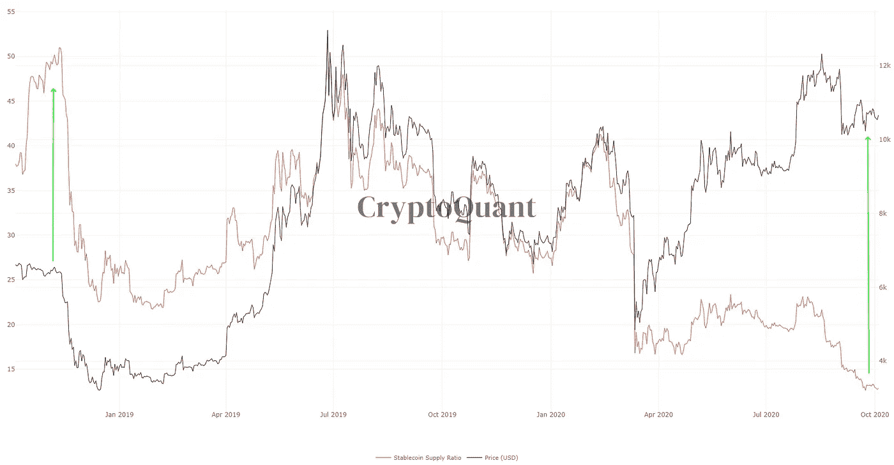
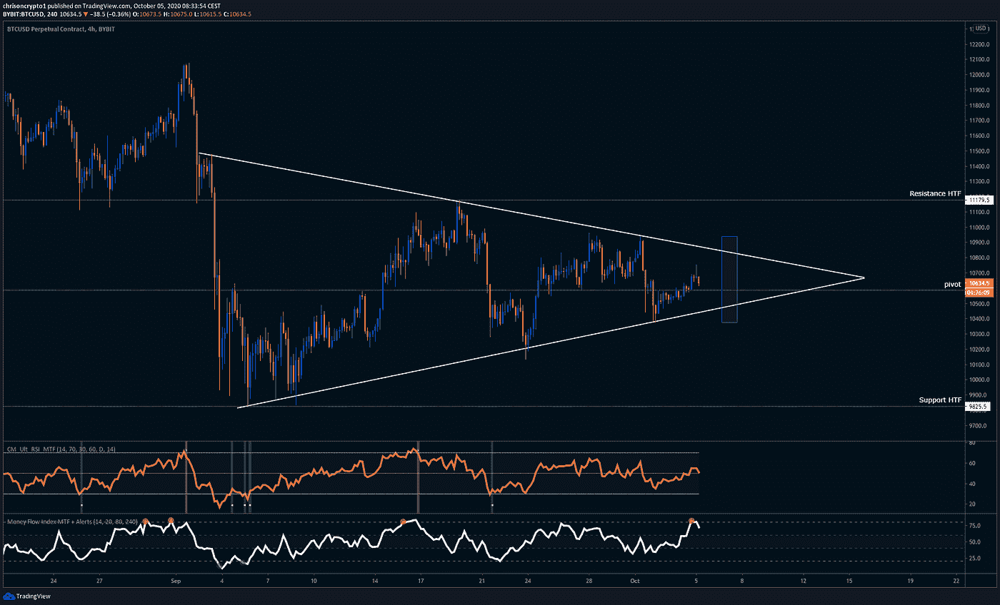
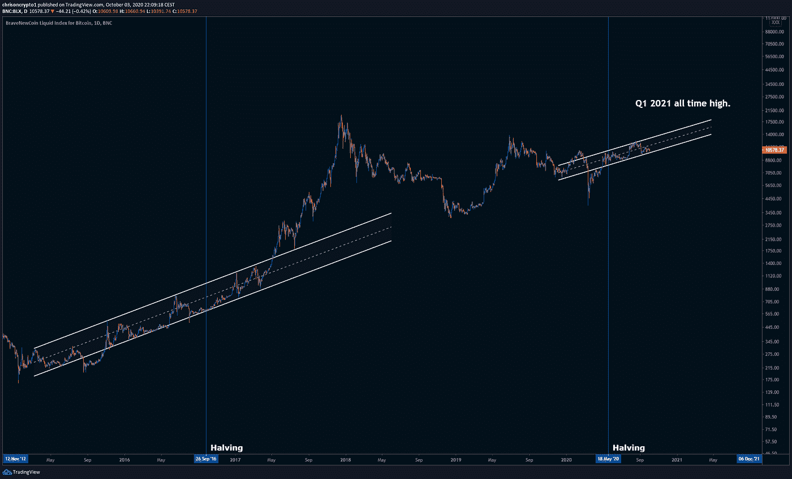

# 比特币宏观分形暗示创历史新高 Q1 2021？

> 原文：<https://medium.com/coinmonks/bitcoin-macro-fractal-suggests-all-time-high-by-q1-2021-a3bd0417a66f?source=collection_archive---------2----------------------->

这是充满惊喜和意外事件的一年，但一旦美国大选结束，至少在短时间内，可预测性因素将有望回归。

事实上，我们即将看到 2008 年金融危机后所目睹事件的放大版本，或者至少各种数据表明了这一点。

让我们开始吃吧。

## **链上比特币数据表明一个宏移动即将完成**

几个链上指标都指向比特币价格即将发生的宏观变动。上一次在 SSR 比率(稳定的货币供应比率)中观察到如此重大的差异是在两年前的 2018 年，就在从 6000 美元暴跌到 3470 美元之前。

比率衡量的是注入比特币的资本与流入 stablecoins 的资本之间的比率。低 SSR 表明更高的“购买力”，这增加了大量资本流入比特币的可能性。

相比之下，稳定币在当时的购买力要小得多，而今天观望的**稳定币的数量完全颠倒过来，有利于相对巨大的购买力**。这种差异的一个原因可能是 DeFi，人们可以在没有购买比特币的情况下参与其中。

当然，DeFi 是一个非常年轻的子行业，资本毁灭每天都在发生，但投资者似乎不太介意在可扣押的 DEX 上交易未注册证券，只要他们能或多或少地立即将替代硬币转换成稳定硬币。

目前，稳定的硬币供应量正以前所未有的速度增长，总价值已经高达 200 多亿美元。[就在 8 月](https://chrisoncrypto.com/blog/f/tether-overtakes-paypal-and-bitcoin-in-daily-transfer-value)，仅泰瑟(USDT)一家就持有整个 stablecoin 市场的 130 亿美元；它现在持有近 160 亿美元。

**BitMEX 压力阀泄气**

在 BitMEX 正式受到反洗钱指控的当天，加密领域充满了恐惧，因为围绕这个曾经是有史以来最大的比特币期货交易平台的资产被没收的担忧正在升温。然而，似乎有时烟只是烟。

我们在博客版块上详细报道了整个事件的[，并提供了你需要的所有数据，以加快 US-BitMEX 联邦起诉的速度。正如我们所知，这可能是四面楚歌的交易所的终结，但比特币将继续存在。](https://chrisoncrypto.com/blog/f/breaking-bitmex-founders-indicted-by-us-federal-prosecutors)

# **技术上讲**

## **10 月 7 日前突围？**

随着比特币接近决定性时刻，它似乎在 4 小时时间框架内的三角旗结构内交易。在下面的盘整阶段，10，580 美元是一个近乎完美的支点，决定了看涨或看跌的支撑和阻力翻转。一个级别被尊重的这么干净，很少见。

然而，当我们接近顶点时，一旦宏观图景开始起作用，支点最终将变得无足轻重。这种结构倾向于在 75%左右完成时采取决定性的行动，将突破日定在 10 月 7 日。

当然，比特币有可能不再尊重这一场景，特别是在传统市场对当前美国大选紧张局势和其他形式的政治舞台做出反应的时候。

除此之外，自[上一期](https://mailchi.mp/34d70e71986d/america-embraces-crypto-as-bitcoin-awaits-a-directional-move)以来，整体情况没有太大变化。比特币仍高于 20 周均线，均线目前停留在 10，254 美元，尚未做出决定。

## **比特币最好的情况是什么？**

如果有人对可能的比特币场景进行一些创造性的自由处理，那么事情很快就会变得有趣起来。

[根据我强烈推荐加入的电报频道](https://t.me/chrisoncryptochannel)，比特币可能会重复之前减半事件中相对相似的价格波动。2016 年，crypto 开发了一个很少打破的上行通道，并继续前进，直到 8 个月后的 5 月份开始。不久后，普莱斯再次回到通道，测试它的支撑，然后继续上升到 20，000 美元的历史高点。

如今，比特币减半已经 5 个月了，没有人在谈论它，尽管事实上它的相关性随着时间的推移变得越来越明显。假设在类似的渠道中有类似的 8 个月潜伏期，那么我们最早可以在 Q1 2021 年看到历史高点。

信不信由你，比特币在历史上最长时间[持续在 1 万美元以上交易的事实](https://chrisoncrypto.com/blog/f/bitcoin-above-10000-for-the-longest-time-in-recorded-history)使得这种情况“并非不可能”，如果这种情况发生，我们都可以举办一场游艇派对。我去拿饮料。

下次再见。

在你的社交网站上分享这些内容。感谢您的支持！
加入 [电报频道](https://t.me/chrisoncryptochannel) **进行实时更新！
关注我的**[Twitter](https://twitter.com/ChrisOnCrypto1)**&**[insta gram](https://www.instagram.com/chrisoncrypto/)**获取更多轻松内容。推荐、商业机会和反馈也很受欢迎。**

**阅读更多:通缩技术和伟大的货币重新谈判**

[https://chrisoncrypto.com/blog/f/deflationary-technology-and-the-great-monetary-renegotiation](https://chrisoncrypto.com/blog/f/deflationary-technology-and-the-great-monetary-renegotiation)

[https://chrisoncrypto.com/](https://chrisoncrypto.com/)

如果你想支持这个免费的时事通讯，请发送一些 BTC 到这个地址:
**3 eydseypjhn 68 axkncuqbb 7 ebqcxrejamr**

最诚挚的问候，
**克里斯托弗·阿塔尔德**
克里斯对加密的创始人
贡献者[www.cityam.com](https://www.cityam.com/)
直接接通:[电报](https://t.me/chrisoncrypto)

*最初发布于*[*https://mailchi . MP*](https://mailchi.mp/0334f2682b2e/bitcoin-macro-fractal-suggests-all-time-high-by-q1-2021)*。*

## 另外，阅读

*   最好的[密码交易机器人](/coinmonks/crypto-trading-bot-c2ffce8acb2a)
*   [密码本交易平台](/coinmonks/top-10-crypto-copy-trading-platforms-for-beginners-d0c37c7d698c)
*   最好的[加密税务软件](/coinmonks/best-crypto-tax-tool-for-my-money-72d4b430816b)
*   [最佳加密交易平台](/coinmonks/the-best-crypto-trading-platforms-in-2020-the-definitive-guide-updated-c72f8b874555)
*   最佳[密码借贷平台](/coinmonks/top-5-crypto-lending-platforms-in-2020-that-you-need-to-know-a1b675cec3fa)
*   [最佳区块链分析工具](https://bitquery.io/blog/best-blockchain-analysis-tools-and-software)
*   [加密套利](/coinmonks/crypto-arbitrage-guide-how-to-make-money-as-a-beginner-62bfe5c868f6)指南:新手如何赚钱
*   最佳[加密制图工具](/coinmonks/what-are-the-best-charting-platforms-for-cryptocurrency-trading-85aade584d80)
*   [莱杰 vs 特雷佐](/coinmonks/ledger-vs-trezor-best-hardware-wallet-to-secure-cryptocurrency-22c7a3fd391e)
*   了解比特币的[最佳书籍有哪些？](/coinmonks/what-are-the-best-books-to-learn-bitcoin-409aeb9aff4b)
*   [3 商业评论](/coinmonks/3commas-review-an-excellent-crypto-trading-bot-2020-1313a58bec92)
*   [AAX 交易所评论](/coinmonks/aax-exchange-review-2021-67c5ea09330c) |推荐代码、交易费用、利弊
*   [Deribit 审查](/coinmonks/deribit-review-options-fees-apis-and-testnet-2ca16c4bbdb2) |选项、费用、API 和 Testnet
*   [FTX 密码交易所评论](/coinmonks/ftx-crypto-exchange-review-53664ac1198f)
*   [n 零审核](/coinmonks/ngrave-zero-review-c465cf8307fc)
*   [Bybit 交换审查](/coinmonks/bybit-exchange-review-dbd570019b71)
*   [3Commas vs Cryptohopper](/coinmonks/cryptohopper-vs-3commas-vs-shrimpy-a2c16095b8fe)
*   最好的比特币[硬件钱包](/coinmonks/the-best-cryptocurrency-hardware-wallets-of-2020-e28b1c124069?source=friends_link&sk=324dd9ff8556ab578d71e7ad7658ad7c)
*   最佳 [monero 钱包](https://blog.coincodecap.com/best-monero-wallets)
*   [莱杰纳诺 s vs x](https://blog.coincodecap.com/ledger-nano-s-vs-x)
*   [bits gap vs 3 commas vs quad ency](https://blog.coincodecap.com/bitsgap-3commas-quadency)
*   [莱杰纳米 S vs 特雷佐 one vs 特雷佐 T vs 莱杰纳米 X](https://blog.coincodecap.com/ledger-nano-s-vs-trezor-one-ledger-nano-x-trezor-t)
*   [block fi vs Celsius](/coinmonks/blockfi-vs-celsius-vs-hodlnaut-8a1cc8c26630)vs Hodlnaut
*   Bitsgap 评论——一个轻松赚钱的加密交易机器人
*   为专业人士设计的加密交易机器人
*   [PrimeXBT 审查](/coinmonks/primexbt-review-88e0815be858) |杠杆交易、费用和交易
*   [埃利帕尔泰坦评论](/coinmonks/ellipal-titan-review-85e9071dd029)
*   [赛克斯·斯通评论](https://blog.coincodecap.com/secux-stone-hardware-wallet-review)
*   [BlockFi 评论](/coinmonks/blockfi-review-53096053c097) |从您的密码中赚取高达 8.6%的利息