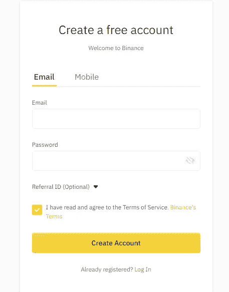

# 5 最佳比特币保证金交易交易所[2021]

> 原文：<https://medium.com/coinmonks/bitcoin-margin-trading-exchange-bcbfcbf7b8e3?source=collection_archive---------6----------------------->

Bitcoin Margin Trading Exchanges

在本文中，我们将讨论比特币[保证金交易](https://blog.coincodecap.com/go/margin-trading)交易所及其各种功能。阅读我们之前的文章了解[什么是保证金交易](https://blog.coincodecap.com/margin-trading)？

## 总结(TL；博士)

*   比特币[保证金交易](https://blog.coincodecap.com/go/margin-trading)意味着从第三方借入资金进行交易。
*   交易所根据你选择的杠杆借给你资金，你用它们进行交易。
*   [币安](https://blog.coincodecap.com/go/binance)提供隔离和交叉[保证金交易](https://blog.coincodecap.com/go/margin-trading)服务，杠杆高达 10 倍。
*   [Bityard](https://blog.coincodecap.com/go/bityard) 处理隔离保证金交易，并提供演示、TP 比率、SL 比率和可定制 UI 等服务。
*   [北海巨妖](https://blog.coincodecap.com/go/kraken)是一家总部位于美国、适合初学者的保证金交易交易所，收费颇具竞争力。
*   [BitMEX](https://blog.coincodecap.com/go/bitmex) 提供比特币保证金交易服务，并通过 ADL 机制处理清算。
*   [Poloniex](https://blog.coincodecap.com/go/poloniex) 是一家位于塞舌尔的交易交易所，为其用户提供高流动性和聊天平台。

> 查表 [**此处**](https://blog.coincodecap.com/bitcoin-margin-trading-exchange#h-summary-tl-dr)

Check Table [**here**](https://blog.coincodecap.com/bitcoin-margin-trading-exchange#h-summary-tl-dr)

## 什么是比特币保证金交易？

比特币保证金交易是指对借来的比特币进行交易。您注册上述交易所之一，并激活您的保证金交易账户。然后你可以在平台上申请贷款，用收到的硬币进行交易。

## 比特币保证金交易是如何运作的？

激活您的保证金交易账户并成功登录后。你需要存入一些资金，然后你可以用你存入的资金作为抵押在 BTC 申请贷款。

交易所每天向您收取利息，根据交易所的不同，利息会频繁更新。

## 比特币保证金交易示例

让我们假设你在保证金交易账户中存入 1 BTC，选择 10 倍的杠杆。然后，exchange 将在您的帐户中额外提供 9 BTC，并每小时向您收取利息。

现在，假设你的 BTC 值增加了 3%，那么你的总回报将是(3×10 = 30%)。然而，你应该记住，加密市场是高度不稳定的，你甚至可以同时遭受 30%的损失。

## 最佳比特币保证金交易平台

市场上有许多选择，我们根据它们的特点将 5 个最好的比特币保证金交易所排序如下:

# 1.**融资融券交易**

**在 [**币安**](https://blog.coincodecap.com/go/binance) 的比特币保证金交易，基本都是借入资金，风险加大的现货交易。[就交易量而言，币安](https://blog.coincodecap.com/go/binance)是世界上最大的[密码交易所](https://blog.coincodecap.com/go/crypto-exchange)，因此你可以获得业内最好的功能。**

****

**在 [**币安**](https://blog.coincodecap.com/go/binance) 进行的比特币保证金交易具有许多功能，如隔离保证金交易、交叉保证金交易、保证金水平和维持保证金。**

## **币安孤立边缘**

**隔离保证金允许交易者通过限制每个头寸的保证金数量来限制风险。这样，如果你的资金流动，那么你失去的只是那个特殊位置的资金。**

**在单独的保证金交易中，你可以获得 10 倍的杠杆，这是基于一个层级系统，取决于你的用户级别。而交叉保证金在主账户和普通账户中分别提供 5 倍和 3 倍的最大杠杆。**

## **隔离保证金中分层杠杆的作用**

**分级杠杆会根据您借入的资金自动调整您的杠杆。这意味着隔离保证金交易的杠杆是动态的。您可以在下表中查看 10 倍隔离保证金的风险比率:**

****

**欲了解隔离融资融券交易中分层杠杆的更多功能，可[点击此处](https://www.binance.com/en-IN/support/faq/7fbadf3c75914efc90e8b831709b644f)。**

****

## **币安的交叉保证金交易**

**您在您的保证金账户的所有未平仓头寸中共享您的全部资产余额。这样做是为了防止清算，因为其他头寸可以帮助头寸亏损。它在专业交易者和对冲现有头寸的投资者中最受欢迎。**

## **币安费用**

**资金存管不收费；然而，所有的用户在取款时都要付费。您可以通过[点击此处](https://www.binance.com/en/fee/marginFee)或下表查看所有资产的保证金利率:**

****

****使用 BNB，你可以减少 25%的交易费用。****

## **币安保证金交易入门**

**您可以按照以下步骤在 [**币安**](https://blog.coincodecap.com/go/binance) 开始比特币保证金交易:**

1.  **首先，你必须在 [**币安**](https://blog.coincodecap.com/go/binance) 注册并完成验证。**
2.  **然后将资金存入你的账户。**
3.  **现在转到您的帐户仪表板，点击保证金。**
4.  **然后完成创建您的保证金账户。**
5.  **将资金转入您的保证金账户。**
6.  **现在你可以从保证金标签做多或做空。**

****

## **利弊**

**币安提供单独交易和交叉保证金交易。对于新用户来说，币安可能会让人不知所措。你所有的保证金订单都进入现货市场。他们不支持大多数传统的支付方式。币安是世界上最大的交易所，因此使用行业领先的安全协议。**

# **2.**保证金交易****

****[**Bityard**](https://blog.coincodecap.com/go/bityard) 是目前市场上最好的比特币保证金交易平台之一。他们通过独立的保证金交易来运作，这有助于你在清算期间保持整个基金的安全。Bityard 是一家位于新加坡的交易所，在 150 多个国家提供服务。****

********

## ****Bityard 的隔离保证金交易是什么？****

****[**Bityard**](https://blog.coincodecap.com/go/bityard) 通过隔离保证金交易为您提供杠杆服务。隔离保证金交易允许您为每个头寸分别使用资金。在清算的情况下，你失去的只是那个特定头寸的资金。****

## ****Bityard 的杠杆作用****

****[**Bityard**](https://blog.coincodecap.com/go/bityard) 为您在加密保证金交易中提供高达 125 倍的杠杆，在衍生品保证金交易中提供高达 200 倍的杠杆。您可以从杠杆滑块调整杠杆。****

********

## ****比特码费用****

****[Bityard](https://blog.coincodecap.com/go/bityard) 在你开仓时收取固定价格的保证金交易费用。以下公式计算保证金交易费用:****

******(开/平仓费=保证金*杠杆* 0.05%)******

## ****Bityard 保证金交易入门****

****从在 [Bityard](https://blog.coincodecap.com/go/bityard) 进行比特币保证金交易开始，你可以遵循以下步骤:****

*   ****创建您的帐户并完成您的电子邮件验证。****
*   ****将资金转移到您的 [Bityard](https://blog.coincodecap.com/go/bityard) 钱包。****
*   ****现在从标题中的合约标签访问加密保证金交易。****
*   ****你现在可以开始保证金交易了。****

## ****比特币保证金交易:利弊****

********

# ****3.[北海巨妖](https://blog.coincodecap.com/go/kraken)保证金交易****

****[北海巨妖](https://blog.coincodecap.com/go/kraken)是一家总部位于美国的[加密货币交易所](https://blog.coincodecap.com/go/crypto-exchange)在超过 175 个国家提供服务。[北海巨妖](https://blog.coincodecap.com/go/kraken)保证金交易通过让你使用更复杂的交易策略来放大你的交易。****

********

## ****对北海巨妖的影响****

****[北海巨妖](https://blog.coincodecap.com/go/kraken)提供最低 2 倍的杠杆和最高 5 倍的杠杆。****

## ****在北海巨妖做多还是做空****

****可以低价建仓，再高价平仓；否则，你可以以更高的价格开盘，以更低的价格收盘。前者正在“做多”，后者正在“做空”。****

****做多有或没有利润；然而，做空只适用于保证金交易。****

********

## ****北海巨妖费用****

****[**北海巨妖**](https://blog.coincodecap.com/go/kraken) 对其保证金订单收取开仓费和展期费。几乎所有资产的开户费都是 0.02%，滚存费是所有资产的 0.02%。开仓费是每个订单一次，而你每 4 小时支付一次延期费。****

********

****您可以[点击此处](https://www.kraken.com/features/fee-schedule)详细了解收费情况。****

## ****北海巨妖保证金交易入门****

****您可以按照以下步骤开始:****

*   ****在 [**【北海巨妖】**](https://blog.coincodecap.com/go/kraken) 注册并创建您的账户。****
*   ****将资金存入您的北海巨妖保证金交易账户。****
*   ****现在点击标题中的“margin”。****
*   ****设置杠杆，下单，开始交易。****

## ****北海巨妖保证金交易:利与弊****

********

# ****4. [**BitMEX**](https://blog.coincodecap.com/go/bitmex) 保证金交易****

****[**BitMEX**](https://blog.coincodecap.com/go/bitmex) 是一个位于塞舌尔的交易平台，为加密交易者提供了一个快速安全的平台。该平台在其平台上提供 [BitMEX](https://blog.coincodecap.com/go/bitmex) 期货和掉期。****

********

## ****利用 BitMEX****

****在 BitMEX 的一些**合约中，你可以获得高达 100 倍的杠杆，而且永久合约不需要你提交 100%的保证金作为抵押。******

******你可以详细看看[提供的杠杆作用点击这里](https://www.bitmex.com/app/perpetualContractsGuide#Leverage)。******

## ******什么是 BitMEX 孤立交叉保证金？******

******让我们假设你使用的是独立保证金，你的账户里有 100 USDT。假设 BTC 的价格是 10000 USDT。现在你开了一个价值 5 USDT 的头寸，交易所的清算价格是 9500 USDT。******

************

******价格跌至 9000 USDT，你所有的 5 USDT 经历清算。但是，不会从您的主余额中扣除。现在，如果你使用交叉保证金，那么你会遭受更大的损失，但你不会遭受清算。******

## ******BitMEX 费用******

******BitMEX 对存款或取款不收取任何费用，对于比特币，收取的费用基于区块链负载。您可以查看下表中的合同收费或点击此处:******

************

## ******BitMEX 保证金交易入门******

******您可以按照以下步骤开始下订单:******

*   ******在 [**BitMEX**](https://blog.coincodecap.com/go/bitmex) 上创建账户。******
*   ******现在将一些资金存入您的比特币保证金交易应用程序。******
*   ******转到“交易”选项卡，选择杠杆并下单。******
*   ******要平仓，点击创建相同价格的卖单或点击红色的“市场”按钮。******

## ******Bitmex 保证金交易:利弊******

************

# ******5. [**波洛涅克斯**](https://blog.coincodecap.com/go/poloniex) 保证金交易******

******[**波兰交易所**](https://blog.coincodecap.com/go/poloniex) 总部位于塞舌尔，提供贷款、现货交易、保证金交易和赌注。截至 2021 年 3 月， [Poloniex](https://blog.coincodecap.com/go/poloniex) 根据 [CoinMarketCap](https://coinmarketcap.com/) 数据，按美元价值交易量[排名第 13](https://coinmarketcap.com/rankings/exchanges/)。******

************

## ******对波洛涅克斯的影响******

******[**Poloniex**](https://blog.coincodecap.com/go/poloniex) 提供高达 100 倍的杠杆作用。在 [Poloniex](https://blog.coincodecap.com/go/poloniex) ，你的初始保证金和维持保证金水平决定了你的杠杆。******

## ******波洛涅克斯费******

******波洛涅克斯 有分级收费制度，你也可以申请白银级和黄金级。点击此处或下表[可查看详细的费用表:](https://support.poloniex.com/hc/en-us/articles/360039490434-Fee-Structure)******

************

## ******开始使用 Poloniex******

******您可以按照以下步骤开始:******

*   ******访问交易所并创建您的帐户。******
*   ******然后登录并存入一些资金开始交易。******
*   ******访问期货选项卡，并相应地设置杠杆。******
*   ******下单，开仓。******

## ******波洛涅克斯保证金交易:利弊******

************

# ******比特币保证金交易风险******

******交易比特币有其风险，这些风险随着你的杠杆而增加。例如，以下是您应该注意的一些事情:******

1.  ******只有当你能承受投资金额的损失时，才开仓。******
2.  ******加密市场非常不稳定，保证金交易不仅增加了你的回报，也增加了你承受损失的机会。******
3.  ******永远使用止损选项，因为它可以防止你平仓。******
4.  ******记住使用更高的杠杆会增加你的利润百分比。但这也增加了你被清算的机会。******
5.  ******下单后千万不要离开屏幕，因为事情可能会在眨眼之间颠倒过来，或者使用[加密交易机器人](https://blog.coincodecap.com/best-crypto-trading-bots)。******

# ******结论:最佳比特币保证金交易交易所******

******比特币保证金交易带来获取回报的绝佳机会；然而，正如任何事物都有两面性一样，它也带来了清算问题。[币安](https://www.binance.com/en)和 [Bityard](https://www.bityard.com/) 是市场上最好的两个平台。从交易量来看，币安是最大的，但从杠杆率来看，它落后了。相比之下， [Bityard](https://blog.coincodecap.com/go/bityard) 为你的交易提供了非常高的杠杆。******

# ******常见问题******

********什么是融资融券交易中的多头或空头？********

******做多意味着你以较低的价格买入一项资产，然后以较高的价格卖出，以获取利润。而“做空”意味着在价格高的时候买入资产，然后以较低的价格卖出以赚取利润。******

********融资融券交易如何做多或做空？********

******要做多，您可以选择交叉保证金或单独保证金模式，然后输入您想要的金额，并点击保证金购买 BTC。要做空，你需要点击保证金卖出 BTC。此外，阅读我们的指南[如何使用](https://blog.coincodecap.com/short-bitcoin)[杠杆代币](https://blog.coincodecap.com/leveraged-token)做空比特币。******

******保证金交易中的“演示”是什么？******

******“演示”选项允许您免费尝试[保证金交易](https://blog.coincodecap.com/margin-trading)。你可以不动用任何资金，随心所欲地进行交易。当你觉得你已经准备好投资你的资金的时候，你就可以上线了。******

********什么是 TP 比例？********

******TP 比率告诉你什么时候可以平仓获利。您可以输入交易完成后您希望获得的金额，也可以输入您希望获得的利润百分比。这样做之后，你将能够看到你应该平仓的价格。******

********什么是 SL 比率？********

******SL 比率告诉你在平仓前你应该平仓的价格。您可以输入您准备损失的最大金额。SL 比率让你知道你应该平仓的价格，这样你就不会承受更多的损失。******

******什么是贸易差额？******

******交易余额是所有未平仓头寸和您的交易账户余额的总和。******

********什么是股权？********

******权益显示您在未平仓头寸上增加或扣除利润/亏损后的实时总余额。******

********什么是自由保证金？********

******自由保证金是您钱包中可用于下任何新订单的金额。假设你没有自由保证金，你试图打开一个位置。在这种情况下，交易所将自动取消您的订单。******

********什么是自动去杠杆或 ADL？********

******当你失去头寸并达到清算限额时，平台会自动将你的抵押品出售给第一个合适的报价，以防止交易所遭受任何损失。保险资金到位，避免 ADL 然而，如果保险基金完全耗尽，ADL 发生。******

********什么是多头和空头？********

******当你在融资融券交易中买入开仓，那就叫做多。做多时，你预测资产价值会上涨，并打算从中获利。
然而，当你点击卖出开仓时，它被称为做空。做空时，你预测资产价值将下跌，并打算从下跌中获利。******

********什么是强制平仓？********

******当你已经失去所有抵押品时，就会发生强制平仓。您的头寸将被自动平仓，以防止贷款金额的任何进一步损失。当你的维护保证金高于当前保证金时，就会发生这种情况。******

********什么是维护保证金？********

******你的借入价值的百分比必须等于你的净值，以防止强行平仓。******

********初始保证金是多少？********

******这是你的账户开户所需的最低资金。我们借助订单的风险限额和杠杆来计算初始保证金。******

********什么是比特币保证金交易？********

******比特币保证金交易允许你通过提供你的资本作为抵押品来交易借入的资金。你完成一笔交易，尝试并成功获得回报，然后连本带利归还贷款金额。******

********加密保证金交易有哪些风险？********

******由于加密市场波动性很大，在使用杠杆时，波动性会增加。因此，最常见的风险是重大损失和清算。有时，你的损失可能远远超过你的初始投资。******

********你的保证金交易能维持多久？********

******每个交易所都有不同的限额；然而，所有的头寸都在固定的时间平仓。比如在 [Bityard，](https://www.bityard.com/)收盘时间是 05:55:00 SGT .同样，你的交易在出现平仓的情况下会自动平仓。******

********是什么触发了追加保证金通知？********

******当你的股票跌破维持保证金时，你会收到追加保证金的通知，要么追加资金，要么被平仓。******

*   ******[什么是保证金交易？保证金交易是如何运作的？【2021】T5](https://blog.coincodecap.com/margin-trading)******
*   ******【2021 年五大加密保证金交易交易所|保证金交易******
*   ******[最佳加密交易所| 2021 年十大加密货币交易所](https://blog.coincodecap.com/crypto-exchange)******
*   ******[Bityard Review 2021 |邀请码、交易费用和功能](https://blog.coincodecap.com/bityard-reivew)******
*   ******[Pionex vs 币安 2021 |交易、费用和机器人](https://blog.coincodecap.com/pionex-vs-binance)******

*******原载于 2021 年 3 月 17 日 https://blog.coincodecap.com***。********