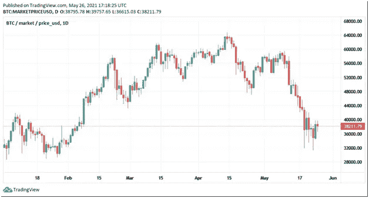
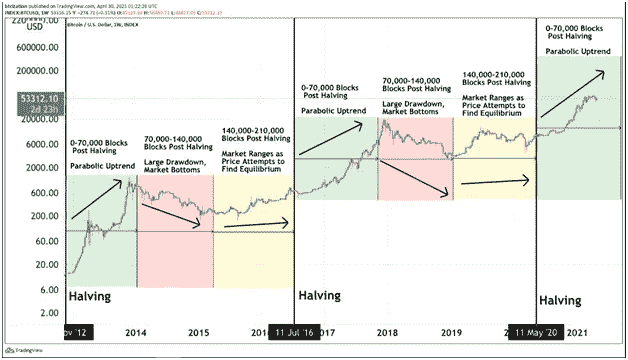
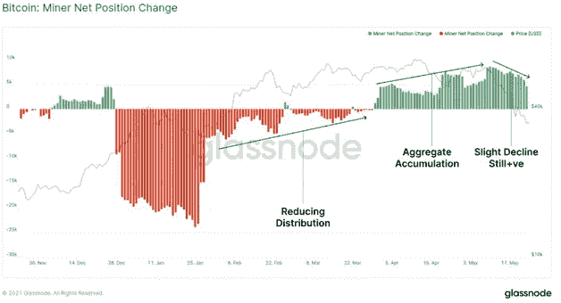

# 比特币市场周期；似曾相识的牛市

> 原文：<https://medium.com/coinmonks/bitcoin-market-cycles-a-d%C3%A9j%C3%A0-vu-bull-run-e64993b1194a?source=collection_archive---------11----------------------->

在经历了一周的流血之后，比特币的价格略有上涨，周一 24 日，比特币的价值下跌了 30%以上，交易者和投资者损失了数十亿美元。在特斯拉首席执行官埃隆·马斯克和 Microstrategy 首席执行官迈克尔·塞勒发布关于他们与北美比特币矿工会面以促进可持续发展的推特后，这种数字货币重新回到了 39k 美元的水平。

最近的价格上涨趋势只是呼应了比特币爱好者长期以来表达的观点；复苏是不可避免的，调整是健康的，也是市场创下历史新高所需要的。从历史上看，比特币的市场投降是坚实的牛市反转的指标，这可能是我们需要的合适催化剂，以推动我们达到我们从未见过的历史高点。

尽管比特币难以突破 40，000 美元的阻力，但突破 42，000 美元至 43，000 美元将是牛市稳步回到正轨的最佳时机。令人欣慰的是，BTC 似乎已经找到了 28k-31k 美元左右的本地底部，指标表明[最糟糕的回调可能很快就会结束](https://www.coindesk.com/bitcoin-chart-indicator-suggests-worst-of-pullback-may-be-over)。然而，纵观全局，20k 的支持是至关重要的。

## **为什么这与其他修正不同**

虽然许多人将这一周期称为双峰周期，但一些怀疑者认为当前的牛市与 2017 年相似，其他人认为 2013 年的牛市更符合当前的趋势。

在过去的两个月里，我们已经看到比特币的价格正在巩固，而[链上分析和历史先例](https://bitcoinmagazine.com/markets/bitcoin-price-will-go-parabolic-in-2021#:~:text=As%20previous%20halving%20cycles%20along,and%20go%20parabolic%20in%202021.)表明，比特币价格将突破 60，000 美元的阻力，并在今年剩余时间内呈抛物线状增长。

比特币减半是另一个迹象，表明我们可能还没有结束牛市。减半对比特币来说是一笔巨大的交易，大约每四年，或者在 210 000 个区块被开采后，就会发生一次。减半事件对市场有着重大影响，因为它计划通过将矿工的集体奖励减半来削减一半的通胀率。在这样的减半之后，比特币价格在几个月后飙升，然后呈上升趋势。

在 2012 年 11 月第一次减半后，价格从减半前的一个月 11 美元上涨到 12 美元。并在 2013 年 11 月涨到 1000 美元以上。同样，比特币在 2016 年 7 月减半，价格从 576 美元上涨到 650 美元，一年后，它打破了第一个纪录，到 2017 年 7 月达到 2526 美元。

[Source](https://insights.glassnode.com/the-week-on-chain-week-21-2021/)

从 2016 年到 2020 年，每 10 分钟就有 12.50 个比特币被释放给矿工。2020 年减半后，每块仅释放 6.25 个比特币，导致比特币生产率立即降低。

这一轮牛市与众不同的另一个原因是该领域新球员的出现。我们看到支持数字硬币的[机构投资者激增。随着特斯拉开创先例，越来越多的公司和基金开始在资产负债表上纳入一点比特币，这已经不是什么新闻了。](https://www.businessinsider.com/bitcoin-cryptocurrency-institutional-interest-btc-price-goldman-sachs-digital-asset-2021-3?utm_source=markets&utm_medium=ingest)

摩根士丹利(Morgan Stanley)是最近一个大举进军加密领域的重要参与者。该公司于 3 月 17 日宣布，它准备向其财富管理客户[提供数字资产](https://markets.businessinsider.com/currencies/news/bitcoin-morgan-stanley-to-offer-wealthy-clients-btc-fund-access-2021-3-1030221077?utm_source=markets&utm_medium=ingest)的访问权限。商业情报公司 MicroStrategy 表示，它于 3 月 12 日购买了价值约 1500 万美元的比特币，使该公司的总持有量达到 91326 单位，估计价值约为 53 亿美元。

目前，随着企业意识到区块链技术的优势，我们看到采用数字货币的市场需求有所增加。

## **接下来是什么？**

仍有大量比特币被买卖，因此，随着市场波动和比特币找到底部，预计波动性将保持相对较高。

由于比特币的波动性，全球各地的央行监管者和金融犯罪调查者仍在就赋予比特币法定货币地位展开辩论。然而，监管机构每淡化一天之前的怀疑，就会提高比特币的合法性，并推动其更接近大众市场的采用。

我们也有可能看到与 2013 年相似的模式。价格在最初的抛物线运行后下跌，并持续一段时间，然后在今年晚些时候继续创下历史新高。

 [## 最佳免费加密交易机器人——前 16 名比特币交易机器人[2021]

### 2021 年币安、比特币基地、库币和其他密码交易所的最佳密码交易机器人。四进制，位间隙…

medium.com](/coinmonks/crypto-trading-bot-c2ffce8acb2a)  [## 最佳 6 个加密交易信号电报通道

### 这是乏味的找到正确的加密交易信号提供商。因此，在本文中，我们将讨论最好的…

medium.com](/coinmonks/best-crypto-signals-telegram-5785cdbc4b2b)  [## BlockFi 评论 2021 —通过您的加密获得 8.6%的利率

### 让你的密码发挥作用，获得比特币和其他加密货币的最佳利率

medium.com](/coinmonks/blockfi-review-53096053c097)