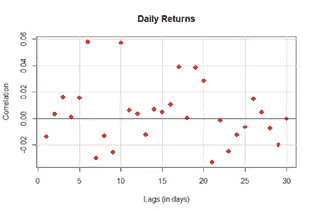
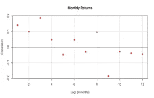

# 比特币、市场效率与技术分析有效性

> 原文：<https://medium.com/coinmonks/bitcoin-market-efficiency-and-technical-analysis-effectivness-9cbbde0c0b63?source=collection_archive---------2----------------------->

Photo by [André François McKenzie](https://unsplash.com/@silverhousehd?utm_source=medium&utm_medium=referral) on [Unsplash](https://unsplash.com?utm_source=medium&utm_medium=referral)

当要测试某项资产是否遵循完全随机的路径或显示递归模式时，我们也试图评估技术分析在应用时是否有任何预测能力。

技术分析师试图根据历史价值和价格运动(价格行为)形成的趋势和特定模式做出预测，并制定策略持续战胜市场。

“过去能预知未来”或者“历史常押韵”。

这是技术分析所依赖的主要假设，没有这个条件，所有描述和分析市场的努力都将毫无价值。

这一假设被构成有效市场理论要素之一的[“弱式有效”](https://www.investopedia.com/terms/w/weakform.asp#:~:text=Weak%20form%20efficiency%20states%20that,prices%20reflect%20all%20current%20information.)假设所拒绝，该假设认为价格已经包含了所有可用的信息，因此预测股票的下一步走势(收益)是不可能的。

一般来说，检验这一假设超出了本文的范围，相反，我将检验弱式效率理论是否适用于像[比特币](https://blog.coincodecap.com/a-candid-explanation-of-bitcoin)这样的资产。

在这种情况下，我提出的“简单”问题是:比特币过去的回报能否解释其未来的回报？

**程序**

为此，我遵循了以下步骤:

以 2014 年至今的所有比特币日/月对数收益率为例

测试回报是否显示任何正/负自相关

计算穿孔框

计算方差比

该样本涵盖了 2366 次每日比特币价格观察，数据来自雅虎财经。

我计算了整个期间日志回报的每日和每月时间序列，然后对同一时间序列的两个不同版本进行了滞后处理，最大滞后时间为 30 天和 12 个月，以便将后者与其原始版本进行比较。

一旦计算出回报的时间序列，我检查了它们的自相关性，我们想检查昨天或一个月前的回报与今天的回报是正相关还是负相关，因此，过去和现在的回报之间是否存在某种关系，我们可以作为交易者加以利用。

Daily returns autocorrelations

第一个图的结果表明，从每日回报的角度来看，在今天的回报和明天之前的 30 天之间，正自相关的出现率略高(这是由于比特币正在经历加速上涨的动量阶段？).

Monthly returns autocorrelations

在第二张图中，从月度回报的角度来看，在长达 8 个月的滞后期内，正自相关的出现率较高，但在此之后，自相关就持续为负。

**盒测试**

仅查看相关性的坐标是不够的，如果我们想进一步检查自相关的存在，我们可以计算 Box-Ljung 检验(所有平方自相关的总和)。

我发现，对于 30 天的滞后，p 值为 0.1537(高于 0.05 的置信水平)，这表明每日回报之间没有显著的自相关，尽管可能存在一些相关性。

乍一看，这并没有提供任何证据来支持使用短期预测的技术分析，因为过去的收益表现出对今天收益的某种依赖，但不是以一种有意义的方式。

对于 12 个月的月度回报滞后，p 值远高于之前的 0.5784，我们可以排除自相关的存在，因此在这种情况下，仅依赖过去的回报可能不是明智的选择。

然而，这种类型的测试可能不那么准确，因为我们应该选择一个更大的时间窗口来产生显著的结果。

## **差异比率**

这就是为什么我还检查了方差比，它衡量自相关的加权和，如果方差比等于 1，市场是弱式有效的，否则回报之间可能存在一些自相关和相关性。

通过使用 bootstrap 程序，我发现每日回报的方差比的最佳估计值是 0.9925032，而每月回报的方差比是 1.468734。

有趣的是，在这种情况下，对于日收益率，我们的方差比率低于 1(因此日收益率略微负相关)，而对于月收益率，比率高于 1，因此有一些正自相关的证据(月正自相关)。

## **结论**

总之，尽管效率假说和低效率假说都有存在的空间，但我认为总体而言，比特币没有足够的价格历史来非常有效地检验自相关性。

因此，考虑到该市场只有 12 年的历史，不受监管，与传统市场相比仍然很小，声称其回报包含所有可用信息不一定是正确的。

希望这篇文章能对进一步的改进、建设性的批评和参考有所启发。

*免责声明:所有的结果和方法都必须是研究目的的产物，本文中报道的一切都不得被视为财务建议，也不应被视为没有错误和不容置疑的。*