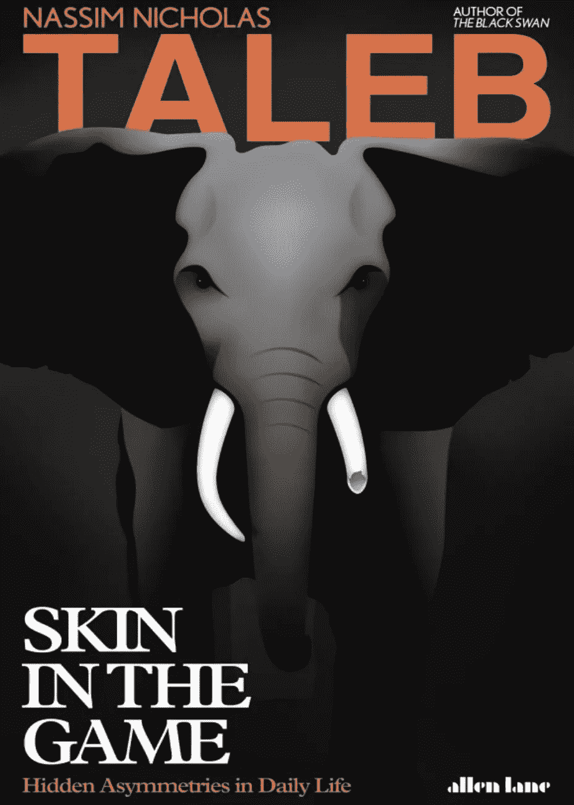

# 比特币最大主义者:利用纳西姆·塔勒布的少数派统治

> 原文：<https://medium.com/coinmonks/bitcoin-maximalists-exploiting-nassim-talebs-minority-rule-f93d3e799295?source=collection_archive---------3----------------------->

## 影响我们生活的顽固少数派

[Skin In the Game](https://philosophiatopics.files.wordpress.com/2018/10/skin-in-the-game-nassim-nicholas-taleb.pdf): free web version

N 阿西姆·塔勒布的第五本书，*游戏中的皮肤:日常生活中隐藏的不对称，*强调了在推广一个想法时承担金钱或声誉风险的重要性。第二章，标题为***最不宽容的人获胜:顽固的少数人的优势*** *，*发展了概念…