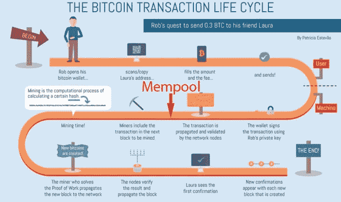

# 比特币内存池——简单解释

> 原文：<https://medium.com/coinmonks/bitcoin-mempool-simply-explained-7f76be235e85?source=collection_archive---------0----------------------->

*Bitcoin transaction life-cycle with Mempool. Image* [*Source*](https://en.bitcoinwiki.org/wiki/Bitcoin_transaction)

2020 年，比特币正式诞生 11 年后，我们很少涉及比特币的基础技术，但经常谈论第四代和第五代区块链、分片、侧链链上分析以及加密货币交易的智能方式。然而，在今天的文章中，我们想谈谈比特币区块链的一个基本特征:比特币内存池，或简称为比特币内存池。