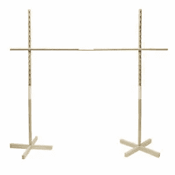

# 低水平的比特币挖矿

> 原文：<https://medium.com/coinmonks/bitcoin-mining-at-a-low-level-5977dc2bd6dd?source=collection_archive---------4----------------------->

> “总有一天，一切都会被区块链标记和连接起来。” ~弗雷德·厄尔萨姆，范式

我看过几篇比特币的文章，在**高**水平谈论比特币挖矿，但很少看到**低**水平的。这篇文章将带你了解比特币挖矿的一切是如何运作的——从“为什么挖矿需要 10 分钟？”—您开始工作所需的硬件。

在开始阅读之前，你应该对区块链有一个扎实的了解，因为我在本文中使用了与它相关的术语和概念。

以下是每个主题:

*   采矿目标
*   内存池
*   开矿装置
*   结论

# 采矿目标

A game of Limbo to symbolize the mining target

在我进入这一部分之前，我想让你快速**思考**这个问题:“为什么一个区块需要 10 分钟才能开采出比特币？”如果你的回答是，“因为他们必须解决一个非常复杂的加密哈希难题”，那么你可能不知道为什么。

**为什么**人家挖矿？**什么是**挖矿？**人家怎么**挖矿？在这一节中，我将解释什么是挖掘目标，这样您就可以详细阐述那些“加密哈希难题”

## 积木是由什么制成的？

块由以下字段组成:

*   链中的块索引
*   数据(以比特币为例，交易)
*   前一个哈希，即前一个块的哈希。
*   现在
*   时间戳
*   块的哈希

上面列表中的前三个项目是任何人都不能更改的项目，即使在采矿时。块索引不能改变，因为它是块在链中的位置。不能更改数据，因为这将被视为对数据块的篡改。先前的散列不能被改变，因为网络中的节点会说，“嘿，这个先前的散列是**而不是**先前块的散列”，并把它改回来。最后，散列仅仅是所有其他字段的顶点。

这里我想快速说明的一件事是，虽然所有区块链都可以对每个数据块的数据进行哈希运算，但他们并不都使用相同的哈希算法。例如，比特币使用的哈希算法 SHA-256——由美国国家安全局(NSA)制作——与以太坊使用的哈希算法不同，以太坊使用的是 Keccak-256 哈希算法。另外，请注意哈希算法**不同于加密算法**。在这里你可以看到一个算法的所有要求被看作是一个散列算法而不是一个加密方法[。](https://www.sciencedirect.com/topics/computer-science/hashing-algorithm)

## 前导零

截至 2021 年 10 月，要添加到区块链的块所需的最低前导零的数量是 18。这意味着什么？

SHA-256 的“256”代表 **256 位**。这意味着当转换为十六进制时，会出现 64 个字符。考虑一个以**为基数二**的 256 位随机字符串。然后，我们假设当它被转换为十六进制数时，它会给出这样的输出:3 f 79 bb 7 b 435 b 05321651 daefd 374 CDC 681 DC 06 FAA 65 e 374 e 38337 b 88 ca 046 DEA。(顺便说一句，我只输入了“e”就有了这个结果。)

每个十六进制数字由四个二进制数字组成。现在，当我说前导零时，我指的是在数字的其余部分出现之前的零。如果我有 6 个前导零，散列应该是 000000xxx…xxx (58 x)。这个概念如此重要的原因是它直接关系到我将要谈到的挖掘目标。但是，现在，我想让你想一想:

在十六进制字符串中，每个数字可以是 0、1、2、3、4、5、6、7、8、9、A、B、C、D、E 或 f。因此，一个 64 位的十六进制数的组合总数是 **16 的 64 次方**。这相当于大约 1.1 * 10^77。虽然这可能很令人惊讶，但让我给你看些别的东西。如果你有 18 个前导零，你就能得到 **16^46** 组合。那是关于 **2.5 * 10^55** 的。同样巨大，**对不对**？

## 前导零统计

与我们的第一个数字相比，不，一点也不。为了快速了解 2.5 * 10^55 与 1.1 * 10^77 的差距，随机选择一个 64 位十六进制数字并加上 18 个前导零的概率约为:(准备好了吗？)

**2.1 * 10^(-22)满分 1 分。**

让我很快地扩展一下。稍等片刻。

**0.0000000000000000021%。**

是啊。

比起随机挑选一个有 18 个前导零的十六进制数字，你赢得彩票的几率要高得多。高多少？哦，你知道，大约只有 23 万亿倍。

## 采矿目标

挖掘目标本质上是一个数字，表示“嘿！矿工！你必须在我下面得到一个散列，否则你将不能把你的块添加到链中！”采矿目标本质上是给那些想赚钱的矿工一个挑战。

以一个挖掘目标为例:00000000000000000000 ffffffxxx…XXX(40 个 x)

所以这个由一个看起来几乎随机的哈希算法生成的哈希一定低于这个值。但是像我们之前看到的那样，得到比这个数字更小的散列的机会非常低。那么，**有什么解决办法**？

## 现在

我想在这里快速记录一下雪崩效应。雪崩效应是指，即使你做了一个看似微不足道或不可忽略的改变，哈希也会发生巨大或绝对的变化。即使你只输入一个空格，仍然有一个不仅仅由零组成的散列。给你，如果你想知道的话:36 a9 e 7 f1 c 95 b 82 FFB 99743 E0 C5 C4 ce 95d 83 C9 a 430 AAC 59 f 84 ef 3c bfab 6145068

中本聪非常聪明。他/她预测比特币的价格将会上涨，当技术进步时，矿工将会面临更大的挑战。此人(或群！没人知道中本聪是谁)预见到人们最终会放弃采矿，因为他们发大财的几率**低得令人难以置信**。人们甚至不会进行交易，因为要花多长时间才能与他人沟通。

因此，产生了一个称为 nonce 的字段。这是一个 **32 位字段**，所以只能上到 4294967296。我知道。这些大数字让我觉得 40 亿很小(的确如此，与其他怪物相比)。还记得我在开始时说过散列是基于每隔一个字段计算的吗？这是其中之一。比特币协议使得当有人在挖掘时，他们迭代随机数，直到他们有一个数字**落在挖掘目标**内。由于雪崩效应，它们每次都会以不同的随机数结束(除非散列变得相同，这比随机选择 18 个前导零的数字更不可能)。

所以现在，如果我们把 4294967296 乘以 0.00000000000000021%，我们得到…

仍然是一个很小的数字。

**0.00000000009%**

所以现在，即使你在一秒钟内遍历了 40 亿个随机数，你仍然有很小的机会得到一个有 18 个前导零的散列。

然而，块中还有一个字段我还没有谈到。它是永远不会被前导零打败的。有请最后一场:

## 时间戳

块中的时间戳表示该块的创建时间。在这里应用雪崩效应，随着每一秒钟的变化，**整个哈希都会发生变化**，并且出现了获得所需数量的前导零的新机会。

但是用什么格式来发布时间戳呢？是' yyyy-mm-dd '，' yyyy-dd-mm '，还是' yy-mm-dd '？你会很惊讶地听到这不是他们中的任何一个。取而代之的是一种叫做 **Unix 时间**的东西。Unix 时间是自 1970 年 1 月 1 日**00:00:00**的 **Unix 纪元**以来经过的秒数。Unix 时间是一种永不重置的东西，不需要任何格式化或解析程序就能理解它。该程序只需检查数字是多少，以确保区块链中的一切都在检查中。

既然我们已经讨论了所有领域，我想再一次快速地告诉你，中本聪是一个非常聪明的人(为了便于解释，我将把中本聪称为一个人)。他/她明白，最终，技术将允许人们在不到一秒的时间内迭代这 40 亿个随机数，这就是现在正在发生的事情。当你读这篇文章的时候，有人正在开采一个区块。有人不断地查看这 40 亿个随机数，每当他或她找不到黄金哈希时，时间戳就会不断更新。

可能有一些临时矿工只能迭代 150 MH/s(兆哈希或百万哈希每秒)。但是对于铁杆矿工来说——我说的是那些拥有巨大仓库的——他们可以获得几个 TH/s(万亿次哈希或每秒万亿次哈希)！

我在这里试图表达的观点或想法是:“矿工们在开采的时候，用**所有的额外时间在做什么？”**

# 内存池

说你是个好矿工。您的平均速度大约是 10 GH/s(每秒十亿次散列)。所以，你平均花费 0.43 秒来遍历所有的随机数迭代。你用剩下的 0.57 秒做什么？幸运的是，比特币的协议已经有一个内置功能**来交换数据，所以现在你可以再次尝试 40 亿个随机数。**

这一部分解释了什么是**内存池**，它是如何工作的，矿工如何将它与他们创建的块关联起来，最后，回答我们之前的问题，他们用这些额外的时间做什么。

## 这是什么？

mempool 是一个**分布式的事务列表**，它还没有传递给预期的接收者。这些是矿工用来添加到他们的区块的交易。每个块大约有 1000 个事务存储在中。

每笔交易都有一些附加的费用。这意味着，如果矿工开采一个区块，他们将获得该区块每笔交易的费用**以及采矿奖励**(目前为 6.25 BTC)。因此，比特币的协议会自动选择最高的费用进入该区块。

回到我们的最后一个场景，你是一个铁杆矿工——在这 0.57 秒内，可以做很多事情。当矿工在不到一秒钟的时间内(或在时间戳更新之前)用完所有 40 亿个随机数时，比特币协议会感应到。

在这个街区，你现在能开关什么？

1.  你**不能**切换块索引。
2.  你**不能**切换之前的 hash。
3.  你**不能**切换时间戳(当然，直到它更新)。
4.  你**不能**切换 nonce(还不行！).
5.  您**可以**切换数据中列出的交易。

当它检测到最后一个 nonce 是在第二个时间内传递的，它就会将 mempool 中值最低的事务换成值次高的事务。

## 稍微谈一下费用

Money for the miners! Money for everyone! (No, just for the miners)

假设你想给你的朋友寄一些比特币，可能是 0.003 BTC。想要赚钱的矿商会选择收费最高的交易。所以，你应该收取一些伴随交易的费用。如果你的支付没有手续费，那么矿工永远不会选择他们(如果你的交易在 72 小时内没有通过，你发送的比特币就退还给你)。

我想说的是，**从矿工的角度看**。你可能不想给他们钱，但这不是你最终想要什么的问题。

我想快速说明的另一件事是，股票的概念在这里也发挥了作用。现在，我不是投资专家，但我知道当需求上升时，价格通常会随之上涨。

当更多的人想同时向其他人汇款时，他们意识到其他人也在**发送汇款，因此他们需要**增加他们的费用**，因为他们希望他们的交易先**进行**。最后，这一切都归结为谁对他们的交易最绝望。**

# 开矿装置

现在你对比特币挖矿有了更深入的了解(希望！)，这里有一些关于如何开始的提示。

## CPUs vs GPUs vs ASICs

CPU 是中央处理器。它们可以用于你电脑中的几乎所有东西。虽然 CPU 可以做任何事情，但这并不意味着它们是非凡的。大多数 CPU 可以达到大约 **1 到 2mh/s。**

之后，我们有了 GPU。与 CPU 相比，图形处理单元在某些方面要好得多，但技能却有限得多。您可以使用 GPU 来运行代码、玩游戏等等。你的电脑里有 GPU，但如果你想进入采矿加密领域，你可以在线购买更好的 GPU。大多数 GPU 的处理速度最高可达约**1gh/s。**

最后，我们有专用集成电路。ASICs 是专门为挖掘比特币和其他使用 SHA-256 的加密货币而制造的。他们的电路实际上是用来计算 SHA-256 散列的，这样就不会有必须被访问的内存。

## 采矿池

挖掘池是您可以将您的散列能力与池中的其他成员相结合来创建和挖掘块的地方。你因对团队贡献了多少力量而获奖。

# 结论

总之，比特币挖矿大有可为。它有几个方面以及它是如何工作的。我很喜欢写这个令人兴奋的话题，我希望你能从中受益。最后，请务必关注我的[子栈](https://padhyesohum.substack.com/p/september-2021-newsletter)的十月时事通讯！

> 加入 Coinmonks [电报频道](https://t.me/coincodecap)和 [Youtube 频道](https://www.youtube.com/c/coinmonks/videos)了解加密交易和投资

## 也阅读

 [## 最佳加密交易所| 2021 年十大加密货币交易所

### ICON _ PLACEHOLDEREstimated 预计阅读时间:28 分钟加密货币交易所的加密交易需要知识…

blog.coincodecap.com](https://blog.coincodecap.com/crypto-exchange)  [## 2021 年 10 大最佳加密贷款平台| CoinCodeCap

### 当谈到加密货币贷款时，大量因素等同于良好的收入状况。此外，借款的一部分…

blog.coincodecap.com](https://blog.coincodecap.com/crypto-lending)  [## 2021 年最佳免费加密交易机器人

### 2021 年币安、比特币基地、库币和其他密码交易所的最佳密码交易机器人。四进制，位间隙…

medium.com](/coinmonks/crypto-trading-bot-c2ffce8acb2a)  [## 最佳 4 个加密交易信号电报通道

### 这是乏味的找到正确的加密交易信号提供商。因此，在本文中，我们将讨论最好的…

medium.com](/coinmonks/best-crypto-signals-telegram-5785cdbc4b2b)  [## BlockFi 评论 2021:利弊和利率| CoinCodeCap

### 今天，我们提出了一个全面的 BlockFi 评论，这是一个成立于 2017 年的加密贷款平台，拥有其…

blog.coincodecap.com](https://blog.coincodecap.com/blockfi-review)  [## 如何在印度购买比特币？2021 年购买比特币的 7 款最佳应用[手机版]

### 如何使用移动应用程序购买比特币印度

medium.com](/coinmonks/buy-bitcoin-in-india-feb50ddfef94)  [## 加密税务软件——五大最佳比特币税务计算器[2021]

### 不管你是刚接触加密还是已经在这个领域呆了一段时间，你都需要交税。

medium.com](/coinmonks/best-crypto-tax-tool-for-my-money-72d4b430816b)  [## 存储比特币的最佳加密硬件钱包[2021] | CoinCodeCap

### 保管您的数字资产很容易，但找到正确的存储方式却是一项繁琐的任务。在线钱包有一个风险…

blog.coincodecap.com](https://blog.coincodecap.com/best-hardware-wallet-bitcoin)