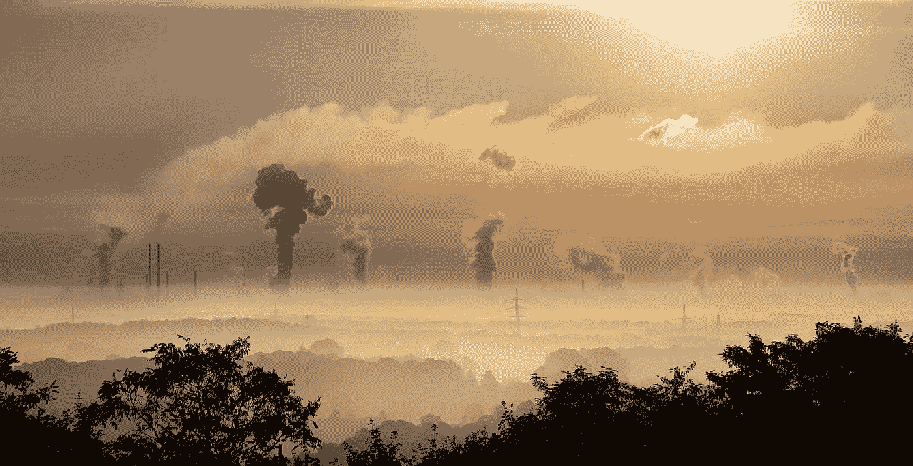

# 比特币挖矿不在乎环境

> 原文：<https://medium.com/coinmonks/bitcoin-mining-doesnt-care-about-the-environment-77c13fc6ef06?source=collection_archive---------8----------------------->

## 关于一个比世界上大多数国家用电量都多的行业，你应该知道什么

Pixabay from Pexels

虽然自 2021 年初以来，对比特币价格的兴趣一直非常热烈，但最近在论坛上不断升温的原始区块链的另一个元素是讨论如何处理…