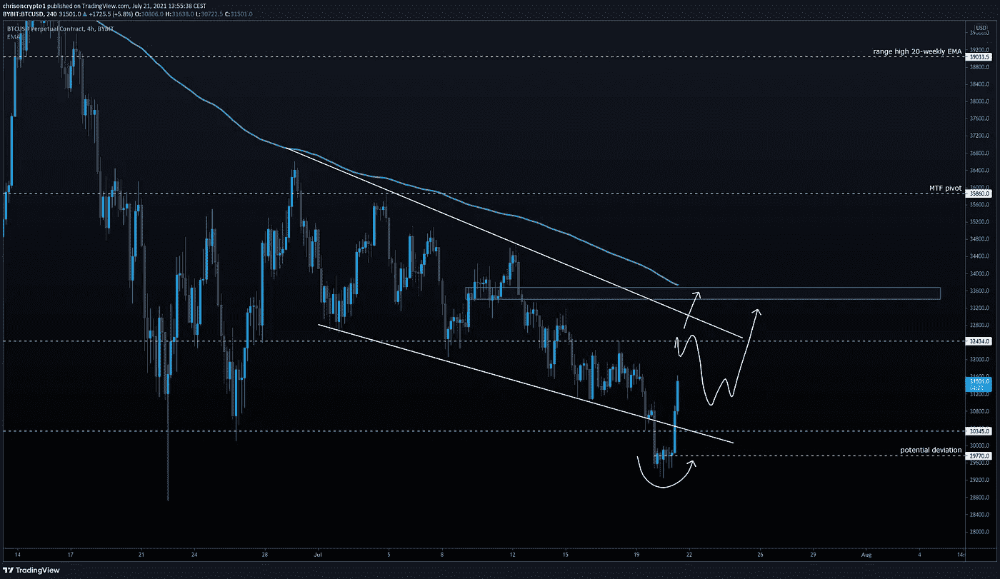
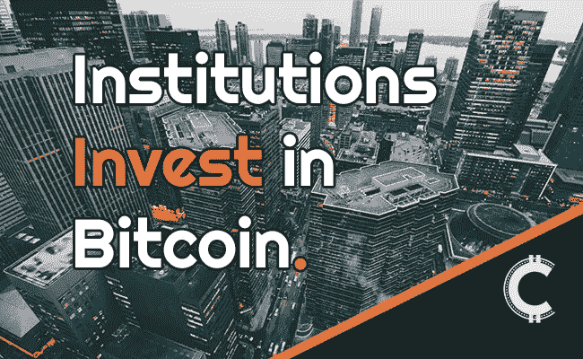

# 由于买家对超卖情况做出反应，比特币勉强避免了灾难！

> 原文：<https://medium.com/coinmonks/bitcoin-narrowly-avoids-catastrophe-as-buyers-react-to-oversold-conditions-29202ef17062?source=collection_archive---------7----------------------->

在以低于 30，000 美元的价格和不断缩水的市值吓坏市场后，BTC 已经反弹，多头为挽救关键心理水平做了最后一搏。与此同时，摩根大通不得不应对外部压力，为其富有的客户提供比特币产品。目前，JPM 客户可以通过 [MSTR](https://chrisoncrypto.com/blog/f/2-trillion-investment-firm-buys-122%25-stake-in-microstrategy) 股票代理获得比特币敞口。

让我们深入探讨一下。

# JPM 表示，客户将比特币视为一种投资资产

摩根大通资产与财富管理公司首席执行官玛丽·卡拉汉·埃尔多斯表示，这家银行业巨头将比特币视为一种资产，“想要投资”。

这些评论来自于媒体周二发布的“彭博财富与大卫·鲁宾斯坦”的视频剪辑[，该视频剪辑首次录制于 6 月 7 日。](https://www.bloomberg.com/news/videos/2021-07-20/most-clients-see-bitcoin-as-an-asset-class-says-j-p-morgan-s-erdoes-video)

**查看** [全文点击这里](https://chrisoncrypto.com/blog/f/jpmorgan-says-clients-see-bitcoin-as-an-asset-to-invest-in) **！**

在跌至 29249 美元的低位后，比特币在亚洲交易时段收复了 3 万美元，因为买家对所有时段的超卖情况做出了反应。根据周一的新闻简报，下一个阻力位位于 33，500 美元，抛售压力可能会再次增加。

如果比特币表现出高于 32，000 美元的实力，那么高于 30，000 美元心理水平的盘整可以被认为是潜在的实力水平。

理想情况下，BTC/美元表现出 32，000 美元以上的弹性和可接受性，在这一点上，可以满怀信心地期待低时间框架向 30，000 美元移动，并建立足够的风险定义。

话虽如此，如果融资利率过早转为正值，这将是第一个可能阻止反弹的危险信号。如果没有像重大新闻事件这样的行业刺激，融资利率是这个交易区间值得考虑的有力工具。

如果弱势持续，那么迈克尔·塞勒的平均进场价格(26000 美元)将会再次下跌。如果 BTC/美元由于各种原因达到这一水平(在未来的某个时候),也就不足为奇了，也就是说，大量的媒体报道将接踵而至。

自 6 月 21 日决定性地跌破 35，860 美元以来，比特币一直处于一个主要交易区间的下半部分。反过来，20 周均线趋势走低，位于 39，000 美元，这是上一周收盘时的记录。

被殴打，擦伤，但从未被打败，公牛的愤怒会是不可饶恕的吗？

时间会证明一切。

一会儿见

**加入** [电报](https://t.me/chrisoncryptochannel) **频道，实时更新&设置！
关注我** [推特](https://twitter.com/ChrisOnCrypto1) **&** [多嘴多舌](https://gab.com/chrisoncrypto) **下面还有我的社交门户。**

[https://www.paypal.com/donate?hosted_button_id=C9VRLGTBHQX2N](https://www.paypal.com/donate?hosted_button_id=C9VRLGTBHQX2N)

# 阅读更多:摩根大通表示，客户将比特币视为一种投资资产

[https://chrisoncrypto.com/blog/f/jpmorgan-says-clients-see-bitcoin-as-an-asset-to-invest-in](https://chrisoncrypto.com/blog/f/jpmorgan-says-clients-see-bitcoin-as-an-asset-to-invest-in)

[http://www.chrisoncrypto.com/](http://www.chrisoncrypto.com/)

你也可以用比特币支持我！
**BTC** 地址:**3 eydseypjhn 68 axkncuqbb 7 ebqcxrejamr**

最诚挚的问候，
T21 克里斯托
克里斯托
上的加密创始人[www.cityam.com](https://www.cityam.com)上的
直接接通:[电报](https://t.me/chrisoncrypto)

*最初发布于*[*https://mailchi . MP*](https://mailchi.mp/0cb775ad0ef5/bitcoin-narrowly-avoids-catastrophe-as-buyers-react-to-oversold-conditions?e=[UNIQID])*。*

> 加入 [Coinmonks 电报频道](https://t.me/coincodecap)，了解加密交易和投资

## 另外，阅读

*   [什么是融资融券交易](https://blog.coincodecap.com/margin-trading) | [美元成本平均法](https://blog.coincodecap.com/dca)
*   [BigONE 交易所评论](/coinmonks/bigone-exchange-review-64705d85a1d4) | [电网交易机器人](https://blog.coincodecap.com/grid-trading)
*   [3 商业评论](/coinmonks/3commas-review-an-excellent-crypto-trading-bot-2020-1313a58bec92) | [Pionex 评论](/coinmonks/pionex-review-exchange-with-crypto-trading-bot-1e459d0191ea) | [Coinrule 评论](/coinmonks/coinrule-review-2021-a-beginner-friendly-crypto-trading-bot-daf0504848ba)
*   [莱杰 vs Ngrave](/coinmonks/ledger-vs-ngrave-zero-7e40f0c1d694) | [莱杰 nano s vs x](/coinmonks/ledger-nano-s-vs-x-battery-hardware-price-storage-59a6663fe3b0) | [币安评论](/coinmonks/binance-review-ee10d3bf3b6e)
*   [Bybit Exchange 审查](/coinmonks/bybit-exchange-review-dbd570019b71) | [Bityard 审查](/coinmonks/bityard-review-7d104239be35) | [CoinSpot 审查](https://blog.coincodecap.com/coinspot-review)
*   [3 commas vs crypto hopper](/coinmonks/3commas-vs-pionex-vs-cryptohopper-best-crypto-bot-6a98d2baa203)|[赚取加密利息](/coinmonks/earn-crypto-interest-b10b810fdda3)
*   最好的比特币[硬件钱包](/coinmonks/the-best-cryptocurrency-hardware-wallets-of-2020-e28b1c124069?source=friends_link&sk=324dd9ff8556ab578d71e7ad7658ad7c) | [BitBox02 回顾](/coinmonks/bitbox02-review-your-swiss-bitcoin-hardware-wallet-c36c88fff29)
*   [BlockFi vs 摄氏](/coinmonks/blockfi-vs-celsius-vs-hodlnaut-8a1cc8c26630) | [Hodlnaut 点评](/coinmonks/hodlnaut-review-best-way-to-hodl-is-to-earn-interest-on-your-bitcoin-6658a8c19edf) | [KuCoin 点评](https://blog.coincodecap.com/kucoin-review)
*   [Bitsgap 审查](/coinmonks/bitsgap-review-a-crypto-trading-bot-that-makes-easy-money-a5d88a336df2) | [Quadency 审查](/coinmonks/quadency-review-a-crypto-trading-automation-platform-3068eaa374e1) | [Bitbns 审查](/coinmonks/bitbns-review-38256a07e161)
*   [加密复制交易平台](/coinmonks/top-10-crypto-copy-trading-platforms-for-beginners-d0c37c7d698c) | [Coinmama 审核](/coinmonks/coinmama-review-ace5641bde6e)
*   [印度的加密交易所](/coinmonks/bitcoin-exchange-in-india-7f1fe79715c9) | [比特币储蓄账户](/coinmonks/bitcoin-savings-account-e65b13f92451)
*   [CoinDCX 评论](/coinmonks/coindcx-review-8444db3621a2) | [加密保证金交易交易所](https://blog.coincodecap.com/crypto-margin-trading-exchanges)
*   [CoinLoan 评论](/coinmonks/coinloan-review-18128b9badc4) | [YouHodler 评论](/coinmonks/youhodler-4-easy-ways-to-make-money-98969b9689f2) | [BlockFi 评论](https://blog.coincodecap.com/blockfi-review)
*   [CoinFLEX 评论](https://blog.coincodecap.com/coinflex-review) | [AEX 交易所评论](https://blog.coincodecap.com/aex-exchange-review) | [UPbit 评论](https://blog.coincodecap.com/upbit-review)
*   [AscendEx 保证金交易](https://blog.coincodecap.com/ascendex-margin-trading) | [Bitfinex 赌注](https://blog.coincodecap.com/bitfinex-staking) | [bitFlyer 审核](https://blog.coincodecap.com/bitflyer-review)
*   [AscendEx Staking](https://blog.coincodecap.com/ascendex-staking)|[Bot Ocean Review](https://blog.coincodecap.com/bot-ocean-review)|[最佳比特币钱包](https://blog.coincodecap.com/bitcoin-wallets-india)
*   [霍比评论](https://blog.coincodecap.com/huobi-review) | [OKEx 保证金交易](https://blog.coincodecap.com/okex-margin-trading) | [期货交易](https://blog.coincodecap.com/futures-trading)
*   [麻雀交换评论](https://blog.coincodecap.com/sparrow-exchange-review) | [纳什交换评论](https://blog.coincodecap.com/nash-exchange-review)
*   最好的[加密税务软件](/coinmonks/best-crypto-tax-tool-for-my-money-72d4b430816b) | [硬币追踪评论](/coinmonks/cointracking-review-a-reliable-cryptocurrency-tax-software-5114e3eb5737)
*   [Stackedinvest 评论](https://blog.coincodecap.com/stackedinvest-review) | [北海巨妖评论](/coinmonks/kraken-review-6165fc1056ac) | [期货交易机器人](/coinmonks/futures-trading-bots-5a282ccee3f5)
*   最佳[加密借贷平台](/coinmonks/top-5-crypto-lending-platforms-in-2020-that-you-need-to-know-a1b675cec3fa) | [杠杆令牌](/coinmonks/leveraged-token-3f5257808b22)
*   最佳[加密制图工具](/coinmonks/what-are-the-best-charting-platforms-for-cryptocurrency-trading-85aade584d80) | [最佳加密交易所](/coinmonks/crypto-exchange-dd2f9d6f3769)