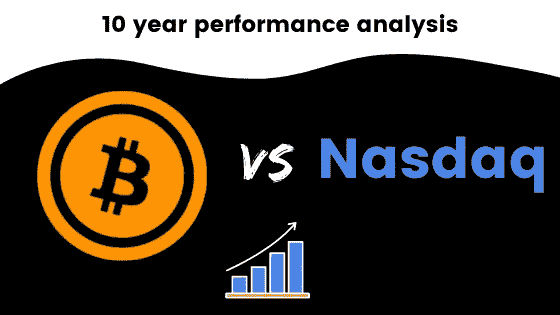
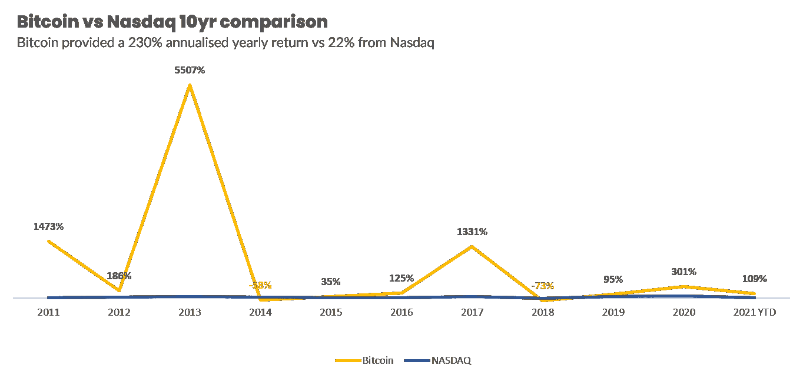
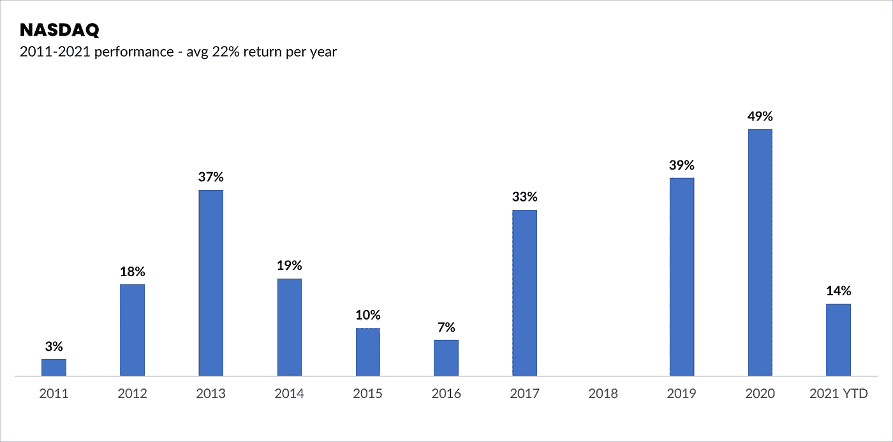

# 比特币和纳斯达克:10 年回报率比较(视觉之旅)

> 原文：<https://medium.com/coinmonks/bitcoin-nasdaq-a-10-year-comparison-on-returns-a-visual-journey-3169ea15993e?source=collection_archive---------4----------------------->

每当我写一篇文章，我主要是为了回答我自己的问题，然后想，也许其他人也可以从这些信息中受益。

这件作品就是这样产生的。

我最喜欢的事情莫过于研究如何让我的钱增值，挖掘数据，并创建可爱的数据可视化。所以，你将会在一篇文章中得到所有这三个——你真幸运。

我想回答的问题很简单**——过去十年，比特币相对于一些最大的科技公司表现如何？**

请注意，我不是在看这些公司中任何一家的单个表现，而是看像纳斯达克这样的指数的综合表现，我们大多数人都很熟悉它，它在普通投资界非常受欢迎。

这篇文章不是关于哪一个更好，因为我们都有自己的观点。数据会一如既往地为自己说话。

首先，让我们回答我关于**的问题，自 2011-2021 年以来，BTC 相对于纳斯达克的表现如何。**

很明显，我们可以看到 BTC 在过去十年轻而易举地占据了主导地位。

尽管在 2014 年和 2018 年有所下降，但在过去十年中，**的平均年化回报率**在 BTC 为**230%**而在纳斯达克为**22%**。

但是，让我们在这里明确一点，22%仍然是一个不错的回报率，因此并不意味着纳斯达克不是一个值得研究的好投资(再次强调，不是财务顾问，这不是财务建议——自己做研究)。

当你看到过去十年的这些类型的回报时，BTC 无疑是有吸引力的，如果我们像今天一样看待这些数据，它看起来没有放缓。但是，正如他们所说，过去的表现并不是未来成功的指标。

如果我们抛开比较，看看纳斯达克过去十年的表现，我们仍然看到强劲的回报。

我们有时会被不断地与 BTC 和 ETH 相提并论所误导，与你所谓的传统资产类别相比较。然而，这并不意味着这些不是你可以自己研究的有趣资产。

我自己的问题的答案很清楚，BTC 轻而易举地赢了。

宣布的数字黄金再次脱颖而出，继续扰乱我们当前的金融运营系统。

你可以在这里找到这篇文章[中引用的所有数据的原始链接。](https://twitter.com/charliebilello/status/1370722188739891202?s=20)

# 重要的

我不是财务顾问、心理学家或任何形式的专业人士。因此，这不是财务建议，我没有资格或许可提供任何类似的东西。这些内容是一群来自人类同胞的想法，仅用于教育目的——仅此而已。

 [## 最佳免费加密交易机器人——前 16 名比特币交易机器人[2021]

### 2021 年币安、比特币基地、库币和其他密码交易所的最佳密码交易机器人。四进制，位间隙…

medium.com](/coinmonks/crypto-trading-bot-c2ffce8acb2a)