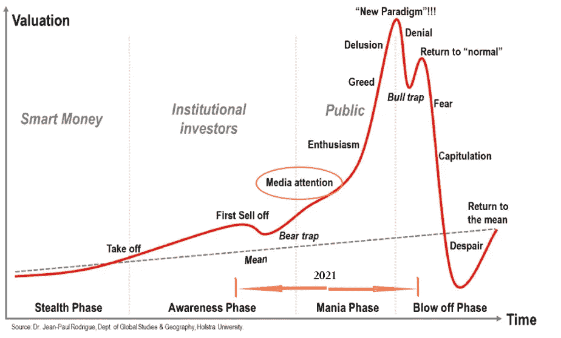
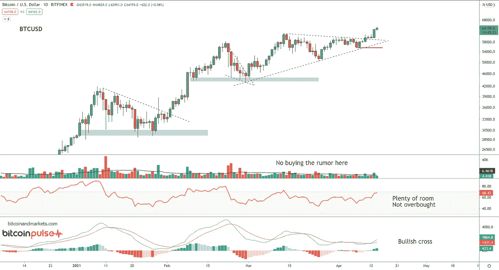
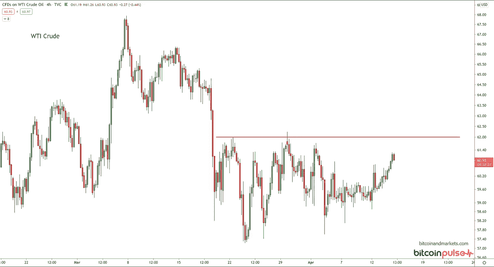
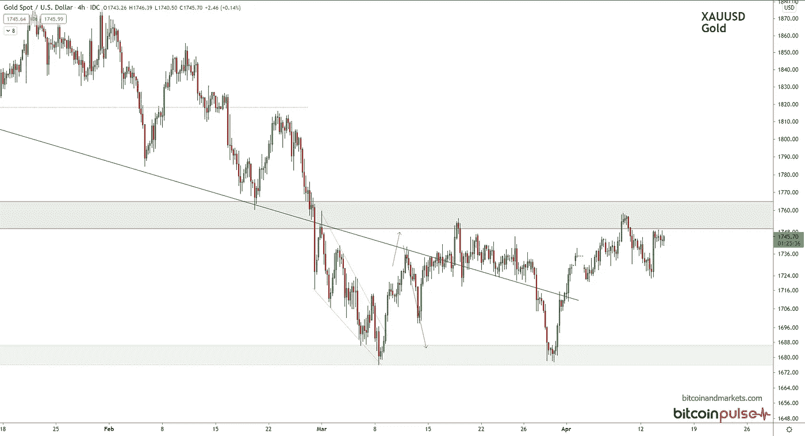
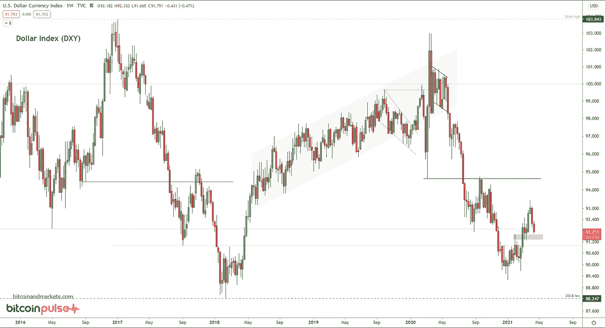
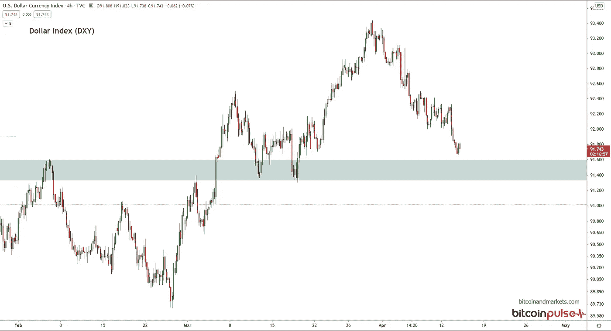
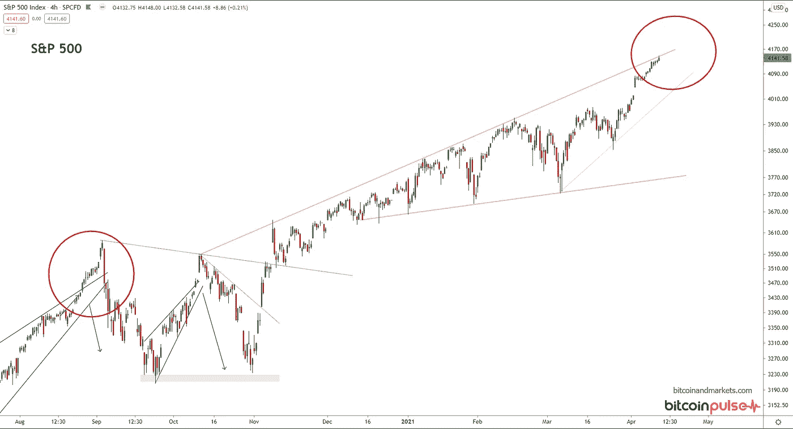

# 4 月(4 日)比特币、石油、美元和标准普尔 500 图表摘要

> 原文：<https://medium.com/coinmonks/bitcoin-oil-dollar-and-s-p-500-chart-rundown-for-april-4rth-a5fdc44f12e8?source=collection_archive---------9----------------------->

欢迎回到 BTCM 研究中心。如果您觉得这些每周更新信息丰富，请订阅。

# 比特币

今天的大新闻是比特币基地直接上市。这类似于首次公开募股，但成本更低，速度更快。兴趣非凡。预计比特币基地将立即进入 100 家最有价值的上市公司。

许多人担心这将是一个“卖新闻”类型的事件，就像 2017 年 12 月 CME 比特币期货一样。我没有看到任何迹象。事实上，除了《比特币与市场》的时事通讯，我只在两周前看到过一些其他渠道谈论这个问题。

这可能是一个“购买新闻”的事件，也是媒体关注周期的开始。

*更多比特币分析尽在我的会员快讯上*【bitcoinandmarkets.com】**。**

# 油

原油仍在 62 美元的阻力中挣扎。我说过任何超过 60 美元的东西都很难维持很长时间。今天早上，德克萨斯州又传来了一些消息，因为他们受到了另一场危机的打击。这可能会暂时推高价格，但不会改变价格走低的基本面。

从这个时间点开始，任何推高油价的事情对美国石油行业都是积极的，并将加速美国从其全球警察的位置上退出。

# 金色的

黄金仍处于区间和决策点。如果它再次测试区间底部(第三次)，它很有可能最终突破该水平。多头需要马上进场买入。如果他们撑不住，它会越来越低。

# 美元

Zoomed out, weekly chart DXY

Zoomed in, 4 hr chart DXY

本周没有重要进展。

# 标准普尔 500 股票

我对美国以外的股票在未来 1-5 年内可能上涨没有强烈的信心。现在，从技术分析的角度来看，我看到了近期见顶和测试一些形态支撑的可能性。

红色圆圈中有趣的分形可能是假的，随后是类似去年八月和九月发生的冷却。

这就是这周的内容。感谢阅读、订阅和查看我们本周的其他帖子！

A

*最初发表于 2021 年 4 月 14 日《比特币与市场》。*

> 加入 coin monks[Telegram group](https://t.me/joinchat/PmKOYQ9NNKZlZGNl)并了解加密交易和投资

## 另外，阅读

*   最好的[密码交易机器人](/coinmonks/crypto-trading-bot-c2ffce8acb2a) | [电网交易机器人](https://blog.coincodecap.com/grid-trading)
*   [加密复制交易平台](/coinmonks/top-10-crypto-copy-trading-platforms-for-beginners-d0c37c7d698c) | [如何在 WazirX 上购买比特币](/coinmonks/buy-bitcoin-on-wazirx-2d12b7989af1)
*   [CoinLoan 点评](/coinmonks/coinloan-review-18128b9badc4)|[Crypto.com 点评](/coinmonks/crypto-com-review-f143dca1f74c) | [火币保证金交易](/coinmonks/huobi-margin-trading-b3b06cdc1519)
*   [尤霍德勒 vs 科恩洛 vs 霍德诺特](/coinmonks/youhodler-vs-coinloan-vs-hodlnaut-b1050acde55a) | [Cryptohopper vs 哈斯博特](https://blog.coincodecap.com/cryptohopper-vs-haasbot)
*   [杠杆代币](/coinmonks/leveraged-token-3f5257808b22) | [最佳密码交易所](/coinmonks/crypto-exchange-dd2f9d6f3769) | [Paxful 点评](/coinmonks/paxful-review-4daf2354ab70)
*   [加密套利](/coinmonks/crypto-arbitrage-guide-how-to-make-money-as-a-beginner-62bfe5c868f6)指南| [如何做空比特币](/coinmonks/how-to-short-bitcoin-568a2d0b4ae5) | [1xBit 回顾](https://blog.coincodecap.com/1xbit-review)
*   [如何在印度购买比特币？](/coinmonks/buy-bitcoin-in-india-feb50ddfef94) | [WazirX 评论](/coinmonks/wazirx-review-5c811b074f5b) | [BitMEX 评论](https://blog.coincodecap.com/bitmex-review)
*   [印度比特币交易所](/coinmonks/bitcoin-exchange-in-india-7f1fe79715c9) | [比特币储蓄账户](/coinmonks/bitcoin-savings-account-e65b13f92451)
*   [币安收费](/coinmonks/binance-fees-8588ec17965) | [Botcrypto 审查](/coinmonks/botcrypto-review-2021-build-your-own-trading-bot-coincodecap-6b8332d736c7) | [Hotbit 审查](/coinmonks/hotbit-review-cd5bec41dafb) | [KuCoin 审查](https://blog.coincodecap.com/kucoin-review)
*   [我的密码副本交易经历](/coinmonks/my-experience-with-crypto-copy-trading-d6feb2ce3ac5) | [购买硬币回顾](https://blog.coincodecap.com/buycoins-review)
*   [Bybit 融资融券交易](/coinmonks/bybit-margin-trading-e5071676244e) | [币安融资融券交易](/coinmonks/binance-margin-trading-c9eb5e9d2116) | [Overbit 审核](/coinmonks/overbit-review-9446ed4f2188)
*   [加密货币储蓄账户](/coinmonks/cryptocurrency-savings-accounts-be3bc0feffbf) | [YoBit 审查](/coinmonks/yobit-review-175464162c62) | [Bitbns 审查](/coinmonks/bitbns-review-38256a07e161)
*   [Botsfolio vs nap bots vs Mudrex](/coinmonks/botsfolio-vs-napbots-vs-mudrex-c81344970c02)|[gate . io 交流回顾](/coinmonks/gate-io-exchange-review-61bf87b7078f)
*   [最佳比特币保证金交易](/coinmonks/bitcoin-margin-trading-exchange-bcbfcbf7b8e3) | [萝莉点评](/coinmonks/lolli-review-e6ddc7895ad8) | [比特币保证金交易](https://blog.coincodecap.com/bityard-margin-trading)
*   [创造并出售你的第一个 NFT](https://blog.coincodecap.com/create-nft) | [本地比特币评论](/coinmonks/localbitcoins-review-6cc001c6ed56)
*   [加密保证金交易交易所](/coinmonks/crypto-margin-trading-exchanges-428b1f7ad108) | [赚取比特币](/coinmonks/earn-bitcoin-6e8bd3c592d9) | [Mudrex 投资](https://blog.coincodecap.com/mudrex-invest-review-the-best-way-to-invest-in-crypto)
*   [如何在印度购买以太坊？](https://blog.coincodecap.com/buy-ethereum-in-india) | [如何在币安购买比特币](https://blog.coincodecap.com/buy-bitcoin-binance)
*   [顶级付费加密货币和区块链课程](https://blog.coincodecap.com/blockchain-courses) | [币安评论](/coinmonks/binance-review-ee10d3bf3b6e)
*   [MXC 交易所评论](/coinmonks/mxc-exchange-review-3af0ec1cba8c) | [Pionex vs 币安](https://blog.coincodecap.com/pionex-vs-binance) | [Pionex 套利机器人](https://blog.coincodecap.com/pionex-arbitrage-bot)
*   [在美国如何使用 BitMEX？](https://blog.coincodecap.com/use-bitmex-in-usa) | [BitMEX 评论](https://blog.coincodecap.com/bitmex-review)