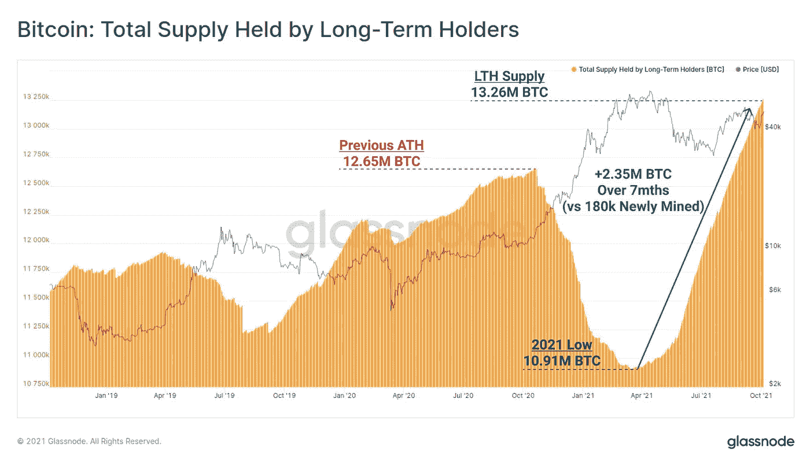
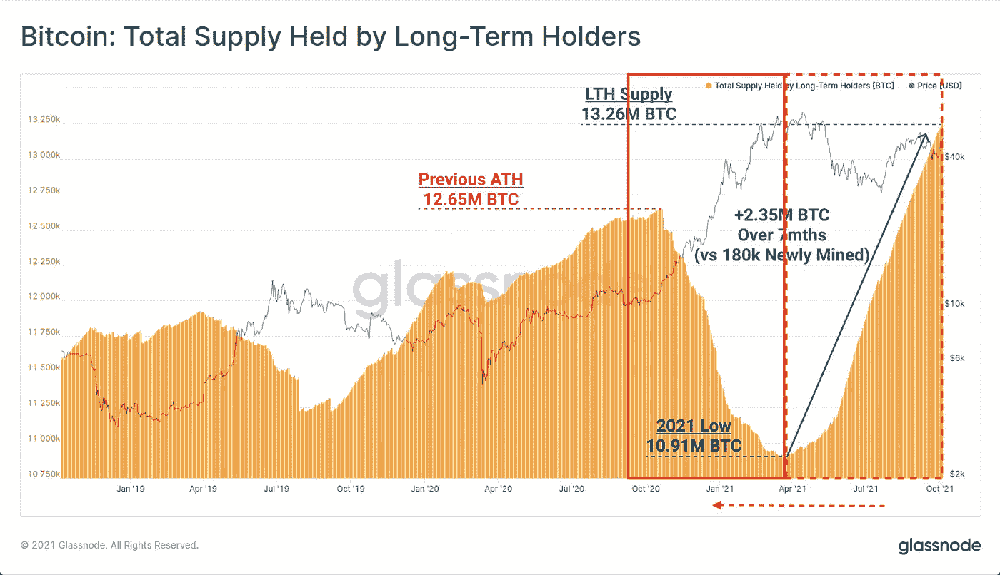

# 比特币链上数据:理解积累游戏

> 原文：<https://medium.com/coinmonks/bitcoin-on-chain-data-understanding-the-accumulation-game-bda502075b02?source=collection_archive---------9----------------------->

这篇文章是在阅读了由 Glassnode 的联合创始人 T2 的 Yann@Negentropic_ 于 1 月 26 日发布的一条推文后引发的。这条推文包含一张图表，显示了过去几个月比特币长期持有人的积累。你可以在下面看到有问题的图表，这里有一个[链接](https://twitter.com/Negentropic_/status/1445326490300600322?s=20)指向有问题的推文。

正如你所看到的，长期持有人(LTH)以*惊人的稳定速度(正如*@ Joe worrall*指出的*)明显积累了硬币。*我最初的反应是，这一定是某种算法积累的表现。LTHs 以几乎不变的速度快速增加。然而，直觉告诉我们，一些大鲸鱼在如此长的时间内以稳定的速度积累，应该会给价格带来持续的上涨压力。然而，我们在最近的价格走势中看不到这一点。那么，这些实体是否已经找到了一种方法，让它们的积累与价格完全脱钩？*

*我不这么认为，我想分解这张图表来阐述一个假设，在我看来，这个假设解释了为什么我们看不到价格对这种积累做出反应。首先，我们需要回顾一下 Glassnode 对长期持有者的定义。*

> *订阅 [**Coinmonks Youtube 频道**](https://www.youtube.com/c/coinmonks/videos) 获取每日加密新闻。*

## *什么是长期持有人(LTH)？*

*当处理集合和更高层次的概念时，定义很重要。重要的是要记住这些集合是如何形成的，以确保我们达到对数据的准确解释。*

*因此，让我们看看 Glassnode 对 LTH 的定义，正如本文中介绍的那样。LTHs 实际上有两个定义，一个是根据拥有新地址的实体(以前被归类为 LTH 实体的实体)将新地址归类为 LTH，另一个是一旦地址的年龄达到某个阈值，就将其归类为 LTH(因此也创建了**新的** LTH 实体)。*

*直接引用 Glassnode:*

> *…我们研究了在特定时间窗口内花费未用交易输出(UTXO)的概率，并将 **155 天**确定为该概率斜率变平的阈值，这标志着比特币(UTXO)由长期还是短期投资者持有的分类水平。*

*并且:*

> *为了确定长期和短期持有人拥有的 BTC 数量，我们首先考虑每个实体自(平均)购买日起的时间:如果该持续时间超过 155 天(上述阈值在我们的[之前的分析](https://insights.glassnode.com/sth-lth-sopr-mvrv/)中得出)，则该实体被视为长期持有人。*

*为什么这很重要？嗯，根据定义，LTH 供应中有一个时间因素。只有在达到某个阈值后，供应才会被添加到 LTH 余额中，因此这是一个滞后指标。Glassnode 对 LTH **实体持有的供应应用加权系数。**天平在 155 天后被赋予 50%的权重，或者换句话说，给定实体持有的一半供应量在 155 天后被标记为 LTH。这在 177 天后达到 90%。类似地，155 天没有变动的硬币被标记为长期供应，因此持有它们的实体成为 lth。*

*现在我们已经清楚了 LTH 实体和供给的定义，让我们回到图表上来。*

*地址实际上是 UTXOs，但出于本文的考虑，我们将对其进行简化。如果你想了解更多关于 UTXOs 的知识，有大量的文章解释它们:这里有 [*一个*](/byzantine-studio/blockchain-fundamentals-2-what-are-utxos-bfc503df4b99) *。**

**UTXO 的年龄是其创建的时间，或者换句话说，是特定硬币最后一次在链上移动的时间**

## *解读 LTH 增长与积累*

**

*我们看到稳定的积累似乎从 2021 年 4 月开始，并在 2021 年 6 月左右加快步伐。如果我们加上上面提到的时间部分，我们应该从该点开始往回追溯，比如说，177 天(在该点，LTH 持有的 90%的供应被认为是 LTH 供应，并且个别地址也成为 LTH 供应的一部分)。这大约是 6 个月的时间，大约在 2020 年 10 月开始积累，2021 年 1 月开始积累。类似地，为了得到范围的末端，我们从 2021 年 10 月开始回溯大约 6 个月，发现趋势应该至少持续到 2021 年 4 月。让我们在图表上添加一些标记:*

**

*accumulation window shifted 6 months back*

*看，它与价格行为完全一致。在积累可能发生的时期，价格稳步上升。*

*那么我们能从这个观察中得到什么呢？如果这种解释是正确的，这将意味着我们现在在链上观察到的积累阶段，实际上是来自过去的人工制品，积累几乎正好在一年前开始，并持续了至少 6 个月。*

*之后的积累是结束了、继续了还是加速了？我们将不得不等待更多的链上数据来回答这个问题。如果我们把上述观察结果反过来，用价格作为累积的预测指标，那么我们可能会说，激进的累积已经结束，或者至少在过去几个月里有所放缓，现在可能只是再次开始。然而，我对这种反向分析非常谨慎，因为这种关系不一定是对称的。*

*我们可以回顾过去，证明价格作为积累的预测因素在历史上并不成立。2020 年 11 月至 2021 年 4 月期间 LTH 供应量的下降并不与价格下降相一致，事实上，与价格从 2020 年 4 月至 2020 年 10 月的低点回落正好相反。我将注意到这并不一定使上述解释无效。因为它可能表明从 LTH 到某物的供应被进入市场的实体简单地吸收，因此对价格没有影响，但这将很难从一个图表中单独验证，所以我将它作为一个替代解释。*

## *替代解释*

*上面的解释只是我们从这张图表中得出的可能假设中的一个。另一个假设是:*

*   *2020 年 10 月左右，一个以前不为人知的实体购买了很大一部分比特币，随着这些硬币的老化，看似持续的积累只是从某物到 LTH 的涓涓细流。*

*通过寻找 2020 年 10 月左右流向单个实体或一组实体的大量资金，这一假设应该是可验证/可证伪的。这也将有助于研究更细致的长期住房贷款数据，将新实体与旧实体分开，并将 LTH 供应量的增加分别归因于这两个类别。如果你对此有什么想法或数据，请分享！*

## *结论*

*总之，LTH 实体持有的供应增加了，但不一定表明最近的积累。这更有可能是一年前开始、持续了至少 6 个月的较老积累阶段的产物。虽然它与同一时期观察到的价格上涨趋势一致，但我会谨慎地提出相反的关系，即价格上涨是由当前的累积引起的，需要更多的数据点来评估这种关系。*

*在任何情况下，比特币供应的很大一部分由长期持有者持有，这一趋势一直稳步持续，特别是对于非常长期的持有者(5 年以上)。比特币的非流动性供应持续上升，而且这一趋势没有逆转的迹象。*

*感谢您的阅读！*

## *我是谁？*

*我叫 Stelios，是一名数据科学家和 Web 开发人员，对比特币和闪电网络充满热情。我目前正在阿姆斯特丹大学攻读计算机科学和大数据工程硕士学位。*

*在业余时间，我正在建立一个平台，旨在通过闪电网络让众筹在全球范围内变得更加容易。*

***你在哪里能找到我？***

*你可以在 twitter @steliosats 上找到我，我主要在那里分享我对比特币和闪电网络的想法。我的 DMs 是开放的，所以请随时联系我！(除非你是垃圾邮件发送者、推广者，在这种情况下，我会立即阻止你:)*

> *加入 Coinmonks [电报频道](https://t.me/coincodecap)和 [Youtube 频道](https://www.youtube.com/c/coinmonks/videos)了解加密交易和投资*

*   *[顶级付费加密货币和区块链课程](https://blog.coincodecap.com/blockchain-courses)*
*   *[在美国如何使用 BitMEX？](https://blog.coincodecap.com/use-bitmex-in-usa) | [BitMEX 审查](https://blog.coincodecap.com/bitmex-review)*
*   *[最佳期货交易信号](https://blog.coincodecap.com/futures-trading-signals) | [流动性交易所评论](https://blog.coincodecap.com/liquid-exchange-review)*
*   *[南非的加密交易所](https://blog.coincodecap.com/crypto-exchanges-in-south-africa) | [BitMEX 加密信号](https://blog.coincodecap.com/bitmex-crypto-signals)*
*   *[MoonXBT 副本交易](https://blog.coincodecap.com/moonxbt-copy-trading) | [阿联酋的加密钱包](https://blog.coincodecap.com/crypto-wallets-in-uae)*
*   *[雷米塔诺审查](https://blog.coincodecap.com/remitano-review)|[1 英寸协议指南](https://blog.coincodecap.com/1inch)*
*   *[MoonXBT vs Bybit vs 币安](https://blog.coincodecap.com/bybit-binance-moonxbt) | [Arbitrum:第二层解决方案](https://blog.coincodecap.com/arbitrum)*
*   *[购买 PancakeSwap(蛋糕)](https://blog.coincodecap.com/buy-pancakeswap) | [矩阵导出审核](https://blog.coincodecap.com/matrixport-review)*
*   *[最佳免费加密信号](https://blog.coincodecap.com/free-crypto-signals) | [YoBit 评论](/coinmonks/yobit-review-175464162c62) | [Bitbns 评论](/coinmonks/bitbns-review-38256a07e161)*
*   *[OKEx 回顾](/coinmonks/okex-review-6b369304110f) | [Kucoin 交易机器人](/coinmonks/kucoin-trading-bot-automate-your-trades-8cf0ca2138e0) | [期货交易机器人](/coinmonks/futures-trading-bots-5a282ccee3f5)*
*   *[AscendEx Staking](https://blog.coincodecap.com/ascendex-staking)|[Bot Ocean Review](https://blog.coincodecap.com/bot-ocean-review)|[最佳比特币钱包](https://blog.coincodecap.com/bitcoin-wallets-india)*
*   *[霍比评论](https://blog.coincodecap.com/huobi-review) | [OKEx 保证金交易](https://blog.coincodecap.com/okex-margin-trading) | [期货交易](https://blog.coincodecap.com/futures-trading)*
*   *[比特币基地跑马圈地](https://blog.coincodecap.com/coinbase-staking) | [Hotbit 评论](/coinmonks/hotbit-review-cd5bec41dafb) | [KuCoin 评论](https://blog.coincodecap.com/kucoin-review)*
*   *[最佳加密交易信号电报](/coinmonks/best-crypto-signals-telegram-5785cdbc4b2b) | [MoonXBT 评论](/coinmonks/moonxbt-review-6e4ab26d037)*
*   *[Coinswitch 俱吠罗评论](/coinmonks/coinswitch-kuber-review-1a8dc5c7a739) | [电网交易机器人](https://blog.coincodecap.com/grid-trading) | [比特币基地收费](/coinmonks/coinbase-fees-831e77d4f2c5)*
*   *[Bitget 回顾](https://blog.coincodecap.com/bitget-review) | [双子 vs 区块链](https://blog.coincodecap.com/gemini-vs-blockfi) | [OKEx 期货交易](https://blog.coincodecap.com/okex-futures-trading)*
*   *[OKEx vs KuCoin](https://blog.coincodecap.com/okex-kucoin) | [摄氏替代品](https://blog.coincodecap.com/celsius-alternatives) | [如何购买 VeChain](https://blog.coincodecap.com/buy-vechain)*
*   *[币安期货交易](https://blog.coincodecap.com/binance-futures-trading)|[3 comas vs Mudrex vs eToro](https://blog.coincodecap.com/mudrex-3commas-etoro)*
*   *[在印度利用加密套利赚取被动收入](https://blog.coincodecap.com/crypto-arbitrage-in-india)*
*   *[德国最佳加密交易所](https://blog.coincodecap.com/crypto-exchanges-in-germany) | [WazirX P2P](https://blog.coincodecap.com/wazirx-p2p)*
*   *[如何购买 Monero](https://blog.coincodecap.com/buy-monero) | [IDEX 评论](https://blog.coincodecap.com/idex-review) | [BitKan 交易机器人](https://blog.coincodecap.com/bitkan-trading-bot)*
*   *[币安 vs 比特邮票](https://blog.coincodecap.com/binance-vs-bitstamp) | [比特熊猫 vs 比特币基地 vs Coinsbit](https://blog.coincodecap.com/bitpanda-coinbase-coinsbit)*
*   *[如何购买 Ripple (XRP)](https://blog.coincodecap.com/buy-ripple-india) | [非洲最好的加密交易所](https://blog.coincodecap.com/crypto-exchange-africa)*