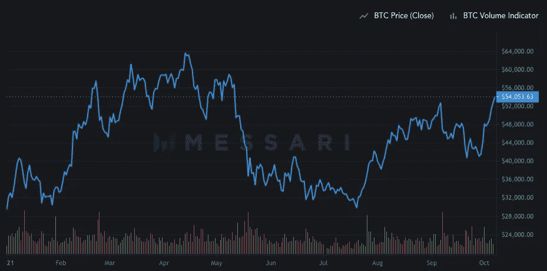
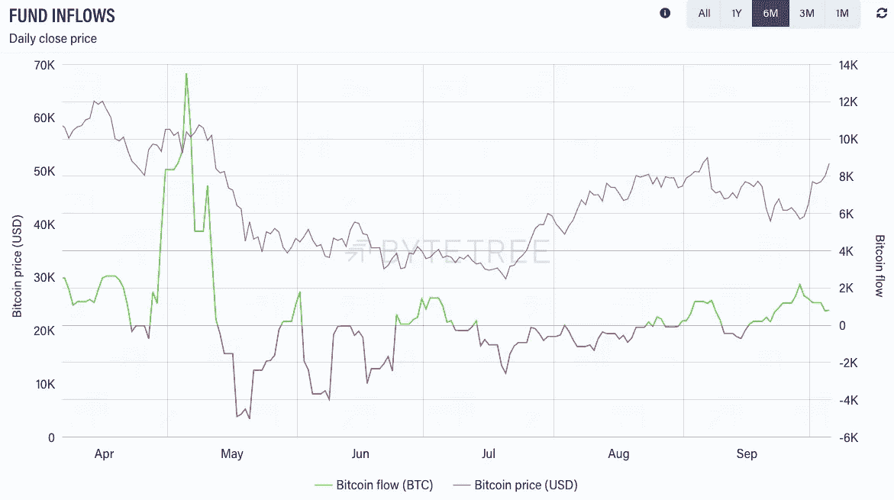
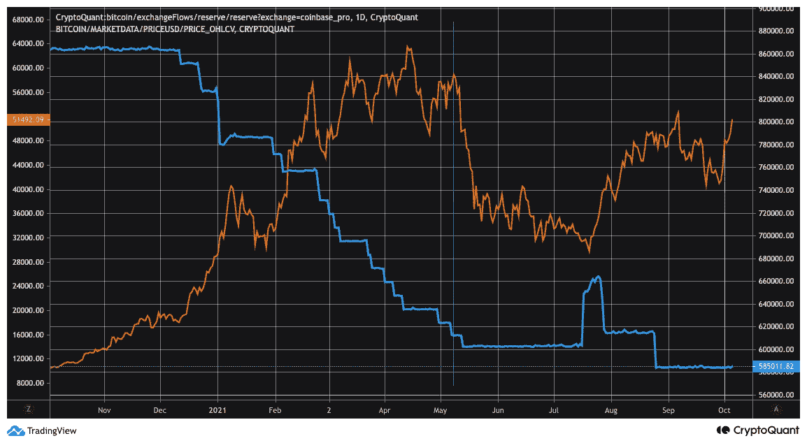
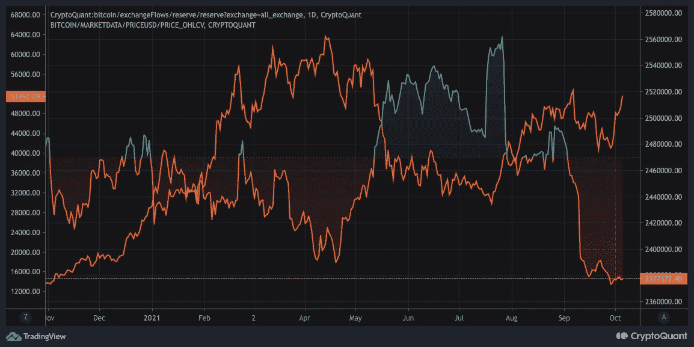
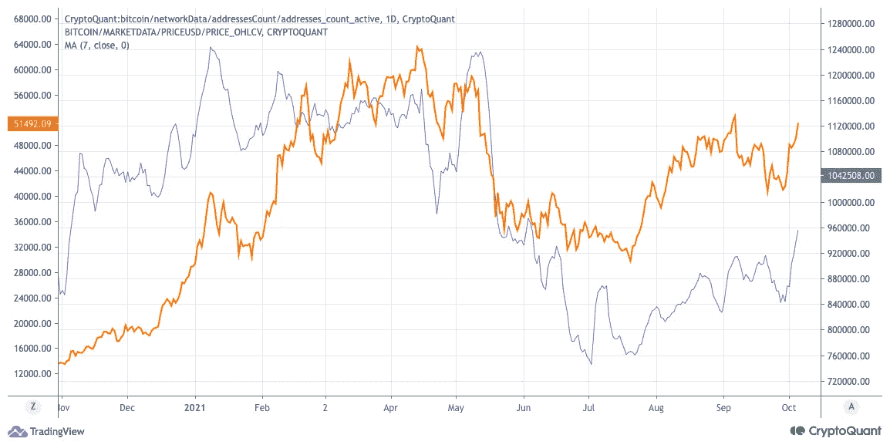
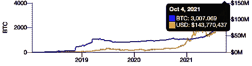
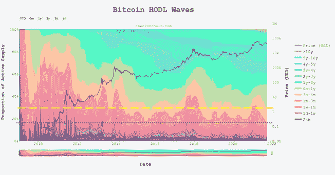

# 比特币连锁市场总结

> 原文：<https://medium.com/coinmonks/bitcoin-on-chain-market-wrap-up-95e55c24337d?source=collection_archive---------6----------------------->

## 比特币供应短缺正在到来吗？

我已经有一段时间没有从链上的角度写一篇更长的关于比特币市场状况的文章了。自那以后，潜在的基本面发生了相当大的变化。我在 6 月 18 日发表的上一篇文章题为“[看涨潜在的连锁趋势和对比特币的短期怀疑前景](/coinmonks/bullish-underlying-on-chain-trend-and-a-short-term-sceptical-outlook-for-bitcoin-ae45f6104606?source=user_profile---------0----------------------------)”，回顾过去是正确的。正如我在文章中指出的，虽然潜在的链上趋势是积极的，但并不是所有的链上和链下数据都显示出积极的趋势。大约在那个时候，价格是 38k 美元。在接下来的几周，价格主要保持横盘整理，几乎整整一个月后的 7 月 20 日，价格跌至约 3 万美元的新低。从那以后，价格开始回升，如今比特币的价格超过了 54k 美元。

Graph 1: Bitcoin Price Year-to-Date (Source: Messari.io)

尽管在撰写上一篇文章时，比特币的 7 天基金净流入有些悲观，主要是在接下来的几个月里，基金自 9 月中旬以来一直呈现净流入。当然，从宏观角度来看，净流入的数量并不那么重要。然而，趋势是积极的，只要保持这种趋势，这就是最重要的。

Graph 2: 7-day fund net inflows of Bitcoin (Source: bytetree.com)

在经历了从 5 月中旬到 7 月中旬的一段平静期后，比特币基地职业比特币交易所的余额在过去几个月里也出现了一些波动。它在 7 月 20 日价格低点之前增加，并自那时以来创下新低。总的来说，今年上半年的趋势并不明显。随着比特币市场的快速发展和潜在变化的发生(例如，gray 不再在比特币基地专业版上购买大量比特币)，我们是否会再次看到这种模式值得怀疑。

Graph 3: Bitcoin Exchange Reserves Coinbase Pro (Source: CryptoQuant)

更有趣的是，根据 cryptoquant.com 的数据，自 7 月底以来，交易所的比特币总余额一直在下降。比特币交易所的储备现在处于新低，低于我们在比特币 ATH 观察到的水平。谈论交易所的供应紧张可能有些过了，但交易所的比特币数量减少，以及那些离开交易所的比特币有望被自我保管，是一个非常积极的发展。

Graph 4: Bitcoin Exchange Reserves Aggregate (Source: CryptoQuant)

总体而言，外汇余额的变化表明，过去两个月对比特币的需求有所增加。

Graph 5: Number of Active Addresses 7-day Moving Average (Source: CryptoQuant)

随着过去几天价格的回升，活跃地址数量方面的网络活动也再次回升，总体而言，自 7 月以来趋势一直在上升。尽管与今年上半年相比仍然相对较低。这里的一个因素可能是闪电网络越来越重要，到目前为止已经达到 3000 多个比特币的容量，并且还在继续增长。最大的问题仍然是闪电网络和其他发展在这项措施的下降中扮演了多大的角色。虽然这肯定是原因之一，但我认为我们仍处于相对平静的时期。我认为，一旦我们打破今年的历史最高价格，我们将看到网络活动再次大幅增加，届时零售将继续以更大的数量回归。

Graph 6: Bitcoin Lightning Network Capacity (Source: bitcoinvisuals.com)

最引人注目的图表是由将军会提供的 HODL 波浪图，该图显示自今年年初以来，比特币越来越多地被转移到霍德勒手中。今年年初，过去三个月内，30%的比特币供应已经转移。截至 2021 年 10 月 4 日，这一数字已降至 16%。与此同时，在前 3-6 个月内最后一次移动的硬币从 7%增加到 13%，在 6-12 个月内最后一次移动的硬币从 9%增加到 22%。这意味着年初已经买的币有很大一部分被套牢了，没有卖出去。

Graph 7: Bitcoin HODL Waves (Source: Checkonchain.com)

这里突出的是过去 3 个月内持续活跃的硬币百分比的历史低点(见图 7 绿色虚线)。这是我们从未见过的低点。这是否表明，人们开始意识到，比特币不仅仅是一种可以短期抛售的投机资产，而是一种可以长期持有的资产？随着宏观经济环境的变化，机构资金的涌入，以及比特币被认为是一种潜在的避险资产，这似乎是合理的。如果这是真的，如果不断增长的需求面临有限的硬币供应，比特币可能会在未来几个月出现一些令人兴奋的举动。当然，这并不意味着，由于宏观环境的变化，或者仅仅是因为价格不能直线上涨，就不会再出现调整。不过，总的来说，在我看来，自上一篇文章以来，情况已经有了很大的改善。

**更多定期更新请关注我的推特:** [**@JanWues**](https://twitter.com/JanWues)

披露:上述文章引用了一种观点，仅供参考。它无意成为投资建议。

> 加入 Coinmonks [电报频道](https://t.me/coincodecap)和 [Youtube 频道](https://www.youtube.com/c/coinmonks/videos)了解加密交易和投资

## 也阅读

 [## 最佳加密交易所| 2021 年十大加密货币交易所

### ICON _ PLACEHOLDEREstimated 预计阅读时间:28 分钟加密货币交易所的加密交易需要知识…

blog.coincodecap.com](https://blog.coincodecap.com/crypto-exchange)  [## 2021 年 10 大最佳加密贷款平台| CoinCodeCap

### 当谈到加密货币贷款时，大量因素等同于良好的收入状况。此外，借款的一部分…

blog.coincodecap.com](https://blog.coincodecap.com/crypto-lending)  [## 2021 年最佳免费加密交易机器人

### 2021 年币安、比特币基地、库币和其他密码交易所的最佳密码交易机器人。四进制，位间隙…

medium.com](/coinmonks/crypto-trading-bot-c2ffce8acb2a)  [## 最佳 4 个加密交易信号电报通道

### 这是乏味的找到正确的加密交易信号提供商。因此，在本文中，我们将讨论最好的…

medium.com](/coinmonks/best-crypto-signals-telegram-5785cdbc4b2b)  [## BlockFi 评论 2021:利弊和利率| CoinCodeCap

### 今天，我们提出了一个全面的 BlockFi 评论，这是一个成立于 2017 年的加密贷款平台，拥有其…

blog.coincodecap.com](https://blog.coincodecap.com/blockfi-review)  [## 如何在印度购买比特币？2021 年购买比特币的 7 款最佳应用[手机版]

### 如何使用移动应用程序购买比特币印度

medium.com](/coinmonks/buy-bitcoin-in-india-feb50ddfef94)  [## 加密税务软件——五大最佳比特币税务计算器[2021]

### 不管你是刚接触加密还是已经在这个领域呆了一段时间，你都需要交税。

medium.com](/coinmonks/best-crypto-tax-tool-for-my-money-72d4b430816b)  [## 存储比特币的最佳加密硬件钱包[2021] | CoinCodeCap

### 保管您的数字资产很容易，但找到正确的存储方式却是一项繁琐的任务。在线钱包有一个风险…

blog.coincodecap.com](https://blog.coincodecap.com/best-hardware-wallet-bitcoin)