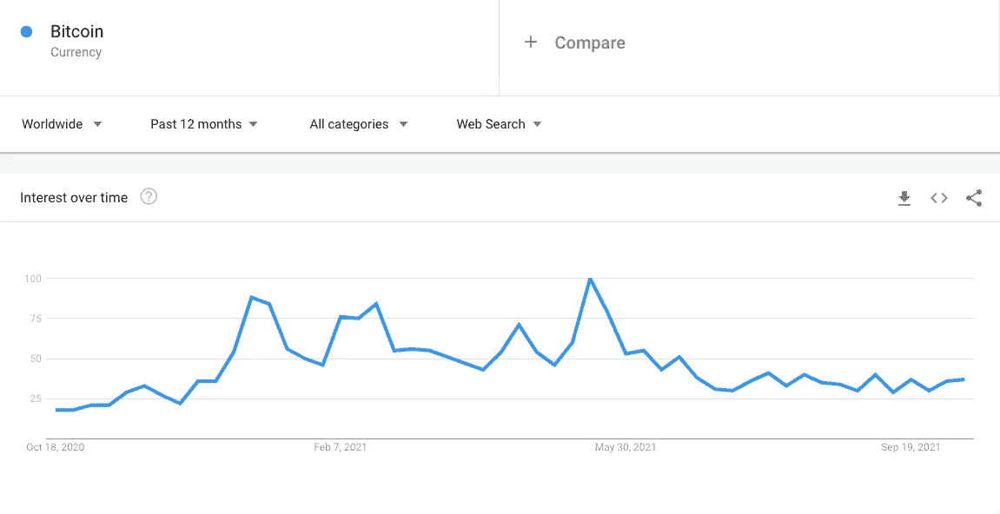
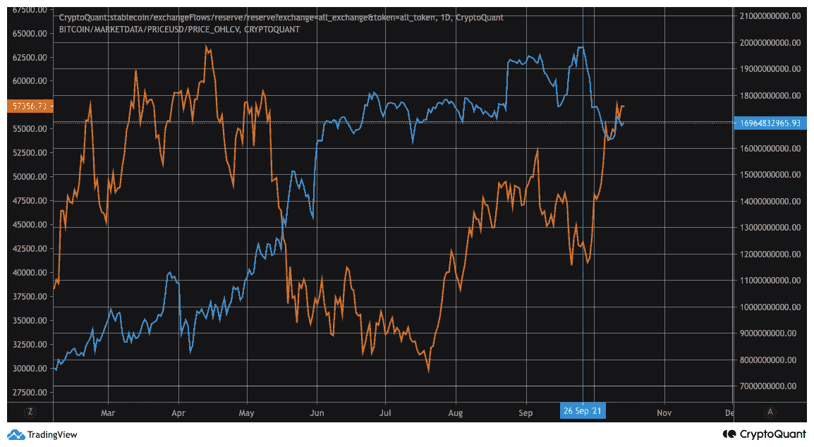

# 比特币连锁市场总结——更多场外交易正在发生？

> 原文：<https://medium.com/coinmonks/bitcoin-on-chain-market-wrap-up-more-otc-deals-happening-178f7c59df45?source=collection_archive---------6----------------------->

## 网络活动和购买者的背景

写完[比特币连锁市场综述](/coinmonks/bitcoin-on-chain-market-wrap-up-95e55c24337d)的文章已经一周多了。随着比特币价格交易在 6 万美元左右，我想简要更新一下链上数据从那时起是如何演变的，并通过添加一些额外的相关数据来提供更多的背景信息。

Graph 1: Bitcoin Price Year-to-Date (Source: Messari.io)

大多数指标没有实质性变化，例如比特币兑换储备。因此，我不打算详细谈论它们。关于进一步的参考，您可以在本文末尾的附录中找到我没有讨论的内容。

7 天比特币资金净流量继续为正。

> 订阅 [**Coinmonks Youtube 频道**](https://www.youtube.com/c/coinmonks/videos) 获取每日加密新闻。

Graph 2: 7-day fund net inflows of Bitcoin (Source: bytetree.com)

截至昨日，基金持有的比特币超过 80.6 万枚。自 10 月 5 日以来，已有超过 45000 万个比特币被纳入基金持有的资产。如此一来，目前基金持有量距离 5 月份的历史高点仅约 65000 比特币。

Graph 3: Bitcoin held by funds (Source: bytetree.com)

活动地址数的 7 天移动平均值继续高于前几个月。正如我在上一篇文章中提到的，与今年上半年相比，这仍然是相对较低的。

Graph 4: Number of Active Addresses 7-day Moving Average (Source: CryptoQuant)

考虑到随着比特币最近的价格回升，在谷歌上搜索比特币的次数并没有大幅增加，零售行业似乎不会再大量关注比特币。我怀疑，一旦比特币价格突破之前的历史高点并创出新高，这种情况就会回来。这可以解释为什么活动地址的数量没有回到历史新高。

Graph 5: Google Searches for Bitcoin (Source: GoogleTrends)

与活跃地址的数量相比，自 8 月底以来，转移的比特币总量的 7 天移动平均水平仍然很高，大大高于我们全年看到的水平和比特币的历史最高水平。那么，为什么在活跃地址数量仍然相对较低的情况下，转移的比特币总量却在大幅增加？

Graph 6: Number of Total Bitcoin Transferred 7-day Moving Average (Source: CryptoQuant)

所有交易所的比特币资金流量比率可以让我们了解这些大额转账来自哪里。资金流动比率定义如下:

例如，比率的增加意味着网络上更多的传输与交换传输相关。自 5 月底以来，这一比例一直呈下降趋势，并创下今年的新低。随之而来的是，越来越多被转移的比特币与汇兑流量无关。因此，比特币链上转账的增加主要与汇兑转账无关。

Graph 7: Exchanges Bitcoin Fund Flow Ratio 7-day Moving Average (Source: CryptoQuant)

虽然我们不能肯定，但这可能表明越来越多的场外交易正在发生，推动了比特币的价格。这也可以解释为什么虽然价格接近历史最高水平，但活跃地址的数量并不接近我们在今年头几个月看到的数量(其他原因可能是闪电网络容量的增加，正如我在上一篇文章中解释的)。

当然，我们不能把最近的价格回升完全归因于鲸鱼和场外交易。已经进入这一领域的资本似乎也已投入使用。就在价格回升的前几天，交易所稳定的硬币供应开始下降。虽然交易所持有的稳定硬币的减少也可能是由于人们将稳定硬币兑换成美元等货币造成的，但这两种情况几乎同时发生是一种巧合。更有可能的是，一直处于观望状态的资本已经被用来购买比特币。

Graph 7: Stable Coin Exchange Reserves (Source: CryptoQuant)

总之，基金继续增加新的比特币。网络活动再次升温，尤其是比特币交易总额，自 8 月底以来，这一数字远高于今年前几个月。这可能是由于鲸鱼活动的增加和潜在的场外交易。价格回升的第二个驱动力可能是由于观望的资本正在转换。新零售似乎还没有大量进入这个领域。这是一个好消息，因为这意味着突破之前的历史高点，不需要来自散户的新资金。然而，不幸的是，在更多的机构资金流入这个领域之前，我更希望看到尽可能多的散户投资者囤积 sat。

**更多定期更新请在 Twitter 上关注我:** [**@JanWues**](https://twitter.com/JanWues)

披露:上述文章引用了一种观点，仅供参考。它无意成为投资建议。

**附录**

Graph 8: Bitcoin Exchange Reserves Coinbase Pro (Source: CryptoQuant)

Graph 9: Bitcoin Exchange Reserves All Exchanges (Source: CryptoQuant)

> 加入 Coinmonks [电报频道](https://t.me/coincodecap)和 [Youtube 频道](https://www.youtube.com/c/coinmonks/videos)了解加密交易和投资

## 也阅读

*   [block fi vs Celsius](/coinmonks/blockfi-vs-celsius-vs-hodlnaut-8a1cc8c26630)|[Hodlnaut 审核](/coinmonks/hodlnaut-review-best-way-to-hodl-is-to-earn-interest-on-your-bitcoin-6658a8c19edf) | [KuCoin 审核](https://blog.coincodecap.com/kucoin-review)
*   [Bitsgap 评审](/coinmonks/bitsgap-review-a-crypto-trading-bot-that-makes-easy-money-a5d88a336df2) | [Quadency 评审](/coinmonks/quadency-review-a-crypto-trading-automation-platform-3068eaa374e1) | [Bitbns 评审](/coinmonks/bitbns-review-38256a07e161)
*   [加密复制交易平台](/coinmonks/top-10-crypto-copy-trading-platforms-for-beginners-d0c37c7d698c) | [Coinmama 审核](/coinmonks/coinmama-review-ace5641bde6e)
*   [印度的加密交易所](/coinmonks/bitcoin-exchange-in-india-7f1fe79715c9) | [比特币储蓄账户](/coinmonks/bitcoin-savings-account-e65b13f92451)
*   [OKEx vs KuCoin](https://blog.coincodecap.com/okex-kucoin) | [摄氏替代品](https://blog.coincodecap.com/celsius-alternatives) | [如何购买 VeChain](https://blog.coincodecap.com/buy-vechain)
*   [币安期货交易](https://blog.coincodecap.com/binance-futures-trading)|[3 comas vs Mudrex vs eToro](https://blog.coincodecap.com/mudrex-3commas-etoro)
*   [如何购买 Monero](https://blog.coincodecap.com/buy-monero) | [IDEX 评论](https://blog.coincodecap.com/idex-review) | [BitKan 交易机器人](https://blog.coincodecap.com/bitkan-trading-bot)
*   [CoinDCX 评论](/coinmonks/coindcx-review-8444db3621a2) | [加密保证金交易交易所](https://blog.coincodecap.com/crypto-margin-trading-exchanges)
*   [Bookmap 评论](https://blog.coincodecap.com/bookmap-review-2021-best-trading-software) | [美国 5 大最佳加密交易所](https://blog.coincodecap.com/crypto-exchange-usa)
*   [如何在 FTX 交易所交易期货](https://blog.coincodecap.com/ftx-futures-trading) | [OKEx vs 币安](https://blog.coincodecap.com/okex-vs-binance)
*   [CoinLoan 评论](https://blog.coincodecap.com/coinloan-review) | [YouHodler 评论](/coinmonks/youhodler-4-easy-ways-to-make-money-98969b9689f2) | [BlockFi 评论](https://blog.coincodecap.com/blockfi-review)
*   [CoinFLEX 评论](https://blog.coincodecap.com/coinflex-review) | [AEX 交易所评论](https://blog.coincodecap.com/aex-exchange-review) | [UPbit 评论](https://blog.coincodecap.com/upbit-review)