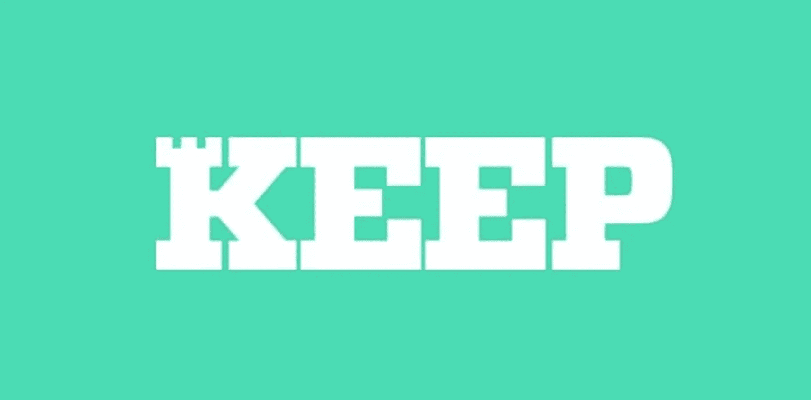

# 以太坊区块链上的比特币，童话，还是现实？tBTC 简介

> 原文：<https://medium.com/coinmonks/bitcoin-on-ethereum-blockchain-fairy-tale-or-reality-an-introduction-of-tbtc-ed1af8d1970b?source=collection_archive---------6----------------------->

加密世界是一个不眠的社区，不同的加密和基于区块链的创新每时每刻都在涌现。你有没有想象过在基于以太坊的区块链上使用 BTC 的可能性有多大？几年前，这可能是一个不可想象的不可能的事情，考虑到区块链的争议。然而，随着对基于以太坊的创新越来越感兴趣，有一项创新允许比特币用户在以太坊网络内使用 BTC。

许多比特币用户一直对跳转到基于以太坊的 DeFi 项目持怀疑态度，这是由于不同的原因，包括；以太坊区块链可感知的复杂性、技术性和安全性，以及 2014 年 Mt. Gox 事件导致的易受黑客攻击和盗窃等。有趣的是，这些年来发生了很多事情，这些创新技术与几年前完全不同，因为技术有了重大改进，随着 tBTC 的引入，这些技术将区块链以太坊上 BTC 的童话从童话变成了实际系统。

> **什么是 tBTC？**

tBTC 是一项创新，让比特币用户在基于以太坊的分散金融(DeFi)系统上赚取 BTC，而不受第三方或中介的干扰。请记住，比特币和以太坊用户之间一直存在信任问题，加上过去的违规历史，但有了 tBTC，他们就有了一个公平的竞争环境。tBTC 使加密用户可以很容易地赎回和存放 BTC，而不用担心信任、安全和其他可察觉的违规行为。像 tBTC 这样的倡议的出现使得比特币用户非常有可能从 DeFi 的惊人功能中受益。以下是您应该考虑 tBTC 的一些原因:

*   **简约**

tBTC 的一个令人惊讶的特性是用户会喜欢的简单性。从 BTC 到 tBTC 的转换非常简单，只需 3 个步骤。

*   **BTC 撑腰**

你可能有兴趣知道，每一个 tBTC 都以 1:1 的比率与 BTC 挂钩。

*   **提高安全性**

tBTC 为用户提供了一个定期接受审计的开源平台。它的功能依赖于 t-ECDSA 算法

*   **分权**

作为默认功能，以太坊区块链是促进 DApps 和 DeFi 操作的基础技术，它具有去中心化功能，可以消除来自中介或第三方的任何形式的干扰。

*   **无权限**

由于没有中央机构或中介，用户可以很容易地随时进行交易。

*   **改进**

没有一个想要在像加密领域这样的竞争市场中茁壮成长的系统不做些事情来改进它的功能。为了使 tBTC 更好，它实施了一些变化，包括扩展其安全协议，以及调整其审计框架，并修复了 10 倍的 bug 奖金。tBTC 平台的整体改进是为比特币用户呈现一种无缝加入 DeFi 潮流的方式。

> **随机性:保持网络和 tBTC**

tBTC 的功能涉及三个项目；Keep、跨链组和 Summa。这些项目有其特定的技术功能，使 tBTC 成为用户使用比特币在基于以太坊的平台上赚取的安全平台。Keep 的职责包括提供随机信标，负责选择 tBTC 存款的签署方。

Keep 为系统带来了不同的功能，其中包括:

*   **隐私**

作为提高交易安全性的一种方式，Keep 通过确保重要的网络组件尽可能保密，为用户提供了增强的隐私框架。除非签名发生在所有人都不知道的私钥上，否则签名组将不起作用，并且这也以相同的方式影响随机信标。随机性是 Keep 的一个核心功能，为了确定一个用户在做什么，必须有各方的合谋；这种冲突是不可能的，因为签名者的选择是随机的，这必然会促进交易的私密性。

*   **保护**

值得注意的是，tBTC 是一个链上框架；然而，私有信息由 Keep 借助于阈值 ECDSA 来存储，并且被保持在链外。Keep 通过以太坊链进行通信，但在远离以太坊链的情况下运行，而 Keep 网络和 tBTC 的智能合约协议相互交互。这是确保用户隐私和收入得到保护的一种方式。

*   **不信任**

tBTC 确保了不信任，因为该平台有一个“签名者团体”框架，可以减轻来自交易对手的风险。在签名者团体的协助下，交易在没有中间人任何形式干预的情况下进行。

主要地，Keep 有助于保持所需的不信任，以通过实现随机信标来保持 tBTC 有效地运行。

> **合作关系**

没有一些战略合作伙伴关系，任何一家总部位于区块链的初创公司都很难取得成功，这就是 Keep 与 40 多家实体合作的原因，其中包括聚合器、股东、审计师、分散式应用程序和平台、钱包、交易所、托管服务提供商和签名者。Keep 的主要投资者包括 Draper Associates、Paradigm、Polychain Capital、Fenbushi Capital 和 a16z。Keep 和 tBTC 与知名公司建立了合作伙伴关系，以进一步提高 tBTC 的声誉和可靠性。

当 BTC 用户想要使用 tBTC 时，他们需要将其 BTC 转换为 tBTC，这是一种基于 ERC 20 的令牌。此外，从 tBTC 到 BTC，他们也可以这样做，并且所有流程都不需要任何第三方签准。这是一项革命性的创新，将推动更多的比特币用户进入 DeFi 市场，从而加快这种加密投资模式的主流采用率。

tBTC 是在以太坊区块链上使用您的 BTC 的一种可信、良好且安全的方式，它让您可以访问不同的 DeFi 资源。任何人加入 tBTC 成为签名者都相当容易，你可以访问 [https://tbtc.network/](https://tbtc.network/) 了解更多信息。

[tBTC](https://tbtc.network)

[tBTC 白皮书](https://docs.keep.network/tbtc/index.pdf)

[保持网络](https://keep.network)

[不和](https://discord.gg/mdmPUP)

[推特](https://twitter.com/keep_project)

由尼基塔#7876 出版

> [直接在您的收件箱中获得最佳软件交易](https://coincodecap.com?utm_source=coinmonks)

