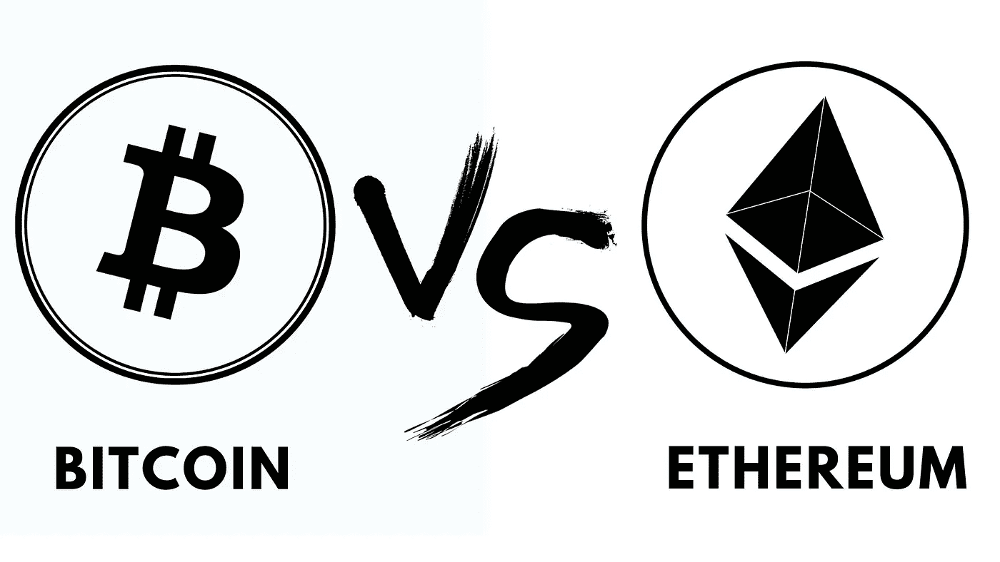

# 比特币还是以太坊？|哪个更好

> 原文：<https://medium.com/coinmonks/bitcoin-or-ethereum-which-one-is-better-cac9a49863a3?source=collection_archive---------10----------------------->

比特币和以太坊是最受欢迎的，按市值排名第一和第二。读完这篇文章后，你会知道他们是如何相同的，他们是如何不同的，哪一个是最好的。为了理解哪一个更好，我们需要更多地了解比特币和以太坊。

# 比特币

比特币的市值为 6850 亿美元，日交易量为 840 亿美元，流通供应量为 1850 万枚代币。比特币是 2008 年 1 月创造的一种 [**数字货币**](https://www.investopedia.com/terms/d/digital-money.asp) 。

它遵循神秘的假名中本聪的想法。创造了**比特币**的人的身份仍然是个谜。

与传统的在线支付机制相比，比特币有望降低交易费用。**比特币由一个去中心化的机构运营，政府与它没有内部联系。**

# 以太坊

以太坊由 Vitalik Pewter 于 2014 年创建并推出，市值为 1220 亿美元，每日交易量为 400 亿美元。我们拥有世界上最聪明的可编程货币。

[以太坊](https://ethereum.org/en/)对所有人开放数字货币和数据友好服务——无论你的背景或位置。**这是一项社区构建的技术，支持加密货币以太网(ETH)和您今天可以使用的数千种应用。**

# 比特币和以太坊的相似之处

然而，这两种加密货币是相关的。它们都是人们喜欢投机和赌博的投资。两者都基于相同的技术，称为“区块链技术”，都是分散的交换媒介。

以太坊类似于比特币，因为它们使用工作证明共识进行操作。这意味着无论是以太坊还是比特币，交易的验证和确认都需要节点的全网共识。由于这种情况，它们在处理事务时都很慢。

以太坊比比特币略快:它通常每秒处理 10-15 笔交易，而比特币处理 3-5 笔交易。至少，目前版本的以太坊是这样的。目前市场上的一大期望是，即将到来的 2.0 升级将提供更快的交易等。

# 比特币和以太坊的区别

以太坊与比特币的主要区别在于智能合约——这个术语与区块链以太坊联系最为紧密。智能合同是具有多种应用的数字合同。

以太坊 2.0，提到信标链就有意义了。，用于提供以太坊智能功能的升级。

Beacon chain 使用利害关系一致性算法证明，而不是工作证明，这意味着它使用令牌而不是传统的计算能力来处理事务。这意味着改善以太坊的可伸缩性，并极大地提高其吞吐率。

两者都是正相关的——当比特币上涨或下跌时，以太坊也会发生同样的情况。比特币的市值大约是它的四倍。因此，它的价格行动不太稳定。

# 比特币和以太坊哪个投资更好

归根结底，比特币和以太坊之间的投资选择取决于相关的风险因素。比特币吸引了机构投资者的最大关注，这是有充分理由的:越来越多的科技公司开始接受比特币作为一种支付形式。

以太坊是一种更加实用的加密货币。因为它是首批支持智能合约的网络之一，所以它将会有更多的发展。尽管业内专业人士的好感似乎只是随着时间的推移而上升。

由于比特币是市场上最古老的，因此它似乎比以太坊更稳定。但以太坊正在升级技术，建立更多智能合约。

因此，合理的做法是分散投资，关注新趋势。几个月内，如果不是几天，加密货币的价值可能会发生巨大变化。随着世界变得越来越数字化，加密货币的采用也越来越多，随着时间的推移，两者都有望取得好成绩。*

*   这不是对任何投资的建议，请在做出任何决定之前做好自己的研究*
*   作者“穆库尔”为[https://investorr.net/](https://investorr.net/)撰写内容

> 加入 Coinmonks [电报频道](https://t.me/coincodecap)和 [Youtube 频道](https://www.youtube.com/c/coinmonks/videos)了解加密交易和投资

## 另外，阅读

*   [网格交易机器人](https://blog.coincodecap.com/grid-trading) | [Cryptohopper 审查](/coinmonks/cryptohopper-review-a388ff5bae88) | [Bexplus 审查](https://blog.coincodecap.com/bexplus-review)
*   [7 个最佳零费用加密交易平台](https://blog.coincodecap.com/zero-fee-crypto-exchanges)
*   [去中心化交易所](https://blog.coincodecap.com/what-are-decentralized-exchanges) | [比特恩斯 FIP](https://blog.coincodecap.com/bitbns-fip) | [Pionex 评论](https://blog.coincodecap.com/pionex-review-exchange-with-crypto-trading-bot)
*   [用信用卡购买密码的 10 个最佳地点](https://blog.coincodecap.com/buy-crypto-with-credit-card)
*   [加密复制交易平台](/coinmonks/top-10-crypto-copy-trading-platforms-for-beginners-d0c37c7d698c) | [如何在 WazirX 上购买比特币](/coinmonks/buy-bitcoin-on-wazirx-2d12b7989af1)
*   [CoinLoan 审核](https://blog.coincodecap.com/coinloan-review)|[Crypto.com 审核](/coinmonks/crypto-com-review-f143dca1f74c) | [火币保证金交易](/coinmonks/huobi-margin-trading-b3b06cdc1519)
*   [Bookmap 评论](https://blog.coincodecap.com/bookmap-review-2021-best-trading-software) | [美国 5 大最佳加密交易所](https://blog.coincodecap.com/crypto-exchange-usa)
*   最佳加密[硬件钱包](/coinmonks/hardware-wallets-dfa1211730c6) | [Bitbns 评论](/coinmonks/bitbns-review-38256a07e161)
*   [新加坡十大最佳加密交易所](https://blog.coincodecap.com/crypto-exchange-in-singapore) | [购买 AXS](https://blog.coincodecap.com/buy-axs-token)
*   [投资印度的最佳加密软件](https://blog.coincodecap.com/best-crypto-to-invest-in-india-in-2021) | [WazirX P2P](https://blog.coincodecap.com/wazirx-p2p)
*   [加拿大最佳加密交易机器人](https://blog.coincodecap.com/5-best-crypto-trading-bots-in-canada) | [库币评论](https://blog.coincodecap.com/kucoin-review)
*   [用于 Huobi 的加密交易信号](https://blog.coincodecap.com/huobi-crypto-trading-signals) | [HitBTC 审查](/coinmonks/hitbtc-review-c5143c5d53c2)