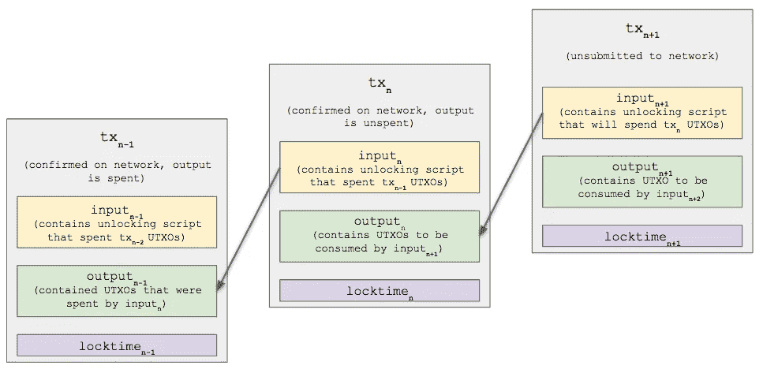

# 比特币 P2PKH 交易明细

> 原文：<https://medium.com/coinmonks/bitcoin-p2pkh-transaction-breakdown-bb663034d6df?source=collection_archive---------0----------------------->

这篇文章的目的是全面介绍最常见的比特币交易类型，*Pay-to-Public-Key-Hash*(P2PKH)。为了实现这一点，提出了以下内容:

*   对未用完事务输出(UTXO)的概念以及事务是如何形成的简要概述
*   P2PKH 交易的每个部分的细分
*   解锁和锁定脚本如何配合使用资金的概述

P2PKH 交易是大多数人通常通过钱包接口将指定数量的比特币从一个地址转移到另一个地址时进行的交易类型。一个示例交易用于清楚地展示一个普通钱包的幕后发生的部分事情。

# 未用交易产出

在深入事务分解之前，需要理解一个非常重要的概念，即*未用完的事务输出*或 UTXO。在比特币交易中，UTXOs 是被消费或花费的东西。一个 UTXO 只能用一次。在耗尽之后，它被称为*耗尽的事务输出*。

消费 UTXO 类似于拿一张 20 美元的钞票去买 10 美元的东西，但不是收银员保留 20 美元钞票，而是她点燃它，凭空创造两张新的 10 美元钞票，保留一张，另一张作为零钱退还给你。

在这个类比中，焚烧后的 20 美元钞票开始是一个 UTXO，但一旦它被消费，就变成了一个失效的交易输出，这产生了两张新的 10 美元钞票，代表两个准备在未来交易中使用的新 UTXO。

网络上所有可供消费的比特币都被称为 *UTXO 集合*。

# 交易构建流程

每个交易由*版本号*、*输入*、*输出*和*锁定时间*组成。

输入包含一个*输出点*、一个*序列号*和一个*解锁脚本*，也称为*脚本签名*。

输出包含花费金额的*值*和*锁定脚本*，也称为 *scriptPubKey* 。

锁定时间规定了交易生效的时间。

每个事务至少有一个输入和一个输出。输入包含告诉网络消耗哪些 UTXOs(通过输出点)并证明它被允许消耗它们(通过解锁脚本)的逻辑。输出包含告诉网络允许未来事务使用新创建的 UTXOs 的条件的逻辑(通过锁定脚本)。

下图旨在说明已确认交易与已用产出、已确认交易与未用产出以及新的未提交交易之间的关系。



Transaction Relationship

## 构建事务的步骤

构建 P2PKH 事务的步骤如下:

1.  找出一个包含你控制的 UTXOs 的以前的交易(只是一些你已经拥有的比特币)。
2.  构建新事务的输入输出点，以确定前一个事务要花费的 UTXO。
3.  构建新事务的输出，这样锁定脚本将包含新创建的 UTXOs 可以被下一个事务使用/解锁的条件。
4.  创建解锁脚本，使其满足前面事务输出的锁定脚本设置的条件。它包含接收者的签名，并在最后一步创建，但也是输入的一部分，实际上位于交易的中间。

# 序列化事务的介绍

下面详细讨论一个完整的已签名的 P2PKH 比特币交易。

```
01000000019c2e0f24a03e72002a96acedb12a632e72b6b74c05dc3ceab1fe78237f886c48010000006a47304402203da9d487be5302a6d69e02a861acff1da472885e43d7528ed9b1b537a8e2cac9022002d1bca03a1e9715a99971bafe3b1852b7a4f0168281cbd27a220380a01b3307012102c9950c622494c2e9ff5a003e33b690fe4832477d32c2d256c67eab8bf613b34effffffff02b6f50500000000001976a914bdf63990d6dc33d705b756e13dd135466c06b3b588ac845e0201000000001976a9145fb0e9755a3424efd2ba0587d20b1e98ee29814a88ac00000000
```

这个交易是从 Blockchain.com 随机抽取的，可以在这里查看([原始值](https://blockchain.info/rawtx/e65ad475a01384b086ce0d04199835fdd580739422ece1e0f1c4e362d43735d9))。

从一个值为 17，373，066 的 UTXO 地址 19 iy 8 hkpg 5 ebsqb 2 gunvpudbxitrpxpsx 发送 390，582 个 satoshi 到 1 jkrg 4 f 7k 1 b 7 PBA HQ 7 he euv 5 atjdpk 9 ts 并接收 16，932，484 个 satoshi 作为更改返回。投入和产出之间的剩余差额作为交易处理费归矿商所有。

# 版本号

```
**01000000**019c2e0f24a03e72002a96acedb12a632e72b6b74c05dc3ceab1fe78237f886c48010000006a47304402203da9d487be5302a6d69e02a861acff1da472885e43d7528ed9b1b537a8e2cac9022002d1bca03a1e9715a99971bafe3b1852b7a4f0168281cbd27a220380a01b3307012102c9950c622494c2e9ff5a003e33b690fe4832477d32c2d256c67eab8bf613b34effffffff02b6f50500000000001976a914bdf63990d6dc33d705b756e13dd135466c06b3b588ac845e0201000000001976a9145fb0e9755a3424efd2ba0587d20b1e98ee29814a88ac00000000
```

版本号有四个字节长，以 little endian 格式表示为十六进制值。

有两种版本类型。版本 01 表示没有相对时间锁。版本 02 表示可能存在相对时间锁定。版本 02 在 [BIP0068](https://github.com/bitcoin/bips/blob/master/bip-0068.mediawiki) 中推出，增加了 OP_CHECKSEQUENCEVERIFY 和 [BIP0112](https://github.com/bitcoin/bips/blob/master/bip-0112.mediawiki#Bidirectional_Payment_Channels) 对其进行了升级。版本 02 与下面描述的序列号一起使用。

示例交易是版本 01。

# 交易输入

```
01000000**019c2e0f24a03e72002a96acedb12a632e72b6b74c05dc3ceab1fe78237f886c48010000006a47304402203da9d487be5302a6d69e02a861acff1da472885e43d7528ed9b1b537a8e2cac9022002d1bca03a1e9715a99971bafe3b1852b7a4f0168281cbd27a220380a01b3307012102c9950c622494c2e9ff5a003e33b690fe4832477d32c2d256c67eab8bf613b34effffffff**02b6f50500000000001976a914bdf63990d6dc33d705b756e13dd135466c06b3b588ac845e0201000000001976a9145fb0e9755a3424efd2ba0587d20b1e98ee29814a88ac00000000
```

每个事务输入指向前一个事务输出。如果当前事务输入中的解锁脚本满足上一个事务的输出脚本设置的条件，那么上一个事务“持有”的 UTXO 就可以花掉。

## 输出点数

```
01000000**01**9c2e0f24a03e72002a96acedb12a632e72b6b74c05dc3ceab1fe78237f886c48010000006a47304402203da9d487be5302a6d69e02a861acff1da472885e43d7528ed9b1b537a8e2cac9022002d1bca03a1e9715a99971bafe3b1852b7a4f0168281cbd27a220380a01b3307012102c9950c622494c2e9ff5a003e33b690fe4832477d32c2d256c67eab8bf613b34effffffff02b6f50500000000001976a914bdf63990d6dc33d705b756e13dd135466c06b3b588ac845e0201000000001976a9145fb0e9755a3424efd2ba0587d20b1e98ee29814a88ac00000000
```

事务输入中接下来的 1 到 9 个字节定义了包含的输出点数，类型为 VarInt。对于每个被使用的 UTXO，总是有一个 outpoint。

示例事务将 1 UTXO 作为输入。

## 交易输出点

```
0100000001**9c2e0f24a03e72002a96acedb12a632e72b6b74c05dc3ceab1fe78237f886c4801000000**6a47304402203da9d487be5302a6d69e02a861acff1da472885e43d7528ed9b1b537a8e2cac9022002d1bca03a1e9715a99971bafe3b1852b7a4f0168281cbd27a220380a01b3307012102c9950c622494c2e9ff5a003e33b690fe4832477d32c2d256c67eab8bf613b34effffffff02b6f50500000000001976a914bdf63990d6dc33d705b756e13dd135466c06b3b588ac845e0201000000001976a9145fb0e9755a3424efd2ba0587d20b1e98ee29814a88ac00000000
```

每个 outpoint 都是对以前事务散列的引用，以及指向正在使用的确切 UTXO 的相应索引。

outpoint 的前 32 个字节是对包含以 little endian 格式消费的 UTXO 的前一个事务散列的引用。例如，前面的事务哈希是:

```
486c887f2378feb1ea3cdc054cb7b6722e632ab1edac962a00723ea0240f2e9c
```

当它包含在事务 outpoint 中时，它以 little endian 格式(反向字节顺序)表示:

```
01**9c2e0f24a03e72002a96acedb12a632e72b6b74c05dc3ceab1fe78237f886c48**01000000
```

outpoint 的最后四个字节定义了前一个事务的 UTXO 正在使用的索引。它也表示为小端格式的十六进制值。

```
019c2e0f24a03e72002a96acedb12a632e72b6b74c05dc3ceab1fe78237f886c48**01000000**
```

包含被花费的 UTXO 的交易可以在这里 ( [原始值](https://blockchain.info/rawtx/486c887f2378feb1ea3cdc054cb7b6722e632ab1edac962a00723ea0240f2e9c))查看[。前一个事务的“out”键中的第一个条目显示，包含十进制值 17，373，066 satoshi 的 UTXO 正在当前事务中使用。请注意，当前事务没有显式包含 17，373，066 satoshi UTXO，只包含通过 outpoint 内容对它的引用。](http://486c887f2378feb1ea3cdc054cb7b6722e632ab1edac962a00723ea0240f2e9c)

## 解锁脚本

解锁脚本也称为 scriptSig，包含构建交易和接收资金的用户的堆栈脚本(签名)和赎回脚本(公钥)。

```
01000000019c2e0f24a03e72002a96acedb12a632e72b6b74c05dc3ceab1fe78237f886c4801000000**6a47304402203da9d487be5302a6d69e02a861acff1da472885e43d7528ed9b1b537a8e2cac9022002d1bca03a1e9715a99971bafe3b1852b7a4f0168281cbd27a220380a01b3307012102c9950c622494c2e9ff5a003e33b690fe4832477d32c2d256c67eab8bf613b34e**ffffffff02b6f50500000000001976a914bdf63990d6dc33d705b756e13dd135466c06b3b588ac845e0201000000001976a9145fb0e9755a3424efd2ba0587d20b1e98ee29814a88ac00000000
```

**解锁脚本长度**

```
**6a**47304402203da9d487be5302a6d69e02a861acff1da472885e43d7528ed9b1b537a8e2cac9022002d1bca03a1e9715a99971bafe3b1852b7a4f0168281cbd27a220380a01b330701
```

前 1–9 个字节属于 VarInt 类型，定义了组成堆栈脚本和赎回脚本的后续字节数。在这种情况下，第一个字节(0x6a)声明将接下来的 106 个字节压入堆栈(将在下面讨论)。

**堆栈脚本(签名)**

```
01000000019c2e0f24a03e72002a96acedb12a632e72b6b74c05dc3ceab1fe78237f886c48010000006a**47304402203da9d487be5302a6d69e02a861acff1da472885e43d7528ed9b1b537a8e2cac9022002d1bca03a1e9715a99971bafe3b1852b7a4f0168281cbd27a220380a01b330701**2102c9950c622494c2e9ff5a003e33b690fe4832477d32c2d256c67eab8bf613b34effffffff02b6f50500000000001976a914bdf63990d6dc33d705b756e13dd135466c06b3b588ac845e0201000000001976a9145fb0e9755a3424efd2ba0587d20b1e98ee29814a88ac00000000
```

堆栈脚本包含向网络提交交易的人的签名和 sighash。它是确认用户(签名者)被允许使用事务 outpoint 所指向的 UTXOs 的证据的一部分。

前 1–9 个字节属于 VarInt 类型，定义了组成签名的后续字节数。

```
**47**304402203da9d487be5302a6d69e02a861acff1da472885e43d7528ed9b1b537a8e2cac9022002d1bca03a1e9715a99971bafe3b1852b7a4f0168281cbd27a220380a01b330701
```

在这种情况下，第一个字节(0x47)声明接下来的 71 个字节是签名和 sighash。签名源自用户的私钥。

```
47**304402203da9d487be5302a6d69e02a861acff1da472885e43d7528ed9b1b537a8e2cac9022002d1bca03a1e9715a99971bafe3b1852b7a4f0168281cbd27a220380a01b3307**01
```

签名可以进一步细分如下:

```
**30** - DER signature marker**44** - declares signature is 68 bytes in length**02** - r value marker**20** - declare r value is 32 bytes in length**3da9d487be5302a6d69e02a861acff1da472885e43d7528ed9b1b537a8e2cac9 ** 
          - r value**02** - s value marker**20** - declare s value is 32 bytes in length**02d1bca03a1e9715a99971bafe3b1852b7a4f0168281cbd27a220380a01b3307
**          - s value
```

最后，代表 sighash 标志的单个字节被附加到签名中。在 P2PKH 事务中，sighash 标志可以是下列标志之一:

*   SIGHASH_ALL (0x01):签名适用于所有输入和输出，这是 P2PKH 事务中最常见的
*   SIGHASH_SINGLE (0x03):签名适用于所有输入和单个输出
*   SIGHASH_ANYONECANPAY 结合 SIGHASH_ALL (0x81):签名适用于一个输入和所有输出
*   SIGHASH_ANYONECANPAY 结合 SIGHASH_SINGLE (ox83):签名适用于一个输入和一个输出

```
47304402203da9d487be5302a6d69e02a861acff1da472885e43d7528ed9b1b537a8e2cac9022002d1bca03a1e9715a99971bafe3b1852b7a4f0168281cbd27a220380a01b3307**01**
```

**赎回脚本**

```
01000000019c2e0f24a03e72002a96acedb12a632e72b6b74c05dc3ceab1fe78237f886c48010000006a47304402203da9d487be5302a6d69e02a861acff1da472885e43d7528ed9b1b537a8e2cac9022002d1bca03a1e9715a99971bafe3b1852b7a4f0168281cbd27a220380a01b330701**2102c9950c622494c2e9ff5a003e33b690fe4832477d32c2d256c67eab8bf613b34e**ffffffff02b6f50500000000001976a914bdf63990d6dc33d705b756e13dd135466c06b3b588ac845e0201000000001976a9145fb0e9755a3424efd2ba0587d20b1e98ee29814a88ac00000000
```

rename 脚本包含由 scriptPubKey 设置的条件。在 P2PKH 事务中，redempte 脚本只是用户(签名者)的公钥。

VarInt 类型的 rename 脚本的前 1–9 个字节定义了组成公钥哈希的后续字节数。

```
**21**02c9950c622494c2e9ff5a003e33b690fe4832477d32c2d256c67eab8bf613b34e
```

在这种情况下，第一个字节(0x21)声明接下来的 33 个字节是用户的公钥散列。哈希算法是 HASH160，也就是 SHA256 后跟一个 RIPEMD160 哈希。公钥源自用户的私钥。

```
21**02c9950c622494c2e9ff5a003e33b690fe4832477d32c2d256c67eab8bf613b34e**
```

## 序列号(nSequence)

```
01000000019c2e0f24a03e72002a96acedb12a632e72b6b74c05dc3ceab1fe78237f886c48010000006a47304402203da9d487be5302a6d69e02a861acff1da472885e43d7528ed9b1b537a8e2cac9022002d1bca03a1e9715a99971bafe3b1852b7a4f0168281cbd27a220380a01b3307012102c9950c622494c2e9ff5a003e33b690fe4832477d32c2d256c67eab8bf613b34e**ffffffff**02b6f50500000000001976a914bdf63990d6dc33d705b756e13dd135466c06b3b588ac845e0201000000001976a9145fb0e9755a3424efd2ba0587d20b1e98ee29814a88ac00000000
```

nSequence 有四个字节长，以小端格式表示为十六进制值。

nSequence 最初是为了让用户可以用具有相同输入但 nSequence 更高的新事务替换以前提交的未确认事务。然而，这在实践中并不奏效，因为矿工们没有动力去确认具有更高 nSequence 的交易，而是更愿意确认具有更高费用的交易。

最初 nSequence 仅用于禁用 nLockTime(下面讨论)。如果 nSequence 设置为 0xFFFFFFFF，则忽略 nLockTime。

BIP0125 引入了 nSequence 的一个新用途，如果它的值小于 0xFFFFFFFE，就用它来通知 RBF。希望这样做的一个例子是，用户向网络提交他们的交易，但是意识到费用不够，并且想要重新提交分配更高费用的交易。

事务通常将 nSequence 默认为 0xFFFFFFFE，选择退出 RBF 并允许 nLockTime。要使用 nLockTime 并选择加入 RBF，通常将 nSequence 设置为 0xFFFFFFFD。

在 [BIP0068](https://github.com/bitcoin/bips/blob/master/bip-0068.mediawiki) 中，nSequence 被重新利用，以允许使用相对时间锁。当且仅当事务处理版本为 02 时，才能实现此功能。

nSequence 本质上是交易被确认所必须经过的持续时间，通过块高度或从当前时间开始的 2⁹ (512)秒的集合来指定。相对时间锁定事务在其父事务被确认之前(nSequence * 521 秒)或(nSequence *块数)是无效的。

nSequence 值的 32 位中的 18 位用于相对时间锁定。剩余的 14 位保留用于将来的升级，如下所示:

```
 31                22            15              7             0 |**D** 0 0 0 0 0 0 0|0 **T** 0 0 0 0 0 0|**V** **V** **V** **V** **V** **V** **V** **V**|**V** **V** **V** **V** **V** **V** **V** **V**|**D** Bit 31: Disable Flag. 0 - enable time lock, 1 - disable time lock
**T** Bit 22: Type Flag. 0 - time in blocks, time in 2⁹ second sets
**V** Bits 15-0: Value. Number of blocks or 2⁹ second sets
```

关于时间锁的全面解释可以在[这里](https://prestwi.ch/bitcoin-time-locks/)找到。

示例事务是序列号为 0xFFFFFFF 的版本 01，选择退出 RBF 并禁用 nLockTime。

# 交易输出

```
01000000019c2e0f24a03e72002a96acedb12a632e72b6b74c05dc3ceab1fe78237f886c48010000006a47304402203da9d487be5302a6d69e02a861acff1da472885e43d7528ed9b1b537a8e2cac9022002d1bca03a1e9715a99971bafe3b1852b7a4f0168281cbd27a220380a01b3307012102c9950c622494c2e9ff5a003e33b690fe4832477d32c2d256c67eab8bf613b34effffffff**02b6f50500000000001976a914bdf63990d6dc33d705b756e13dd135466c06b3b588ac845e0201000000001976a9145fb0e9755a3424efd2ba0587d20b1e98ee29814a88ac**00000000
```

事务输出包含输出脚本和这些脚本控制的数量。通常，事务有多个输出。在典型的 P2PKH 中，一个事务有一个包含花费输出和变化输出的输出。每一个输出都包含了以 satoshis 表示的被消耗的数量，以及使用它们必须满足的条件。

## 产出数量

```
01000000019c2e0f24a03e72002a96acedb12a632e72b6b74c05dc3ceab1fe78237f886c48010000006a47304402203da9d487be5302a6d69e02a861acff1da472885e43d7528ed9b1b537a8e2cac9022002d1bca03a1e9715a99971bafe3b1852b7a4f0168281cbd27a220380a01b3307012102c9950c622494c2e9ff5a003e33b690fe4832477d32c2d256c67eab8bf613b34effffffff**02**b6f50500000000001976a914bdf63990d6dc33d705b756e13dd135466c06b3b588ac845e0201000000001976a9145fb0e9755a3424efd2ba0587d20b1e98ee29814a88ac00000000
```

事务输出中的第一个字节定义了输出的数量，其类型为 VarInt。

在这个事务中，有两个输出，一个是来自传入 UTXO 的花费金额，另一个是变化金额。

# 输出

```
01000000019c2e0f24a03e72002a96acedb12a632e72b6b74c05dc3ceab1fe78237f886c48010000006a47304402203da9d487be5302a6d69e02a861acff1da472885e43d7528ed9b1b537a8e2cac9022002d1bca03a1e9715a99971bafe3b1852b7a4f0168281cbd27a220380a01b3307012102c9950c622494c2e9ff5a003e33b690fe4832477d32c2d256c67eab8bf613b34effffffff02**b6f50500000000001976a914bdf63990d6dc33d705b756e13dd135466c06b3b588ac845e0201000000001976a9145fb0e9755a3424efd2ba0587d20b1e98ee29814a88ac**00000000
```

每个输出的前 16 个字节表示由解锁(下面详细描述)所指示的消耗量，并以小端格式表示为十六进制值。

```
01000000019c2e0f24a03e72002a96acedb12a632e72b6b74c05dc3ceab1fe78237f886c48010000006a47304402203da9d487be5302a6d69e02a861acff1da472885e43d7528ed9b1b537a8e2cac9022002d1bca03a1e9715a99971bafe3b1852b7a4f0168281cbd27a220380a01b3307012102c9950c622494c2e9ff5a003e33b690fe4832477d32c2d256c67eab8bf613b34effffffff02**b6f5050000000000**1976a914bdf63990d6dc33d705b756e13dd135466c06b3b588ac**845e020100000000**1976a9145fb0e9755a3424efd2ba0587d20b1e98ee29814a88ac00000000
```

输出的第二部分是一个称为锁定脚本的可变长度值，或者等效地，称为 scriptPubKey。锁定脚本定义了可以使用指定的条件。换句话说，它只允许具有正确签名的用户访问资金。

```
01000000019c2e0f24a03e72002a96acedb12a632e72b6b74c05dc3ceab1fe78237f886c48010000006a47304402203da9d487be5302a6d69e02a861acff1da472885e43d7528ed9b1b537a8e2cac9022002d1bca03a1e9715a99971bafe3b1852b7a4f0168281cbd27a220380a01b3307012102c9950c622494c2e9ff5a003e33b690fe4832477d32c2d256c67eab8bf613b34effffffff02b6f5050000000000**1976a914bdf63990d6dc33d705b756e13dd135466c06b3b588ac**845e020100000000**1976a9145fb0e9755a3424efd2ba0587d20b1e98ee29814a88ac**00000000
```

此 P2PKH 事务正在消耗一个 UTXO previous，它由地址 19 iy 8 hkpg 5 ebsqb 2 gunvpudbxitrpxpsx 控制，值为 17，373，066 satoshi。此事务的第一个输出创建一个新的 UTXO，其值为 390，582 satoshi，由接收地址 1 jkrg 4 f 7k 1 b 7 PBA HQ 7 he euv 5 atjdpk 9 ts 控制。

此事务的第二个输出创建一个新的 UTXO，其值为 16，932，484 satoshi，由原始发送地址 19 iy 8 hkpg 5 ebsqb 2 gunvpudbxitrpxpsx 控制。这就是来自交易的“变化”。

**第一次输出**

第一个十进制的输出量是 390，582 satoshi (0x0005F5B6 hex)。

```
**b6f5050000000000**1976a914bdf63990d6dc33d705b756e13dd135466c06b3b588ac
```

锁定脚本源自接收资金的用户的地址。

```
b6f5050000000000**1976a914bdf63990d6dc33d705b756e13dd135466c06b3b588ac**
```

锁定脚本只是一个脚本，一段代码，告诉网络如何使用这笔钱。代码是用比特币脚本编写的，这是一种基于堆栈的反向波兰符号(RPN)语言，是图灵不完全的。这是一种非常原始的语言，本质上只是通过一系列名为 [OP_CODES](https://en.bitcoin.it/wiki/Script) 的命令将值放入栈中和从栈中取出，并对项目执行操作。

锁定脚本来自接收资金的人的地址，细分如下:

```
**19** - (25 bytes) byte length of the following unlocking script**76** - OP_DUP: Duplicates the top stack item.**a9** - OP_HASH160: The input is hashed twice: first with SHA-256 and then with RIPEMD-160**14** - (20 bytes) length of the following public key hash**bdf63990d6dc33d705b756e13dd135466c06b3b5** - public key hash of funds receiver**88** - OP_EQUALVERIFY: Returns 1 if the inputs are exactly equal, 0 otherwise. Then runs OP_VERIFY which fails and marks the transaction as invalid of the top stack value is false**ac** - OP_CHECKSIG: The entire transaction's outputs, inputs, and script are hashed. The signature used by OP_CHECKSIG must be a valid signature for this hash and public key. If it is, 1 is returned, 0 otherwise
```

**第二输出**

```
01000000019c2e0f24a03e72002a96acedb12a632e72b6b74c05dc3ceab1fe78237f886c48010000006a47304402203da9d487be5302a6d69e02a861acff1da472885e43d7528ed9b1b537a8e2cac9022002d1bca03a1e9715a99971bafe3b1852b7a4f0168281cbd27a220380a01b3307012102c9950c622494c2e9ff5a003e33b690fe4832477d32c2d256c67eab8bf613b34effffffff02b6f50500000000001976a914bdf63990d6dc33d705b756e13dd135466c06b3b588ac845e020100000000**1976a9145fb0e9755a3424efd2ba0587d20b1e98ee29814a88ac**00000000
```

第二个输出值是 16，932，484 satoshi。

```
**845e020100000000**1976a9145fb0e9755a3424efd2ba0587d20b1e98ee29814a88ac
```

第二个输出的锁定脚本将 16，932，484 satoshi 发送回发送方。这是寄件人的零钱。

```
845e020100000000**1976a9145fb0e9755a3424efd2ba0587d20b1e98ee29814a88ac**
```

锁定脚本可以分解如下

```
**19** - (25 bytes) byte length of the following unlocking script**76** - OP_DUP: Duplicates the top stack item.**a9** - OP_HASH160: The input is hashed twice: first with SHA-256 and then with RIPEMD-160.**14** - (20 bytes) length of the following public key hash**5fb0e9755a3424efd2ba0587d20b1e98ee29814a** - public key hash of funds receiver**88** - OP_EQUALVERIFY: Returns 1 if the inputs are exactly equal, 0 otherwise. Then runs OP_VERIFY which fails and marks the transaction as invalid of the top stack value is false**ac** - OP_CHECKSIG: The entire transaction's outputs, inputs, and script are hashed. The signature used by OP_CHECKSIG must be a valid signature for this hash and public key. If it is, 1 is returned, 0 otherwise
```

**交易费用**

矿商的交易费是总投入和总产出之间的差额。在示例交易中，矿工费用计算如下:

```
miner_fee = (input_amount) - (spend_amount + change_amount)
miner_fee = (17373066) - (390582 + 16932484)
miner_fee = 50000 satoshi
```

# 锁定时间

```
01000000019c2e0f24a03e72002a96acedb12a632e72b6b74c05dc3ceab1fe78237f886c48010000006a47304402203da9d487be5302a6d69e02a861acff1da472885e43d7528ed9b1b537a8e2cac9022002d1bca03a1e9715a99971bafe3b1852b7a4f0168281cbd27a220380a01b3307012102c9950c622494c2e9ff5a003e33b690fe4832477d32c2d256c67eab8bf613b34effffffff02b6f50500000000001976a914bdf63990d6dc33d705b756e13dd135466c06b3b588ac845e0201000000001976a9145fb0e9755a3424efd2ba0587d20b1e98ee29814a88ac**00000000**
```

nLockTime 允许使用绝对时间锁。它有四个字节长，以 little endian 格式表示为十六进制值。绝对时间锁使用户能够向网络提交事务，该事务将保持无效，直到指定的时间过去。nLockTime 本质上是要确认的事务的时间目标，并通过块号或纪元时间来指定。

如果 nLockTime 为 0，则没有时间锁。交易立即生效。

如果 nLockTime 大于 0 且小于 500，000，000，则绝对时间锁定以块数来衡量。

如果 nLockTime 大于或等于 500，000，000，则绝对时间锁定以纪元时间为单位。

需要注意的是，如果 nSequence 设为 0xFFFFFFFF，则 nLockTime 完全禁用。

示例事务的 nLockTime 为 0。

# 解锁锁定脚本

下面显示了锁定和解锁脚本如何协同工作来解锁 P2PKH 输出中的资金。仅显示了第一个输出的值，但该逻辑适用于两个输出。

最左边一列显示锁定脚本内容，中间一列显示解锁脚本内容，最右边一列显示堆栈是如何构建的(记住，比特币脚本是一种类似 Forth 的 RPN 语言)。

```
**Locking Script **    |     **Unlocking Script **    |    **Script**
                   |                         |
OP_DUP             |     <signature>         |     <signature>
OP_HASH160         |     <pubkey>            |     <pubkey>
<pubkey hash>      |                         |     OP_DUP
OP_EQUALVERIFY     |                         |     OP_HASH160
OP_CHECKSIG        |                         |     <hash>
                   |                         |     OP_EQUALVERIFY
                   |                         |     OP_CHECKSIG where, for the first output:<pubkey hash> - bdf63990d6dc33d705b756e13dd135466c06b3b5<signature> - 304402203da9d487be5302a6d69e02a861acff1da472885e43d7528ed9b1b537a8e2cac9022002d1bca03a1e9715a99971bafe3b1852b7a4f0168281cbd27a220380a01b330701<pubkey> - 02c9950c622494c2e9ff5a003e33b690fe4832477d32c2d256c67eab8bf613b34e
```

该脚本执行如下:

```
**Script**             |           **Stack       **   |    **Execution**
                   |                         |
<signature>        |                          |     
<pubkey>           |                         |     
OP_DUP             |                         |     
OP_HASH160         |                         |     
<pubkey hash>      |                         |     
OP_EQUALVERIFY     |                         |     
OP_CHECKSIG        |                         | 
```

将签名和公钥推送到堆栈上:

```
**Script**             |           **Stack       **   |    **Processed**
                   |                         |
                   |                          |     
                   |                         |     
OP_DUP             |                         |     
OP_HASH160         |                         |     
<pubkey hash>      |                         |     
OP_EQUALVERIFY     |       <pubkey>          |     
OP_CHECKSIG        |        <signature>       |
```

OP_DUP 复制堆栈顶部的项目，即公钥，并将其推送到堆栈顶部:

```
**Script**             |           **Stack       **   |    **Processed**
                   |                         |
                   |                          |     
                   |                         |     
                   |                         |     
OP_HASH160         |                         |     
<pubkey hash>      |        <pubkey>         |     
OP_EQUALVERIFY     |        <pubkey>         |     
OP_CHECKSIG        |        <signature>       |        OP_DUP
```

OP_HASH160 从堆栈中弹出顶部项目，并对其执行 SHA256 哈希和 RIPEMD160 哈希:

```
<pubkey hash> = RIPEMD160(SHA256(public key))
```

然后，它将该哈希值推到堆栈的顶部:

```
**Script**             |           **Stack       **   |    **Processed**
                   |                         |
                   |                          |     
                   |                         |     
                   |                         |     
                   |                         |     
<pubkey hash>      |      <pubkey hash>      |     
OP_EQUALVERIFY     |        <pubkey>         |     
OP_CHECKSIG        |        <signature>       |      OP_HASH160
```

公钥散列被推到堆栈的顶部:

```
**Script**             |           **Stack       **   |    **Processed**
                   |                         |
                   |                          |     
                   |                         |     
                   |                         |     
                   |      <pubkey hash>      |     
                   |      <pubkey hash>      |     
OP_EQUALVERIFY     |        <pubkey>         |     
OP_CHECKSIG        |        <signature>       | 
```

OP_EQUALVERIFY 从堆栈中弹出前两项，并检查它们是否相等。如果两个公共密钥散列不相等，那么试图索取资金的接收者无意或恶意地提供了不正确的公共密钥。如果发生这种情况，OP_EQUALVERIFY 将使脚本失败，并且事务无效。

```
**Script**             |           **Stack       **   |    **Processed**
                   |                         |
                   |                          |     
                   |                         |     
                   |                         |     
                   |                         |     
                   |                         |     
                   |        <pubkey>         |     
OP_CHECKSIG        |        <signature>       |    OP_EQUALVERIFY
```

最后，OP_CHECKSIG 从堆栈中弹出最上面的两项，应该是一个公钥和一个签名，并检查签名对于公钥是否有效。

如果 OP_CHECKSIG 运行成功，它会将 1 推送到堆栈，并且事务是有效的和完整的。

如果用户没有为公钥提供有效的签名，OP_CHECKSIG 将 0 压入堆栈，表示事务无效。

```
**Script**             |           **Stack       **   |    **Processed**
                   |                         |
                   |                          |     
                   |                         |     
                   |                         |     
                   |                         |     
                   |                         |     
                   |                         |     
                   |             1            |      OP_CHECKSIG
```

> [在您的收件箱中直接获得最佳软件交易](https://coincodecap.com/?utm_source=coinmonks)

[](https://coincodecap.com/?utm_source=coinmonks)