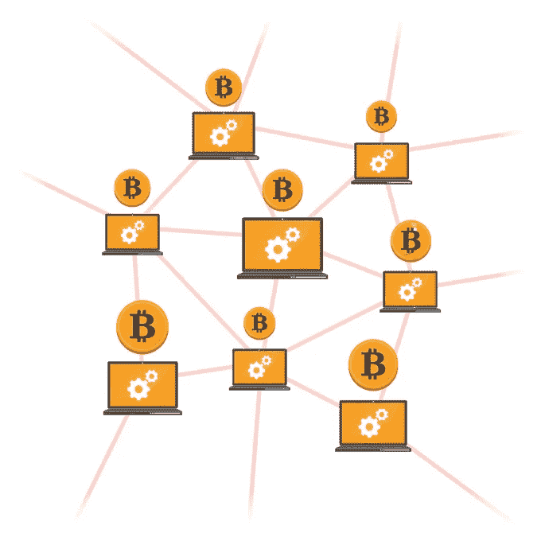

# 比特币点对点网络及改进建议

> 原文：<https://medium.com/coinmonks/bitcoin-peer-to-peer-networking-improvement-proposals-70841fdd572f?source=collection_archive---------0----------------------->

## 比特币点对点网络工作原理概述及解决其缺点的改进建议



Source: [https://portaldobitcoin.com/transacoes-nao-confirmadas-bitcoin-batem-recorde-e-chegam-155mil/](https://portaldobitcoin.com/transacoes-nao-confirmadas-bitcoin-batem-recorde-e-chegam-155mil/)

本文旨在概述比特币点对点网络的工作原理。本文由三个不同的部分组成，讨论比特币 P2P 网络的不同功能

*   连接到网络中的节点
*   检测网络中的其他节点
*   接收事务或块数据

# 连接到网络中的节点

当您在计算机上安装比特币节点时，配置中会出现一些硬编码的比特币节点地址，这些地址充当种子节点。他们是你在比特币网络中连接的第一批同行。

下面是您可以找到的一个种子地址，使用 dig 命令查看您可以连接的比特币节点的不同 IP 地址列表。

```
$ dig seed.btc.petertodd.org
```

在连接到比特币网络中的远程节点之前，您的本地比特币节点向它想要连接的远程节点发送一个“ **PING** ，它应该以“ **PONG** 响应。但是如果该节点拒绝响应(可能它是离线的)，那么该节点被“**触发**，即断开连接

在成功连接到网络上的比特币节点后，您执行初始“**握手**”，这涉及到本地节点启动连接，首先发送版本消息，远程对等体发送回其版本消息，然后启动对等体发送“ **Verack** ”消息，确认远程对等体版本&远程对等体也这样做。


Bitcoin Initial Connection & Handshake

远程对等体在收到版本消息之前不会发送任何数据。“**版本**”消息包含您正在运行的比特币节点的版本。

# 检测网络中的其他节点

你了解网络中其他比特币节点的方式是通过发送“ ***getaddr*** ”消息。与远程节点成功连接后，您可以向远程节点&发送“ ***getaddr*** ”消息，远程节点将响应您可以连接的其他远程节点的 IP 地址示例列表。此外，它还会不断向您发送已连接节点的 IP 地址。


Bitcoin Node detection fllow

# 接收事务或块数据

在远程节点从比特币网络中的其他对等体接收到块或交易数据后，它会向其连接对等体发送“ ***inv*** ”消息，以检查它们是否已经有交易或块。如果连接对等体没有，它会向远程节点&发送一个“ ***getdata*** ”响应，并以事务或块的详细信息进行响应。


Bitcoin Data Request flow

# 比特币 P2P 网络改进建议

有各种各样的比特币改进建议( **BIP** )来提高比特币 P2P 网络的性能。我们将在下面回顾其中的一些。

## BIP 152 — [紧凑型](https://github.com/bitcoin/bips/blob/master/bip-0152.mediawiki)

这旨在减少比特币网络上节点之间的块中继期间使用的带宽。

该协议旨在以两种方式使用，取决于对等体和可用带宽。“高带宽”和“低带宽”模式。在低带宽模式下，对等体发送新的块通知和通常的 inv/headers 通知。并且不支持紧凑块的节点仍然可以使用传统的块中继协议。

紧凑块包含块中事务 id 的缩短版本。当接收到 *cmpctblock* 消息时，节点将计算其内存池中所有事务的缩短 txids。它从内存池中检索具有匹配的缩短的 txids 的事务，以便重建整个块。如果它找不到一个事务，它将从向它发送 *cmpctblock* 消息的对等点请求它。这样，块被中继，而不需要在块被中继时实际发送该块的所有数据；块中的大多数(如果不是全部)事务可能会在节点的 mempool 中找到，并且可以从那里重建。


Source: [https://github.com/bitcoin/bips/blob/master/bip-0152.mediawiki](https://github.com/bitcoin/bips/blob/master/bip-0152.mediawiki)

这已经在比特币核心代码库中实现和合并。对比特币核心代码库的拉取请求可以在这里找到[https://github.com/bitcoin/bitcoin/pull/8068](https://github.com/bitcoin/bitcoin/pull/8068)https://github.com/bitcoin/bitcoin/pull/8393

## 石墨烯——阻碍传播

石墨烯是一种新颖且高效的块传输协议(由 *A. Pinar Ozisik、Gavin Andresen* 等开发)，该协议提出使用布隆过滤器从本地内存池(简称*内存池*，这是网络中等待验证并要包含在块中的所有比特币交易的集合)中识别块内的交易。

这是对 BIP 152(紧凑型)的改进。它结合了 bloom filters 和可逆 Bloom Lookup Tables (IBLTs ),以降低块传播的成本。

## BIP 157 — [客户端拦截过滤](https://github.com/bitcoin/bips/blob/master/bip-0157.mediawiki)

这个 BIP 在比特币中描述了一个新的轻量级客户端协议，它改进了当前可用的选项。目前使用的轻量级客户端协议存在已知的缺陷，会削弱客户端的安全性和隐私性，并允许在整个节点上进行拒绝服务攻击。

它描述了轻量级客户端向网络中的远程对等方请求数据的备用协议，以保护隐私。

完整节点对提供给客户端的块数据生成确定性过滤器，而不是轻型客户端向完整节点对等体发送过滤器。如果过滤器与它正在观察的数据匹配，一个轻量级客户端就可以下载整个块。由于过滤器是确定性的，因此只要有新的块连接到链上，它们只需要构造一次并存储在磁盘上。

这提高了隐私性，因为数据块可以从*任何来源*下载，所以没有一个对等方获得客户端所需数据的完整信息。此外，轻量级客户端可以更好地确保看到所有相关事务，因为它们可以比检查过滤块的完整性更容易地检查从对等体接收的过滤器的有效性。

# 结论

比特币点对点网络的运作方式已经有了很大的改进。关于如何进一步改进它使之变得更好，更多的事情正在被讨论和研究。

# 进一步阅读

[](https://bitcointalk.org/index.php?topic=1831243.0) [## 紧凑数据块:如何在高带宽模式下验证数据块？

### 紧凑数据块:如何在高带宽模式下验证数据块？

紧凑数据块:如何在高带宽模式下验证数据块？bitcointalk.org](https://bitcointalk.org/index.php?topic=1831243.0) 

[http://cryptoeconomics . cs . umass . edu/graphene/graphene-short . pdf](http://cryptoeconomics.cs.umass.edu/graphene/graphene-short.pdf)

 [## 比特币/bips

### 比特币改进建议。通过在 GitHub 上创建帐户，为比特币/bips 的发展做出贡献。

github.com](https://github.com/bitcoin/bips/blob/master/bip-0157.mediawiki) [](/coinmonks/graphene-block-propagation-protocol-aceb8730fa5e) [## 石墨烯块传播协议

### 使用布隆过滤器提高吞吐量

medium.com](/coinmonks/graphene-block-propagation-protocol-aceb8730fa5e) 

> [直接在您的收件箱中获取最佳软件交易](https://coincodecap.com/?utm_source=coinmonks)

[](https://coincodecap.com/?utm_source=coinmonks)